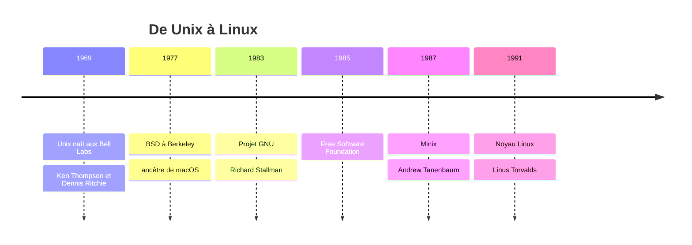
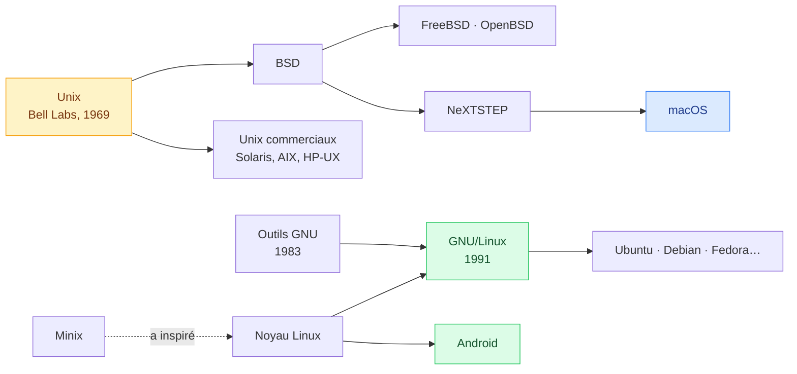
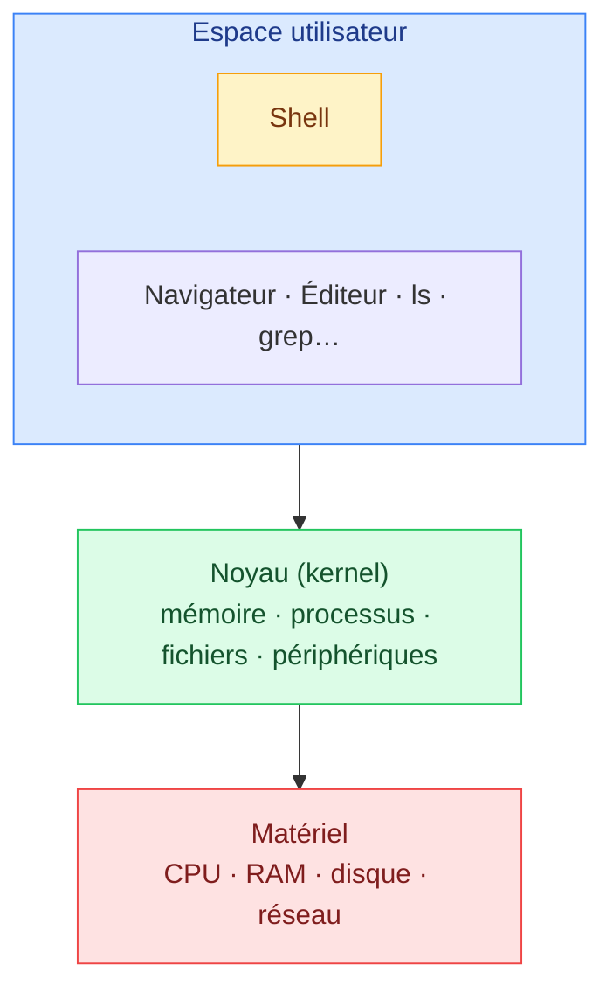
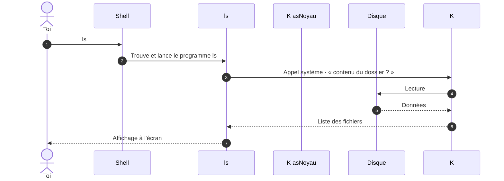
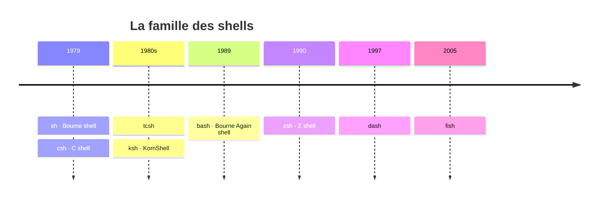

# 1. Linux et le shell

<mark style="color:blue;">**Un système né d'une idée simple : des petits outils qui travaillent ensemble.**</mark>

&#x20;


**En bref**

**Linux** est le noyau d'un système d'exploitation libre, associé aux outils du projet **GNU**. Le **noyau** parle au matériel ; le **shell** est le programme qui te permet de parler au système en tapant des commandes.


&#x20;

***

&#x20;

## <mark style="color:purple;">01</mark> · Un peu d'histoire

&#x20;



&#x20;



### Unix, l'ancêtre (1969)

&#x20;

Aux **Bell Labs** (AT&T), Ken Thompson et Dennis Ritchie créent **Unix**. Sa philosophie traverse les décennies :

&#x20;

> **« Écrire des programmes qui font une seule chose, et qui la font bien. Écrire des programmes qui travaillent ensemble. »**

&#x20;

C'est exactement ce que tu feras en enchaînant `ls`, `grep` et `wc` avec des pipes.



### GNU, le logiciel libre (1983–1985)

&#x20;

**Richard Stallman** lance le **projet GNU** (_GNU's Not Unix_) en 1983 pour recréer un Unix **entièrement libre**, puis fonde la **Free Software Foundation** (FSF) en 1985.

&#x20;

La FSF écrit des outils essentiels : **Emacs**, le compilateur **gcc**, **make**, le shell **bash**, les commandes `ls`, `cp`, `cat`… Mais il manque la pièce centrale : <mark style="color:orange;">**le noyau**</mark>.



### Linux, le noyau manquant (1991)

&#x20;

**Linus Torvalds**, étudiant finlandais, écrit la première version du **noyau Linux** et l'associe aux outils GNU. Résultat : un système complet et libre. C'est pour ça que la FSF préfère dire <mark style="color:blue;">**GNU/Linux**</mark>.

&#x20;

Linus maintient toujours le noyau aujourd'hui : son code est sur [kernel.org](https://www.kernel.org).



&#x20;

### L'arbre généalogique

&#x20;



&#x20;


**Le savais-tu ?** macOS descend de BSD, donc d'Unix : c'est pour ça que son terminal ressemble tant à celui de Linux. Et **Android** tourne sur le noyau Linux.


&#x20;

### Les distributions

&#x20;

Le noyau seul ne suffit pas. Une **distribution** assemble le noyau, les outils GNU, un gestionnaire de paquets, un bureau graphique…

&#x20;

| Distribution     | Particularité                                                  |
| ---------------- | -------------------------------------------------------------- |
| **Ubuntu**    | La plus populaire pour débuter, basée sur Debian               |
| **Debian**    | Très stable, omniprésente sur les serveurs                     |
| **Fedora**    | Récente, sponsorisée par Red Hat                               |
| **Arch**      | Minimaliste : tu construis tout toi-même                       |
| **Alpine**    | Ultra-légère (~5 Mo), star des images Docker                   |

&#x20;

***

&#x20;

## <mark style="color:purple;">02</mark> · Les couches d'un système

&#x20;



&#x20;



**Matériel**

Le processeur, la mémoire, le disque…



**Noyau**

Le chef d'orchestre. Le **seul** à parler directement au matériel.



**Espace utilisateur**

Tous tes programmes. Ils n'ont **pas le droit** de toucher le matériel : ils **demandent au noyau**.



&#x20;

***

&#x20;

## <mark style="color:purple;">03</mark> · Qu'est-ce qu'un shell ?

&#x20;

> Un **shell** est un **interpréteur de commandes** : il lit ce que tu tapes, le comprend, et demande au système de l'exécuter.

&#x20;

_Shell_ veut dire **coquille** : c'est la couche la plus externe, celle qui enveloppe le noyau et avec laquelle tu interagis.

&#x20;

### L'analogie du restaurant

&#x20;

| Restaurant                        | Ordinateur          |
| ------------------------------------ | ---------------------- |
| Toi, le client                       | L'utilisateur          |
| Le serveur qui prend ta commande     | Le **shell**           |
| La cuisine                           | Le **noyau**           |
| Les fourneaux, frigos, ustensiles    | Le **matériel**        |

&#x20;

Tu ne vas jamais en cuisine allumer les fourneaux toi-même. Tu dis au serveur ce que tu veux, il transmet, et on te ramène le plat.

&#x20;

### Terminal ≠ shell

&#x20;



**Le terminal**

La **fenêtre** qui affiche du texte et capte ton clavier : GNOME Terminal, iTerm2, Windows Terminal…

Le téléphone.



**Le shell**

Le **programme qui tourne dedans** et interprète tes commandes : bash, zsh…

La personne au bout du fil.



&#x20;

<figure><figcaption><p>Un terminal, dans lequel le shell attend ta prochaine commande après le <code>$</code>.</p></figcaption></figure>

&#x20;

***

&#x20;

## <mark style="color:purple;">04</mark> · Que se passe-t-il quand je tape `ls` ?

&#x20;



&#x20;


Les échanges entre l'espace utilisateur et le noyau s'appellent des <mark style="color:blue;">**appels système**</mark> (_system calls_). Pour aller plus loin : Tanenbaum, _Modern Operating Systems_, chapitre 1.6.


&#x20;

***

&#x20;

## <mark style="color:purple;">05</mark> · Les différents shells

&#x20;



&#x20;

| Shell                           | Description                                                                                          |
| ------------------------------- | ---------------------------------------------------------------------------------------------------- |
| **sh** (Bourne shell)           | Le premier shell par défaut d'Unix. La référence historique                                          |
| **csh** / **tcsh**              | Syntaxe inspirée du langage C                                                                        |
| **ksh** (KornShell)             | Basé sur sh, très utilisé sur les Unix commerciaux                                                   |
| **bash** (Bourne Again Shell)   | Extension de sh par GNU. <mark style="color:green;">**Le shell par défaut de la plupart des Linux**</mark> |
| **dash**                        | Très léger et rapide, pour les scripts système sur Debian/Ubuntu                                     |
| **zsh** (Z shell)               | Extension de sh, très personnalisable. <mark style="color:green;">**Par défaut sur macOS**</mark> depuis 2019 |
| **fish**                        | Axé confort (suggestions, couleurs), mais <mark style="color:orange;">**pas compatible POSIX**</mark>  |

&#x20;


**POSIX** est une norme qui définit comment un shell doit se comporter. Un script qui la respecte fonctionne dans bash, zsh, ksh ou dash. D'où les scripts qui commencent par `#!/bin/sh`.


&#x20;

Quel shell utilises-tu ?

&#x20;

```bash
echo $SHELL
```

&#x20;

***

&#x20;

## <mark style="color:purple;">06</mark> · En résumé

&#x20;


* **Unix** (1969) → **GNU** (1983, outils libres) + **Linux** (1991, noyau) = **GNU/Linux**.
* Le **noyau** est le seul à parler au matériel ; les programmes passent par des **appels système**.
* Le **shell** interprète tes commandes ; le **terminal** n'est que la fenêtre.
* **bash** et **zsh** sont les shells les plus courants.


&#x20;

<mark style="color:green;">**→ Suite :**</mark> [2. L'arborescence](02-arborescence.md)
