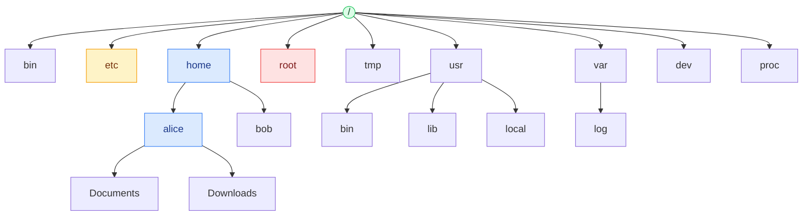
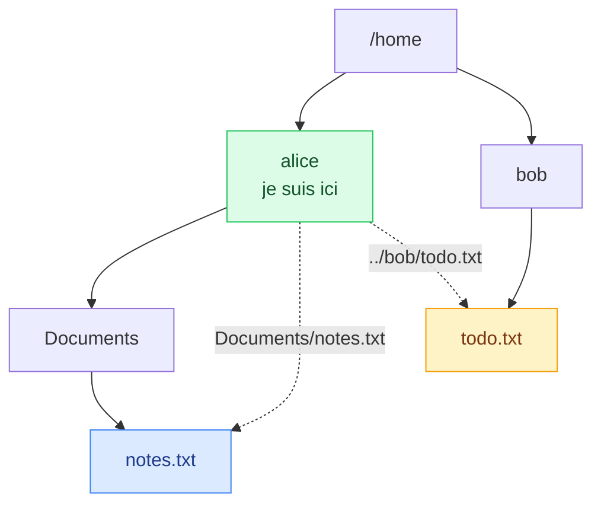

# 2. L'arborescence Linux

<mark style="color:blue;">**Un seul arbre, une seule racine, et chaque chose à sa place.**</mark>

&#x20;


**En bref**

Sous Linux, tout part de la racine **`/`**. Chaque dossier a un rôle précis (`/etc` = configuration, `/home` = utilisateurs…). Une fois que tu connais le plan, tu t'y retrouves sur **n'importe quel** Linux.


&#x20;

***

&#x20;

## <mark style="color:purple;">01</mark> · Un seul arbre

&#x20;

Sous Windows, chaque disque a sa lettre : `C:\`, `D:\`… Sous Linux, il n'y a **qu'un seul arbre**, qui part d'une **racine** unique notée <mark style="color:blue;">**`/`**</mark>. Tout est rangé en dessous, même les autres disques et les clés USB.

&#x20;



&#x20;

### Un arbre… la tête en bas

&#x20;

La racine `/` est **en haut**, et les branches (dossiers) descendent vers les feuilles (fichiers).

&#x20;

***

&#x20;

## <mark style="color:purple;">02</mark> · Le rôle de chaque dossier

&#x20;

Cette organisation suit une norme : le <mark style="color:blue;">**FHS**</mark> (_Filesystem Hierarchy Standard_).

&#x20;

| Dossier          | Contenu                                                                              | Pour retenir                        |
| ---------------- | ------------------------------------------------------------------------------------ | -------------------------------------- |
| `/`              | La **racine** : contient tout le reste                                               | Le tronc de l'arbre                    |
| `/bin`           | **Binaires essentiels** pour tous (`ls`, `cp`, `cat`…)                               | _bin_ = binaries                       |
| `/sbin`          | Binaires d'**administration** (`reboot`, `fdisk`…)                                   | _s_ = system                           |
| `/etc`           | Fichiers de **configuration**                                                        | Le tiroir des réglages                 |
| `/home`          | Les **dossiers personnels** (`/home/alice`)                                          | La maison de chacun                    |
| `/root`          | Le dossier personnel de l'**administrateur**                                         | Hors de `/home`, toujours accessible   |
| `/usr`           | **Programmes installés** : `/usr/bin`, `/usr/lib`, `/usr/share`                      | _Unix System Resources_                |
| `/usr/local`     | Logiciels **installés à la main**                                                    | Ce que tu ajoutes toi-même             |
| `/lib`           | **Bibliothèques partagées** (≈ les `.dll` de Windows)                                | _lib_ = libraries                      |
| `/dev`           | Les **périphériques** (`/dev/sda` = disque, `/dev/null`…)                            | _dev_ = devices                        |
| `/proc`          | Infos **virtuelles** sur les **processus** et le noyau                               | Générées à la volée                    |
| `/sys`           | Infos **virtuelles** sur le **matériel** et les pilotes                              | Comme `/proc`, côté matériel           |
| `/tmp`           | **Fichiers temporaires**, souvent vidés au redémarrage                               | Le brouillon                           |
| `/var`           | **Données variables** : logs (`/var/log`), caches, bases de données                  | Ce qui change tout le temps            |
| `/boot`          | Fichiers de **démarrage** : le noyau (`vmlinuz`), le chargeur                        | Pour booter                            |
| `/opt`           | Logiciels **optionnels** tiers                                                       | _opt_ = optional                       |
| `/mnt`, `/media` | Points de **montage** : disques, clés USB                                            | Où « branchent » les autres disques    |

&#x20;


Sur les distributions récentes, `/bin`, `/sbin` et `/lib` sont souvent de simples **raccourcis** vers `/usr/bin`, `/usr/sbin` et `/usr/lib`. La séparation est historique : autrefois, `/usr` pouvait être sur un autre disque.


&#x20;

### L'analogie de la maison

&#x20;



**`/bin`, `/usr/bin`**
La boîte à outils commune.

&#x20;

**`/sbin`**
Le local technique, accès réservé.

&#x20;

**`/etc`**
Le tableau des réglages : thermostat, alarme…

&#x20;

**`/home/alice`**
La chambre de chacun.



**`/root`**
La chambre du propriétaire.

&#x20;

**`/tmp`**
La table de brouillon, nettoyée chaque soir.

&#x20;

**`/var/log`**
Le journal de bord de la maison.

&#x20;

**`/dev`, `/mnt`**
Les prises murales pour brancher des appareils.



&#x20;

***

&#x20;

## <mark style="color:purple;">03</mark> · « Tout est fichier »

&#x20;

Une idée fondamentale d'Unix : **tout est représenté comme un fichier**. Les documents, mais aussi les **dossiers**, les **périphériques** et même des **infos système**.

&#x20;

```bash
cat /proc/cpuinfo     # infos sur le processeur… lues comme un fichier texte !
cat /etc/os-release   # quelle distribution Linux ?
```

&#x20;

***

&#x20;

## <mark style="color:purple;">04</mark> · Les raccourcis spéciaux

&#x20;

| Symbole | Signification                                          | Exemple          |
| ------- | ------------------------------------------------------ | ---------------- |
| `/`     | La **racine**                                          | `cd /`           |
| `~`     | Ton **dossier personnel** : `/home/ton_nom`            | `cd ~`           |
| `.`     | Le **dossier courant**                                 | `./script.sh`    |
| `..`    | Le **dossier parent**                                  | `cd ..`          |
| `-`     | Le **dossier précédent** (avec `cd`)                   | `cd -`           |

&#x20;

```bash
cd /          # aller à la racine
cd ~          # aller dans son dossier personnel
cd            # idem : cd sans argument ramène au home
echo $HOME    # affiche le chemin du home, ex. /home/alice
```

&#x20;

***

&#x20;

## <mark style="color:purple;">05</mark> · Chemins absolus et relatifs

&#x20;



### Absolu

Commence **toujours par `/`**. Il part de la racine et marche **d'où que tu sois**.

```bash
cat /home/alice/Documents/notes.txt
```

Une **adresse postale complète** : « Rue de la Gare 12, 1700 Fribourg ».



### Relatif

Ne commence **pas** par `/`. Il part du **dossier où tu te trouves**.

```bash
# depuis /home/alice
cat Documents/notes.txt
cat ../bob/todo.txt
```

Une **indication de passant** : « deuxième rue à gauche ».



&#x20;

### Exemple guidé

&#x20;



&#x20;

| Je veux atteindre | Chemin absolu                       | Relatif, depuis `/home/alice` |
| ----------------- | ----------------------------------- | ----------------------------- |
| `notes.txt`       | `/home/alice/Documents/notes.txt`   | `Documents/notes.txt`         |
| `todo.txt`        | `/home/bob/todo.txt`                | `../bob/todo.txt`             |
| la racine         | `/`                                 | `../..`                       |

&#x20;


**Attention à la casse** — Linux distingue majuscules et minuscules : `Documents`, `documents` et `DOCUMENTS` sont **trois noms différents**. Et évite les espaces dans les noms de fichiers : ils compliquent la vie en ligne de commande.


&#x20;

***

&#x20;

## <mark style="color:purple;">06</mark> · En résumé

&#x20;


* Un **seul arbre**, qui part de la racine **`/`**.
* Chaque dossier a un rôle défini par le **FHS** : `/etc` = config, `/home` = utilisateurs, `/var/log` = logs, `/tmp` = temporaire…
* **Tout est fichier**, même les périphériques.
* `~` = home, `.` = ici, `..` = parent.
* Chemin **absolu** = commence par `/` ; **relatif** = part du dossier courant.


&#x20;

<mark style="color:green;">**→ Suite :**</mark> [3. Naviguer et gérer les fichiers](03-navigation-fichiers.md)
