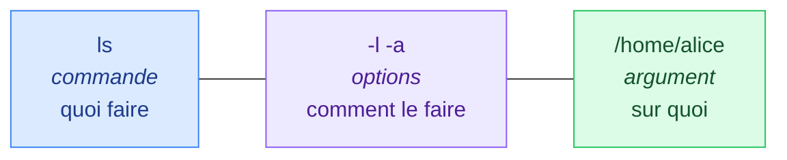
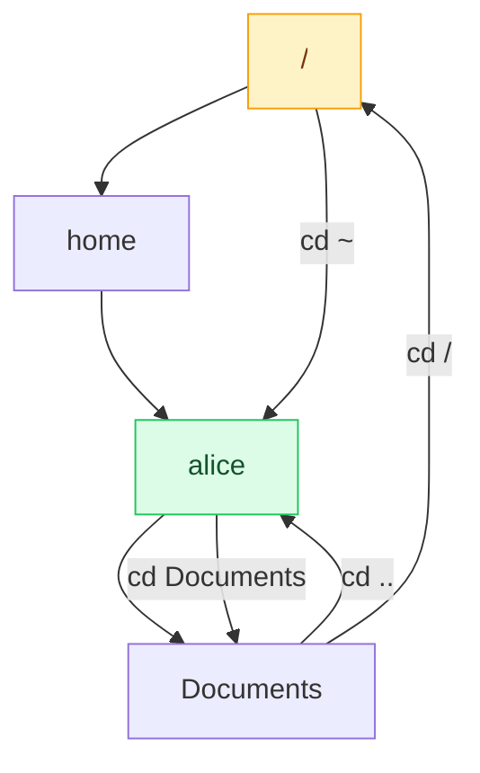
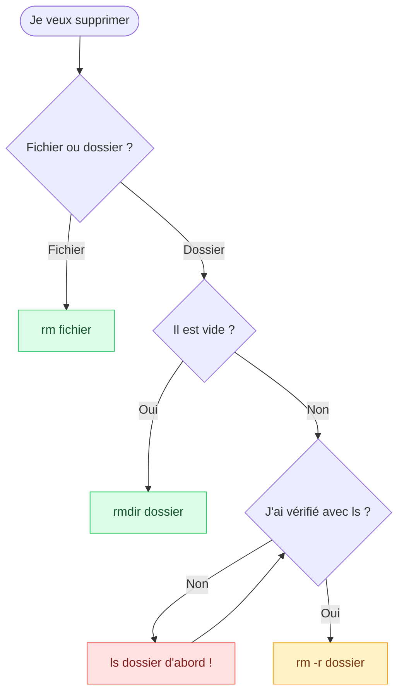

# 3. Naviguer et gérer les fichiers

<mark style="color:blue;">**Où suis-je, qu'y a-t-il ici, et comment je range tout ça.**</mark>

&#x20;


**En bref**

`pwd` te dit où tu es, `ls` ce qu'il y a, `cd` t'emmène ailleurs. Ensuite : `mkdir`, `touch`, `cp`, `mv`, `rm` pour créer, copier, déplacer et supprimer.


&#x20;

***

&#x20;

## <mark style="color:purple;">01</mark> · Anatomie d'une commande

&#x20;



&#x20;

* Les options courtes se **combinent** : `ls -l -a` = `ls -la`
* Les options longues ont deux tirets : `ls --all`

&#x20;

***

&#x20;

## <mark style="color:purple;">02</mark> · Les réflexes de survie

&#x20;

| Raccourci                           | Effet                                                              |
| ----------------------------------- | ------------------------------------------------------------------ |
| <kbd>Tab</kbd>                      | <mark style="color:green;">**Autocomplétion**</mark> — deux fois pour voir les choix |
| <kbd>↑</kbd> / <kbd>↓</kbd>         | Parcourir l'**historique**                                          |
| <kbd>Ctrl</kbd> + <kbd>C</kbd>      | **Interrompre** la commande en cours                                |
| <kbd>Ctrl</kbd> + <kbd>L</kbd>      | **Effacer** l'écran                                                 |
| <kbd>Ctrl</kbd> + <kbd>R</kbd>      | **Rechercher** dans l'historique                                    |
| <kbd>Ctrl</kbd> + <kbd>D</kbd>      | Quitter le shell                                                    |
| `man <commande>`                    | Le **manuel** complet (<kbd>q</kbd> pour quitter)                   |
| `<commande> --help`                 | Aide rapide                                                         |

&#x20;


**La touche Tab est ta meilleure amie.** Elle évite les fautes de frappe et te montre ce qui existe. Les pros ne tapent presque jamais un chemin en entier.


&#x20;

***

&#x20;

## <mark style="color:purple;">03</mark> · Où suis-je ? `pwd`

&#x20;

```
$ pwd
/home/alice
```

&#x20;

`pwd` (_print working directory_), c'est le point rouge **« Vous êtes ici »** sur le plan du centre commercial.

&#x20;

***

&#x20;

## <mark style="color:purple;">04</mark> · Qu'y a-t-il ici ? `ls`

&#x20;



```bash
ls              # contenu du dossier courant
ls /etc         # contenu d'un autre dossier
```



```bash
ls -l           # format long
ls -lh          # tailles lisibles (K, M, G)
ls -lt          # trié par date de modification
```



```bash
ls -a           # aussi les fichiers cachés (qui commencent par .)
ls -la          # cachés + détails
```



```bash
ls -R           # tous les sous-dossiers
```



&#x20;

### Lire la sortie de `ls -l`

&#x20;

```
-rw-r--r--  1  alice  staff  1.2K  Sep 14 10:32  notes.txt
```

&#x20;

| Morceau            | Signification                                                                 |
| ------------------ | ----------------------------------------------------------------------------- |
| `-rw-r--r--`       | **Type** (`-` fichier, `d` dossier, `l` lien) + **permissions** ([chap. 7](07-permissions.md)) |
| `1`                | Nombre de liens                                                                |
| `alice`            | **Propriétaire**                                                               |
| `staff`            | **Groupe**                                                                     |
| `1.2K`             | **Taille**                                                                     |
| `Sep 14 10:32`     | Dernière **modification**                                                      |
| `notes.txt`        | **Nom**                                                                        |

&#x20;


Les **fichiers cachés** commencent par un point : `.bashrc`, `.zshrc`, `.gitignore`… Ce sont souvent des fichiers de configuration.


&#x20;

***

&#x20;

## <mark style="color:purple;">05</mark> · Se déplacer : `cd`

&#x20;



&#x20;

```bash
cd /etc              # chemin absolu
cd Documents         # chemin relatif
cd ..                # remonter d'un niveau
cd ../..             # remonter de deux niveaux
cd ~                 # aller dans son home   (ou simplement : cd)
cd -                 # revenir au dossier précédent
```

&#x20;

***

&#x20;

## <mark style="color:purple;">06</mark> · Créer, copier, déplacer

&#x20;



### Créer

```bash
mkdir projets        # un dossier
mkdir -p a/b/c       # toute une hiérarchie
touch notes.txt      # un fichier vide
```



### Copier

```bash
cp notes.txt copie.txt
cp notes.txt Documents/
cp -r projets/ sauvegarde/   # dossier : -r !
```



### Déplacer / renommer

```bash
mv notes.txt Documents/
mv ancien.txt nouveau.txt
```



&#x20;


**Il n'y a pas de commande « renommer »** : renommer, c'est **déplacer vers un nouveau nom**, avec `mv`.


&#x20;

***

&#x20;

## <mark style="color:purple;">07</mark> · Supprimer

&#x20;

```bash
rm notes.txt         # un fichier
rm -i notes.txt      # demande confirmation avant
rmdir vide/          # un dossier VIDE
rm -r projets/       # un dossier et tout son contenu
```

&#x20;


**Pas de corbeille dans le terminal.** Un fichier supprimé avec `rm` est **définitivement perdu**.

&#x20;

Méfie-toi surtout de `rm -rf` (`-r` récursif, `-f` sans confirmation). Une faute de frappe comme `rm -rf / home/alice/tmp` (espace en trop) tente d'effacer **tout le système**. Relis toujours deux fois.


&#x20;



&#x20;

***

&#x20;

## <mark style="color:purple;">08</mark> · Les jokers (wildcards)

&#x20;

| Joker   | Signification                       | Exemple            | Correspond à                          |
| ------- | ----------------------------------- | ------------------ | ------------------------------------- |
| `*`     | N'importe quelle suite de caractères | `*.txt`            | `notes.txt`, `a.txt`, `todo.txt`      |
| `?`     | Un seul caractère                   | `photo?.jpg`       | `photo1.jpg`, `photoA.jpg`            |
| `[...]` | Un caractère parmi une liste        | `rapport[12].pdf`  | `rapport1.pdf`, `rapport2.pdf`        |

&#x20;

```bash
ls *.txt             # tous les .txt
cp *.jpg Photos/     # copier toutes les images
rm brouillon*        # tout ce qui commence par "brouillon"
```

&#x20;


**Avant un `rm` avec un joker**, fais d'abord un `ls` avec le **même** motif pour voir ce qui sera supprimé.


&#x20;

***

&#x20;

## <mark style="color:purple;">09</mark> · Trouver et identifier

&#x20;



### `find`

```bash
find . -name "*.txt"
find /home -name "notes*"
find . -type d
find . -size +100M
```



### Infos utiles

```bash
whoami            # qui suis-je ?
which ls          # où est ls ?
file notes.txt    # quel type ?
du -sh Documents  # taille d'un dossier
df -h             # espace disque
```



&#x20;

***

&#x20;

## <mark style="color:purple;">10</mark> · En résumé

&#x20;

| Besoin                          | Commande                              |
| ------------------------------- | ------------------------------------- |
| Où suis-je ?                 | `pwd`                                 |
| Qu'y a-t-il ici ?            | `ls -la`                              |
| Aller ailleurs               | `cd <chemin>`                         |
| Créer                        | `mkdir` / `touch`                     |
| Copier / déplacer         | `cp` / `mv`                           |
| Supprimer                    | `rm` (dossier : `rm -r`) |
| Trouver                      | `find`                                |
| Aide                         | `man <commande>` / `--help`           |

&#x20;

<mark style="color:green;">**→ Suite :**</mark> [4. Lire et chercher du texte](04-lire-chercher-texte.md)
