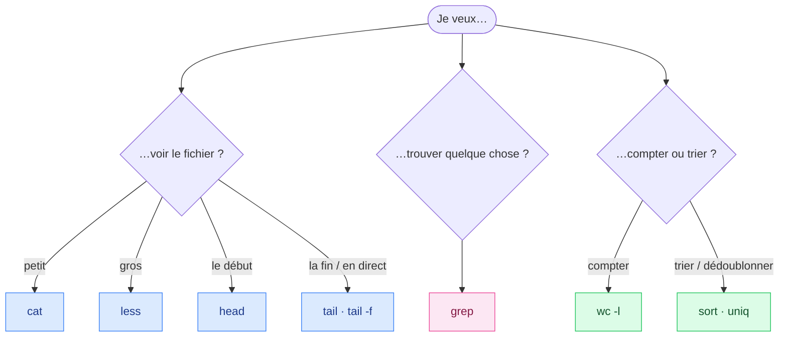
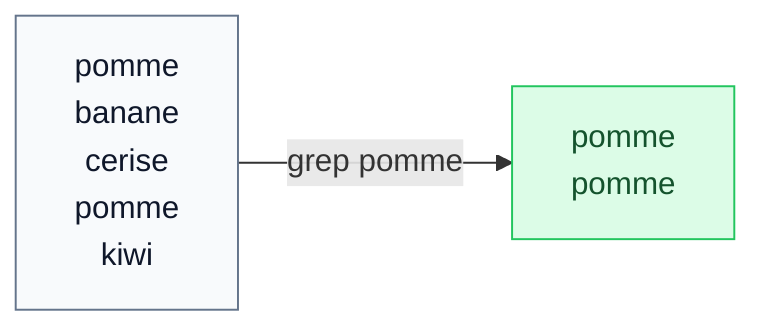

# 4. Lire et chercher du texte

<mark style="color:blue;">**Sous Linux, presque tout est du texte. Autant savoir le lire.**</mark>

&#x20;


**En bref**

`cat` affiche tout, `less` feuillette, `head` et `tail` montrent le début et la fin, `grep` filtre, `wc` compte, `sort` trie. Seuls, ils sont utiles ; combinés avec des pipes, ils deviennent redoutables.


&#x20;

***

&#x20;

## <mark style="color:purple;">01</mark> · Quel outil choisir ?

&#x20;



&#x20;

Pour les exemples, on utilise ce fichier `fruits.txt` :

&#x20;

```
pomme
banane
cerise
pomme
kiwi
Banane
abricot
```

&#x20;

***

&#x20;

## <mark style="color:purple;">02</mark> · Afficher : `echo`

&#x20;

```bash
echo "Bonjour le monde"       # → Bonjour le monde
echo $HOME                    # → /home/alice
echo "Je suis $USER"          # → Je suis alice
echo "ligne" > fichier.txt    # écrire dans un fichier (chap. 5)
```

&#x20;



**`"guillemets doubles"`**

Les variables sont **remplacées**.

`echo "$HOME"` → `/home/alice`



**`'guillemets simples'`**

Tout est pris **littéralement**.

`echo '$HOME'` → `$HOME`



&#x20;

***

&#x20;

## <mark style="color:purple;">03</mark> · Lire : `cat` et `less`

&#x20;



### `cat`

Affiche **tout d'un coup**.

```bash
cat fruits.txt
cat -n fruits.txt       # numéros de ligne
cat a.txt b.txt         # à la suite
cat a.txt b.txt > ab.txt
```

Parfait pour les **petits** fichiers.



### `less`

Affiche **page par page**, avec recherche.

```bash
less /var/log/syslog
```

Parfait pour les **gros** fichiers.



&#x20;

### L'analogie du livre

&#x20;

* `cat`, c'est **jeter toutes les pages du livre sur la table** d'un coup.
* `less`, c'est **lire le livre page par page**, avec un index pour chercher.

&#x20;

### Naviguer dans `less`

&#x20;

| Touche                              | Action                                  |
| ----------------------------------- | --------------------------------------- |
| <kbd>Espace</kbd> / <kbd>b</kbd>    | Page suivante / précédente              |
| <kbd>↑</kbd> / <kbd>↓</kbd>         | Ligne par ligne                         |
| <kbd>g</kbd> / <kbd>G</kbd>         | Début / fin                             |
| `/mot`                              | <mark style="color:blue;">**Chercher**</mark> « mot » |
| <kbd>n</kbd> / <kbd>N</kbd>         | Occurrence suivante / précédente        |
| <kbd>q</kbd>                        | <mark style="color:green;">**Quitter**</mark>          |

&#x20;


**« less is more »** — `less` est une version améliorée d'un ancien outil nommé `more`, qui ne savait qu'avancer. D'où le jeu de mots.


&#x20;

***

&#x20;

## <mark style="color:purple;">04</mark> · Le début ou la fin : `head` et `tail`

&#x20;

```bash
head fruits.txt               # les 10 premières lignes
head -n 3 fruits.txt          # les 3 premières
tail fruits.txt               # les 10 dernières
tail -n 2 fruits.txt          # les 2 dernières
tail -f /var/log/syslog       # suit le fichier EN DIRECT (Ctrl+C pour arrêter)
```

&#x20;


**`tail -f`** est l'outil n°1 pour **surveiller des logs** : chaque nouvelle ligne s'affiche dès qu'elle est écrite.


&#x20;

***

&#x20;

## <mark style="color:purple;">05</mark> · Chercher : `grep`

&#x20;

`grep` affiche **uniquement les lignes qui contiennent un motif**. C'est l'un des outils les plus utilisés sous Linux.

&#x20;



&#x20;

**L'analogie du surligneur** : `grep`, c'est passer un surligneur sur un document et **ne garder que les lignes surlignées**.

&#x20;

### Les options essentielles

&#x20;

| Option | Effet                                             | Exemple                                         |
| ------ | ------------------------------------------------- | ----------------------------------------------- |
| `-i`   | Ignore la **casse**                               | `grep -i banane` → `banane` **et** `Banane`     |
| `-n`   | Affiche le **numéro** de ligne                    | `grep -n kiwi` → `5:kiwi`                       |
| `-v`   | **Inverse** : lignes **sans** le motif            | `grep -v pomme`                                 |
| `-c`   | **Compte** les lignes trouvées                    | `grep -c pomme` → `2`                           |
| `-r`   | Cherche dans tout un **dossier**                  | `grep -r "TODO" src/`                           |
| `-l`   | Seulement le **nom des fichiers**                 | `grep -rl "password" .`                         |
| `-w`   | **Mot entier** uniquement                         | `grep -w an` ne trouve pas « banane »           |

&#x20;



```bash
grep -i "error" /var/log/syslog
```

Toutes les erreurs, peu importe la casse.



```bash
grep -rn "TODO" .
```

Tous les TODO du projet, avec fichier et numéro de ligne.



```bash
grep -v "^#" /etc/ssh/sshd_config
```

La configuration sans les lignes de commentaire.



&#x20;

<details>

<summary>Pour aller plus loin : les expressions régulières</summary>

&#x20;

`grep` comprend des motifs appelés **expressions régulières** (_regex_) :

&#x20;

| Motif | Signification                          | Exemple                                   |
| ----- | -------------------------------------- | ----------------------------------------- |
| `^`   | Début de ligne                         | `grep "^b"` → lignes qui commencent par b |
| `$`   | Fin de ligne                           | `grep "e$"` → lignes qui finissent par e  |
| `.`   | N'importe quel caractère               | `grep "k.w"` → `kiwi`                     |
| `*`   | Le caractère précédent, 0 fois ou plus | `grep "po*"`                              |

&#x20;

</details>

&#x20;

***

&#x20;

## <mark style="color:purple;">06</mark> · Compter, trier, comparer

&#x20;



### `wc`

```bash
wc fruits.txt       # lignes mots octets
wc -l fruits.txt    # → 7
wc -w fruits.txt    # mots
```



### `sort` · `uniq`

```bash
sort fruits.txt
sort -r fruits.txt       # inversé
sort -n nombres.txt      # numérique
sort fruits.txt | uniq
sort fruits.txt | uniq -c
```



### `diff`

```bash
diff ancien.txt nouveau.txt
```

Affiche les lignes qui diffèrent.



&#x20;


**`uniq` seul ne suffit pas** — il ne supprime que les doublons **consécutifs**. Il faut presque toujours **trier avant** : `sort | uniq`.


&#x20;

***

&#x20;

## <mark style="color:purple;">07</mark> · En résumé

&#x20;

| Besoin                              | Commande                                  |
| ----------------------------------- | ----------------------------------------- |
| Afficher un message / une variable | `echo`                                  |
| Afficher un petit fichier        | `cat`                                     |
| Parcourir un gros fichier        | `less` (<kbd>q</kbd> pour quitter)        |
| Début / fin                   | `head` / `tail` (`-f` pour suivre)        |
| Filtrer des lignes               | `grep` (`-i`, `-n`, `-v`, `-r`)           |
| Compter                          | `wc -l`                                   |
| Trier / dédoublonner             | `sort` / `sort \| uniq`                   |

&#x20;

La vraie puissance arrive quand on **combine** ces outils : c'est le chapitre suivant.

&#x20;

<mark style="color:green;">**→ Suite :**</mark> [5. Redirections et pipes](05-redirections-pipes.md)
