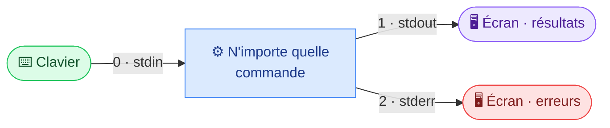
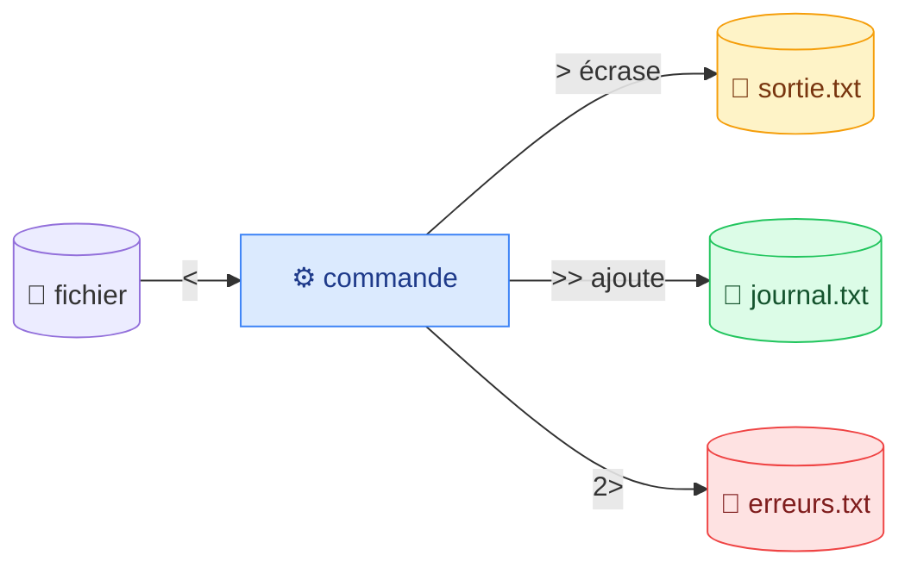

# 5. Redirections et pipes

<mark style="color:blue;">**Brancher les commandes entre elles, comme des tuyaux.**</mark>

&#x20;


**En bref**

Chaque programme a une entrée et deux sorties. Les **redirections** (`>`, `>>`, `<`, `2>`) les branchent sur des fichiers. Les **pipes** (`|`) branchent la sortie d'une commande sur l'entrée de la suivante.


&#x20;

***

&#x20;

## <mark style="color:purple;">01</mark> · Les trois flux standard

&#x20;

Sous Linux, **tout est fichier**. Quand un programme ouvre un fichier, le système lui donne un numéro pour s'y référer : un <mark style="color:blue;">**descripteur de fichier**</mark> (_file descriptor_, FD).

&#x20;

Chaque programme démarre avec **trois descripteurs déjà ouverts** :

&#x20;



&#x20;

| Flux                | FD    | Nom      | Par défaut       |
| ------------------- | ----- | -------- | ---------------- |
| 🟢 Entrée standard  | **0** | `stdin`  | Le **clavier**   |
| 🟣 Sortie standard  | **1** | `stdout` | L'**écran**      |
| 🔴 Erreur standard  | **2** | `stderr` | L'**écran**      |

&#x20;



**Exemple 1 · stdout**

```
$ ls /
bin  boot  dev  etc  home  ...
```

Le résultat part sur **stdout**.



**Exemple 2 · stderr**

```
$ ls aaa
ls: cannot access 'aaa':
No such file or directory
```

L'erreur part sur **stderr**.



&#x20;

Les deux s'affichent à l'écran, mais ce sont **deux canaux différents**. On va pouvoir les séparer.

&#x20;

### 🚰 L'analogie de la plomberie

&#x20;

Un programme est un **appareil de plomberie** avec un tuyau d'arrivée (stdin) et deux tuyaux de sortie : l'eau propre (stdout) et l'évacuation (stderr). Par défaut, tout coule dans l'évier (l'écran). Les redirections **rebranchent les tuyaux** ailleurs.

&#x20;

***

&#x20;

## <mark style="color:purple;">02</mark> · Les redirections

&#x20;



&#x20;



```bash
ls > liste.txt
```

La sortie de `ls` va dans `liste.txt` au lieu de l'écran. Le fichier est **créé**, ou **écrasé** s'il existe.

&#x20;


`>` **écrase sans prévenir**. `echo "test" > important.txt` remplace tout le fichier par le mot « test ».




```bash
ls >> liste.txt
echo "nouvelle ligne" >> journal.txt
```

La sortie est **ajoutée à la fin**, sans effacer ce qui existe.



```bash
ls aaa 2> erreurs.txt
```

Le message d'erreur va dans `erreurs.txt`, l'écran reste propre. Le `2` désigne **stderr**.



```bash
cat < fruits.txt                  # cat lit fruits.txt comme si on le tapait
cat < fruits.txt > copie.txt      # lit fruits.txt, écrit dans copie.txt
wc -l < fruits.txt
```



&#x20;

### Les combinaisons utiles

&#x20;

```bash
commande > sortie.txt 2> erreurs.txt   # séparer résultats et erreurs
commande > tout.txt 2>&1               # tout dans le même fichier
commande 2> /dev/null                  # jeter les erreurs
commande > /dev/null 2>&1              # silence total
```

&#x20;


**`/dev/null`, le trou noir** — tout ce qu'on y écrit disparaît. Exemple : `find / -name "*.conf" 2> /dev/null` affiche les résultats sans la centaine de « Permission denied ».


&#x20;

| Symbole  | Effet                                    | Exemple               |
| -------- | ---------------------------------------- | --------------------- |
| `>`      | stdout → fichier (<mark style="color:red;">**écrase**</mark>) | `ls > liste.txt`      |
| `>>`     | stdout → fichier (<mark style="color:green;">**ajoute**</mark>) | `ls >> liste.txt`     |
| `2>`     | stderr → fichier                         | `ls aaa 2> err.txt`   |
| `2>&1`   | stderr → même endroit que stdout         | `cmd > log.txt 2>&1`  |
| `<`      | fichier → stdin                          | `cat < fruits.txt`    |

&#x20;

***

&#x20;

## <mark style="color:purple;">03</mark> · Les pipes : `|`

&#x20;

Un **pipe** (tube) envoie la **sortie d'une commande directement à l'entrée de la suivante**. Pas de fichier intermédiaire.

&#x20;


&#x20;


**Où est la touche `|` ?** <kbd>AltGr</kbd> + <kbd>7</kbd> sur un clavier suisse, <kbd>AltGr</kbd> + <kbd>6</kbd> sur un clavier français, <kbd>Shift</kbd> + <kbd>\\</kbd> sur un clavier américain.


&#x20;

### 🏭 L'analogie de la chaîne de montage

&#x20;

Chaque commande est un **ouvrier** sur une chaîne. Il fait **une seule tâche**, puis passe le résultat au suivant. C'est la philosophie Unix : de petits outils simples qu'on assemble.

&#x20;

### Les exemples du cours

&#x20;

| Commande                     | Ce qu'elle fait                                                         |
| ---------------------------- | ----------------------------------------------------------------------- |
| `ls \| grep test.txt`        | Liste le dossier, puis ne garde que `test.txt`                          |
| `ls \| sort -r`              | Liste le dossier, puis trie à l'envers                                  |
| `ls \| sort -r \| wc -l`     | … puis compte les lignes = le nombre de fichiers et dossiers            |

&#x20;

### Décortiquons un vrai pipeline

&#x20;

« Quels sont les fruits les plus fréquents ? »

&#x20;

```bash
sort fruits.txt | uniq -c | sort -rn | head -5
```

&#x20;



### `sort fruits.txt`

&#x20;

Trie les lignes pour **regrouper les doublons** côte à côte.



### `| uniq -c`

&#x20;

**Compte** chaque ligne : `2 pomme`, `1 kiwi`…



### `| sort -rn`

&#x20;

Trie **par nombre**, du plus grand au plus petit.



### `| head -5`

&#x20;

Garde les **5 premiers**.

&#x20;

<mark style="color:green;">**✓ Le top 5 des fruits, en une ligne.**</mark>



&#x20;

### D'autres pipelines utiles

&#x20;

```bash
ls | grep ".txt" | wc -l                         # combien de .txt ?
cat /var/log/syslog | grep -i error | tail -20   # les 20 dernières erreurs
ls -la /etc | less                               # feuilleter une longue sortie
ps aux | grep firefox                            # trouver un processus
history | grep docker                            # retrouver une vieille commande
```

&#x20;


**Construis tes pipelines petit à petit** — lance la première commande, regarde le résultat, ajoute `| la suivante`, regarde encore… Tout le monde fait comme ça.


&#x20;

***

&#x20;

## <mark style="color:purple;">04</mark> · Redirection ou pipe ?

&#x20;



### 📄 Redirection `>`

Envoie la sortie vers un **fichier**.

```bash
ls > liste.txt
```



### 🚰 Pipe `|`

Envoie la sortie vers **une autre commande**.

```bash
ls | wc -l
```



&#x20;

***

&#x20;

## <mark style="color:purple;">05</mark> · En résumé

&#x20;


* Chaque programme a **3 flux** : stdin (0), stdout (1), stderr (2).
* `>` écrase, `>>` ajoute, `2>` redirige les erreurs, `<` lit depuis un fichier.
* `/dev/null` fait disparaître ce qu'on lui envoie.
* `|` branche la sortie d'une commande sur l'entrée de la suivante.


&#x20;

<mark style="color:green;">**→ Suite :**</mark> [6. Variables d'environnement](06-variables-environnement.md)
