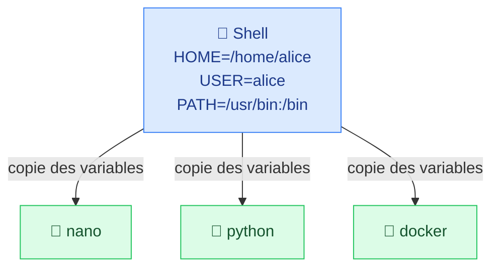
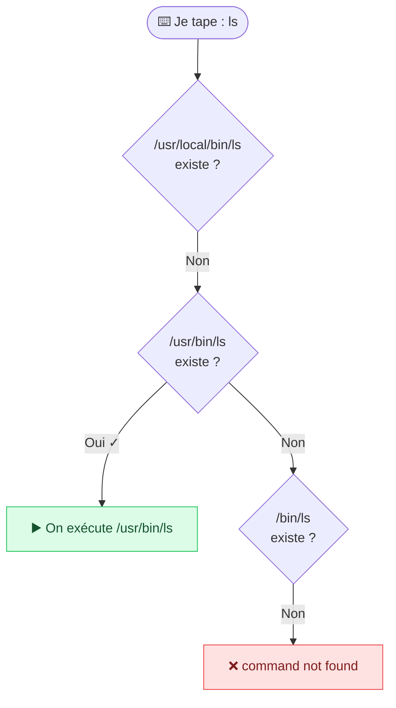
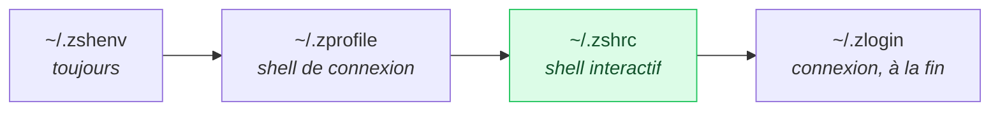

# 6. Variables d'environnement

<mark style="color:blue;">**Le sac à dos que chaque programme emporte avec lui.**</mark>

&#x20;


**En bref**

Les variables d'environnement sont des réglages nommés (`HOME`, `USER`, `PATH`…) que le shell transmet aux programmes qu'il lance. La plus importante, **`PATH`**, dit au shell où chercher les commandes.


&#x20;

***

&#x20;

## <mark style="color:purple;">01</mark> · C'est quoi ?

&#x20;

Une **variable d'environnement** est une valeur nommée que le shell garde en mémoire et **transmet aux programmes qu'il lance** (ses processus enfants).

&#x20;



&#x20;

### 🎒 L'analogie du sac à dos

&#x20;

Chaque programme part en excursion avec un **sac à dos** préparé par le shell. Dedans : une carte (`PATH`), l'adresse de la maison (`HOME`), le nom du randonneur (`USER`)… Tous les programmes lancés depuis ce shell reçoivent **une copie** du sac.

&#x20;

***

&#x20;

## <mark style="color:purple;">02</mark> · Afficher les variables

&#x20;

```bash
printenv              # toutes les variables
env                   # idem
echo $HOME            # une seule variable (avec $)
printenv HOME         # idem, sans $
```

&#x20;

```
$ printenv
SHELL=/bin/bash
HOME=/root
PWD=/root
USER=root
PATH=/usr/sbin:/usr/bin:/sbin:/bin
```

&#x20;

| Variable  | Contenu                                  | Exemple                          |
| --------- | ---------------------------------------- | -------------------------------- |
| `HOME`    | Ton dossier personnel                    | `/home/alice`                    |
| `USER`    | Ton nom d'utilisateur                    | `alice`                          |
| `SHELL`   | Ton shell par défaut                     | `/bin/zsh`                       |
| `PWD`     | Le dossier courant                       | `/home/alice/projets`            |
| `PATH`    | Où chercher les programmes               | `/usr/local/bin:/usr/bin:/bin`   |
| `LANG`    | Langue et encodage                       | `fr_CH.UTF-8`                    |
| `EDITOR`  | Éditeur de texte par défaut              | `nano`, `vim`                    |

&#x20;

***

&#x20;

## <mark style="color:purple;">03</mark> · Le `PATH` : où sont les programmes ?

&#x20;

Quand tu tapes `ls`, comment le shell sait-il **où** est ce programme ? Il parcourt la variable <mark style="color:blue;">**`PATH`**</mark> : une liste de dossiers séparés par `:`, **dans l'ordre**.

&#x20;



&#x20;

```bash
echo $PATH        # /usr/local/bin:/usr/bin:/bin
which ls          # /usr/bin/ls
```

&#x20;

📚 **L'analogie de la bibliothèque** : le `PATH`, c'est la **liste des étagères** où le bibliothécaire cherche un livre, **dans l'ordre**. Dès qu'il le trouve, il s'arrête.

&#x20;


**Pourquoi `./script.sh` ?** Le dossier courant `.` n'est **pas** dans le `PATH` (par sécurité). Pour lancer un script d'ici, il faut donc donner son chemin explicitement.


&#x20;

### Modifier le `PATH`

&#x20;

```bash
PATH=$PATH:/usr/local/bin
echo $PATH
# /usr/sbin:/usr/bin:/sbin:/bin:/usr/local/bin
```

&#x20;

`$PATH:/usr/local/bin` signifie : **l'ancienne valeur**, suivie de `:/usr/local/bin`.

&#x20;


**Ne jamais oublier `$PATH:`** — `PATH=/mon/dossier` **remplace** toute la liste : plus aucune commande (`ls`, `cat`…) n'est trouvée. Si ça t'arrive, ferme le terminal et rouvre-le.


&#x20;

***

&#x20;

## <mark style="color:purple;">04</mark> · Créer ses variables

&#x20;

```bash
PRENOM="Alice"            # variable du shell (PAS d'espaces autour du =)
echo $PRENOM              # → Alice

export PRENOM="Alice"     # variable d'ENVIRONNEMENT : transmise aux programmes
export EDITOR=nano

unset PRENOM              # supprime la variable
```

&#x20;


**Pas d'espace autour du `=`** — `NOM="Alice"` fonctionne ; `NOM = "Alice"` échoue, car le shell croit que `NOM` est une commande.


&#x20;

|                                     | Variable du shell  | Variable d'environnement |
| ----------------------------------- | ------------------ | ------------------------ |
| Création                            | `NOM=valeur`       | `export NOM=valeur`      |
| Visible dans le shell courant       | ✅                 | ✅                       |
| Transmise aux programmes lancés     | ❌                 | ✅                       |

&#x20;

***

&#x20;

## <mark style="color:purple;">05</mark> · Rendre les changements permanents

&#x20;

Une variable définie dans le terminal **disparaît quand tu le fermes**. Pour la garder, on l'écrit dans un **fichier de configuration** lu au démarrage du shell.

&#x20;





&#x20;

| Fichier     | Quand ?                                 | Pour quoi ?                                          |
| ----------- | --------------------------------------- | ---------------------------------------------------- |
| `.zshenv`   | **Toujours**, en premier                | Variables nécessaires partout                        |
| `.zprofile` | Shell de connexion                      | Configuration au démarrage de session                |
| `.zshrc`    | Chaque **terminal ouvert**              | <mark style="color:green;">**Alias, prompt, `PATH`, plugins — le plus utilisé**</mark> |
| `.zlogin`   | Connexion, après `.zshrc`               | Rarement utilisé                                     |

&#x20;

📖 [How do Zsh configuration files work? — freeCodeCamp](https://www.freecodecamp.org/news/how-do-zsh-configuration-files-work/)



| Fichier            | Quand ?                          |
| ------------------ | -------------------------------- |
| `~/.bash_profile`  | Shell de connexion               |
| `~/.bashrc`        | Chaque terminal ouvert — **le plus utilisé** |



&#x20;



### Ajouter la ligne au fichier

&#x20;

```bash
echo 'export PATH=$PATH:$HOME/bin' >> ~/.zshrc
```



### Recharger la configuration

&#x20;

```bash
source ~/.zshrc
```

&#x20;

<mark style="color:green;">**✓ Le changement est actif, et le restera à chaque ouverture.**</mark>



&#x20;

<details>

<summary>💡 Bonus : les alias</summary>

&#x20;

Un **alias** est un raccourci pour une commande longue :

&#x20;

```bash
alias ll='ls -lah'
alias gs='git status'
```

&#x20;

Mets-les dans ton `~/.zshrc` (ou `~/.bashrc`) pour les garder. Et si tu veux aller plus loin, personnalise ton prompt zsh avec [Oh My Zsh](https://ohmyz.sh).

&#x20;

</details>

&#x20;

***

&#x20;

## <mark style="color:purple;">06</mark> · En résumé

&#x20;


* Les **variables d'environnement** configurent le shell et sont transmises aux programmes lancés.
* `printenv` pour tout voir, `echo $NOM` pour une seule.
* **`PATH`** = liste ordonnée des dossiers où chercher les commandes. On ajoute avec `PATH=$PATH:/nouveau`.
* `export` rend une variable visible aux programmes enfants.
* Pour que ce soit permanent : `~/.zshrc` ou `~/.bashrc`, puis `source`.


&#x20;

<mark style="color:green;">**→ Suite :**</mark> [7. Utilisateurs et permissions](07-permissions.md)
