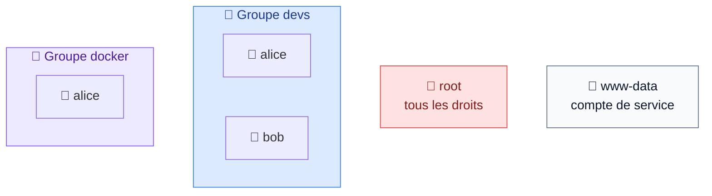
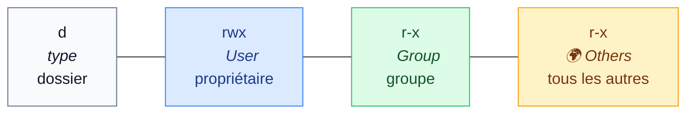
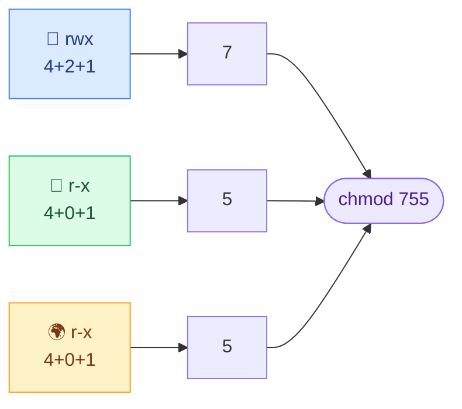
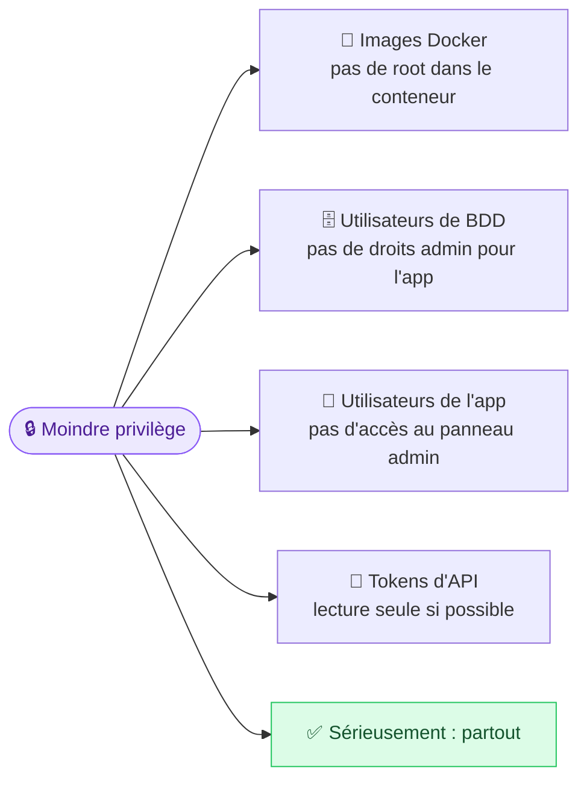

# 7. Utilisateurs et permissions

<mark style="color:blue;">**Qui a le droit de faire quoi, sur quel fichier.**</mark>

&#x20;


**En bref**

Chaque fichier a un **propriétaire**, un **groupe**, et trois séries de droits (**r**ead, **w**rite, e**x**ecute) pour le propriétaire, le groupe et les autres. `chmod` change les droits, `chown` change le propriétaire. Et on donne toujours **le minimum nécessaire**.


&#x20;

***

&#x20;

## <mark style="color:purple;">01</mark> · Utilisateurs et groupes

&#x20;

Linux est **multi-utilisateur** depuis toujours : plusieurs personnes (ou services) partagent la même machine.

&#x20;



&#x20;

* Chaque personne ou service a un **compte utilisateur** : `alice`, `bob`, `www-data`…
* Les utilisateurs appartiennent à des **groupes** : donner un droit à un groupe, c'est le donner à tous ses membres.
* <mark style="color:red;">**`root`**</mark> est le **super-administrateur** : il a **tous les droits**, partout.

&#x20;

```bash
whoami           # qui suis-je ?       → alice
id               # mon identifiant et mes groupes
groups           # la liste de mes groupes
```

&#x20;

### `sudo` : agir en administrateur

&#x20;

Plutôt que de se connecter en `root`, on utilise **`sudo`** (_superuser do_) pour exécuter **une seule commande** avec les droits d'administrateur :

&#x20;

```bash
sudo apt update          # demande ton mot de passe, puis exécute en root
```

&#x20;


**Grand pouvoir, grandes responsabilités** — une erreur avec `sudo rm -rf` peut détruire le système. N'utilise `sudo` que quand c'est **vraiment nécessaire**, et relis la commande.


&#x20;

***

&#x20;

## <mark style="color:purple;">02</mark> · Lire les permissions

&#x20;

```
$ ls -l /home
drwxr-xr-x 2 alice   alice   4.0K Jul 20 12:41 alice
drwxr-xr-x 2 bob     bob     4.0K Jul 20 12:40 bob
```

&#x20;

Décortiquons `drwxr-xr-x` :

&#x20;



&#x20;

| Lettre | Droit                | Sur un **fichier**         | Sur un **dossier**                          |
| ------ | -------------------- | -------------------------- | ------------------------------------------- |
| `r`    | **R**ead · lire      | Lire le contenu            | Lister le contenu (`ls`)                    |
| `w`    | **W**rite · écrire   | Modifier le contenu        | Créer / supprimer des fichiers dedans       |
| `x`    | e**X**ecute          | Lancer comme programme     | **Entrer** dedans (`cd`)                    |
| `-`    | Aucun droit          |                            |                                             |

&#x20;

Donc `drwxr-xr-x` sur `/home/alice` signifie :

&#x20;

* 👤 **alice** peut lire, écrire et entrer → `rwx`
* 👥 **le groupe** peut lire et entrer, pas modifier → `r-x`
* 🌍 **les autres** peuvent lire et entrer, pas modifier → `r-x`

&#x20;

### 🏢 L'analogie de l'immeuble de bureaux

&#x20;

Chaque bureau (fichier) a trois types de badges :

&#x20;



**👤 User**

Le badge du **locataire** du bureau.



**👥 Group**

Le badge de **son équipe**.



**🌍 Others**

Le badge **visiteur**.



&#x20;

Et chaque badge ouvre (ou non) trois choses : **lire** les dossiers sur le bureau (`r`), **modifier** ce qui s'y trouve (`w`), **utiliser** les machines (`x`).

&#x20;

***

&#x20;

## <mark style="color:purple;">03</mark> · La notation en chiffres

&#x20;

Chaque droit vaut un nombre, et on **additionne** :

&#x20;



**`r` = 4**



**`w` = 2**



**`x` = 1**



&#x20;



&#x20;

| Octal    | Symbolique    | Usage typique                                                   |
| -------- | ------------- | --------------------------------------------------------------- |
| `755`    | `rwxr-xr-x`   | Dossiers, scripts, programmes                                   |
| `644`    | `rw-r--r--`   | Fichiers normaux (documents, config)                            |
| `700`    | `rwx------`   | Dossier privé                                                   |
| `600`    | `rw-------`   | <mark style="color:blue;">**Fichier privé : clés SSH, mots de passe**</mark> |
| `777`    | `rwxrwxrwx`   | <mark style="color:red;">**⚠️ Tout le monde peut tout faire — à éviter**</mark> |

&#x20;

***

&#x20;

## <mark style="color:purple;">04</mark> · Modifier les droits : `chmod`

&#x20;



```bash
chmod 755 script.sh      # rwxr-xr-x
chmod 644 notes.txt      # rw-r--r--
chmod 600 ~/.ssh/id_rsa  # rw------- (clé privée)
chmod -R 755 dossier/    # récursif
```



Format : **qui** (`u` user, `g` group, `o` others, `a` all) + **action** (`+`, `-`, `=`) + **droit** (`r`, `w`, `x`).

```bash
chmod u+x script.sh      # ajoute l'exécution au propriétaire
chmod g-w notes.txt      # retire l'écriture au groupe
chmod o-rwx secret.txt   # retire tout aux autres
chmod a+r public.txt     # tout le monde peut lire
chmod u=rw,go=r doc.txt  # = 644
```



&#x20;


**Le cas classique** — tu écris `deploy.sh`, et `./deploy.sh` répond `Permission denied`. Il manque juste le droit d'exécution : `chmod u+x deploy.sh`.


&#x20;

***

&#x20;

## <mark style="color:purple;">05</mark> · Changer le propriétaire : `chown`

&#x20;

```bash
sudo chown bob fichier.txt            # propriétaire → bob (groupe inchangé)
sudo chown bob:devs fichier.txt       # propriétaire → bob ET groupe → devs
sudo chown :devs fichier.txt          # seulement le groupe
sudo chown -R alice:alice dossier/    # récursif
```

&#x20;


**Piège fréquent** — `chown user fichier` ne change **que** le propriétaire. Pour le groupe aussi : `chown user:group fichier`.


&#x20;

***

&#x20;

## <mark style="color:purple;">06</mark> · Gérer les comptes

&#x20;

| Commande        | Rôle                                   | Exemple                              |
| --------------- | -------------------------------------- | ------------------------------------ |
| `useradd`       | Créer un utilisateur                   | `sudo useradd -m alice` (`-m` = home) |
| `passwd`        | Définir un mot de passe                | `sudo passwd alice`                  |
| `groupadd`      | Créer un groupe                        | `sudo groupadd devs`                 |
| `usermod -aG`   | Ajouter à un groupe                    | `sudo usermod -aG devs alice`        |
| `userdel`       | Supprimer un utilisateur               | `sudo userdel -r alice`              |

&#x20;



### Créer le groupe et l'utilisateur

&#x20;

```bash
sudo groupadd devs
sudo useradd -m alice
sudo passwd alice
```



### Ajouter alice au groupe

&#x20;

```bash
sudo usermod -aG devs alice
```

&#x20;

<mark style="color:orange;">**Le `-a` (append) est essentiel**</mark> : sans lui, alice serait **retirée de tous ses autres groupes** !



### Se reconnecter

&#x20;

Le changement de groupe ne prend effet qu'à la **prochaine connexion** (ou avec `newgrp devs`).



&#x20;

📖 Exercice : [Linux user groups and permissions guide — daily.dev](https://daily.dev/blog/linux-user-groups-and-permissions-guide/)

&#x20;

***

&#x20;

## <mark style="color:purple;">07</mark> · 🔒 Le principe du moindre privilège

&#x20;

> **Principle of Least Privilege** (PoLP) : donner à chaque utilisateur **uniquement les accès dont il a besoin pour faire son travail. Rien de plus.**

&#x20;

Si un compte est compromis, les dégâts sont limités à ce qu'il pouvait faire.

&#x20;

🔑 **L'analogie de l'hôtel** : la carte d'un client ouvre **sa** chambre, la salle de sport et l'ascenseur. Pas les autres chambres, ni la cuisine, ni le coffre. S'il la perd, le voleur ne peut pas vider l'hôtel.

&#x20;



&#x20;

***

&#x20;

## <mark style="color:purple;">08</mark> · Les erreurs courantes

&#x20;

| ❌ Erreur                                           | Pourquoi c'est un problème                                                                       |
| -------------------------------------------------- | ------------------------------------------------------------------------------------------------ |
| `chmod 777` « pour que ça marche »                 | N'importe qui peut tout faire. On masque le vrai problème en ouvrant une faille                  |
| `chmod -R` sur le mauvais chemin                   | Change des milliers de fichiers d'un coup, parfois système. Difficile à annuler                  |
| `x` sur des fichiers de données                    | Un `.txt` ou `.csv` n'a pas à être exécutable : porte ouverte inutile                             |
| Compter **uniquement** sur les permissions         | La sécurité se fait en **couches** : permissions, pare-feu, chiffrement, mises à jour…            |
| Confondre `chown user f` et `chown user:group f`   | Le premier ne change pas le groupe                                                                |
| Oublier la **nouvelle session** après un groupe    | « J'ai ajouté alice au groupe docker mais ça ne marche pas » → elle doit se reconnecter           |

&#x20;

***

&#x20;

## <mark style="color:purple;">09</mark> · En résumé

&#x20;


* Chaque fichier a un **propriétaire**, un **groupe** et des droits pour **User / Group / Others**.
* `r` = 4, `w` = 2, `x` = 1 → `755` pour dossiers et scripts, `644` pour fichiers, `600` pour secrets.
* `chmod` change les droits, `chown` change le propriétaire.
* **Moindre privilège** : le strict nécessaire, partout. **Jamais de `chmod 777`**.


&#x20;

<mark style="color:green;">**→ Suite :**</mark> [8. Systèmes de fichiers](08-systemes-de-fichiers.md)
