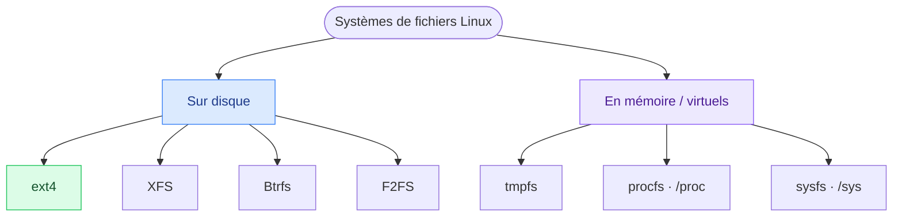
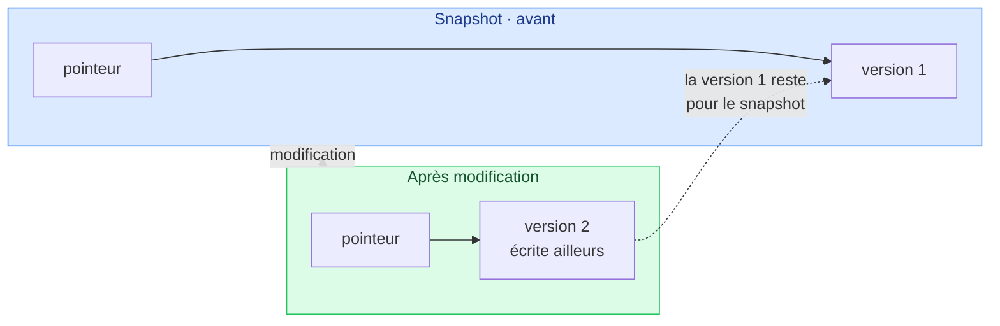

# 8. Systèmes de fichiers

<mark style="color:blue;">**Comment un disque sait où est rangé chaque fichier.**</mark>

&#x20;


**En bref**

Un **système de fichiers** est la méthode de classement d'un disque. Sur disque : **ext4** (fiable, par défaut), **XFS** (gros volumes), **Btrfs** (snapshots), **F2FS** (SSD). En mémoire : **tmpfs**, **procfs** (`/proc`), **sysfs** (`/sys`).


&#x20;

***

&#x20;

## <mark style="color:purple;">01</mark> · C'est quoi ?

&#x20;

Un disque, c'est au fond une immense suite de cases vides. Le **système de fichiers** (_filesystem_) sait où est chaque fichier, son nom, sa taille, ses permissions, sa date…

&#x20;

**L'analogie de la bibliothèque** : le disque, ce sont les **étagères** ; le système de fichiers, c'est le **système de classement** (catalogue, cotes, règles de rangement). Mêmes étagères, classements différents, plus ou moins rapides ou robustes.

&#x20;



&#x20;

***

&#x20;

## <mark style="color:purple;">02</mark> · Sur disque

&#x20;



### ext4

**Mature, très fiable, journalisé.**
Le choix par défaut de la plupart des distributions.

&#x20;

### XFS

**Très gros fichiers et volumes**, excellentes performances en parallèle.
Serveurs d'entreprise ; plus complexe à gérer.



### Btrfs

**Copy-on-Write, snapshots instantanés**, RAID intégré, compression transparente.
La « nouvelle génération » (par défaut sur Fedora).

&#x20;

### F2FS

**Conçu pour la mémoire flash** (SSD, NVMe, cartes SD).
Maximise durée de vie et performances.



&#x20;

### La journalisation (ext4)

&#x20;

Un système **journalisé** note les modifications dans un journal **avant** de les appliquer. En cas de coupure au milieu d'une écriture, il reprend ou annule proprement, au lieu de laisser des fichiers corrompus.

&#x20;


&#x20;

C'est comme un **comptable** qui note chaque opération dans son cahier **avant** de toucher à la caisse.

&#x20;

### Copy-on-Write et snapshots (Btrfs)

&#x20;

Avec le **Copy-on-Write** (CoW), un fichier modifié n'est **jamais écrasé sur place** : la nouvelle version est écrite ailleurs, puis on met à jour le pointeur. On peut donc créer un **snapshot** (une photo du système) **instantanément**, sans copier les données.

&#x20;



&#x20;


**Utile avant une mise à jour risquée** — en cas de problème, on revient au snapshot en quelques secondes.


&#x20;

***

&#x20;

## <mark style="color:purple;">03</mark> · En mémoire et virtuels

&#x20;

Certains systèmes de fichiers n'existent **pas sur le disque** : ils vivent en RAM ou sont générés à la volée par le noyau.

&#x20;

| Système     | Monté sur         | Rôle                                                                              |
| ----------- | ----------------- | --------------------------------------------------------------------------------- |
| **tmpfs**  | `/tmp`, `/run`…   | Fichiers **en RAM** : ultra rapide, mais <mark style="color:orange;">**effacé au redémarrage**</mark> |
| **procfs** | `/proc`           | Fenêtre sur les **processus** et le noyau (stats CPU, mémoire…)                   |
| **sysfs**  | `/sys`            | Vue structurée du **matériel**, des pilotes et de la configuration                |

&#x20;

```bash
cat /proc/cpuinfo        # infos processeur
cat /proc/meminfo        # infos mémoire
ls /proc                 # un dossier numéroté par processus en cours !
cat /proc/version        # version du noyau
ls /sys/class/net        # les interfaces réseau
```

&#x20;


**Aucune place sur le disque** — quand tu lis `/proc/cpuinfo`, c'est le noyau qui génère le texte **au moment où tu le lis**. L'illustration parfaite de « **tout est fichier** ».


&#x20;


**Lien avec Docker** — les montages `tmpfs` de Docker (voir [Volumes Docker](../docker/06-volumes.md)) utilisent exactement ce mécanisme.


&#x20;

***

&#x20;

## <mark style="color:purple;">04</mark> · Voir ce qui est monté

&#x20;

```bash
df -hT          # espace et type de chaque montage
lsblk -f        # disques, partitions et leurs systèmes de fichiers
mount           # tout ce qui est monté
```

&#x20;

```
$ df -hT
Filesystem     Type   Size  Used Avail Use% Mounted on
/dev/nvme0n1p3 btrfs  475G  120G  353G  26% /
tmpfs          tmpfs   16G  4.0M   16G   1% /tmp
/dev/nvme0n1p1 vfat   599M   20M  579M   4% /boot/efi
```

&#x20;

***

&#x20;

## <mark style="color:purple;">05</mark> · En résumé

&#x20;

| Type          | Exemples                          | À retenir                                                     |
| ------------- | --------------------------------- | ------------------------------------------------------------- |
| Sur disque | ext4, XFS, Btrfs, F2FS            | ext4 = fiable par défaut, Btrfs = snapshots, F2FS = SSD       |
| En mémoire | tmpfs                             | Rapide, mais perdu au redémarrage                             |
| Virtuels   | procfs (`/proc`), sysfs (`/sys`)  | Générés par le noyau, exposent processus et matériel          |

&#x20;

<mark style="color:green;">**→ Suite :**</mark> [9. Aide-mémoire](09-aide-memoire.md)
