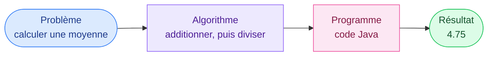
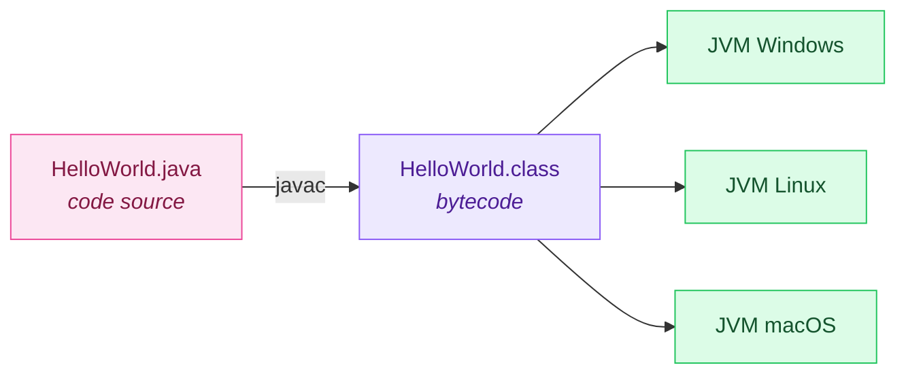
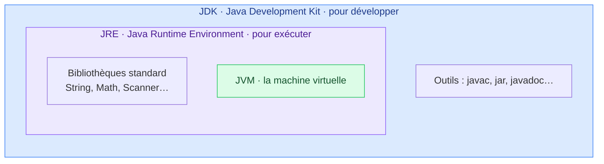
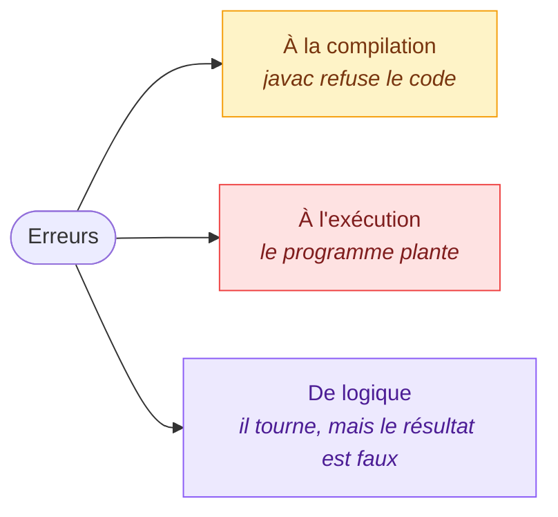
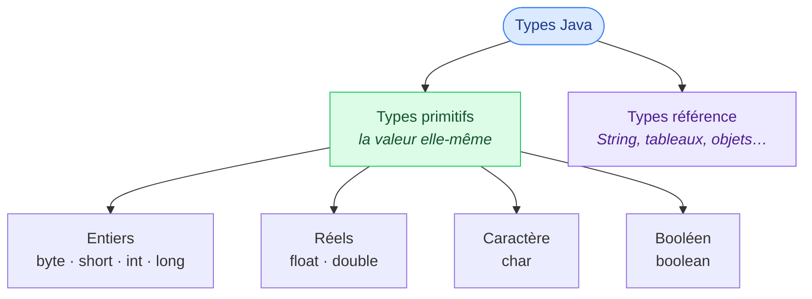
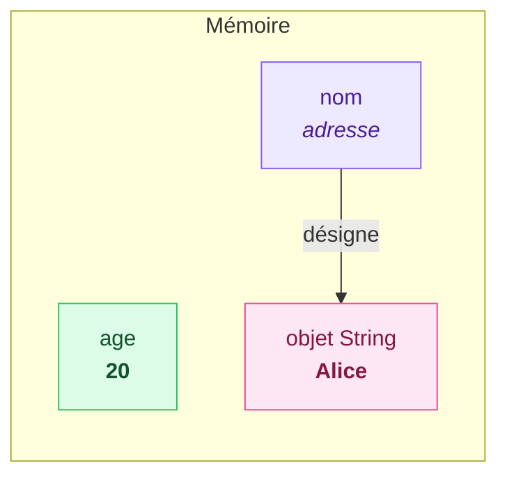

# 1. Introduction et éléments de base

<mark style="color:blue;">**Du problème au programme : écrire, compiler, exécuter.**</mark>

&#x20;


**En bref**

Un programme Java est écrit dans un fichier `.java`, **compilé** en bytecode par `javac`, puis **exécuté** par la machine virtuelle Java (JVM). Il manipule des **variables**, chacune avec un **type** qui dit ce qu'elle peut contenir.


&#x20;

***

&#x20;

## <mark style="color:purple;">01</mark> · Programmer, c'est quoi ?

&#x20;

Un ordinateur est extrêmement rapide, mais il ne **comprend rien** : il exécute des instructions, une par une, exactement comme on les lui donne.

&#x20;

* Un <mark style="color:blue;">**algorithme**</mark> est une suite d'étapes précises pour résoudre un problème.
* Un <mark style="color:blue;">**programme**</mark> est cet algorithme écrit dans un **langage** que la machine peut exécuter.

&#x20;

### L'analogie de la recette

&#x20;

Une recette de cuisine est un algorithme : des ingrédients (les **données**), des étapes dans un ordre précis (les **instructions**), et un résultat (le **plat**). Si tu écris « ajouter du sel » sans dire combien, un humain devine. Un ordinateur, lui, ne devine **jamais** : il faut tout lui dire.

&#x20;



&#x20;

***

&#x20;

## <mark style="color:purple;">02</mark> · Compilé, interprété… et Java ?

&#x20;

Le processeur ne comprend que le **langage machine** (des 0 et des 1). Il faut donc **traduire** le code écrit par un humain. Deux grandes approches existent :

&#x20;



### Langage compilé

Le code est traduit **une fois pour toutes** en langage machine, avant l'exécution (C, C++, Rust).

Rapide, mais le programme obtenu ne tourne que sur **un type de machine**.



### Langage interprété

Le code est traduit **ligne par ligne**, pendant l'exécution (Python, JavaScript).

Portable, mais plus lent.



&#x20;

**Java fait les deux.** Le compilateur `javac` traduit le code source en <mark style="color:blue;">**bytecode**</mark>, un langage intermédiaire. Puis la **JVM** (_Java Virtual Machine_) de chaque ordinateur exécute ce bytecode.

&#x20;



&#x20;

### L'analogie du livre traduit

&#x20;

Imagine un livre écrit en français. Plutôt que de le traduire dans chaque langue du monde, on le traduit **une seule fois** dans une langue universelle (le bytecode). Ensuite, dans chaque pays, un **interprète local** (la JVM) le lit à voix haute dans la langue du pays.

&#x20;

C'est la promesse de Java : <mark style="color:green;">**« Write once, run anywhere »**</mark> — écrire une fois, exécuter partout.

&#x20;

### JDK, JRE, JVM : qui contient quoi ?

&#x20;



&#x20;

| Sigle   | Nom complet                 | Rôle                                                        |
| ------- | --------------------------- | ----------------------------------------------------------- |
| **JVM** | Java Virtual Machine        | Exécute le bytecode                                         |
| **JRE** | Java Runtime Environment    | JVM + bibliothèques : de quoi **exécuter** un programme     |
| **JDK** | Java Development Kit        | JRE + outils (`javac`…) : de quoi **développer**            |

&#x20;


**Pour ce cours**, installe un **JDK** (par exemple Eclipse Temurin, version 21 ou plus récente). Il contient tout le reste.


&#x20;

***

&#x20;

## <mark style="color:purple;">03</mark> · Le premier programme

&#x20;


```java
public class HelloWorld {

    public static void main(String[] args) {
        System.out.println("Bonjour HEIA-FR !");
    }
}
```


&#x20;

| Élément                                   | Rôle                                                                                   |
| ----------------------------------------- | -------------------------------------------------------------------------------------- |
| `public class HelloWorld`                 | Déclare une **classe**. Le fichier doit porter **le même nom** : `HelloWorld.java`      |
| `public static void main(String[] args)`  | Le **point d'entrée** : c'est ici que la JVM commence l'exécution                      |
| `System.out.println(...)`                 | **Affiche** le texte, puis passe à la ligne                                            |
| `"Bonjour HEIA-FR !"`                     | Une **chaîne de caractères** (`String`), entre guillemets doubles                      |
| `;`                                       | **Termine** chaque instruction                                                         |
| `{ }`                                     | Délimitent un **bloc** : le contenu de la classe, puis celui de `main`                 |

&#x20;

### Compiler et exécuter

&#x20;



### Compiler

&#x20;

```bash
javac HelloWorld.java
```

&#x20;

`javac` vérifie le code et produit le fichier `HelloWorld.class` (le bytecode). S'il y a une erreur, rien n'est produit.



### Exécuter

&#x20;

```bash
java HelloWorld
```

&#x20;

On donne le **nom de la classe**, sans extension.



### Admirer le résultat

&#x20;

```
Bonjour HEIA-FR !
```

&#x20;

<mark style="color:green;">**C'est ton premier programme Java.**</mark>



&#x20;


**Raccourci** — depuis Java 11, `java HelloWorld.java` compile et exécute en une seule commande un programme tenant dans un seul fichier. Pratique pour tester.


&#x20;

***

&#x20;

## <mark style="color:purple;">04</mark> · Les trois sortes d'erreurs

&#x20;



&#x20;

| Sorte               | Exemple                                           | Qui la détecte ?                         |
| ------------------- | ------------------------------------------------- | ---------------------------------------- |
| **Compilation**     | Point-virgule oublié, type incompatible           | `javac`, avant même de lancer            |
| **Exécution**       | Division entière par zéro                         | La JVM, pendant l'exécution (exception)  |
| **Logique**         | Moyenne calculée avec la mauvaise formule         | **Toi**, en testant                      |

&#x20;


**Les erreurs de logique sont les plus dangereuses** — personne ne te prévient. Il faut toujours vérifier les résultats sur des exemples dont on connaît la réponse.


&#x20;

***

&#x20;

## <mark style="color:purple;">05</mark> · Anatomie du code

&#x20;

### Instructions et blocs

&#x20;

* Une **instruction** se termine par un **point-virgule** `;`.
* Un **bloc** regroupe des instructions entre **accolades** `{ }`.
* Java est **sensible à la casse** : `age`, `Age` et `AGE` sont trois noms différents.
* Les espaces et retours à la ligne sont ignorés par le compilateur, mais **indispensables pour l'humain** qui lit.

&#x20;

### Les commentaires

&#x20;

```java
// Commentaire sur une seule ligne

/* Commentaire
   sur plusieurs lignes */

/**
 * Commentaire Javadoc : documente une classe ou une méthode.
 * L'outil javadoc s'en sert pour générer une documentation HTML.
 */
```

&#x20;


**Un bon commentaire explique le « pourquoi »**, pas le « quoi ». `i = i + 1; // ajoute 1 à i` n'apporte rien ; `// on saute l'en-tête du fichier` aide vraiment.


&#x20;

***

&#x20;

## <mark style="color:purple;">06</mark> · Les identificateurs

&#x20;

Un **identificateur** est le nom que tu donnes à une variable, une méthode ou une classe.

&#x20;

### Les règles (imposées par le compilateur)

&#x20;

* Composé de **lettres**, **chiffres**, `_` et `$`
* Ne commence **pas par un chiffre**
* Ne contient **pas d'espace** ni de tiret
* N'est **pas un mot-clé** du langage (`int`, `class`, `if`, `for`, `public`…)

&#x20;



**Valides**

```java
age
nombreEtudiants
_temp
x2
prixTTC
```



**Invalides**

```java
2x               // commence par un chiffre
nombre-etudiants // tiret
mon age          // espace
class            // mot-clé
```



&#x20;

### Les conventions (imposées par les humains)

&#x20;

| Élément                | Convention            | Exemples                                  |
| ---------------------- | --------------------- | ----------------------------------------- |
| Classe                 | `PascalCase`          | `HelloWorld`, `CompteBancaire`            |
| Variable, méthode      | `camelCase`           | `age`, `nombreEtudiants`, `calculerMoyenne` |
| Constante              | `UPPER_SNAKE_CASE`    | `TAUX_TVA`, `MAX_ESSAIS`                  |
| Package                | tout en minuscules    | `ch.heiafr.cours`                         |

&#x20;


**Choisis des noms qui parlent** — `moyenneNotes` plutôt que `m`, `nombreEssais` plutôt que `n2`. Le code est lu bien plus souvent qu'il n'est écrit.


&#x20;

***

&#x20;

## <mark style="color:purple;">07</mark> · Les variables

&#x20;

Une **variable** est un emplacement mémoire qui porte un **nom**, possède un **type**, et contient une **valeur**.

&#x20;

### L'analogie de la boîte étiquetée

&#x20;



**L'étiquette**

Le **nom** de la variable : `age`.



**La forme de la boîte**

Le **type** : on ne range pas de la soupe dans une boîte à œufs. Une boîte `int` ne contient que des entiers.



**Le contenu**

La **valeur** : `20`. Elle peut changer, pas le type.



&#x20;

### Déclarer, initialiser, affecter

&#x20;

```java
int age;              // déclaration : on crée une boîte de type int nommée age
age = 20;             // affectation : on range 20 dedans
int annee = 2026;     // déclaration + initialisation en une ligne
age = age + 1;        // on lit age (20), on ajoute 1, on range 21 dans age
```

&#x20;


**Le `=` n'est pas une égalité mathématique** — c'est une **affectation** : « calcule ce qui est à droite, puis range-le dans la variable de gauche ». `age = age + 1` est donc parfaitement logique en Java.


&#x20;


**Variable non initialisée** — une variable locale doit recevoir une valeur **avant d'être lue**, sinon le compilateur refuse : `variable age might not have been initialized`.


&#x20;

### Les constantes : `final`

&#x20;

```java
final int JOURS_PAR_SEMAINE = 7;
final double TAUX_TVA = 0.081;

JOURS_PAR_SEMAINE = 8;   // ERREUR de compilation : une constante ne change pas
```

&#x20;

### L'inférence de type : `var`

&#x20;

Depuis Java 10, `var` laisse le compilateur **déduire le type** à partir de la valeur :

&#x20;

```java
var compteur = 0;       // le compilateur déduit : int
var nom = "Alice";      // le compilateur déduit : String
var prix;               // ERREUR : impossible de déduire le type sans valeur
```

&#x20;


`var` ne rend pas Java « sans type » : le type est fixé **à la compilation** et ne change plus. En début d'apprentissage, écrire le type explicitement aide à bien le comprendre.


&#x20;

***

&#x20;

## <mark style="color:purple;">08</mark> · Les types

&#x20;



&#x20;

### Les 8 types primitifs

&#x20;

| Type        | Taille   | Valeurs possibles                              | Exemple                          |
| ----------- | -------- | ---------------------------------------------- | -------------------------------- |
| `byte`      | 8 bits   | −128 à 127                                     | `byte b = 100;`                  |
| `short`     | 16 bits  | −32 768 à 32 767                               | `short s = 2026;`                |
| `int`       | 32 bits  | environ ±2,1 milliards (−2³¹ à 2³¹−1)          | `int n = 42;`                    |
| `long`      | 64 bits  | environ ±9,2 × 10¹⁸                            | `long l = 8_000_000_000L;`       |
| `float`     | 32 bits  | réel, environ 7 chiffres significatifs         | `float f = 3.14f;`               |
| `double`    | 64 bits  | réel, environ 15 à 16 chiffres significatifs   | `double d = 3.14;`               |
| `char`      | 16 bits  | un caractère Unicode                           | `char c = 'A';`                  |
| `boolean`   | —        | `true` ou `false`                              | `boolean ok = true;`             |

&#x20;


**Au quotidien**, tu utiliseras surtout **`int`** pour les entiers, **`double`** pour les réels, **`char`** pour un caractère et **`boolean`** pour vrai/faux. Les autres servent quand la taille ou la mémoire comptent.


&#x20;

### Primitif ou référence ?

&#x20;



&#x20;

* Une variable **primitive** contient **directement la valeur** : la boîte `age` contient `20`.
* Une variable **référence** contient **l'adresse** d'un objet rangé ailleurs en mémoire : la boîte `nom` contient « l'adresse de la maison », pas la maison elle-même.

&#x20;

Pour l'instant, retiens que `String` (le texte) est un type **référence**. On y reviendra en détail au chapitre sur les classes et objets.

&#x20;

***

&#x20;

## <mark style="color:purple;">09</mark> · Les littéraux

&#x20;

Un **littéral** est une valeur écrite directement dans le code.

&#x20;

| Littéral            | Type       | Remarque                                           |
| ------------------- | ---------- | -------------------------------------------------- |
| `42`                | `int`      | Par défaut, un entier est un `int`                  |
| `42L`               | `long`     | Suffixe `L`                                        |
| `0x2A`              | `int`      | Hexadécimal (= 42)                                 |
| `0b101010`          | `int`      | Binaire (= 42)                                     |
| `1_000_000`         | `int`      | Les `_` rendent les grands nombres lisibles         |
| `3.14`              | `double`   | Par défaut, un réel est un `double`                 |
| `3.14f`             | `float`    | Suffixe `f`                                        |
| `1.5e3`             | `double`   | Notation scientifique (= 1500.0)                   |
| `'A'`               | `char`     | **Guillemets simples**                             |
| `"Bonjour"`         | `String`   | **Guillemets doubles**                             |
| `true`, `false`     | `boolean`  |                                                    |
| `'\n'`, `'\t'`      | `char`     | Retour à la ligne, tabulation (séquences d'échappement) |

&#x20;


**`'A'` n'est pas `"A"`** — le premier est un `char` (un seul caractère, guillemets simples), le second un `String` (du texte, guillemets doubles). Les confondre est une erreur de compilation fréquente.


&#x20;

***

&#x20;

## <mark style="color:purple;">10</mark> · Afficher à l'écran

&#x20;


```java
public class Affichage {

    public static void main(String[] args) {
        int age = 20;
        double taille = 1.75;

        System.out.println("Bonjour");              // affiche, puis retour à la ligne
        System.out.print("Bon");                    // affiche, SANS retour à la ligne
        System.out.print("jour\n");                 // \n force le retour à la ligne
        System.out.println("J'ai " + age + " ans"); // + colle (concatène) les morceaux
        System.out.println("Je mesure " + taille + " m");
    }
}
```


&#x20;

```
Bonjour
Bonjour
J'ai 20 ans
Je mesure 1.75 m
```

&#x20;


**Lire au clavier** (avec `Scanner`) et **mettre en forme** l'affichage (avec `printf`) sont traités au chapitre [7. String et entrées/sorties](../07-string-entrees-sorties/README.md).


&#x20;

***

&#x20;

## <mark style="color:purple;">11</mark> · En résumé

&#x20;


* Java est **compilé** en bytecode (`javac`), puis **exécuté** par la JVM (`java`) : un même programme tourne partout.
* Un programme commence par la méthode **`main`** ; chaque instruction finit par **`;`**.
* Une **variable** a un nom, un type et une valeur. Elle doit être **initialisée** avant d'être lue.
* 8 **types primitifs** : `byte`, `short`, `int`, `long`, `float`, `double`, `char`, `boolean`. `String` est un type **référence**.
* Noms : `PascalCase` pour les classes, `camelCase` pour les variables, `UPPER_SNAKE_CASE` pour les constantes (`final`).


&#x20;

***

&#x20;

## <mark style="color:purple;">12</mark> · Exercices

&#x20;


**Sur papier, sans ordinateur.** Écris tes réponses à la main, puis ouvre la solution pour corriger. C'est exactement le format des examens écrits.


&#x20;

### Exercice 1 — Le compilateur, c'est toi

&#x20;

Pour chaque ligne, indique si elle **compile**. Si oui, donne la **valeur** stockée ; si non, explique **pourquoi** en une phrase. Chaque ligne est indépendante.

&#x20;

```java
int a = 3.0;
double b = 3;
float c = 2.5;
long d = 5_000_000_000;
char e = "A";
boolean f = 1;
byte g = 127;
int 2eme = 4;
final int MAX = 10;  MAX = 12;
var h;
```

&#x20;

<details>

<summary>Solution</summary>

&#x20;

| Ligne                                | Compile ? | Explication                                                                 |
| ------------------------------------ | --------- | --------------------------------------------------------------------------- |
| `int a = 3.0;`                       | Non       | `3.0` est un `double` : le ranger dans un `int` risque de perdre de l'information |
| `double b = 3;`                      | Oui       | `b` vaut `3.0` : un `int` se convertit sans perte en `double`               |
| `float c = 2.5;`                     | Non       | `2.5` est un `double` ; il faut écrire `2.5f`                                |
| `long d = 5_000_000_000;`            | Non       | Le littéral est un `int`, trop grand pour un `int` ; il faut `5_000_000_000L` |
| `char e = "A";`                      | Non       | `"A"` est un `String` ; un `char` s'écrit `'A'`                             |
| `boolean f = 1;`                     | Non       | En Java, un entier n'est **jamais** un booléen                              |
| `byte g = 127;`                      | Oui       | `g` vaut `127`, la valeur maximale d'un `byte`                              |
| `int 2eme = 4;`                      | Non       | Un identificateur ne commence pas par un chiffre                            |
| `final int MAX = 10;  MAX = 12;`     | Non       | La 1re instruction compile, la 2e non : une constante `final` ne change pas |
| `var h;`                             | Non       | `var` a besoin d'une valeur pour déduire le type                            |

&#x20;

</details>

&#x20;

### Exercice 2 — La carte d'étudiant

&#x20;

Écris **à la main** un programme complet `CarteEtudiant` qui :

&#x20;

1. déclare et initialise des variables pour le **nom** (Alice Dupont), l'**âge** (20), la **taille** en mètres (1.68), l'**initiale du prénom** (A) et le fait d'être **boursière** (oui) ;
2. déclare une **constante** pour l'année académique (2026) ;
3. affiche une carte de ce format :

&#x20;

```
Carte d'étudiant 2026
Nom    : Alice Dupont (A)
Âge    : 20 ans
Taille : 1.68 m
Bourse : true
```

&#x20;

Choisis soigneusement le **type** de chaque variable et respecte les **conventions de nommage**.

&#x20;

<details>

<summary>Solution</summary>

&#x20;


```java
public class CarteEtudiant {

    public static void main(String[] args) {
        final int ANNEE_ACADEMIQUE = 2026;

        String nom = "Alice Dupont";
        int age = 20;
        double taille = 1.68;
        char initiale = 'A';
        boolean boursiere = true;

        System.out.println("Carte d'étudiant " + ANNEE_ACADEMIQUE);
        System.out.println("Nom    : " + nom + " (" + initiale + ")");
        System.out.println("Âge    : " + age + " ans");
        System.out.println("Taille : " + taille + " m");
        System.out.println("Bourse : " + boursiere);
    }
}
```


&#x20;

**Points à vérifier sur ta copie :**

* `String` pour le nom (du texte), `int` pour l'âge (entier), `double` pour la taille (réel), `char` avec **guillemets simples** pour l'initiale, `boolean` pour la bourse.
* La constante est `final` et écrite en `UPPER_SNAKE_CASE`.
* Les variables sont en `camelCase`, la classe en `PascalCase`, et le fichier s'appellerait `CarteEtudiant.java`.

&#x20;

</details>

&#x20;

<mark style="color:green;">**→ Suite :**</mark> [2. Expressions et opérateurs](../02-expressions-operateurs/README.md)
