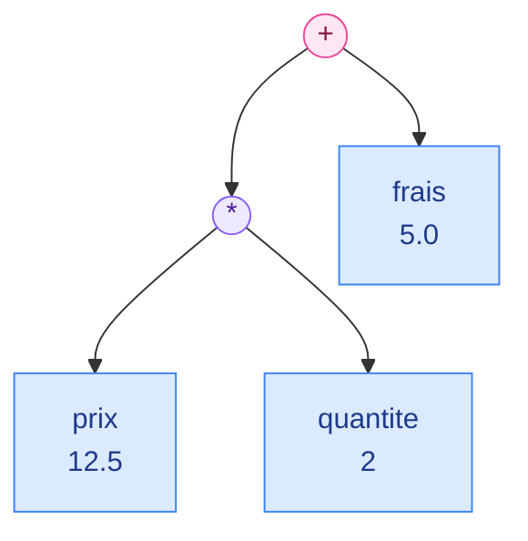
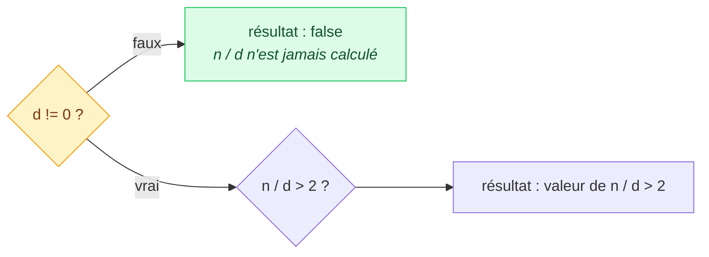
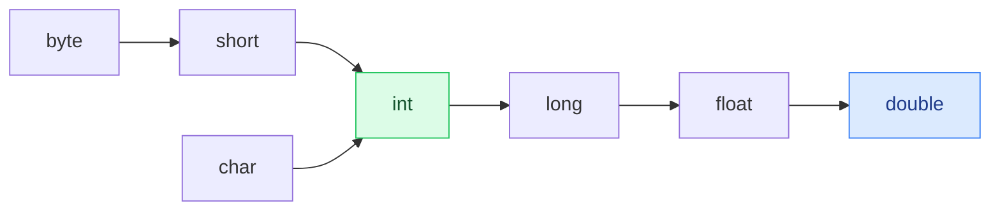

# 2. Expressions et opérateurs

<mark style="color:blue;">**Faire calculer la machine, et savoir exactement ce qu'elle va répondre.**</mark>

&#x20;


**En bref**

Une **expression** combine des valeurs avec des **opérateurs** et produit un résultat d'un certain **type**. Il faut connaître trois choses : ce que fait chaque opérateur, **dans quel ordre** ils s'appliquent, et **quel type** a le résultat.


&#x20;

***

&#x20;

## <mark style="color:purple;">01</mark> · Expression, opérande, opérateur

&#x20;

```java
double total = prix * quantite + frais;
```

&#x20;

* `prix`, `quantite`, `frais` sont des **opérandes** (les valeurs).
* `*` et `+` sont des **opérateurs** (les actions).
* `prix * quantite + frais` est une **expression** : elle produit **une valeur**.

&#x20;

Java évalue une expression comme un **arbre** : on calcule d'abord les branches du bas, puis on remonte.

&#x20;



&#x20;

`12.5 * 2` donne `25.0`, puis `25.0 + 5.0` donne `30.0`.

&#x20;

***

&#x20;

## <mark style="color:purple;">02</mark> · Les opérateurs arithmétiques

&#x20;

| Opérateur | Rôle                        | Exemple      | Résultat |
| --------- | --------------------------- | ------------ | -------- |
| `+`       | Addition                    | `7 + 2`      | `9`      |
| `-`       | Soustraction                | `7 - 2`      | `5`      |
| `*`       | Multiplication              | `7 * 2`      | `14`     |
| `/`       | Division                    | `7 / 2`      | <mark style="color:orange;">**`3`**</mark> |
| `%`       | Reste de la division (modulo) | `7 % 2`    | `1`      |

&#x20;

### Le piège n°1 : la division entière

&#x20;


**Entier divisé par entier = entier.** Java **coupe** la partie décimale, sans arrondir : `7 / 2` vaut `3`, pas `3.5`.


&#x20;

```java
int a = 7, b = 2;

System.out.println(a / b);          // 3     : int / int -> int
System.out.println(7.0 / 2);        // 3.5   : double / int -> double
System.out.println((double) a / b); // 3.5   : on convertit a AVANT la division
System.out.println((double) (a / b)); // 3.0 : trop tard, la division a déjà coupé
System.out.println(-7 / 2);         // -3    : on coupe vers zéro
```

&#x20;

Il suffit qu'**un seul** des deux opérandes soit réel pour que la division soit réelle.

&#x20;

### Le modulo `%` : plus utile qu'il n'y paraît

&#x20;

| Usage                          | Expression           | Exemple                     |
| ------------------------------ | -------------------- | --------------------------- |
| Tester la parité               | `n % 2 == 0`         | `14 % 2` vaut `0` : pair    |
| Dernier chiffre d'un nombre    | `n % 10`             | `472 % 10` vaut `2`         |
| Tester la divisibilité         | `n % 3 == 0`         | `21 % 3` vaut `0`           |
| Revenir au début d'un cycle    | `(heure + 5) % 24`   | `(22 + 5) % 24` vaut `3`    |

&#x20;


Le signe du résultat de `%` est celui de l'opérande **de gauche** : `-7 % 2` vaut `-1`, et `7 % -2` vaut `1`.


&#x20;

### Division par zéro

&#x20;

| Expression     | Résultat                                                           |
| -------------- | ------------------------------------------------------------------ |
| `7 / 0`        | <mark style="color:red;">**`ArithmeticException`**</mark> : le programme plante |
| `7 % 0`        | <mark style="color:red;">**`ArithmeticException`**</mark>          |
| `7.0 / 0`      | `Infinity`                                                         |
| `0.0 / 0`      | `NaN` (_Not a Number_)                                             |

&#x20;

### Le dépassement de capacité

&#x20;

Un `int` ne peut pas dépasser 2 147 483 647. Si on essaie, il **repart de l'autre côté**, sans prévenir :

&#x20;

```java
int max = Integer.MAX_VALUE;     //  2147483647
System.out.println(max + 1);     // -2147483648
```

&#x20;

C'est comme un **compteur kilométrique** à 6 chiffres : après 999 999, il affiche 000 000. Si les nombres peuvent devenir très grands, utilise un `long`.

&#x20;

***

&#x20;

## <mark style="color:purple;">03</mark> · Incrément et décrément

&#x20;

`++` ajoute 1, `--` retire 1. Mais leur **position** change la valeur de l'expression :

&#x20;

```java
int a = 5;
int b = a++;   // post-incrément : b reçoit 5, PUIS a devient 6
int c = ++a;   // pré-incrément  : a devient 7, PUIS c reçoit 7
```

&#x20;



**`a++` (post)**

« Je te donne la valeur actuelle, **puis** j'augmente. »

Comme un ticket de file d'attente : tu reçois le numéro 5, puis le distributeur passe à 6.



**`++a` (pré)**

« J'augmente **d'abord**, puis je te donne la nouvelle valeur. »



&#x20;


**Bonne pratique** — utilise `++` et `--` **seuls sur leur ligne** (`i++;`). Les mélanger dans une expression plus grande (`x = i++ + ++i;`) rend le code illisible.


&#x20;

***

&#x20;

## <mark style="color:purple;">04</mark> · L'affectation

&#x20;

`=` calcule l'expression de droite, puis range le résultat dans la variable de gauche. Les **affectations composées** sont des raccourcis :

&#x20;

| Écriture     | Équivaut à        |
| ------------ | ----------------- |
| `x += 3`     | `x = x + 3`       |
| `x -= 3`     | `x = x - 3`       |
| `x *= 3`     | `x = x * 3`       |
| `x /= 3`     | `x = x / 3`       |
| `x %= 3`     | `x = x % 3`       |

&#x20;


**Subtilité** — l'affectation composée fait une conversion **implicite** vers le type de la variable :

```java
byte b = 10;
b += 5;      // compile : équivaut à b = (byte) (b + 5)
b = b + 5;   // ERREUR : b + 5 est un int, qu'on ne peut pas ranger dans un byte
```


&#x20;

***

&#x20;

## <mark style="color:purple;">05</mark> · Les opérateurs de comparaison

&#x20;

Ils comparent deux valeurs et produisent un **`boolean`** (`true` ou `false`).

&#x20;

| Opérateur | Signification           | Exemple (`a = 7`, `b = 2`) | Résultat |
| --------- | ----------------------- | -------------------------- | -------- |
| `==`      | égal à                  | `a == b`                   | `false`  |
| `!=`      | différent de            | `a != b`                   | `true`   |
| `<`       | strictement inférieur   | `a < b`                    | `false`  |
| `<=`      | inférieur ou égal       | `a <= 7`                   | `true`   |
| `>`       | strictement supérieur   | `a > b`                    | `true`   |
| `>=`      | supérieur ou égal       | `b >= 3`                   | `false`  |

&#x20;


**`=` affecte, `==` compare.** Écrire `if (x = 5)` au lieu de `if (x == 5)` est une faute classique (le compilateur la refuse pour un `int`, mais pas pour un `boolean`).


&#x20;

### Ne jamais comparer deux réels avec `==`

&#x20;

Les `double` sont stockés en binaire, avec une précision limitée. Certains nombres simples en décimal ne tombent **jamais juste** :

&#x20;

```java
System.out.println(0.1 + 0.2);          // 0.30000000000000004
System.out.println(0.1 + 0.2 == 0.3);   // false !

// La bonne façon : vérifier que l'écart est minuscule
final double EPSILON = 1e-9;
System.out.println(Math.abs((0.1 + 0.2) - 0.3) < EPSILON);   // true
```

&#x20;

C'est comme écrire 1/3 en décimal : 0,333… il faudrait une infinité de chiffres.

&#x20;

***

&#x20;

## <mark style="color:purple;">06</mark> · Les opérateurs logiques

&#x20;

Ils combinent des **conditions** (`boolean`).

&#x20;

| `a`     | `b`     | `a && b` (ET) | `a \|\| b` (OU) | `a ^ b` (OU exclusif) | `!a` (NON) |
| ------- | ------- | ------------- | --------------- | --------------------- | ---------- |
| `true`  | `true`  | `true`        | `true`          | `false`               | `false`    |
| `true`  | `false` | `false`       | `true`          | `true`                | `false`    |
| `false` | `true`  | `false`       | `true`          | `true`                | `true`     |
| `false` | `false` | `false`       | `false`         | `false`               | `true`     |

&#x20;

```java
boolean majeur = age >= 18;
boolean etudiant = true;
boolean reduction = majeur && etudiant;       // les deux doivent être vrais
boolean horsSaison = mois <= 3 || mois >= 11; // l'un OU l'autre suffit
```

&#x20;

### L'évaluation en court-circuit

&#x20;

`&&` et `||` s'arrêtent **dès que le résultat est connu** :

&#x20;

* `faux && …` est forcément faux : la partie droite n'est **pas évaluée**.
* `vrai || …` est forcément vrai : la partie droite n'est **pas évaluée**.

&#x20;

On s'en sert pour **protéger** une opération dangereuse :

&#x20;

```java
if (d != 0 && n / d > 2) {
    // la division n'est faite que si d n'est pas nul
}
```

&#x20;



&#x20;


`&` et `|` existent aussi sur des booléens, mais ils évaluent **toujours les deux côtés**. En pratique, utilise `&&` et `||`.


&#x20;

***

&#x20;

## <mark style="color:purple;">07</mark> · L'opérateur conditionnel `? :`

&#x20;

Un `if/else` compact, qui **produit une valeur** : `condition ? valeurSiVrai : valeurSiFaux`.

&#x20;

```java
int max = (a > b) ? a : b;
String statut = (note >= 4.0) ? "réussi" : "échoué";
```

&#x20;


Pratique pour un choix simple. Dès que ça se complique, un vrai `if/else` ([chapitre 3](03-instructions-controle-flux.md)) est plus lisible.


&#x20;

***

&#x20;

## <mark style="color:purple;">08</mark> · Les conversions de types

&#x20;

### Conversion implicite (élargissante)

&#x20;

Java convertit **automatiquement** vers un type plus « large », sans perte :

&#x20;



&#x20;

```java
int n = 42;
long l = n;       // int -> long : automatique
double d = n;     // int -> double : d vaut 42.0
```

&#x20;

### Promotion dans les calculs

&#x20;

Dans une expression, Java convertit les opérandes vers le type **le plus large** présent, et **au minimum en `int`** :

&#x20;

| Opération               | Type du résultat |
| ----------------------- | ---------------- |
| `int + int`             | `int`            |
| `int + long`            | `long`           |
| `int + double`          | `double`         |
| `byte + byte`           | <mark style="color:orange;">**`int`**</mark> |
| `char + int`            | `int`            |

&#x20;

### Conversion explicite : le cast

&#x20;

Pour aller vers un type plus « étroit », il faut le demander avec un **cast** `(type)`. On accepte alors de **perdre** de l'information :

&#x20;

```java
double d = 9.87;
int i = (int) d;              // 9  : la partie décimale est COUPÉE, pas arrondie
int j = (int) -9.87;          // -9 : on coupe vers zéro
long arrondi = Math.round(d); // 10 : pour arrondir, on utilise Math.round

long grand = 3_000_000_000L;
int k = (int) grand;          // -1294967296 : trop grand, la valeur n'a plus de sens
```

&#x20;


**Le cast ne s'applique qu'à ce qui le suit immédiatement.** `(double) a / b` convertit `a`, puis divise en réel. `(double) (a / b)` divise d'abord en entier, puis convertit le résultat déjà tronqué.


&#x20;

### Les caractères sont des nombres

&#x20;

Un `char` est stocké comme un nombre (son code Unicode) : `'A'` vaut 65, `'B'` vaut 66…

&#x20;

```java
char c = 'A';
System.out.println(c + 1);          // 66 : char + int donne un int
System.out.println((char) (c + 1)); // B
c++;                                // c vaut maintenant 'B' (++ garde le type char)
```

&#x20;

### Le `+` avec du texte

&#x20;

Dès qu'un opérande est un `String`, `+` **colle** (concatène) au lieu d'additionner. L'évaluation se fait **de gauche à droite** :

&#x20;

```java
System.out.println("Total : " + 1 + 2);     // Total : 12
System.out.println("Total : " + (1 + 2));   // Total : 3
System.out.println(1 + 2 + " francs");      // 3 francs
```

&#x20;

***

&#x20;

## <mark style="color:purple;">09</mark> · Priorité des opérateurs

&#x20;

Comme en mathématiques, `*` passe avant `+`. Voici l'ordre complet, du plus prioritaire au moins prioritaire :

&#x20;

| Priorité          | Opérateurs                                          | Associativité     |
| ----------------- | --------------------------------------------------- | ----------------- |
| 1 (la plus forte) | `a++` `a--`                                         | gauche → droite   |
| 2                 | `++a` `--a` `+a` `-a` `!` `~` `(type)`              | droite → gauche   |
| 3                 | `*` `/` `%`                                         | gauche → droite   |
| 4                 | `+` `-`                                             | gauche → droite   |
| 5                 | `<<` `>>` `>>>`                                     | gauche → droite   |
| 6                 | `<` `<=` `>` `>=` `instanceof`                      | gauche → droite   |
| 7                 | `==` `!=`                                           | gauche → droite   |
| 8                 | `&`                                                 | gauche → droite   |
| 9                 | `^`                                                 | gauche → droite   |
| 10                | `\|`                                                | gauche → droite   |
| 11                | `&&`                                                | gauche → droite   |
| 12                | `\|\|`                                              | gauche → droite   |
| 13                | `? :`                                               | droite → gauche   |
| 14 (la plus faible) | `=` `+=` `-=` `*=` `/=` `%=` …                    | droite → gauche   |

&#x20;

Exemple : `a + b * c > d || !e` se lit `((a + (b * c)) > d) || (!e)`.

&#x20;


**Règle pratique** — inutile d'apprendre ce tableau par cœur. Retiens : **unaires, puis `* / %`, puis `+ -`, puis comparaisons, puis `&&`, puis `||`, puis affectation**. Et dans le doute, **mets des parenthèses** : elles ne coûtent rien et rendent le code clair.


&#x20;

***

&#x20;

<details>

<summary>Pour aller plus loin : les opérateurs bit à bit</summary>

&#x20;

Ils travaillent directement sur la représentation **binaire** des entiers. On les rencontre en programmation système, en réseau ou pour des optimisations.

&#x20;

| Opérateur | Rôle                              | Exemple (6 = `110`, 3 = `011`) | Résultat      |
| --------- | --------------------------------- | ------------------------------ | ------------- |
| `&`       | ET bit à bit                      | `6 & 3`                        | `2` (`010`)   |
| `\|`      | OU bit à bit                      | `6 \| 3`                       | `7` (`111`)   |
| `^`       | OU exclusif bit à bit             | `6 ^ 3`                        | `5` (`101`)   |
| `~`       | Inversion de tous les bits        | `~6`                           | `-7`          |
| `<<`      | Décalage à gauche (× 2 par cran)  | `6 << 1`                       | `12`          |
| `>>`      | Décalage à droite, garde le signe | `6 >> 1`                       | `3`           |
| `>>>`     | Décalage à droite, remplit de 0   | `-8 >>> 28`                    | `15`          |

&#x20;

</details>

&#x20;

***

&#x20;

## <mark style="color:purple;">10</mark> · En résumé

&#x20;


* **`int / int` donne un `int`** : la partie décimale est coupée. Convertis un opérande en `double` **avant** la division.
* `%` donne le **reste** : parité, dernier chiffre, divisibilité.
* `a++` utilise puis incrémente ; `++a` incrémente puis utilise.
* `&&` et `||` s'arrêtent dès que le résultat est connu (**court-circuit**).
* Conversions : automatiques vers un type plus large, **cast** `(type)` pour un type plus étroit (avec perte possible).
* Jamais de `==` entre deux `double` ; dans le doute sur la priorité, **des parenthèses**.


&#x20;

***

&#x20;

## <mark style="color:purple;">11</mark> · Exercices

&#x20;


**Sur papier, sans ordinateur.** Écris tes réponses à la main, puis ouvre la solution pour corriger.


&#x20;

### Exercice 1 — Évaluer à la main

&#x20;

On déclare :

&#x20;

```java
int a = 7, b = 2;
double x = 2.0;
```

&#x20;

Pour chaque expression, donne le **type** et la **valeur** du résultat. Chaque ligne est **indépendante** : on repart toujours de `a = 7`, `b = 2`, `x = 2.0`.

&#x20;

| #  | Expression                 | Type | Valeur |
| -- | -------------------------- | ---- | ------ |
| 1  | `a / b`                    |      |        |
| 2  | `a % b`                    |      |        |
| 3  | `a / x`                    |      |        |
| 4  | `(double) a / b`           |      |        |
| 5  | `(double) (a / b)`         |      |        |
| 6  | `a + b * 3`                |      |        |
| 7  | `-a / b`                   |      |        |
| 8  | `-a % b`                   |      |        |
| 9  | `1 + 2 + "3"`              |      |        |
| 10 | `"1" + 2 + 3`              |      |        |
| 11 | `a > 5 \|\| b++ > 0` (et que vaut `b` après ?) |      |        |
| 12 | `a++ + a`                  |      |        |
| 13 | `'A' + 1`                  |      |        |
| 14 | `(char) ('A' + 2)`         |      |        |

&#x20;

<details>

<summary>Solution</summary>

&#x20;

| #  | Expression                 | Type      | Valeur    | Pourquoi                                                           |
| -- | -------------------------- | --------- | --------- | ------------------------------------------------------------------ |
| 1  | `a / b`                    | `int`     | `3`       | Division entière                                                   |
| 2  | `a % b`                    | `int`     | `1`       | 7 = 3 × 2 + **1**                                                  |
| 3  | `a / x`                    | `double`  | `3.5`     | Un opérande est `double`                                           |
| 4  | `(double) a / b`           | `double`  | `3.5`     | `a` est converti **avant** la division                             |
| 5  | `(double) (a / b)`         | `double`  | `3.0`     | La division entière donne 3, **puis** conversion                   |
| 6  | `a + b * 3`                | `int`     | `13`      | `*` avant `+` : 7 + 6                                              |
| 7  | `-a / b`                   | `int`     | `-3`      | −7 / 2 = −3,5, coupé vers zéro                                     |
| 8  | `-a % b`                   | `int`     | `-1`      | Le signe suit l'opérande de gauche                                 |
| 9  | `1 + 2 + "3"`              | `String`  | `"33"`    | De gauche à droite : 1 + 2 = 3, puis 3 + "3" = "33"                |
| 10 | `"1" + 2 + 3`              | `String`  | `"123"`   | "1" + 2 = "12", puis "12" + 3 = "123"                              |
| 11 | `a > 5 \|\| b++ > 0`       | `boolean` | `true`    | `a > 5` est vrai : **court-circuit**, `b++` n'est pas exécuté, `b` reste **2** |
| 12 | `a++ + a`                  | `int`     | `15`      | `a++` vaut 7 (puis `a` devient 8), puis on ajoute `a` = 8          |
| 13 | `'A' + 1`                  | `int`     | `66`      | `char + int` donne un `int` ; `'A'` vaut 65                        |
| 14 | `(char) ('A' + 2)`         | `char`    | `'C'`     | 65 + 2 = 67, converti en caractère                                 |

&#x20;

</details>

&#x20;

### Exercice 2 — Le thermomètre qui ment

&#x20;

Un étudiant veut convertir des degrés Celsius en Fahrenheit avec la formule **F = C × 9/5 + 32**. Il écrit :

&#x20;


```java
public class Temperature {

    public static void main(String[] args) {
        int celsius = 25;
        double fahrenheit = 9 / 5 * celsius + 32;
        System.out.println(celsius + " C = " + fahrenheit + " F");
    }
}
```


&#x20;

1. Qu'affiche **exactement** ce programme ? Détaille le calcul étape par étape.
2. Quel devrait être le bon résultat ?
3. Propose **deux** corrections différentes de la ligne 5.
4. Réécris la ligne 5 avec des parenthèses qui montrent l'ordre d'évaluation **réel**.

&#x20;

<details>

<summary>Solution</summary>

&#x20;

**1.** Le programme affiche `25 C = 57.0 F`.

&#x20;

| Étape | Calcul             | Résultat | Type     |
| ----- | ------------------ | -------- | -------- |
| 1     | `9 / 5`            | `1`      | `int` (division entière !) |
| 2     | `1 * 25`           | `25`     | `int`    |
| 3     | `25 + 32`          | `57`     | `int`    |
| 4     | rangé dans un `double` | `57.0` | `double` |

&#x20;

La conversion en `double` arrive **à la fin**, bien trop tard.

&#x20;

**2.** 25 × 1,8 + 32 = **77.0**.

&#x20;

**3.** Deux corrections possibles :

```java
double fahrenheit = 9.0 / 5 * celsius + 32;   // 9.0 est un double : 1.8 * 25 + 32 = 77.0
double fahrenheit = celsius * 9 / 5 + 32;     // 225 / 5 = 45 (division exacte ici), + 32 = 77 -> 77.0
```

&#x20;

La première est la plus sûre : la seconde ne marche que parce que `celsius * 9` est divisible par 5 (avec `celsius = 26`, elle donnerait 78.0 au lieu de 78.8).

&#x20;

**4.** `double fahrenheit = (((9 / 5) * celsius) + 32);`

&#x20;

</details>

&#x20;

<mark style="color:green;">**→ Suite :**</mark> [3. Instructions et contrôle de flux](03-instructions-controle-flux.md)
