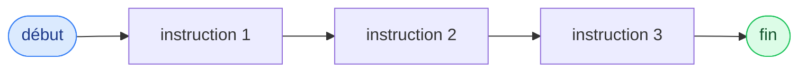
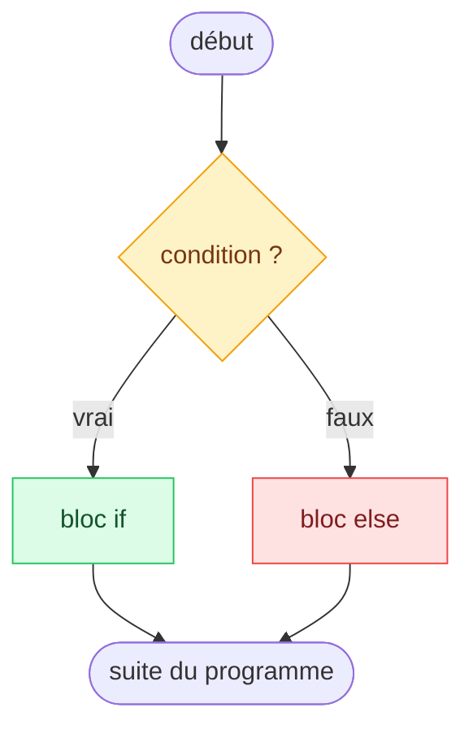
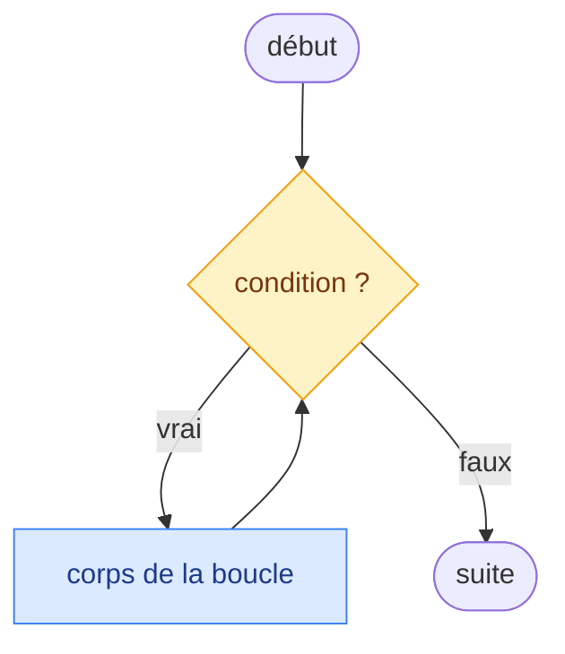
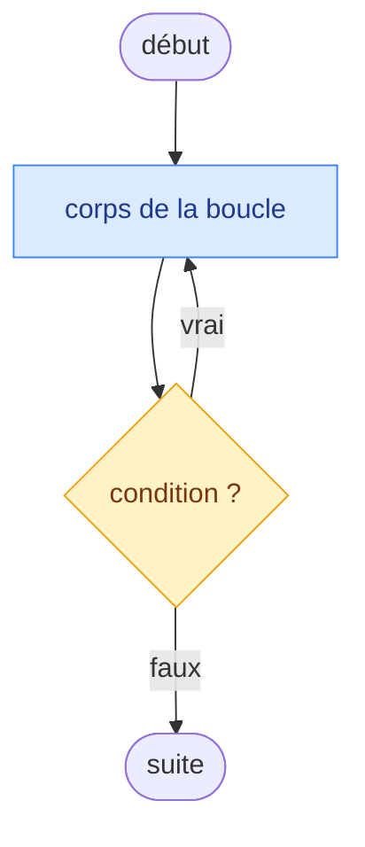
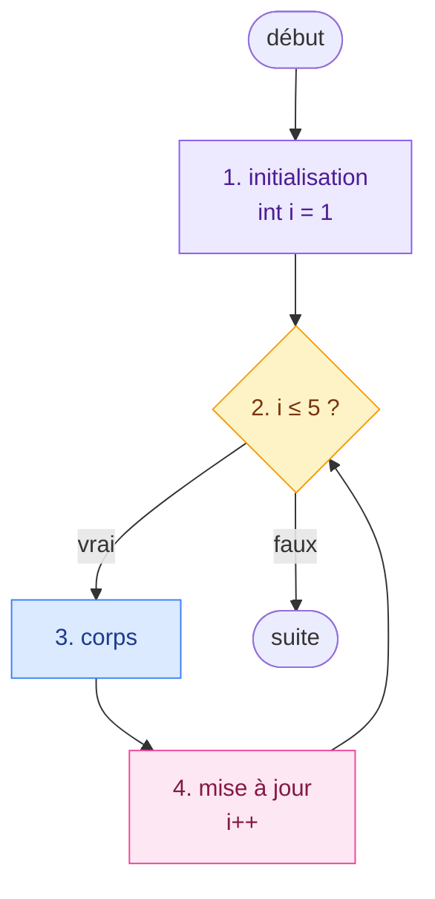
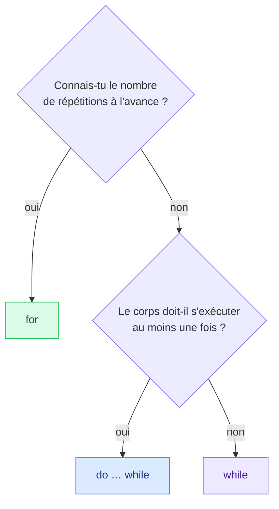
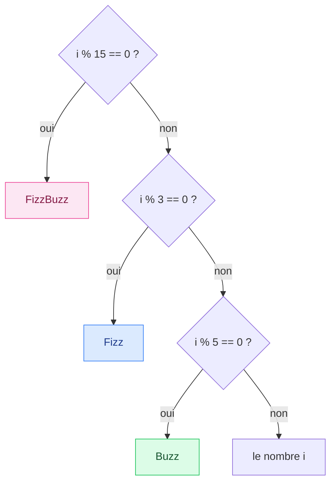

# 3. Instructions et contrôle de flux

<mark style="color:blue;">**Apprendre au programme à choisir et à répéter.**</mark>

&#x20;


**En bref**

Par défaut, les instructions s'exécutent **de haut en bas**, une fois chacune. Les **conditions** (`if`, `switch`) permettent de **choisir** quelles instructions exécuter ; les **boucles** (`while`, `do-while`, `for`) permettent de les **répéter**.


&#x20;

***

&#x20;

## <mark style="color:purple;">01</mark> · Instructions et blocs

&#x20;

Un programme est une **séquence** d'instructions, exécutées dans l'ordre. Un **bloc** `{ }` regroupe plusieurs instructions pour qu'elles se comportent comme une seule.

&#x20;



&#x20;

### La portée d'une variable

&#x20;

Une variable **n'existe que dans le bloc** où elle est déclarée, à partir de sa déclaration :

&#x20;

```java
int x = 1;
if (x > 0) {
    int y = 2;                   // y naît ici…
    System.out.println(x + y);   // 3
}                                // …et meurt ici
System.out.println(y);           // ERREUR de compilation : y n'existe plus
```

&#x20;


**Règle simple** — une variable est visible **de sa déclaration jusqu'à l'accolade fermante** de son bloc. Déclare-la dans le bloc le plus petit possible.


&#x20;

***

&#x20;

## <mark style="color:purple;">02</mark> · Choisir : `if` et `else`

&#x20;



&#x20;



```java
if (temperature > 30) {
    System.out.println("Pense à boire !");
}
```

Si la condition est fausse, on ne fait rien de spécial et on continue.



```java
if (note >= 4.0) {
    System.out.println("Réussi");
} else {
    System.out.println("Échoué");
}
```

Exactement **un** des deux blocs est exécuté.



```java
if (note >= 5.5) {
    System.out.println("Excellent");
} else if (note >= 4.0) {
    System.out.println("Suffisant");
} else {
    System.out.println("Insuffisant");
}
```

Les conditions sont testées **dans l'ordre** ; seul le **premier** bloc dont la condition est vraie s'exécute.



&#x20;


**L'ordre des `else if` compte.** Si on testait `note >= 4.0` en premier, un 5.8 afficherait « Suffisant » : la première condition vraie gagne, les suivantes ne sont jamais testées.


&#x20;

### Toujours mettre les accolades

&#x20;

Sans accolades, `if` ne contrôle **qu'une seule instruction** — peu importe l'indentation :

&#x20;

```java
if (note >= 4.0)
    System.out.println("Réussi");
    System.out.println("Bravo !");   // TOUJOURS exécuté, même avec un 2.5 !
```

&#x20;


**Le point-virgule fantôme** — `if (x > 0);` termine le `if` par une instruction **vide**. Le bloc qui suit s'exécute alors **toujours**. Même piège avec `for (...);` et `while (...);`.


&#x20;

***

&#x20;

## <mark style="color:purple;">03</mark> · Choisir parmi plusieurs valeurs : `switch`

&#x20;

Quand on compare **une même variable** à plusieurs valeurs précises, `switch` est plus lisible qu'une longue chaîne de `if / else if`.

&#x20;



```java
switch (jour) {
    case 1 -> System.out.println("Lundi");
    case 2 -> System.out.println("Mardi");
    case 3 -> System.out.println("Mercredi");
    case 6, 7 -> System.out.println("Week-end");
    default -> System.out.println("Autre jour");
}
```

&#x20;

Depuis Java 14. Chaque `case` exécute **uniquement** sa partie : pas de `break` à écrire, pas de mauvaise surprise.



```java
String nom = switch (jour) {
    case 1 -> "Lundi";
    case 2 -> "Mardi";
    case 3 -> "Mercredi";
    case 6, 7 -> "Week-end";
    default -> "Autre jour";
};
```

&#x20;

Le `switch` **produit une valeur**, rangée dans `nom`. Notez le `;` final.



```java
switch (jour) {
    case 1:
        System.out.println("Lundi");
        break;
    case 2:
        System.out.println("Mardi");
        break;
    case 6:
    case 7:
        System.out.println("Week-end");
        break;
    default:
        System.out.println("Autre jour");
}
```

&#x20;

La forme historique, encore très répandue. **Le `break` est indispensable** (voir ci-dessous).



&#x20;

### Le piège du `switch` classique : l'effet cascade

&#x20;

Dans la forme classique, sans `break`, l'exécution **continue dans les `case` suivants** (_fall-through_) :

&#x20;

```java
int jour = 1;
switch (jour) {
    case 1:
        System.out.println("Lundi");     // affiché
    case 2:
        System.out.println("Mardi");     // affiché aussi !
    default:
        System.out.println("Autre");     // et encore ça !
}
```

&#x20;

C'est comme un ascenseur sans arrêt programmé : il descend **tous les étages** jusqu'en bas.

&#x20;

| Ce qu'on peut tester avec `switch`                  | Ce qu'on ne peut pas tester          |
| --------------------------------------------------- | ------------------------------------ |
| `int`, `short`, `byte`, `char`                      | `long`, `float`, `double`            |
| `String`                                            | `boolean`                            |
| `enum` (voir chapitre 14)                           | des intervalles comme `note >= 4`    |

&#x20;


**`if` ou `switch` ?** `switch` pour comparer une variable à des **valeurs précises** ; `if` pour des **intervalles** ou des conditions combinées.


&#x20;

***

&#x20;

## <mark style="color:purple;">04</mark> · Répéter : les boucles

&#x20;

### `while` : tant que…

&#x20;







```java
int n = 1;
while (n <= 1000) {
    n = n * 2;
}
System.out.println(n);   // 1024
```

&#x20;

La condition est testée **avant** chaque tour. Si elle est fausse dès le départ, le corps ne s'exécute **jamais**.



&#x20;

### `do … while` : faire, puis recommencer tant que…

&#x20;







```java
int de;
do {
    de = lancerDe();          // lance un dé
    System.out.println(de);
} while (de != 6);
```

&#x20;

La condition est testée **après** chaque tour : le corps s'exécute **au moins une fois**. Idéal pour « essayer jusqu'à réussir ».



&#x20;

### `for` : répéter un nombre connu de fois

&#x20;

```java
for (int i = 1; i <= 5; i++) {
    System.out.println("Tour " + i);
}
```

&#x20;







Les trois parties entre parenthèses :

&#x20;

1. **Initialisation** `int i = 1` — exécutée **une seule fois**, au début
2. **Condition** `i <= 5` — testée **avant** chaque tour
3. **Mise à jour** `i++` — exécutée **après** chaque tour

&#x20;

La variable `i` n'existe **que dans la boucle**.



&#x20;


**Un `for` n'est qu'un `while` bien rangé.** La boucle ci-dessus équivaut à :

```java
int i = 1;
while (i <= 5) {
    System.out.println("Tour " + i);
    i++;
}
```


&#x20;

### Quelle boucle choisir ?

&#x20;



&#x20;


Il existe aussi la boucle **`for-each`** (`for (int note : notes)`), qui parcourt tous les éléments d'un tableau. Elle est présentée au chapitre [5. Tableaux](../05-tableaux/README.md).


&#x20;

***

&#x20;

## <mark style="color:purple;">05</mark> · Interrompre une boucle : `break` et `continue`

&#x20;



### `break`

**Sort immédiatement** de la boucle.

```java
for (int i = 1; i <= 100; i++) {
    if (i * i > 50) {
        break;           // on s'arrête là
    }
    System.out.println(i);
}
// affiche 1 à 7
```



### `continue`

**Saute la fin du tour** et passe directement au suivant.

```java
for (int i = 1; i <= 6; i++) {
    if (i % 2 == 0) {
        continue;        // on saute les pairs
    }
    System.out.println(i);
}
// affiche 1, 3, 5
```



&#x20;

### Les étiquettes (boucles imbriquées)

&#x20;

Dans des boucles **imbriquées**, `break` ne sort que de la boucle **la plus intérieure**. Une **étiquette** permet de sortir des deux d'un coup :

&#x20;


```java
externe:
for (int i = 0; i < 3; i++) {
    for (int j = 0; j < 3; j++) {
        if (j == 1) {
            continue;            // passe au j suivant
        }
        if (i == 2) {
            break externe;       // sort des DEUX boucles
        }
        System.out.println(i + "," + j);
    }
}
```


&#x20;

```
0,0
0,2
1,0
1,2
```

&#x20;


À utiliser avec modération : trop de `break` et `continue` rendent une boucle difficile à suivre. Souvent, une meilleure condition suffit.


&#x20;

***

&#x20;

## <mark style="color:purple;">06</mark> · Tracer un programme à la main

&#x20;

À l'examen écrit, on te demandera souvent : « Qu'affiche ce programme ? ». La méthode fiable est le <mark style="color:blue;">**tableau de trace**</mark> : tu joues le rôle de la machine, pas à pas.

&#x20;



### Une colonne par variable

&#x20;

Ajoute une colonne pour la **condition** de la boucle, et une pour ce qui est **affiché**.



### Une ligne par étape

&#x20;

Note les valeurs **après** chaque tour de boucle. Ne modifie que ce qui change vraiment.



### Tester la condition à chaque tour

&#x20;

Dès qu'elle est fausse, la boucle s'arrête : la dernière ligne donne l'état final.



&#x20;

### Exemple

&#x20;

```java
int i = 1;
int produit = 1;
while (i <= 4) {
    produit = produit * i;
    i++;
}
System.out.println(produit);
```

&#x20;

| Étape     | `produit` | `i` | `i <= 4` ? |
| --------- | --------- | --- | ---------- |
| Départ    | 1         | 1   | vrai       |
| Tour 1    | 1         | 2   | vrai       |
| Tour 2    | 2         | 3   | vrai       |
| Tour 3    | 6         | 4   | vrai       |
| Tour 4    | 24        | 5   | **faux** → fin |

&#x20;

Le programme affiche `24` : il calcule 4! = 1 × 2 × 3 × 4.

&#x20;

***

&#x20;

## <mark style="color:purple;">07</mark> · Les pièges classiques

&#x20;

| Piège                                   | Exemple                                           | Conséquence                                   |
| --------------------------------------- | ------------------------------------------------- | --------------------------------------------- |
| **Décalage de un** (_off-by-one_)       | `for (int i = 0; i <= 10; i++)`                   | 11 tours au lieu de 10                        |
| **Boucle infinie**                      | `while (i < 10) { … }` sans jamais modifier `i`   | Le programme ne s'arrête jamais               |
| **Point-virgule après la condition**    | `while (i < 10);`                                 | Boucle vide infinie                           |
| **Accolades oubliées**                  | `if (ok)` suivi de deux lignes indentées          | Seule la première ligne est conditionnelle    |
| **`break` oublié** (switch classique)   | `case 1: …` sans `break`                          | Les `case` suivants s'exécutent aussi         |
| **`=` au lieu de `==`**                 | `if (fini = true)`                                | Toujours vrai, et `fini` est modifié          |

&#x20;


**Réflexe anti-bug** — pour chaque boucle, vérifie trois choses : la valeur **de départ**, la condition **d'arrêt**, et que quelque chose **change** à chaque tour pour qu'elle finisse par s'arrêter.


&#x20;

***

&#x20;

## <mark style="color:purple;">08</mark> · En résumé

&#x20;


* Une variable n'existe que **dans le bloc** où elle est déclarée.
* `if / else if / else` : la **première** condition vraie gagne. Toujours des **accolades**.
* `switch` pour comparer une variable à des **valeurs précises** ; la forme avec flèches `->` évite les oublis de `break`.
* `while` teste **avant**, `do … while` teste **après** (au moins un tour), `for` pour un nombre de tours **connu**.
* `break` sort de la boucle, `continue` passe au tour suivant.
* Pour prévoir ce qu'affiche un programme : le **tableau de trace**.


&#x20;

***

&#x20;

## <mark style="color:purple;">09</mark> · Exercices

&#x20;


**Sur papier, sans ordinateur.** Écris tes réponses à la main, puis ouvre la solution pour corriger.


&#x20;

### Exercice 1 — Joue la machine

&#x20;

**a)** Remplis le tableau de trace de ce programme, puis indique ce qu'il affiche. Que calcule-t-il **en général**, pour n'importe quelle valeur de départ de `n` ?

&#x20;


```java
int n = 472;
int somme = 0;
while (n > 0) {
    somme = somme + n % 10;
    n = n / 10;
}
System.out.println(somme);
```


&#x20;

| Étape   | `n` | `somme` | `n > 0` ? |
| ------- | --- | ------- | --------- |
| Départ  |     |         |           |
| Tour 1  |     |         |           |
| …       |     |         |           |

&#x20;

**b)** Qu'affiche ce second programme ?

&#x20;

```java
for (int i = 1; i <= 10; i++) {
    if (i % 3 == 0) {
        continue;
    }
    if (i == 8) {
        break;
    }
    System.out.print(i + " ");
}
```

&#x20;

<details>

<summary>Solution</summary>

&#x20;

**a)**

&#x20;

| Étape   | `n`  | `somme` | `n > 0` ? |
| ------- | ---- | ------- | --------- |
| Départ  | 472  | 0       | vrai      |
| Tour 1  | 47   | 2       | vrai      |
| Tour 2  | 4    | 9       | vrai      |
| Tour 3  | 0    | 13      | **faux** → fin |

&#x20;

Le programme affiche `13`. À chaque tour, `n % 10` prend le **dernier chiffre** et `n / 10` le **retire** : le programme calcule la **somme des chiffres** de `n` (4 + 7 + 2 = 13).

&#x20;

**b)** Le programme affiche `1 2 4 5 7 `.

&#x20;

| `i`        | 1   | 2   | 3      | 4   | 5   | 6      | 7   | 8         |
| ---------- | --- | --- | ------ | --- | --- | ------ | --- | --------- |
| Action     | affiche | affiche | `continue` | affiche | affiche | `continue` | affiche | `break` |

&#x20;

À `i = 8`, `8 % 3` vaut 2 (pas de `continue`), puis `i == 8` déclenche le `break` : 9 et 10 ne sont jamais atteints.

&#x20;

</details>

&#x20;

### Exercice 2 — FizzBuzz

&#x20;

Écris **à la main** un programme qui affiche les nombres de **1 à 30**, un par ligne, en remplaçant :

&#x20;

* les multiples de **3** par `Fizz` ;
* les multiples de **5** par `Buzz` ;
* les multiples de **3 et de 5** par `FizzBuzz`.

&#x20;

Début de l'affichage attendu :

&#x20;

```
1
2
Fizz
4
Buzz
Fizz
…
14
FizzBuzz
```

&#x20;

**Avant d'écrire le code**, dessine l'organigramme de la décision prise pour un nombre `i`. Quel test doit être fait **en premier**, et pourquoi ?

&#x20;

<details>

<summary>Solution</summary>

&#x20;



&#x20;


```java
public class FizzBuzz {

    public static void main(String[] args) {
        for (int i = 1; i <= 30; i++) {
            if (i % 15 == 0) {
                System.out.println("FizzBuzz");
            } else if (i % 3 == 0) {
                System.out.println("Fizz");
            } else if (i % 5 == 0) {
                System.out.println("Buzz");
            } else {
                System.out.println(i);
            }
        }
    }
}
```


&#x20;

**Pourquoi tester 15 en premier ?** Un multiple de 15 est **aussi** multiple de 3. Si on testait `i % 3 == 0` d'abord, 15 afficherait `Fizz` : dans une chaîne de `else if`, la **première** condition vraie gagne. On aurait aussi pu écrire `i % 3 == 0 && i % 5 == 0`.

&#x20;

</details>

&#x20;

<mark style="color:green;">**→ Suite :**</mark> [4. Méthodes](../04-methodes/README.md)
