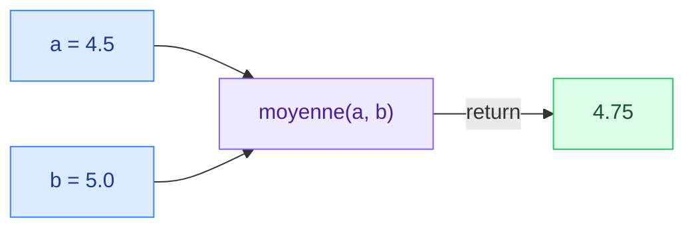
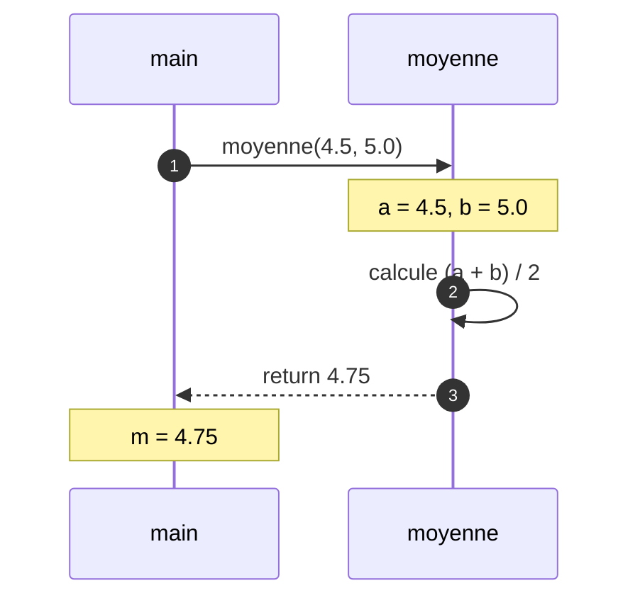
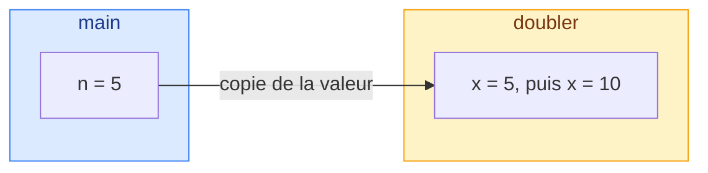
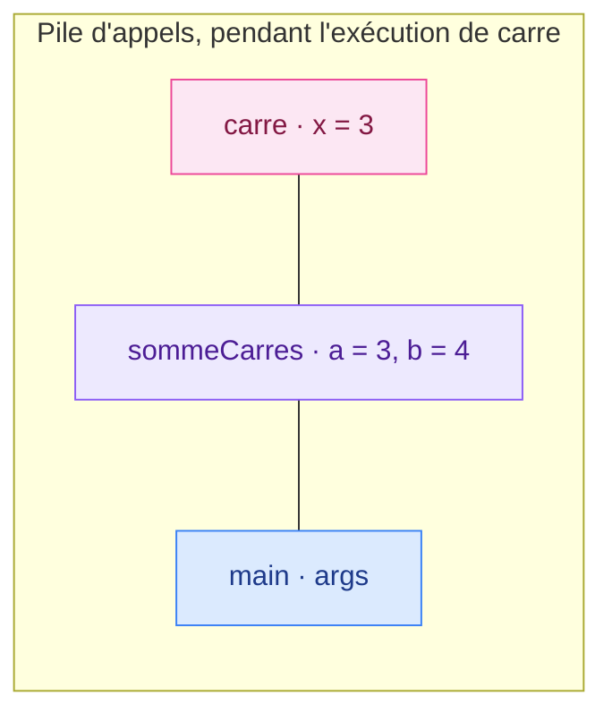
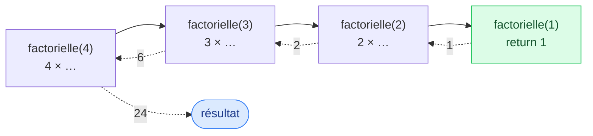

# 4. Méthodes

<mark style="color:blue;">**Donner un nom à un morceau de code, et le réutiliser autant qu'on veut.**</mark>

&#x20;


**En bref**

Une **méthode** est un bloc de code nommé qui reçoit des **paramètres**, effectue une tâche, et peut **renvoyer** un résultat. Les paramètres sont **copiés** à l'appel (passage par valeur). Plusieurs méthodes peuvent porter le même nom si leurs paramètres diffèrent (**surcharge**).


&#x20;

***

&#x20;

## <mark style="color:purple;">01</mark> · Pourquoi des méthodes ?

&#x20;

Sans méthodes, un programme devient vite un long bloc illisible, où le même code est **copié-collé** à plusieurs endroits. Le jour où il faut le corriger, on oublie une copie.

&#x20;

Une méthode permet de :

&#x20;

* **Découper** un problème en petites tâches simples
* **Réutiliser** du code sans le recopier
* **Nommer** une idée : `calculerMoyenne(notes)` se lit mieux que dix lignes de calcul
* **Tester** chaque morceau séparément

&#x20;

### L'analogie de la machine à café

&#x20;

Tu mets des **entrées** (du café, de l'eau), tu appuies sur un bouton, et tu récupères une **sortie** (un espresso). Tu n'as pas besoin de savoir comment la machine fonctionne à l'intérieur : tu connais juste **ce qu'elle attend** et **ce qu'elle rend**.

&#x20;



&#x20;

***

&#x20;

## <mark style="color:purple;">02</mark> · Anatomie d'une méthode

&#x20;

```java
public static double moyenne(double a, double b) {
    return (a + b) / 2;
}
```

&#x20;

| Élément                  | Rôle                                                                              |
| ------------------------ | --------------------------------------------------------------------------------- |
| `public`                 | **Visibilité** : qui peut appeler la méthode (voir chapitre 9)                    |
| `static`                 | La méthode appartient à la **classe**, pas à un objet (voir chapitre 10)          |
| `double`                 | **Type de retour** : ce que la méthode renvoie. `void` si elle ne renvoie rien    |
| `moyenne`                | **Nom** de la méthode, en `camelCase`, idéalement un **verbe**                    |
| `(double a, double b)`   | **Paramètres** : les entrées, chacune avec son type                               |
| `{ … }`                  | **Corps** : les instructions exécutées                                            |
| `return`                 | **Renvoie** une valeur et **termine** immédiatement la méthode                    |

&#x20;

La première ligne (visibilité, type, nom, paramètres) s'appelle la <mark style="color:blue;">**signature**</mark> ou l'**en-tête** de la méthode.

&#x20;


Dans les chapitres 1 à 7, toutes nos méthodes sont `public static` et placées dans la même classe que `main`. Le sens exact de `static` est expliqué au chapitre 10.


&#x20;

***

&#x20;

## <mark style="color:purple;">03</mark> · Appeler une méthode

&#x20;


```java
public class Notes {

    public static double moyenne(double a, double b) {
        return (a + b) / 2;
    }

    public static void main(String[] args) {
        double m = moyenne(4.5, 5.0);          // appel : m reçoit 4.75
        System.out.println(m);
        System.out.println(moyenne(6.0, 3.0)); // on peut utiliser le résultat directement
    }
}
```


&#x20;

* Les valeurs données à l'appel (`4.5`, `5.0`) s'appellent les **arguments**.
* Les variables qui les reçoivent dans la méthode (`a`, `b`) s'appellent les **paramètres**.
* Les arguments doivent correspondre aux paramètres en **nombre**, en **ordre** et en **type**.

&#x20;



&#x20;

***

&#x20;

## <mark style="color:purple;">04</mark> · `void` ou `return`

&#x20;



### Méthode avec résultat

```java
public static int carre(int x) {
    return x * x;
}
```

On **utilise** son résultat :
`int c = carre(5);`



### Méthode `void`

```java
public static void saluer(String nom) {
    System.out.println("Salut " + nom);
}
```

Elle **agit** (affiche) mais ne renvoie rien :
`saluer("Alice");`



&#x20;

### `return` termine la méthode

&#x20;

Dès qu'un `return` est exécuté, la méthode s'arrête. On peut s'en servir pour sortir tôt :

&#x20;

```java
public static String mention(double note) {
    if (note >= 5.5) {
        return "Excellent";
    }
    if (note >= 4.0) {
        return "Suffisant";
    }
    return "Insuffisant";
}
```

&#x20;


**Tous les chemins doivent renvoyer une valeur.** Si une méthode non `void` peut atteindre la fin sans `return`, le compilateur refuse : `missing return statement`.


&#x20;

***

&#x20;

## <mark style="color:purple;">05</mark> · Le passage par valeur

&#x20;

C'est **la** notion clé de ce chapitre : à l'appel, Java **copie** la valeur de chaque argument dans le paramètre. La méthode travaille sur sa **copie**.

&#x20;


```java
public class Copie {

    public static void doubler(int x) {
        x = x * 2;                        // modifie la COPIE
        System.out.println("dans doubler : " + x);
    }

    public static void main(String[] args) {
        int n = 5;
        doubler(n);
        System.out.println("dans main : " + n);
    }
}
```


&#x20;

```
dans doubler : 10
dans main : 5
```

&#x20;



&#x20;

### L'analogie de la photocopie

&#x20;

Tu donnes à quelqu'un une **photocopie** de ton document. Il peut gribouiller dessus autant qu'il veut : **ton original ne change pas**.

&#x20;


**Pour « modifier » une variable de l'appelant**, la méthode doit **renvoyer** le nouveau résultat, et l'appelant le récupère : `n = doubler(n);` (avec une méthode qui fait `return x * 2;`).


&#x20;


Avec les **tableaux** et les **objets**, c'est aussi une copie… mais une copie de la **référence** (l'adresse). La méthode peut alors modifier le contenu de l'objet désigné. Voir les chapitres [5. Tableaux](05-tableaux.md) et [8. Classes et objets](08-classes-objets.md).


&#x20;

***

&#x20;

## <mark style="color:purple;">06</mark> · Variables locales et pile d'appels

&#x20;

Les paramètres et les variables déclarées dans une méthode sont **locales** : elles naissent à l'appel et disparaissent au `return`. Deux méthodes peuvent donc avoir chacune une variable `x` sans conflit.

&#x20;

Pour gérer les appels, la JVM utilise une <mark style="color:blue;">**pile d'appels**</mark> (_call stack_) : chaque appel empile un **cadre** contenant ses variables locales, chaque `return` le dépile.

&#x20;



&#x20;

```java
public static int carre(int x) {
    return x * x;
}

public static int sommeCarres(int a, int b) {
    return carre(a) + carre(b);    // appelle carre deux fois
}

public static void main(String[] args) {
    System.out.println(sommeCarres(3, 4));   // 25
}
```

&#x20;

C'est comme une **pile d'assiettes** : on pose la dernière arrivée sur le dessus, et on la retire en premier.

&#x20;

***

&#x20;

## <mark style="color:purple;">07</mark> · La surcharge

&#x20;

Plusieurs méthodes peuvent porter **le même nom** si leurs **listes de paramètres** diffèrent (en nombre, en type ou en ordre). Le compilateur choisit la bonne selon les arguments.

&#x20;

```java
public static int max(int a, int b) {
    return (a > b) ? a : b;
}

public static int max(int a, int b, int c) {
    return max(max(a, b), c);
}

public static double max(double a, double b) {
    return (a > b) ? a : b;
}

max(3, 7);        // appelle max(int, int)
max(3, 7, 5);     // appelle max(int, int, int)
max(2.5, 1.0);    // appelle max(double, double)
```

&#x20;


**Le type de retour ne suffit pas.** Deux méthodes `int calcul(int x)` et `double calcul(int x)` ne peuvent pas coexister : à l'appel `calcul(3)`, le compilateur ne saurait pas laquelle choisir.


&#x20;

***

&#x20;

## <mark style="color:purple;">08</mark> · La récursivité

&#x20;

Une méthode **récursive** s'appelle **elle-même** sur un problème plus petit. Elle a toujours besoin de deux ingrédients :

&#x20;

1. un **cas de base**, qui s'arrête sans s'appeler ;
2. un **cas récursif**, qui se rapproche du cas de base.

&#x20;

```java
// n! = n × (n-1) × … × 1
public static long factorielle(int n) {
    if (n <= 1) {
        return 1;                          // cas de base
    }
    return n * factorielle(n - 1);         // cas récursif
}
```

&#x20;



&#x20;

### L'analogie des poupées russes

&#x20;

On ouvre une poupée, puis la suivante, puis la suivante… jusqu'à la plus petite, qui ne s'ouvre pas (le **cas de base**). Ensuite, on referme tout dans l'ordre inverse.

&#x20;


**Sans cas de base** (ou s'il n'est jamais atteint), la méthode s'appelle à l'infini, la pile d'appels déborde, et le programme plante avec une `StackOverflowError`.


&#x20;

***

&#x20;

## <mark style="color:purple;">09</mark> · Bien écrire ses méthodes

&#x20;



**Une méthode = une tâche**

Si tu dois utiliser « et » pour décrire ce qu'elle fait, découpe-la.

&#x20;

**Un nom qui dit ce qu'elle fait**

Un verbe : `calculerTotal`, `afficherMenu`, `estPair` (pour un `boolean`).



**Courte**

Idéalement lisible sans faire défiler l'écran.

&#x20;

**Documentée**

Un commentaire Javadoc explique le rôle, les paramètres et le résultat.



&#x20;

```java
/**
 * Calcule la moyenne de deux notes.
 *
 * @param a la première note, entre 1 et 6
 * @param b la seconde note, entre 1 et 6
 * @return la moyenne arithmétique de a et b
 */
public static double moyenne(double a, double b) {
    return (a + b) / 2;
}
```

&#x20;

***

&#x20;

## <mark style="color:purple;">10</mark> · En résumé

&#x20;


* Une méthode a une **signature** (visibilité, type de retour, nom, paramètres) et un **corps**.
* `return` renvoie une valeur **et termine** la méthode ; `void` = pas de valeur renvoyée.
* Les arguments sont **copiés** dans les paramètres : modifier un paramètre ne change pas la variable de l'appelant.
* Les variables locales vivent dans la **pile d'appels**, le temps d'un appel.
* **Surcharge** : même nom, paramètres différents (le type de retour ne compte pas).
* **Récursivité** : un cas de base + un cas récursif qui s'en rapproche.


&#x20;

***

&#x20;

## <mark style="color:purple;">11</mark> · Exercices

&#x20;


**Sur papier, sans ordinateur.** Écris tes réponses à la main, puis ouvre la solution pour corriger.


&#x20;

### Exercice 1 — Suivre les appels

&#x20;

**a)** Qu'affiche ce programme ?

&#x20;


```java
public class Appels {

    public static int doubler(int x) {
        x = x * 2;
        return x;
    }

    public static void afficher(int x) {
        System.out.println("x = " + x);
    }

    public static void main(String[] args) {
        int x = 5;
        int y = doubler(x);
        afficher(x);
        afficher(y);
        afficher(doubler(doubler(y)));
    }
}
```


&#x20;

**b)** Que renvoie `f(4)` ? Dessine la chaîne des appels comme dans la section 08.

&#x20;

```java
public static int f(int n) {
    if (n <= 1) {
        return 1;
    }
    return n + f(n - 1);
}
```

&#x20;

<details>

<summary>Solution</summary>

&#x20;

**a)**

```
x = 5
x = 10
x = 40
```

&#x20;

* `doubler(x)` travaille sur une **copie** : le `x` de `main` reste 5, et `y` reçoit 10.
* `doubler(doubler(y))` : l'appel intérieur donne 20, l'extérieur 40.
* Les trois `x` (dans `main`, `doubler` et `afficher`) sont des variables **différentes**.

&#x20;

**b)** `f(4)` renvoie **10**.

&#x20;

`f(4)` = 4 + `f(3)` = 4 + (3 + `f(2)`) = 4 + (3 + (2 + `f(1)`)) = 4 + 3 + 2 + 1 = 10.

La méthode calcule la **somme des entiers de 1 à n**.

&#x20;

</details>

&#x20;

### Exercice 2 — Écrire ses propres méthodes

&#x20;

Écris **à la main** les méthodes suivantes, avec leur signature complète et un commentaire Javadoc court :

&#x20;

1. `max3` : reçoit trois entiers et renvoie le plus grand. Réutilise une méthode `max` à deux paramètres que tu écris aussi.
2. `estBissextile` : reçoit une année et renvoie `true` si elle est bissextile. Règle : une année est bissextile si elle est divisible par 4 **mais pas** par 100, **ou** si elle est divisible par 400.
3. Complète un `main` qui affiche si 1900, 2000 et 2024 sont bissextiles.

&#x20;

<details>

<summary>Solution</summary>

&#x20;


```java
public class Methodes {

    /**
     * @return le plus grand de a et b
     */
    public static int max(int a, int b) {
        return (a > b) ? a : b;
    }

    /**
     * @return le plus grand des trois entiers
     */
    public static int max3(int a, int b, int c) {
        return max(max(a, b), c);
    }

    /**
     * @param annee une année du calendrier grégorien
     * @return true si l'année est bissextile
     */
    public static boolean estBissextile(int annee) {
        return (annee % 4 == 0 && annee % 100 != 0) || annee % 400 == 0;
    }

    public static void main(String[] args) {
        System.out.println(max3(4, 9, 2));          // 9
        System.out.println(estBissextile(1900));    // false : divisible par 100, pas par 400
        System.out.println(estBissextile(2000));    // true  : divisible par 400
        System.out.println(estBissextile(2024));    // true  : divisible par 4, pas par 100
    }
}
```


&#x20;

**Points à vérifier sur ta copie :** le type de retour `boolean` (et pas `void`), un `return` sur tous les chemins, et les parenthèses autour du `&&` pour que la condition se lise clairement.

&#x20;

</details>

&#x20;

<mark style="color:green;">**→ Suite :**</mark> [5. Tableaux](05-tableaux.md)
