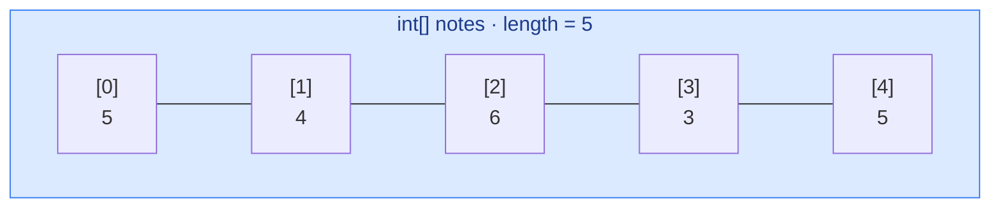
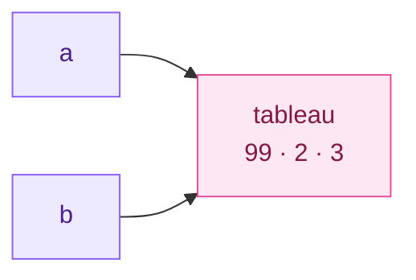
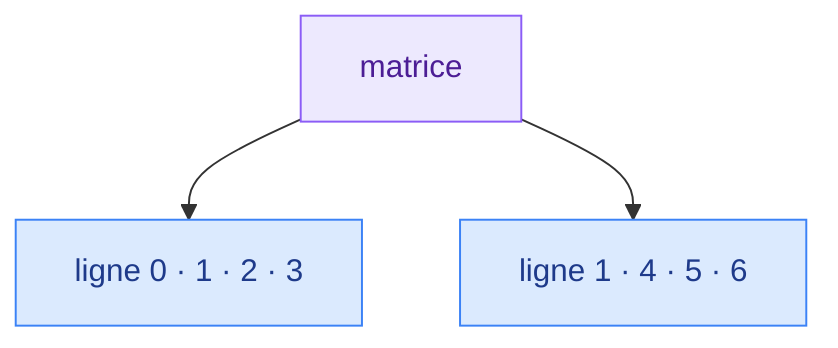
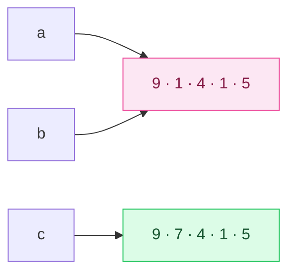

# 5. Tableaux

<mark style="color:blue;">**Une seule variable, plein de cases numérotées.**</mark>

&#x20;


**En bref**

Un **tableau** contient un nombre **fixe** de valeurs du **même type**, repérées par un **indice** qui commence à **0**. Une variable tableau est une **référence** : copier la variable ne copie pas le tableau.


&#x20;

***

&#x20;

## <mark style="color:purple;">01</mark> · Pourquoi des tableaux ?

&#x20;

Pour stocker les notes de 25 étudiants, on ne va pas déclarer `note1`, `note2`… `note25`, puis écrire 25 fois le même calcul. Un tableau regroupe toutes ces valeurs sous **un seul nom**.

&#x20;

### L'analogie des casiers

&#x20;

Un tableau, c'est une **rangée de casiers numérotés** à la gare : tous identiques, côte à côte, et chacun a un numéro. Le premier casier porte le numéro **0**.

&#x20;



&#x20;

***

&#x20;

## <mark style="color:purple;">02</mark> · Déclarer et créer

&#x20;



```java
int[] notes = new int[5];        // 5 cases, toutes à 0
double[] prix = new double[3];   // 3 cases, toutes à 0.0
String[] noms = new String[4];   // 4 cases, toutes à null
```

On connaît la **taille**, pas encore les valeurs.



```java
int[] premiers = {2, 3, 5, 7, 11};
String[] jours = {"lundi", "mardi", "mercredi"};
```

La taille est déduite du nombre de valeurs.



&#x20;

### Les valeurs par défaut

&#x20;

À la création avec `new`, chaque case reçoit automatiquement une valeur par défaut :

&#x20;

| Type des éléments                | Valeur par défaut |
| -------------------------------- | ----------------- |
| `int`, `long`, `short`, `byte`   | `0`               |
| `double`, `float`                | `0.0`             |
| `boolean`                        | `false`           |
| `char`                           | `'\u0000'` (caractère nul) |
| Types référence (`String`…)      | `null`            |

&#x20;

### La taille : `length`

&#x20;

```java
int[] notes = {5, 4, 6, 3, 5};
System.out.println(notes.length);   // 5  (pas de parenthèses : c'est un attribut)
```

&#x20;


**La taille est fixée une fois pour toutes.** Un tableau ne grandit pas. Si tu as besoin d'une liste qui s'agrandit, on utilisera `ArrayList` (chapitre 13).


&#x20;

***

&#x20;

## <mark style="color:purple;">03</mark> · Lire et écrire une case

&#x20;

```java
int[] notes = new int[5];
notes[0] = 5;                 // première case
notes[4] = 6;                 // dernière case : indice length - 1
int n = notes[0] + notes[4];  // 11
```

&#x20;


**Les indices vont de `0` à `length - 1`.** `notes[5]` sur un tableau de 5 cases fait planter le programme avec une `ArrayIndexOutOfBoundsException`. C'est l'erreur la plus fréquente avec les tableaux.


&#x20;

***

&#x20;

## <mark style="color:purple;">04</mark> · Parcourir un tableau

&#x20;



### Boucle `for` classique

```java
for (int i = 0; i < notes.length; i++) {
    System.out.println("Note " + i + " : " + notes[i]);
}
```

On a **l'indice** `i` : on peut lire, **modifier** la case, ou comparer avec la voisine.



### Boucle `for-each`

```java
for (int note : notes) {
    System.out.println(note);
}
```

Se lit « pour chaque `note` dans `notes` ». Plus simple, mais **pas d'indice**, et modifier `note` ne modifie pas le tableau.



&#x20;


**Règle pratique** — `for-each` pour **lire** tous les éléments ; `for` classique dès qu'il faut **l'indice** ou **modifier** les cases.


&#x20;

***

&#x20;

## <mark style="color:purple;">05</mark> · Les algorithmes classiques

&#x20;

Ces petits algorithmes reviennent **tout le temps**, à l'examen comme en pratique. Il faut savoir les écrire les yeux fermés.

&#x20;



```java
public static double moyenne(int[] t) {
    int somme = 0;
    for (int valeur : t) {
        somme += valeur;
    }
    return (double) somme / t.length;   // cast pour éviter la division entière
}
```



```java
public static int max(int[] t) {
    int max = t[0];                     // on part du premier élément, pas de 0 !
    for (int i = 1; i < t.length; i++) {
        if (t[i] > max) {
            max = t[i];
        }
    }
    return max;
}
```

Partir de `0` serait faux si toutes les valeurs sont négatives.



```java
/** @return l'indice de la première occurrence de x, ou -1 si absent */
public static int indexOf(int[] t, int x) {
    for (int i = 0; i < t.length; i++) {
        if (t[i] == x) {
            return i;                   // trouvé : on s'arrête
        }
    }
    return -1;                          // parcouru en entier sans trouver
}
```



```java
public static int compterReussites(double[] notes) {
    int compteur = 0;
    for (double note : notes) {
        if (note >= 4.0) {
            compteur++;
        }
    }
    return compteur;
}
```



&#x20;

***

&#x20;

## <mark style="color:purple;">06</mark> · Un tableau est une référence

&#x20;

Une variable tableau ne contient pas les cases : elle contient **l'adresse** du tableau en mémoire.

&#x20;

```java
int[] a = {1, 2, 3};
int[] b = a;          // b désigne LE MÊME tableau que a
b[0] = 99;
System.out.println(a[0]);   // 99 !
```

&#x20;



&#x20;

### L'analogie de l'adresse

&#x20;

`b = a` ne construit pas une deuxième maison : ça **recopie l'adresse** sur un deuxième papier. Les deux papiers mènent à **la même maison** ; repeindre la porte depuis l'un se voit depuis l'autre.

&#x20;

### Copier vraiment

&#x20;

```java
int[] copie1 = a.clone();                      // copie complète
int[] copie2 = java.util.Arrays.copyOf(a, 5);  // copie, en ajustant la taille (5 cases)
```

&#x20;

### Comparer

&#x20;

```java
int[] x = {1, 2, 3};
int[] y = {1, 2, 3};
System.out.println(x == y);                          // false : deux tableaux différents
System.out.println(java.util.Arrays.equals(x, y));   // true  : même contenu
```

&#x20;

### Passer un tableau à une méthode

&#x20;

La méthode reçoit une **copie de la référence** : elle peut donc **modifier le contenu** du tableau de l'appelant.

&#x20;

```java
public static void remettreAZero(int[] t) {
    for (int i = 0; i < t.length; i++) {
        t[i] = 0;          // modifie le tableau de l'appelant
    }
}
```

&#x20;


C'est cohérent avec le **passage par valeur** du chapitre 4 : la valeur copiée est **l'adresse**. La méthode ne peut pas faire pointer la variable de l'appelant ailleurs, mais elle peut modifier ce qui se trouve à l'adresse.


&#x20;

***

&#x20;

## <mark style="color:purple;">07</mark> · Les tableaux à deux dimensions

&#x20;

Un tableau 2D est un **tableau de tableaux** : parfait pour une grille, un plateau de jeu, une matrice.

&#x20;

```java
int[][] grille = new int[3][4];     // 3 lignes, 4 colonnes
grille[1][2] = 7;                   // ligne 1, colonne 2

int[][] matrice = {
    {1, 2, 3},
    {4, 5, 6}
};
System.out.println(matrice.length);      // 2 : nombre de lignes
System.out.println(matrice[0].length);   // 3 : nombre de colonnes de la ligne 0
```

&#x20;



&#x20;

### Parcourir avec deux boucles imbriquées

&#x20;

```java
for (int ligne = 0; ligne < matrice.length; ligne++) {
    for (int col = 0; col < matrice[ligne].length; col++) {
        System.out.print(matrice[ligne][col] + " ");
    }
    System.out.println();
}
```

&#x20;

```
1 2 3
4 5 6
```

&#x20;


**Tableaux irréguliers** — comme chaque ligne est un tableau indépendant, les lignes peuvent avoir des longueurs différentes : `int[][] triangle = new int[3][];` puis `triangle[0] = new int[1];`, `triangle[1] = new int[2];`… C'est pour ça qu'on écrit `matrice[ligne].length` et pas une taille fixe.


&#x20;

***

&#x20;

## <mark style="color:purple;">08</mark> · La boîte à outils `Arrays`

&#x20;

La classe `java.util.Arrays` fournit des méthodes toutes prêtes :

&#x20;

| Méthode                       | Rôle                                         | Exemple                                  |
| ----------------------------- | -------------------------------------------- | ---------------------------------------- |
| `Arrays.toString(t)`          | Texte lisible du contenu                     | `"[5, 4, 6]"`                            |
| `Arrays.sort(t)`              | Trie le tableau (sur place)                  | `{6, 4, 5}` devient `{4, 5, 6}`          |
| `Arrays.fill(t, v)`           | Remplit toutes les cases avec `v`            | `Arrays.fill(t, -1)`                     |
| `Arrays.copyOf(t, n)`         | Copie sur `n` cases                          | `Arrays.copyOf(t, 10)`                   |
| `Arrays.equals(a, b)`         | Compare les contenus                         | `true` si mêmes valeurs dans le même ordre |

&#x20;


```java
import java.util.Arrays;

public class OutilsArrays {

    public static void main(String[] args) {
        int[] t = {6, 4, 5};
        System.out.println(t);                    // [I@1b6d3586 : l'adresse, illisible
        System.out.println(Arrays.toString(t));   // [6, 4, 5]
        Arrays.sort(t);
        System.out.println(Arrays.toString(t));   // [4, 5, 6]
    }
}
```


&#x20;

***

&#x20;

## <mark style="color:purple;">09</mark> · En résumé

&#x20;


* Un tableau a une **taille fixe** (`length`) et des indices de **`0` à `length - 1`**.
* `new int[n]` remplit avec des valeurs **par défaut** (0, 0.0, false, null).
* `for` classique pour l'indice ou la modification, `for-each` pour la lecture.
* Une variable tableau est une **référence** : `b = a` partage le tableau, `a.clone()` le copie, `Arrays.equals` compare le contenu.
* 2D = **tableau de tableaux** : `t[ligne][colonne]`, parcouru avec deux boucles imbriquées.


&#x20;

***

&#x20;

## <mark style="color:purple;">10</mark> · Exercices

&#x20;


**Sur papier, sans ordinateur.** Écris tes réponses à la main, puis ouvre la solution pour corriger.


&#x20;

### Exercice 1 — Références et parcours

&#x20;

**a)** Qu'affiche ce code ? Dessine l'état de la mémoire (variables et tableaux, avec des flèches) juste avant le `println`.

&#x20;

```java
int[] a = {3, 1, 4, 1, 5};
int[] b = a;
b[0] = 9;
int[] c = a.clone();
c[1] = 7;
System.out.println(a[0] + " " + a[1] + " " + c[0] + " " + c[1]);
```

&#x20;

**b)** Que vaut `s` à la fin ? Remplis un tableau de trace avec les colonnes `i`, `t[i]` et `s`.

&#x20;

```java
int[] t = {4, 8, 15, 16, 23, 42};
int s = 0;
for (int i = 0; i < t.length; i += 2) {
    s += t[i];
}
```

&#x20;

<details>

<summary>Solution</summary>

&#x20;

**a)** Le code affiche `9 1 9 7`.

&#x20;



&#x20;

* `b` et `a` désignent **le même** tableau : `b[0] = 9` modifie `a[0]`.
* `c` est une **vraie copie**, faite **après** la modification : elle commence par 9. Modifier `c[1]` ne touche pas `a`.

&#x20;

**b)** `s` vaut **42**.

&#x20;

| `i` | `t[i]` | `s`  |
| --- | ------ | ---- |
| 0   | 4      | 4    |
| 2   | 15     | 19   |
| 4   | 23     | 42   |
| 6   | —      | fin (6 n'est pas inférieur à 6) |

&#x20;

</details>

&#x20;

### Exercice 2 — Écrire des algorithmes sur tableaux

&#x20;

Écris **à la main** :

&#x20;

1. `indexDuMax(int[] t)` : renvoie l'**indice** de la plus grande valeur (le premier en cas d'égalité).
2. `inverser(int[] t)` : inverse l'ordre des éléments **dans le tableau lui-même** (sans créer de nouveau tableau). Par exemple `{1, 2, 3, 4, 5}` devient `{5, 4, 3, 2, 1}`.
3. Fais la trace de `inverser` sur `{1, 2, 3, 4, 5}` : combien d'échanges sont faits ?

&#x20;

<details>

<summary>Solution</summary>

&#x20;


```java
public static int indexDuMax(int[] t) {
    int indexMax = 0;
    for (int i = 1; i < t.length; i++) {
        if (t[i] > t[indexMax]) {      // > strict : garde le premier en cas d'égalité
            indexMax = i;
        }
    }
    return indexMax;
}

public static void inverser(int[] t) {
    for (int i = 0; i < t.length / 2; i++) {
        int j = t.length - 1 - i;      // la case symétrique
        int temp = t[i];               // échange de t[i] et t[j]
        t[i] = t[j];
        t[j] = temp;
    }
}
```


&#x20;

**Trace de `inverser` sur `{1, 2, 3, 4, 5}`** (`t.length / 2` vaut 2) :

&#x20;

| `i` | `j` | Tableau après l'échange |
| --- | --- | ----------------------- |
| 0   | 4   | `{5, 2, 3, 4, 1}`       |
| 1   | 3   | `{5, 4, 3, 2, 1}`       |

&#x20;

**2 échanges** : l'élément du milieu reste en place. Si la boucle allait jusqu'à `t.length`, chaque paire serait échangée **deux fois**, et le tableau reviendrait à son état de départ.

&#x20;

</details>

&#x20;

<mark style="color:green;">**→ Suite :**</mark> [6. Exceptions](06-exceptions.md)
