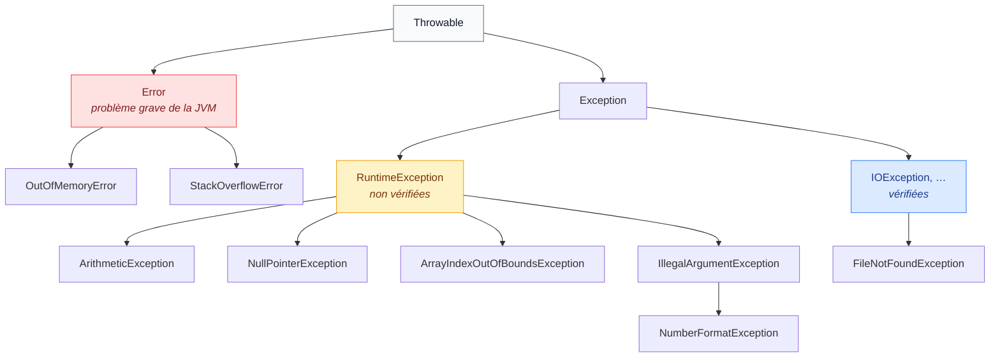
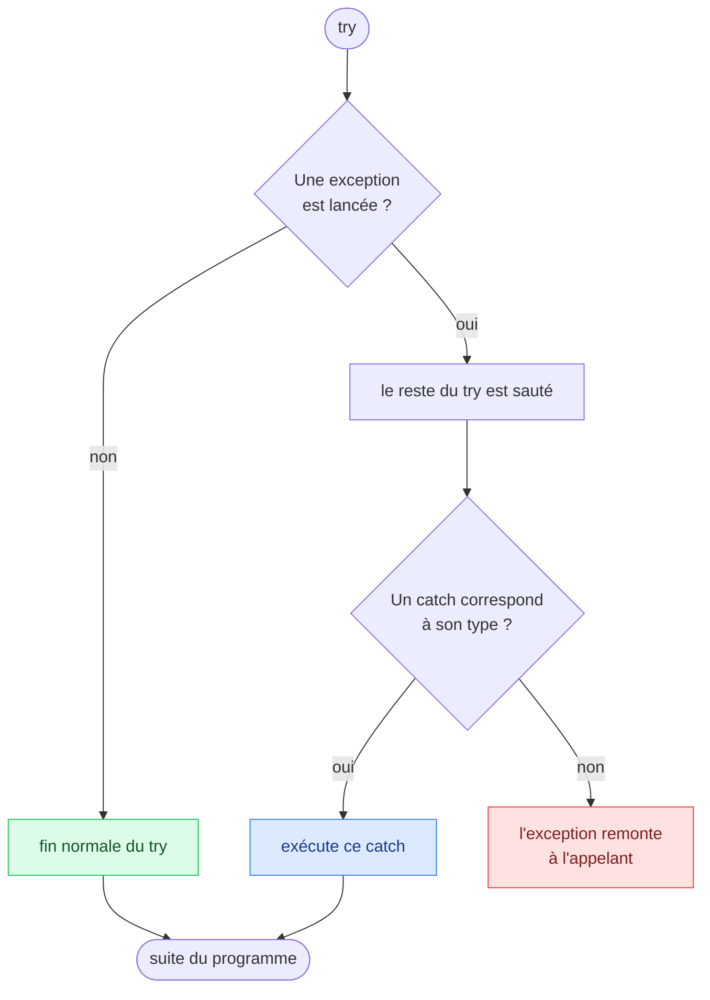
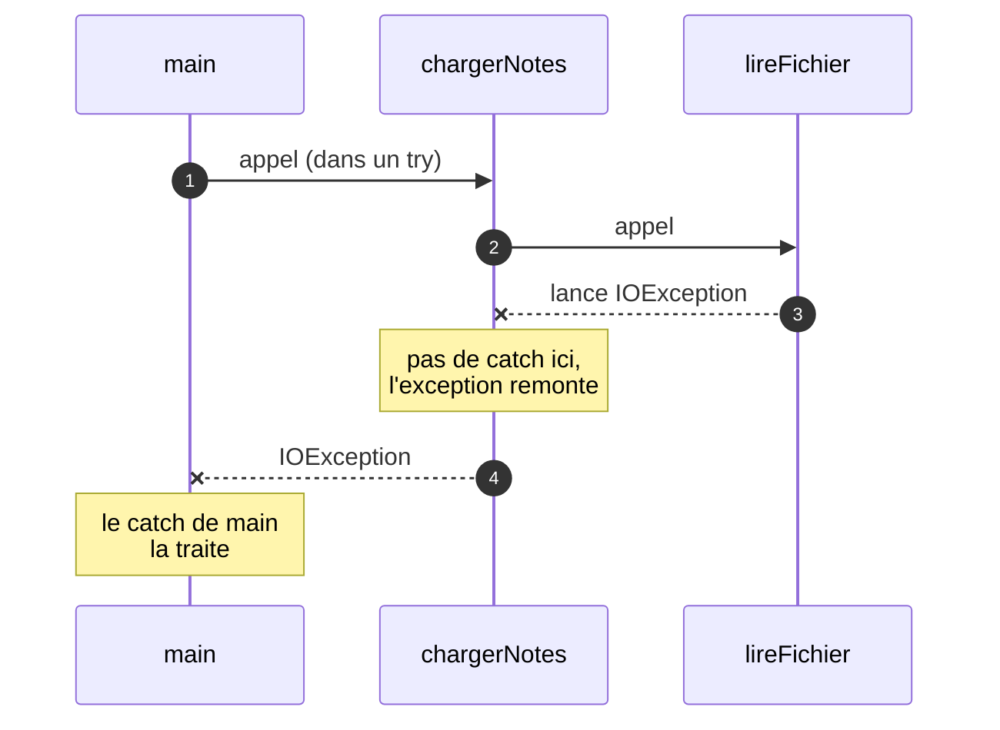

# 6. Exceptions

<mark style="color:blue;">**Quand quelque chose tourne mal, le dire proprement et réagir.**</mark>

&#x20;


**En bref**

Une **exception** est un objet qui signale une erreur à l'exécution. On la **lance** avec `throw`, elle **remonte** la pile d'appels, et on la **traite** avec `try / catch`. Les exceptions **vérifiées** doivent être traitées ou déclarées avec `throws`.


&#x20;

***

&#x20;

## <mark style="color:purple;">01</mark> · Qu'est-ce qu'une exception ?

&#x20;

Certaines erreurs ne peuvent être détectées **qu'à l'exécution** : un fichier absent, une saisie invalide, une division par zéro… Java les signale par une <mark style="color:blue;">**exception**</mark>.

&#x20;

```java
int[] t = new int[3];
t[5] = 1;
```

&#x20;

```
Exception in thread "main" java.lang.ArrayIndexOutOfBoundsException: Index 5 out of bounds for length 3
	at Demo.main(Demo.java:4)
```

&#x20;

### Lire un message d'erreur

&#x20;

| Morceau                                        | Ce qu'il te dit                                  |
| ---------------------------------------------- | ------------------------------------------------ |
| `ArrayIndexOutOfBoundsException`               | Le **type** d'erreur                             |
| `Index 5 out of bounds for length 3`           | Le **message** : ce qui s'est passé              |
| `at Demo.main(Demo.java:4)`                    | **Où** : classe, méthode, fichier et **ligne**   |

&#x20;

Ce bloc s'appelle la **trace de la pile** (_stack trace_). La **première ligne `at`** indique l'endroit exact de l'erreur, les suivantes montrent la chaîne d'appels qui y a mené.

&#x20;

### L'analogie de l'alarme incendie

&#x20;

Quand un feu se déclare, l'alarme **interrompt** tout ce qui se passait et **remonte** jusqu'à quelqu'un capable de réagir. Si personne ne réagit, le bâtiment est évacué : le programme **s'arrête**.

&#x20;

***

&#x20;

## <mark style="color:purple;">02</mark> · La famille des exceptions

&#x20;



&#x20;

| Catégorie                           | Exemples                                       | Le compilateur oblige à la traiter ? |
| ----------------------------------- | ---------------------------------------------- | ------------------------------------ |
| **Error**                           | `OutOfMemoryError`, `StackOverflowError`       | Non — on ne les attrape pas          |
| **Non vérifiée** (`RuntimeException`) | `NullPointerException`, `ArithmeticException` | Non — ce sont souvent des **bugs** à corriger |
| **Vérifiée** (_checked_)            | `IOException`, `FileNotFoundException`         | <mark style="color:orange;">**Oui**</mark> — traiter ou déclarer |

&#x20;


**Pourquoi deux familles ?** Une exception **vérifiée** décrit un problème **prévisible et extérieur** au programme (fichier absent, réseau coupé) : Java t'oblige à y penser. Une exception **non vérifiée** signale en général une **erreur de programmation** (indice hors limites, référence `null`) : il faut corriger le code, pas l'attraper.


&#x20;

***

&#x20;

## <mark style="color:purple;">03</mark> · Attraper : `try` et `catch`

&#x20;

```java
try {
    int n = Integer.parseInt(saisie);   // peut lancer NumberFormatException
    System.out.println(100 / n);        // peut lancer ArithmeticException
} catch (NumberFormatException e) {
    System.out.println("Ce n'est pas un nombre : " + e.getMessage());
} catch (ArithmeticException e) {
    System.out.println("Division par zéro impossible");
}
System.out.println("Le programme continue");
```

&#x20;



&#x20;

* Dès qu'une exception est lancée, **le reste du `try` est sauté**.
* Java teste les `catch` **dans l'ordre** et exécute le **premier** dont le type correspond.
* Un `catch (Exception e)` attrape **toutes** les exceptions de cette famille et de ses sous-familles.

&#x20;


**Du plus précis au plus général.** Un `catch (Exception e)` placé **avant** `catch (NumberFormatException e)` attraperait tout ; le second ne servirait jamais, et le compilateur le refuse.


&#x20;

### Plusieurs types dans un seul `catch`

&#x20;

```java
catch (NumberFormatException | ArithmeticException e) {
    System.out.println("Saisie invalide : " + e.getMessage());
}
```

&#x20;

***

&#x20;

## <mark style="color:purple;">04</mark> · Toujours exécuté : `finally`

&#x20;

Le bloc `finally` s'exécute **dans tous les cas** : que le `try` réussisse, qu'une exception soit attrapée ou non, et même s'il y a un `return`.

&#x20;

```java
try {
    ouvrirConnexion();
    envoyerDonnees();
} catch (IOException e) {
    System.out.println("Échec de l'envoi");
} finally {
    fermerConnexion();     // toujours fait, succès ou échec
}
```

&#x20;

On s'en sert pour **libérer** une ressource : fermer un fichier, une connexion, un verrou.

&#x20;


**Plus simple : `try-with-resources`** — pour les ressources qui se ferment (fichiers, flux), Java les ferme automatiquement :

```java
try (BufferedReader lecteur = Files.newBufferedReader(Path.of("notes.txt"))) {
    System.out.println(lecteur.readLine());
}   // lecteur est fermé ici, même en cas d'exception
```

Détails au chapitre [7. String et entrées/sorties](07-string-entrees-sorties.md).


&#x20;

***

&#x20;

## <mark style="color:purple;">05</mark> · Lancer : `throw`

&#x20;

Ton propre code peut aussi **signaler** une erreur, par exemple quand on lui donne une valeur absurde :

&#x20;

```java
public static double racine(double x) {
    if (x < 0) {
        throw new IllegalArgumentException("x doit être positif, reçu : " + x);
    }
    return Math.sqrt(x);
}
```

&#x20;

* `new IllegalArgumentException(...)` **crée** l'objet exception, avec un message.
* `throw` le **lance** : la méthode s'arrête immédiatement, comme avec un `return`.

&#x20;

| Exception à lancer                | Quand                                                         |
| --------------------------------- | ------------------------------------------------------------- |
| `IllegalArgumentException`        | Un **paramètre** a une valeur invalide                        |
| `IllegalStateException`           | L'objet n'est pas dans le bon **état** pour cette opération   |
| `UnsupportedOperationException`   | L'opération n'est **pas prise en charge**                     |
| `NullPointerException`            | Un paramètre obligatoire est `null`                           |

&#x20;

***

&#x20;

## <mark style="color:purple;">06</mark> · Propagation et `throws`

&#x20;

Si une méthode ne traite pas une exception, celle-ci **remonte** à la méthode appelante, puis à la suivante… jusqu'à trouver un `catch`. Si elle atteint le haut de `main`, le programme s'arrête.

&#x20;



&#x20;

### La règle « traiter ou déclarer »

&#x20;

Pour une exception **vérifiée**, le compilateur exige l'un des deux :

&#x20;



**Traiter** avec `try / catch`

```java
public static String premiereLigne(Path p) {
    try {
        return Files.readAllLines(p).get(0);
    } catch (IOException e) {
        return "";
    }
}
```



**Déclarer** avec `throws`

```java
public static String premiereLigne(Path p)
        throws IOException {
    return Files.readAllLines(p).get(0);
}
```

C'est alors à **l'appelant** de s'en occuper.



&#x20;


**`throw` ou `throws` ?** `throw` (sans s) **lance** une exception, dans le corps. `throws` (avec s) **déclare**, dans la signature, qu'une méthode peut en laisser passer une.


&#x20;

***

&#x20;

## <mark style="color:purple;">07</mark> · Créer sa propre exception

&#x20;

Une exception est une **classe** comme une autre. Pour décrire une erreur propre à ton programme, tu en crées une qui **hérite** d'`Exception` (vérifiée) ou de `RuntimeException` (non vérifiée) — l'héritage est expliqué au chapitre 11.

&#x20;


```java
public class SoldeInsuffisantException extends Exception {

    public SoldeInsuffisantException(String message) {
        super(message);
    }
}
```


&#x20;

```java
public static void retirer(double montant) throws SoldeInsuffisantException {
    if (montant > solde) {
        throw new SoldeInsuffisantException("Solde de " + solde + " insuffisant pour " + montant);
    }
    solde -= montant;
}
```

&#x20;

***

&#x20;

## <mark style="color:purple;">08</mark> · Les bonnes pratiques

&#x20;

| À faire                                                        | À éviter                                                      |
| -------------------------------------------------------------- | ------------------------------------------------------------- |
| Attraper le type **le plus précis** possible                   | `catch (Exception e)` qui attrape tout sans distinction       |
| Donner un **message** utile en lançant                         | `throw new RuntimeException()` sans explication               |
| **Corriger** la cause d'une `NullPointerException`             | L'attraper pour la cacher                                     |
| Traiter l'erreur là où on **sait quoi faire**                  | Un `catch` vide qui « avale » l'erreur en silence            |
| Utiliser des `if` pour les cas **normaux**                     | Utiliser des exceptions comme des `if`                        |

&#x20;


**Le `catch` vide est le pire des bugs** — `catch (Exception e) { }` fait disparaître l'erreur : le programme continue avec des données fausses, et personne ne sait pourquoi. Au minimum, affiche le message ou relance l'exception.


&#x20;

***

&#x20;

## <mark style="color:purple;">09</mark> · En résumé

&#x20;


* Une exception signale une erreur **à l'exécution** ; la trace de la pile dit **quoi** et **où**.
* `try / catch` attrape, du type **le plus précis** au plus général ; `finally` s'exécute **toujours**.
* `throw` **lance** une exception ; `throws` **déclare** qu'une méthode peut en laisser passer.
* Une exception non traitée **remonte** la pile d'appels jusqu'à un `catch`, ou arrête le programme.
* **Vérifiées** (`IOException`…) : traiter ou déclarer, obligatoirement. **Non vérifiées** (`RuntimeException`) : en général, des bugs à corriger.


&#x20;

***

&#x20;

## <mark style="color:purple;">10</mark> · Exercices

&#x20;


**Sur papier, sans ordinateur.** Écris tes réponses à la main, puis ouvre la solution pour corriger.


&#x20;

### Exercice 1 — Suivre le chemin de l'exception

&#x20;

Qu'affiche ce programme ? Écris **chaque ligne** dans l'ordre.

&#x20;


```java
public class Chemins {

    public static int test(int n) {
        try {
            System.out.println("A");
            int r = 10 / n;
            System.out.println("B");
            return r;
        } catch (ArithmeticException e) {
            System.out.println("C");
            return -1;
        } finally {
            System.out.println("D");
        }
    }

    public static void main(String[] args) {
        System.out.println(test(2));
        System.out.println(test(0));
    }
}
```


&#x20;

<details>

<summary>Solution</summary>

&#x20;

```
A
B
D
5
A
C
D
-1
```

&#x20;

* `test(2)` : pas d'exception, `A` et `B` s'affichent, le `return 5` est **préparé**, puis `finally` affiche `D` **avant** que la méthode rende la main. Enfin `main` affiche `5`.
* `test(0)` : `10 / 0` lance une `ArithmeticException` ; `B` est **sauté** ; le `catch` affiche `C` et prépare `return -1` ; `finally` affiche `D` ; puis `main` affiche `-1`.

&#x20;

</details>

&#x20;

### Exercice 2 — Valider une saisie

&#x20;

Écris **à la main** :

&#x20;

1. Une méthode `lireAge(String texte)` qui convertit le texte en entier avec `Integer.parseInt` et **renvoie** l'âge. Si l'âge est négatif ou supérieur à 150, elle **lance** une `IllegalArgumentException` avec un message clair.
2. Un `main` qui appelle `lireAge` sur `"42"`, `"-3"` et `"abc"`, et affiche pour chacun soit l'âge, soit un message d'erreur adapté, **sans que le programme s'arrête**.

&#x20;

Indice : `Integer.parseInt("abc")` lance une `NumberFormatException`.

&#x20;

<details>

<summary>Solution</summary>

&#x20;


```java
public class Ages {

    /**
     * @param texte l'âge sous forme de texte
     * @return l'âge, entre 0 et 150
     * @throws NumberFormatException si le texte n'est pas un entier
     * @throws IllegalArgumentException si l'âge est hors limites
     */
    public static int lireAge(String texte) {
        int age = Integer.parseInt(texte);
        if (age < 0 || age > 150) {
            throw new IllegalArgumentException("Âge impossible : " + age);
        }
        return age;
    }

    public static void main(String[] args) {
        String[] saisies = {"42", "-3", "abc"};
        for (String saisie : saisies) {
            try {
                System.out.println("Âge : " + lireAge(saisie));
            } catch (NumberFormatException e) {
                System.out.println("\"" + saisie + "\" n'est pas un nombre");
            } catch (IllegalArgumentException e) {
                System.out.println(e.getMessage());
            }
        }
    }
}
```


&#x20;

```
Âge : 42
Âge impossible : -3
"abc" n'est pas un nombre
```

&#x20;

**Piège :** `NumberFormatException` **hérite** d'`IllegalArgumentException`. Son `catch` doit donc venir **en premier**, sinon il ne serait jamais atteint (et le compilateur refuserait).

&#x20;

</details>

&#x20;

<mark style="color:green;">**→ Suite :**</mark> [7. String et entrées/sorties](07-string-entrees-sorties.md)
