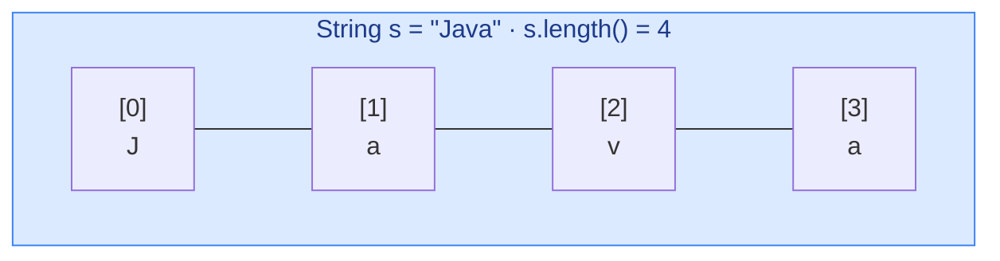
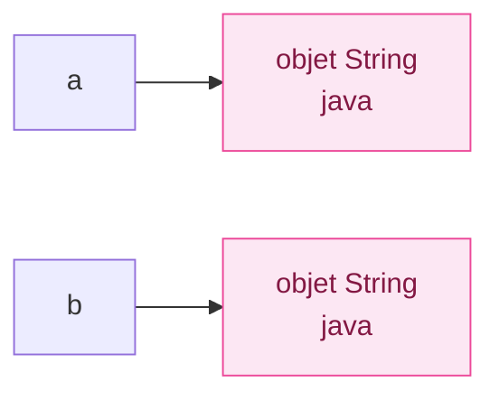
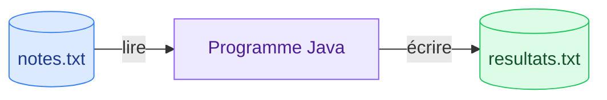

# 7. String et entrées/sorties

<mark style="color:blue;">**Le texte, le clavier, l'écran et les fichiers.**</mark>

&#x20;


**En bref**

Un `String` est un objet **immuable** : chaque « modification » crée une nouvelle chaîne. On compare deux chaînes avec **`equals`**, jamais avec `==`. On lit au clavier avec `Scanner`, on formate avec `printf`, et on manipule les fichiers avec `Files` et `try-with-resources`.


&#x20;

***

&#x20;

## <mark style="color:purple;">01</mark> · La classe `String`

&#x20;

Une chaîne de caractères est une **suite de `char`**, numérotés à partir de 0, comme un tableau.

&#x20;



&#x20;

### Une chaîne ne change jamais

&#x20;

Un `String` est <mark style="color:blue;">**immuable**</mark> : aucune méthode ne le modifie. `toUpperCase()`, `replace()`… **renvoient une nouvelle chaîne**.

&#x20;

```java
String s = "java";
s.toUpperCase();             // crée "JAVA"… et le résultat est perdu
System.out.println(s);       // java

s = s.toUpperCase();         // on range la nouvelle chaîne dans s
System.out.println(s);       // JAVA
```

&#x20;


**Piège classique** — appeler une méthode de `String` sans récupérer son résultat ne fait **rien** d'utile. Il faut toujours écrire `s = s.methode(...)` ou utiliser le résultat directement.


&#x20;

***

&#x20;

## <mark style="color:purple;">02</mark> · Les méthodes à connaître

&#x20;

Exemples avec `String s = "Bonjour HEIA";`

&#x20;

| Méthode                        | Rôle                                                  | Exemple                          | Résultat                 |
| ------------------------------ | ----------------------------------------------------- | -------------------------------- | ------------------------ |
| `length()`                     | Nombre de caractères                                  | `s.length()`                     | `12`                     |
| `charAt(i)`                    | Caractère à l'indice `i`                              | `s.charAt(0)`                    | `'B'`                    |
| `indexOf(x)`                   | Indice de la 1re occurrence, `-1` si absent           | `s.indexOf('o')`                 | `1`                      |
| `lastIndexOf(x)`               | Indice de la dernière occurrence                      | `s.lastIndexOf('o')`             | `4`                      |
| `substring(debut, fin)`        | Morceau de `debut` **inclus** à `fin` **exclu**       | `s.substring(0, 3)`              | `"Bon"`                  |
| `substring(debut)`             | Morceau de `debut` jusqu'à la fin                     | `s.substring(8)`                 | `"HEIA"`                 |
| `toUpperCase()` / `toLowerCase()` | Majuscules / minuscules                            | `s.toLowerCase()`                | `"bonjour heia"`         |
| `contains(t)`                  | Contient `t` ?                                        | `s.contains("jour")`             | `true`                   |
| `startsWith(t)` / `endsWith(t)` | Commence / finit par `t` ?                           | `s.endsWith("IA")`               | `true`                   |
| `replace(a, b)`                | Remplace toutes les occurrences                       | `s.replace('o', '0')`            | `"B0nj0ur HEIA"`         |
| `strip()` / `trim()`           | Retire les espaces au début et à la fin               | `"  hi  ".strip()`               | `"hi"`                   |
| `isEmpty()` / `isBlank()`      | Vide ? Vide ou seulement des espaces ?                | `" ".isBlank()`                  | `true`                   |
| `split(sep)`                   | Découpe en tableau                                    | `"a;b;c".split(";")`             | `{"a", "b", "c"}`        |
| `equals(t)`                    | Même contenu ?                                        | `s.equals("Bonjour HEIA")`       | `true`                   |
| `equalsIgnoreCase(t)`          | Même contenu, sans tenir compte de la casse           | `"java".equalsIgnoreCase("JAVA")` | `true`                  |
| `compareTo(t)`                 | Ordre alphabétique : négatif, 0 ou positif            | `"abc".compareTo("abd")`         | négatif                  |

&#x20;


**`substring(debut, fin)` : la fin est exclue.** Astuce : la longueur du morceau est `fin - debut`. `s.substring(0, 3)` donne 3 caractères.


&#x20;

***

&#x20;

## <mark style="color:purple;">03</mark> · Comparer deux chaînes : `equals`, jamais `==`

&#x20;

`String` est un type **référence**. `==` compare les **adresses**, `equals` compare le **contenu**.

&#x20;

```java
String a = "java";
String b = new String("java");

System.out.println(a == b);        // false : deux objets différents
System.out.println(a.equals(b));   // true  : même contenu
```

&#x20;



&#x20;

### L'analogie des jumeaux

&#x20;

Deux jumeaux ont le même visage (`equals` vrai), mais ce sont **deux personnes** différentes (`==` faux).

&#x20;


**Toujours `equals` pour comparer du texte.** `==` semble parfois fonctionner (Java réutilise les littéraux identiques), mais échoue dès que la chaîne vient d'une saisie, d'un fichier ou d'un calcul. C'est un bug classique et difficile à repérer.


&#x20;

***

&#x20;

## <mark style="color:purple;">04</mark> · Parcourir une chaîne

&#x20;

```java
String mot = "Java 21";
int chiffres = 0;
for (int i = 0; i < mot.length(); i++) {
    char c = mot.charAt(i);
    if (Character.isDigit(c)) {
        chiffres++;
    }
}
System.out.println(chiffres);   // 2
```

&#x20;

La classe `Character` aide à tester un caractère :

&#x20;

| Méthode                          | Vrai si le caractère est…      |
| -------------------------------- | ------------------------------ |
| `Character.isDigit(c)`           | un chiffre                     |
| `Character.isLetter(c)`          | une lettre                     |
| `Character.isWhitespace(c)`      | un espace, une tabulation…     |
| `Character.isUpperCase(c)`       | une majuscule                  |
| `Character.toUpperCase(c)`       | (renvoie la version majuscule) |

&#x20;

***

&#x20;

## <mark style="color:purple;">05</mark> · Construire du texte : `StringBuilder`

&#x20;

Comme `String` est immuable, concaténer dans une boucle crée **une nouvelle chaîne à chaque tour** : c'est lent pour de gros volumes. `StringBuilder` est une chaîne **modifiable** :

&#x20;

```java
StringBuilder sb = new StringBuilder();
for (int i = 1; i <= 5; i++) {
    sb.append(i).append(" ");
}
String resultat = sb.toString();     // "1 2 3 4 5 "

new StringBuilder("Java").reverse().toString();   // "avaJ"
```

&#x20;


**Règle pratique** — `+` pour assembler quelques morceaux ; `StringBuilder` pour construire du texte **dans une boucle**.


&#x20;

***

&#x20;

## <mark style="color:purple;">06</mark> · Convertir texte et nombres

&#x20;

| Conversion               | Méthode                             | Exemple                                  |
| ------------------------ | ----------------------------------- | ---------------------------------------- |
| texte → `int`            | `Integer.parseInt(s)`               | `Integer.parseInt("42")` donne `42`      |
| texte → `double`         | `Double.parseDouble(s)`             | `Double.parseDouble("3.5")` donne `3.5`  |
| texte → `boolean`        | `Boolean.parseBoolean(s)`           | `Boolean.parseBoolean("true")`           |
| nombre → texte           | `String.valueOf(x)`                 | `String.valueOf(42)` donne `"42"`        |
| nombre → texte (astuce)  | `"" + x`                            | `"" + 3.5` donne `"3.5"`                 |

&#x20;


`Integer.parseInt("12a")` lance une **`NumberFormatException`** : à attraper quand le texte vient de l'utilisateur (voir [chapitre 6](06-exceptions.md)).


&#x20;

***

&#x20;

## <mark style="color:purple;">07</mark> · Mettre en forme : `printf` et `String.format`

&#x20;

```java
String nom = "Alice";
double moyenne = 5.1666;
int rang = 3;

System.out.printf("%s a %.2f de moyenne (rang %d)%n", nom, moyenne, rang);
// Alice a 5.17 de moyenne (rang 3)

String ligne = String.format("|%-8s|%6.1f|", nom, moyenne);
// |Alice   |   5.2|
```

&#x20;

| Code       | Affiche                                  | Exemple → résultat                 |
| ---------- | ---------------------------------------- | ---------------------------------- |
| `%d`       | un entier                                | `%d` avec 42 → `42`                |
| `%f`       | un réel (6 décimales par défaut)         | `%f` avec 3.5 → `3.500000`         |
| `%.2f`     | un réel avec 2 décimales (arrondi)       | `%.2f` avec 3.14159 → `3.14`       |
| `%s`       | du texte (ou n'importe quel objet)       | `%s` avec "HEIA" → `HEIA`          |
| `%c`       | un caractère                             | `%c` avec 'A' → `A`                |
| `%b`       | un booléen                               | `%b` avec true → `true`            |
| `%n`       | un retour à la ligne                     |                                    |
| `%6d`      | un entier sur 6 caractères, aligné à droite | `%6d` avec 42 → `    42`         |
| `%-8s`     | du texte sur 8 caractères, aligné à gauche | `%-8s` avec "Bob" → `Bob     `    |

&#x20;

***

&#x20;

## <mark style="color:purple;">08</mark> · Lire au clavier : `Scanner`

&#x20;


```java
import java.util.Scanner;

public class Saisie {

    public static void main(String[] args) {
        Scanner clavier = new Scanner(System.in);

        System.out.print("Ton prénom : ");
        String prenom = clavier.nextLine();     // lit toute la ligne

        System.out.print("Ton âge : ");
        int age = clavier.nextInt();            // lit un entier

        System.out.println("Salut " + prenom + ", tu as " + age + " ans.");
    }
}
```


&#x20;

| Méthode          | Lit…                                           |
| ---------------- | ---------------------------------------------- |
| `nextLine()`     | toute la ligne, jusqu'à la touche Entrée       |
| `next()`         | un mot (jusqu'au prochain espace)              |
| `nextInt()`      | un entier                                      |
| `nextDouble()`   | un réel                                        |
| `hasNextInt()`   | `true` si la prochaine saisie est un entier    |

&#x20;


**Le piège `nextInt()` puis `nextLine()`** — `nextInt()` lit le nombre mais **laisse** le retour à la ligne dans le tampon. Le `nextLine()` suivant le lit aussitôt et renvoie une chaîne **vide**. Solution : appeler un `nextLine()` supplémentaire juste après `nextInt()`, ou tout lire avec `nextLine()` puis convertir avec `Integer.parseInt`.


&#x20;

***

&#x20;

## <mark style="color:purple;">09</mark> · Lire et écrire des fichiers

&#x20;



&#x20;



```java
import java.io.IOException;
import java.nio.file.Files;
import java.nio.file.Path;
import java.util.List;

Path chemin = Path.of("notes.txt");
List<String> lignes = Files.readAllLines(chemin);      // lire toutes les lignes
Files.writeString(Path.of("resultat.txt"), "Moyenne : 5.2\n");   // écrire
```

&#x20;

Simple et parfait pour des **petits** fichiers. Ces méthodes lancent une `IOException` (vérifiée) : à traiter ou déclarer avec `throws`.



```java
try (BufferedReader lecteur = Files.newBufferedReader(Path.of("notes.txt"))) {
    String ligne;
    while ((ligne = lecteur.readLine()) != null) {     // null = fin du fichier
        System.out.println(ligne);
    }
} catch (IOException e) {
    System.out.println("Lecture impossible : " + e.getMessage());
}
```

&#x20;

Adapté aux **gros** fichiers : une seule ligne en mémoire à la fois.



```java
try (BufferedWriter ecrivain = Files.newBufferedWriter(Path.of("sortie.txt"))) {
    ecrivain.write("Première ligne");
    ecrivain.newLine();
    ecrivain.write("Deuxième ligne");
} catch (IOException e) {
    System.out.println("Écriture impossible : " + e.getMessage());
}
```



&#x20;


**`try-with-resources`** — la ressource déclarée entre les parenthèses du `try` est **fermée automatiquement** à la fin du bloc, même en cas d'exception. Toujours l'utiliser pour les fichiers.


&#x20;

***

&#x20;

## <mark style="color:purple;">10</mark> · En résumé

&#x20;


* `String` est **immuable** : ses méthodes renvoient une **nouvelle** chaîne qu'il faut récupérer.
* Comparer du texte avec **`equals`**, jamais `==`.
* `substring(debut, fin)` : `fin` est **exclu** ; les indices vont de 0 à `length() - 1`.
* `StringBuilder` pour construire du texte dans une boucle.
* `Integer.parseInt` / `String.valueOf` pour convertir ; `printf` avec `%d`, `%.2f`, `%s`, `%n` pour formater.
* `Scanner` pour le clavier (attention à `nextInt` suivi de `nextLine`), `Files` et `try-with-resources` pour les fichiers.


&#x20;

***

&#x20;

## <mark style="color:purple;">11</mark> · Exercices

&#x20;


**Sur papier, sans ordinateur.** Écris tes réponses à la main, puis ouvre la solution pour corriger.


&#x20;

### Exercice 1 — Évaluer des appels sur `String`

&#x20;

On déclare `String s = "Programmation Java";`. Donne le résultat de chaque expression (chaque ligne est indépendante, `s` ne change pas).

&#x20;

| #  | Expression                    | Résultat |
| -- | ----------------------------- | -------- |
| 1  | `s.length()`                  |          |
| 2  | `s.charAt(3)`                 |          |
| 3  | `s.indexOf('a')`              |          |
| 4  | `s.lastIndexOf('a')`          |          |
| 5  | `s.substring(0, 7)`           |          |
| 6  | `s.substring(14)`             |          |
| 7  | `s.replace('a', 'o')`         |          |
| 8  | `s.contains("java")`          |          |
| 9  | `s.split(" ").length`         |          |
| 10 | `s.toUpperCase().charAt(1)`   |          |

&#x20;

Puis : qu'affiche `System.out.println(s == new String(s));` et pourquoi ?

&#x20;

<details>

<summary>Solution</summary>

&#x20;

Repère les indices : `P0 r1 o2 g3 r4 a5 m6 m7 a8 t9 i10 o11 n12`, espace en 13, `J14 a15 v16 a17`.

&#x20;

| #  | Expression                    | Résultat                  | Pourquoi                                          |
| -- | ----------------------------- | ------------------------- | ------------------------------------------------- |
| 1  | `s.length()`                  | `18`                      | 13 lettres + 1 espace + 4 lettres                 |
| 2  | `s.charAt(3)`                 | `'g'`                     | P, r, o, **g**                                    |
| 3  | `s.indexOf('a')`              | `5`                       | Premier `a` de « Progr**a**mmation »              |
| 4  | `s.lastIndexOf('a')`          | `17`                      | Dernier caractère de « Jav**a** »                 |
| 5  | `s.substring(0, 7)`           | `"Program"`               | Indices 0 à 6 (7 exclu)                           |
| 6  | `s.substring(14)`             | `"Java"`                  | De l'indice 14 à la fin                           |
| 7  | `s.replace('a', 'o')`         | `"Progrommotion Jovo"`    | Tous les `a` sont remplacés                       |
| 8  | `s.contains("java")`          | `false`                   | La casse compte : c'est `"Java"`                  |
| 9  | `s.split(" ").length`         | `2`                       | `{"Programmation", "Java"}`                       |
| 10 | `s.toUpperCase().charAt(1)`   | `'R'`                     | `"PROGRAMMATION JAVA"`, indice 1                  |

&#x20;

`s == new String(s)` affiche **`false`** : `new` crée **un nouvel objet**, donc une adresse différente, même si le contenu est identique. Il fallait `equals`.

&#x20;

</details>

&#x20;

### Exercice 2 — Écrire des méthodes sur le texte

&#x20;

Écris **à la main** :

&#x20;

1. `compterVoyelles(String s)` : renvoie le nombre de voyelles (a, e, i, o, u, y), **sans tenir compte des majuscules**.
2. `estPalindrome(String s)` : renvoie `true` si le mot se lit pareil dans les deux sens, sans tenir compte des majuscules (`"Kayak"` → `true`, `"Java"` → `false`). **Sans** utiliser `StringBuilder.reverse()`.

&#x20;

<details>

<summary>Solution</summary>

&#x20;


```java
public static int compterVoyelles(String s) {
    String voyelles = "aeiouy";
    String minuscules = s.toLowerCase();
    int compteur = 0;
    for (int i = 0; i < minuscules.length(); i++) {
        if (voyelles.indexOf(minuscules.charAt(i)) != -1) {
            compteur++;
        }
    }
    return compteur;
}

public static boolean estPalindrome(String s) {
    String t = s.toLowerCase();
    int gauche = 0;
    int droite = t.length() - 1;
    while (gauche < droite) {
        if (t.charAt(gauche) != t.charAt(droite)) {
            return false;               // dès qu'une paire diffère
        }
        gauche++;
        droite--;
    }
    return true;
}
```


&#x20;

**Points à vérifier :**

* `toLowerCase()` est **récupéré** dans une variable (immuabilité !).
* On compare des `char` avec `!=` : c'est correct, ce sont des types **primitifs**. Pour des `String`, il aurait fallu `equals`.
* L'astuce `voyelles.indexOf(c) != -1` évite une longue chaîne de `||`.

&#x20;

</details>

&#x20;

<mark style="color:green;">**→ Suite :**</mark> [8. Classes et objets](08-classes-objets.md)
