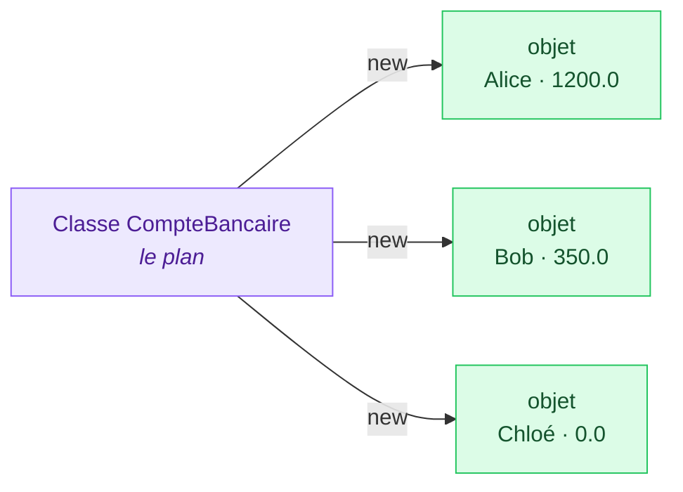
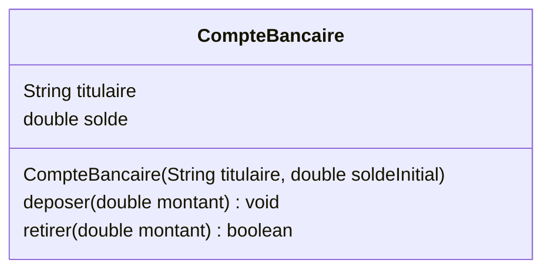
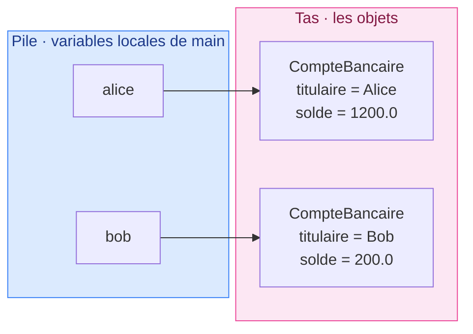
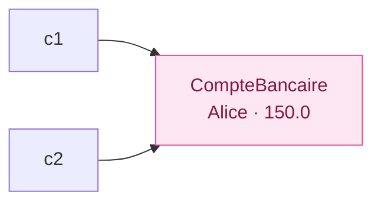
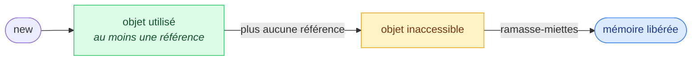
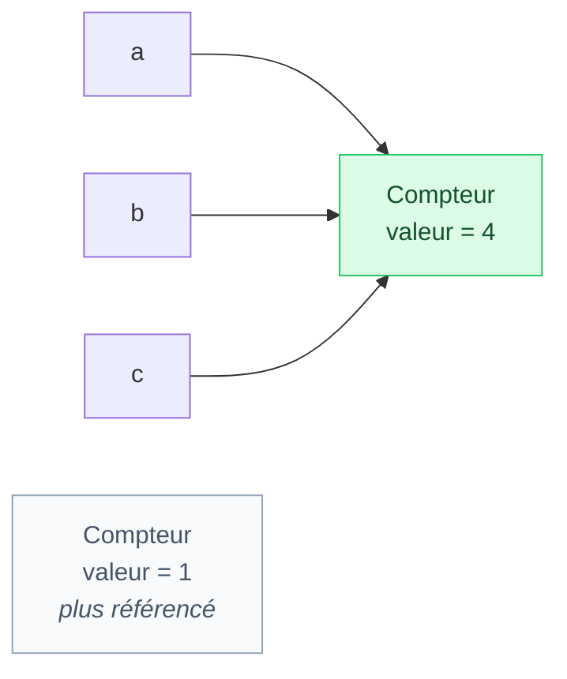
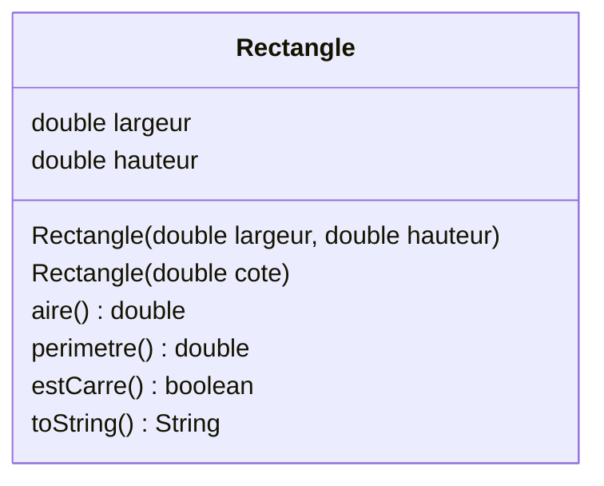

# 8. Classes et objets

<mark style="color:blue;">**Regrouper les données et ce qu'on peut en faire.**</mark>

&#x20;


**En bref**

Une **classe** est un **plan** : elle décrit des **attributs** (les données) et des **méthodes** (les comportements). Un **objet** est un exemplaire concret construit à partir de ce plan avec `new` et un **constructeur**. Une variable ne contient pas l'objet, mais une **référence** vers lui.


&#x20;

***

&#x20;

## <mark style="color:purple;">01</mark> · Pourquoi la programmation orientée objet ?

&#x20;

Jusqu'ici, pour représenter un compte bancaire, il fallait des variables séparées (`titulaire`, `solde`) et des méthodes qui les reçoivent en paramètres. Avec 100 comptes, ça devient ingérable.

&#x20;

La **programmation orientée objet** (POO) regroupe dans une même unité les **données** et les **actions** qui les concernent.

&#x20;

### L'analogie du plan d'architecte

&#x20;



**La classe = le plan**

Un seul plan décrit **ce qu'aura** chaque maison : un nombre de pièces, une couleur de façade, une porte qu'on peut ouvrir.



**Les objets = les maisons**

On construit **autant de maisons** qu'on veut avec le même plan. Chacune a **ses propres valeurs** : l'une est bleue, l'autre rouge.



&#x20;



&#x20;

***

&#x20;

## <mark style="color:purple;">02</mark> · Écrire une classe

&#x20;


```java
public class CompteBancaire {

    // Attributs : l'état de chaque objet
    String titulaire;
    double solde;

    // Constructeur : initialise un nouvel objet
    CompteBancaire(String titulaire, double soldeInitial) {
        this.titulaire = titulaire;
        this.solde = soldeInitial;
    }

    // Méthodes : le comportement
    void deposer(double montant) {
        solde += montant;
    }

    boolean retirer(double montant) {
        if (montant > solde) {
            return false;
        }
        solde -= montant;
        return true;
    }
}
```


&#x20;

Représentation en **diagramme de classe UML** :

&#x20;



&#x20;

| Partie          | Rôle                                                                            |
| --------------- | ------------------------------------------------------------------------------- |
| **Attributs**   | Les **données** de chaque objet. Chaque compte a **son** titulaire et **son** solde |
| **Constructeur**| Méthode spéciale appelée par `new`. Même nom que la classe, **pas de type de retour** |
| **Méthodes**    | Les **actions**. Elles utilisent directement les attributs de l'objet          |

&#x20;


Contrairement aux chapitres précédents, ces méthodes **n'ont pas `static`** : ce sont des **méthodes d'instance**, elles agissent sur **un objet précis**.


&#x20;

***

&#x20;

## <mark style="color:purple;">03</mark> · Créer et utiliser des objets

&#x20;


```java
public class Banque {

    public static void main(String[] args) {
        CompteBancaire alice = new CompteBancaire("Alice", 1000.0);
        CompteBancaire bob = new CompteBancaire("Bob", 200.0);

        alice.deposer(200.0);          // agit sur le compte d'Alice uniquement
        boolean ok = bob.retirer(500.0);

        System.out.println(alice.solde);   // 1200.0
        System.out.println(bob.solde);     // 200.0
        System.out.println(ok);            // false
    }
}
```


&#x20;

* `new CompteBancaire(...)` **crée** un objet en mémoire et appelle le constructeur.
* L'opérateur **point** `.` accède aux attributs et méthodes d'un objet : `alice.deposer(200.0)`.
* Chaque objet a **ses propres attributs** : déposer sur `alice` ne change pas `bob`.

&#x20;

### Où vivent les objets ?

&#x20;



&#x20;

Les objets sont rangés dans une zone mémoire appelée le **tas** (_heap_). Les variables `alice` et `bob` contiennent seulement leur **adresse** : ce sont des **références**, comme pour les tableaux.

&#x20;

***

&#x20;

## <mark style="color:purple;">04</mark> · Les constructeurs

&#x20;

### Le constructeur par défaut

&#x20;

Si une classe ne déclare **aucun** constructeur, Java en fournit un **sans paramètre**, qui laisse les attributs à leur valeur par défaut (0, `false`, `null`).

&#x20;


Dès que tu écris **un** constructeur, le constructeur par défaut **disparaît**. `new CompteBancaire()` ne compile plus si seul `CompteBancaire(String, double)` existe.


&#x20;

### Plusieurs constructeurs (surcharge)

&#x20;

```java
CompteBancaire(String titulaire, double soldeInitial) {
    this.titulaire = titulaire;
    this.solde = soldeInitial;
}

CompteBancaire(String titulaire) {
    this(titulaire, 0.0);      // appelle l'autre constructeur
}
```

&#x20;

`this(...)` appelle un autre constructeur de la même classe. Il doit être la **première instruction**. On évite ainsi de dupliquer le code d'initialisation.

&#x20;

***

&#x20;

## <mark style="color:purple;">05</mark> · Le mot-clé `this`

&#x20;

À l'intérieur d'une méthode ou d'un constructeur, `this` désigne **l'objet courant** : celui sur lequel la méthode a été appelée.

&#x20;

```java
CompteBancaire(String titulaire, double soldeInitial) {
    this.titulaire = titulaire;   // attribut de l'objet  =  paramètre
    this.solde = soldeInitial;
}
```

&#x20;

Ici, le paramètre `titulaire` **masque** l'attribut du même nom. `this.titulaire` lève l'ambiguïté : « le `titulaire` de **cet** objet ».

&#x20;


Quand on appelle `alice.deposer(200.0)`, dans `deposer`, `this` vaut `alice`. Avec `bob.deposer(...)`, `this` vaut `bob`. C'est ainsi qu'une seule méthode sert à tous les objets.


&#x20;

***

&#x20;

## <mark style="color:purple;">06</mark> · Références, `null` et comparaison

&#x20;

### Deux variables, un seul objet

&#x20;

```java
CompteBancaire c1 = new CompteBancaire("Alice", 100.0);
CompteBancaire c2 = c1;          // copie de la RÉFÉRENCE, pas de l'objet
c2.deposer(50.0);
System.out.println(c1.solde);    // 150.0
```

&#x20;



&#x20;

C'est le même mécanisme que pour les tableaux : `c2 = c1` recopie **l'adresse**, les deux variables désignent le **même** objet.

&#x20;

### La référence vide : `null`

&#x20;

```java
CompteBancaire c = null;     // c ne désigne aucun objet
c.deposer(10.0);             // NullPointerException !
```

&#x20;


**`NullPointerException`** — appeler une méthode ou lire un attribut sur une référence `null`. C'est l'erreur la plus fréquente en Java. Vérifie avec `if (c != null)` quand une référence peut être vide.


&#x20;

### `==` ou `equals` ?

&#x20;

| Comparaison     | Compare                   | Deux comptes distincts « Alice, 100.0 »              |
| --------------- | ------------------------- | ---------------------------------------------------- |
| `a == b`        | les **adresses**          | `false`                                              |
| `a.equals(b)`   | le **contenu** (si la classe le définit) | `false` par défaut, `true` si `equals` est redéfini (chapitre 11) |

&#x20;

***

&#x20;

## <mark style="color:purple;">07</mark> · Afficher un objet : `toString`

&#x20;

Par défaut, `System.out.println(alice)` affiche quelque chose comme `CompteBancaire@1b6d3586`. En ajoutant une méthode `toString`, on choisit le texte :

&#x20;

```java
@Override
public String toString() {
    return titulaire + " : " + solde + " CHF";
}
```

&#x20;

```java
System.out.println(alice);            // Alice : 1200.0 CHF
String texte = "Compte de " + alice;  // toString est appelée automatiquement
```

&#x20;


`@Override` indique qu'on **redéfinit** une méthode héritée de la classe `Object`. Tout est expliqué au chapitre [11. Héritage et polymorphisme](11-heritage-polymorphisme.md).


&#x20;

***

&#x20;

## <mark style="color:purple;">08</mark> · La vie et la mort d'un objet

&#x20;



&#x20;

Un objet n'a pas besoin d'être détruit à la main. Quand **plus aucune variable** ne le référence, le <mark style="color:blue;">**ramasse-miettes**</mark> (_garbage collector_) de la JVM récupère automatiquement sa mémoire.

&#x20;

***

&#x20;

## <mark style="color:purple;">09</mark> · En résumé

&#x20;


* Une **classe** décrit des **attributs** et des **méthodes** ; un **objet** est une instance créée avec `new`.
* Le **constructeur** porte le nom de la classe, n'a pas de type de retour et initialise l'objet. `this(...)` appelle un autre constructeur.
* `this` désigne **l'objet courant** ; `this.attribut` distingue l'attribut d'un paramètre de même nom.
* Une variable objet est une **référence** : `b = a` partage l'objet ; `null` = aucune référence ; `==` compare les adresses.
* `toString()` définit le texte affiché ; le **ramasse-miettes** libère les objets inaccessibles.


&#x20;

***

&#x20;

## <mark style="color:purple;">10</mark> · Exercices

&#x20;


**Sur papier, sans ordinateur.** Écris tes réponses à la main, puis ouvre la solution pour corriger.


&#x20;

### Exercice 1 — Qui pointe vers qui ?

&#x20;

```java
class Compteur {
    int valeur;

    Compteur(int depart) {
        valeur = depart;
    }

    void incrementer() {
        valeur++;
    }
}
```

&#x20;

```java
Compteur a = new Compteur(1);
Compteur b = new Compteur(1);
Compteur c = a;
a.incrementer();
c.incrementer();
b = c;
b.incrementer();
System.out.println(a.valeur + " " + b.valeur + " " + c.valeur);
System.out.println((a == c) + " " + (a == b));
```

&#x20;

1. Dessine la mémoire (variables et objets, avec des flèches) **à la fin** du code.
2. Qu'affiche-t-il ?
3. Combien d'objets `Compteur` ont été créés ? Combien sont encore accessibles à la fin ?

&#x20;

<details>

<summary>Solution</summary>

&#x20;



&#x20;

```
4 4 4
true true
```

&#x20;

* `c = a` : `a` et `c` désignent le **premier** objet.
* `a.incrementer()` puis `c.incrementer()` : le premier objet passe à 3.
* `b = c` : `b` désigne maintenant **aussi** le premier objet ; le second n'est plus référencé.
* `b.incrementer()` : le premier objet passe à **4**.

&#x20;

**2 objets** ont été créés (deux `new`), **1 seul** est encore accessible ; l'autre sera récupéré par le ramasse-miettes.

&#x20;

</details>

&#x20;

### Exercice 2 — La classe `Rectangle`

&#x20;

1. Dessine le **diagramme de classe** d'une classe `Rectangle` avec deux attributs `largeur` et `hauteur` (réels).
2. Écris-la **à la main** avec :
   * un constructeur `Rectangle(double largeur, double hauteur)` ;
   * un second constructeur `Rectangle(double cote)` qui crée un carré, en réutilisant le premier ;
   * les méthodes `aire()`, `perimetre()` et `estCarre()` ;
   * une méthode `toString()` qui renvoie par exemple `"Rectangle 3.0 x 2.0"`.
3. Écris un `main` qui crée un rectangle 3 × 2 et un carré de côté 4, et affiche leur aire.

&#x20;

<details>

<summary>Solution</summary>

&#x20;



&#x20;


```java
public class Rectangle {

    double largeur;
    double hauteur;

    Rectangle(double largeur, double hauteur) {
        this.largeur = largeur;
        this.hauteur = hauteur;
    }

    Rectangle(double cote) {
        this(cote, cote);
    }

    double aire() {
        return largeur * hauteur;
    }

    double perimetre() {
        return 2 * (largeur + hauteur);
    }

    boolean estCarre() {
        return largeur == hauteur;
    }

    @Override
    public String toString() {
        return "Rectangle " + largeur + " x " + hauteur;
    }

    public static void main(String[] args) {
        Rectangle r = new Rectangle(3.0, 2.0);
        Rectangle carre = new Rectangle(4.0);
        System.out.println(r + " : aire " + r.aire());           // Rectangle 3.0 x 2.0 : aire 6.0
        System.out.println(carre + " : aire " + carre.aire());   // Rectangle 4.0 x 4.0 : aire 16.0
    }
}
```


&#x20;

**Points à vérifier :** pas de type de retour sur les constructeurs, `this.` pour lever l'ambiguïté, `this(cote, cote)` en **première** ligne du second constructeur. (Comparer deux `double` avec `==` est acceptable ici car les valeurs sont données telles quelles, pas calculées.)

&#x20;

</details>

&#x20;

<mark style="color:green;">**→ Suite :**</mark> [9. Packages, contrôle d'accès, initialiseurs et encapsulation](09-packages-controle-acces-initialiseurs-encapsulation.md)
