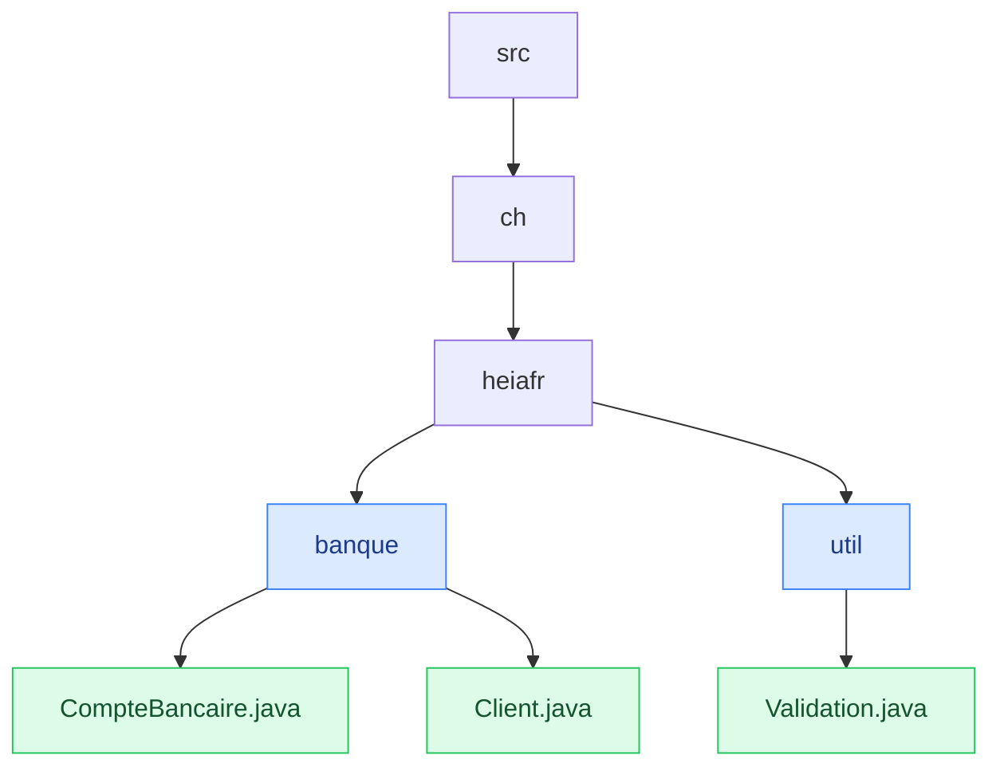
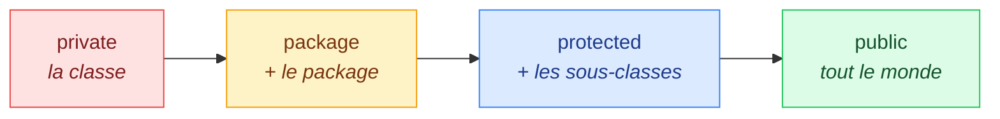
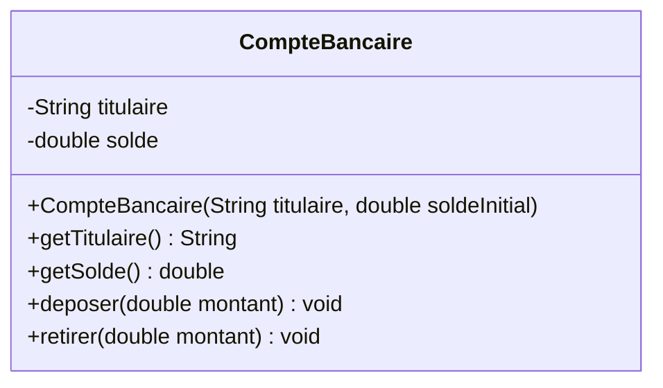
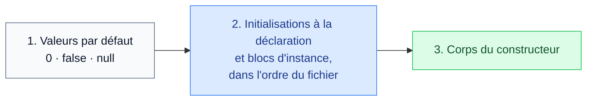

# 9. Packages, contrôle d'accès, initialiseurs et encapsulation

<mark style="color:blue;">**Ranger son code, et protéger ce qui doit l'être.**</mark>

&#x20;


**En bref**

Les **packages** rangent les classes dans des dossiers nommés. Les **modificateurs d'accès** (`public`, `protected`, rien, `private`) décident qui peut utiliser quoi. L'**encapsulation** consiste à rendre les attributs `private` et à n'y donner accès que par des méthodes qui **vérifient** les valeurs. Les **initialiseurs** fixent l'ordre dans lequel un objet est préparé.


&#x20;

***

&#x20;

## <mark style="color:purple;">01</mark> · Les packages

&#x20;

Un **package** regroupe des classes liées, comme un **dossier** regroupe des fichiers. Il évite les conflits de noms (deux classes `Date` dans deux packages différents) et structure les gros projets.

&#x20;

### Déclarer un package

&#x20;

La première ligne du fichier indique son package, et le fichier doit se trouver dans le **dossier correspondant** :

&#x20;


```java
package ch.heiafr.banque;

public class CompteBancaire {
    // …
}
```


&#x20;



&#x20;


**Convention de nommage** — un package s'écrit **en minuscules**, en commençant par le nom de domaine **à l'envers** : `ch.heiafr.banque` pour une organisation dont le site est `heiafr.ch`. Cela garantit des noms uniques dans le monde entier.


&#x20;

### Importer des classes

&#x20;

```java
package ch.heiafr.app;

import ch.heiafr.banque.CompteBancaire;   // une classe précise
import java.util.*;                        // toutes les classes de java.util

public class Main {
    public static void main(String[] args) {
        CompteBancaire c = new CompteBancaire("Alice", 100.0);
        List<String> noms = new ArrayList<>();
    }
}
```

&#x20;

* Sans `import`, il faudrait écrire le **nom complet** : `ch.heiafr.banque.CompteBancaire`.
* Le package **`java.lang`** (`String`, `Math`, `Integer`, `System`…) est importé **automatiquement**.
* Les classes du **même package** se voient sans `import`.

&#x20;

***

&#x20;

## <mark style="color:purple;">02</mark> · Le contrôle d'accès

&#x20;

Chaque classe, attribut, méthode ou constructeur a un **niveau de visibilité** :

&#x20;

| Modificateur                     | Même classe | Même package | Sous-classe (autre package) | Partout |
| -------------------------------- | ----------- | ------------ | --------------------------- | ------- |
| `public`                         | Oui         | Oui          | Oui                         | Oui     |
| `protected`                      | Oui         | Oui          | Oui                         | Non     |
| _(rien : accès package)_         | Oui         | Oui          | Non                         | Non     |
| `private`                        | Oui         | Non          | Non                         | Non     |

&#x20;



&#x20;

### L'analogie de la maison

&#x20;

* `private` : ta **chambre** — toi seul y entres.
* _package_ : la **maison** — toute la famille.
* `protected` : la famille **et les enfants partis vivre ailleurs**.
* `public` : le **jardin ouvert** — tout le monde.

&#x20;


**Une seule classe `public` par fichier**, et le fichier porte son nom. Les autres classes du fichier ont l'accès package.


&#x20;

***

&#x20;

## <mark style="color:purple;">03</mark> · L'encapsulation

&#x20;

Avec des attributs accessibles, n'importe quel code peut écrire n'importe quoi :

&#x20;

```java
alice.solde = -1_000_000;      // rien ne l'empêche !
```

&#x20;

L'**encapsulation** consiste à :

&#x20;

1. rendre les attributs **`private`** ;
2. fournir des méthodes **`public`** pour les lire (**getters**) et, si nécessaire, les modifier (**setters** ou méthodes métier) ;
3. **vérifier** chaque modification dans ces méthodes.

&#x20;


```java
package ch.heiafr.banque;

public class CompteBancaire {

    private final String titulaire;
    private double solde;

    public CompteBancaire(String titulaire, double soldeInitial) {
        if (soldeInitial < 0) {
            throw new IllegalArgumentException("Solde initial négatif");
        }
        this.titulaire = titulaire;
        this.solde = soldeInitial;
    }

    public String getTitulaire() {
        return titulaire;
    }

    public double getSolde() {
        return solde;
    }

    public void deposer(double montant) {
        if (montant <= 0) {
            throw new IllegalArgumentException("Le montant doit être positif");
        }
        solde += montant;
    }

    public void retirer(double montant) {
        if (montant <= 0 || montant > solde) {
            throw new IllegalArgumentException("Retrait impossible : " + montant);
        }
        solde -= montant;
    }
}
```


&#x20;



&#x20;

En UML, `-` signifie `private` et `+` signifie `public` (`#` pour `protected`, `~` pour package).

&#x20;

### L'analogie du distributeur de billets

&#x20;

Tu n'ouvres pas le coffre du distributeur pour te servir : tu passes par l'**écran** (les méthodes publiques), qui **vérifie** ta carte, ton code et ton solde avant de te donner l'argent. Le coffre (les attributs) reste **privé**.

&#x20;


**Pourquoi c'est important**

* **Protection** : l'objet ne peut jamais être dans un état incohérent (un solde négatif, une date au 31 février).
* **Liberté de changer** : on peut modifier la représentation interne sans casser le code qui utilise la classe.
* **Lisibilité** : l'interface publique dit clairement ce qu'on peut faire avec l'objet.


&#x20;

### Getters, setters… ou pas

&#x20;

* Nomme les getters `getX()` (ou `isX()` pour un `boolean`) et les setters `setX(...)`.
* **Ne crée pas de setter automatiquement** pour chaque attribut : un `setSolde` permettrait de contourner `deposer` et `retirer`. Préfère des méthodes **métier** qui ont un sens.
* Un attribut qui ne doit jamais changer est déclaré **`final`** (ici `titulaire`) : il doit alors être initialisé une fois, dans la déclaration ou le constructeur.

&#x20;

***

&#x20;

## <mark style="color:purple;">04</mark> · Les initialiseurs et l'ordre d'initialisation

&#x20;

Un attribut peut recevoir sa valeur à plusieurs endroits :

&#x20;

```java
public class Commande {

    private int quantite;                     // 1. valeur par défaut : 0
    private double prix = 10.0;               // 2. initialisation à la déclaration
    private String statut;

    {                                         // 3. bloc d'initialisation d'instance
        statut = "nouvelle";
    }

    public Commande(int quantite) {           // 4. constructeur
        this.quantite = quantite;
    }
}
```

&#x20;

À chaque `new`, Java suit **toujours** le même ordre :

&#x20;



&#x20;


**Le bloc d'initialisation d'instance** `{ … }` s'exécute à **chaque** création d'objet, avant le constructeur. Il sert rarement : on l'utilise surtout pour partager du code entre plusieurs constructeurs. Le bloc **statique** `static { … }`, lui, est présenté au [chapitre 10](10-membres-statiques-initialiseurs-wrappers.md).


&#x20;

***

&#x20;

## <mark style="color:purple;">05</mark> · Les objets immuables

&#x20;

Pousser l'encapsulation au bout : un objet dont l'état **ne change jamais** après sa création. Comme `String`.

&#x20;

```java
public final class Point {

    private final double x;
    private final double y;

    public Point(double x, double y) {
        this.x = x;
        this.y = y;
    }

    public double getX() { return x; }
    public double getY() { return y; }

    public Point deplacer(double dx, double dy) {
        return new Point(x + dx, y + dy);     // renvoie un NOUVEL objet
    }
}
```

&#x20;

Tous les attributs `private final`, **aucun** setter, et les méthodes « de modification » renvoient un nouvel objet. Un objet immuable est simple à comprendre et sûr à partager.

&#x20;

***

&#x20;

## <mark style="color:purple;">06</mark> · En résumé

&#x20;


* Un **package** range les classes (`package ch.heiafr.banque;`), en minuscules, domaine à l'envers ; `import` évite les noms complets ; `java.lang` est importé d'office.
* Visibilité : `private` (classe) → package (rien) → `protected` (+ sous-classes) → `public` (tous).
* **Encapsulation** : attributs `private`, accès par des méthodes `public` qui **vérifient** les valeurs.
* Ordre d'initialisation : **valeurs par défaut**, puis **déclarations et blocs d'instance** dans l'ordre du fichier, puis **constructeur**.
* `final` : l'attribut est fixé une seule fois ; objet **immuable** = tout `private final`, sans setter.


&#x20;

***

&#x20;

## <mark style="color:purple;">07</mark> · Exercices

&#x20;


**Sur papier, sans ordinateur.** Écris tes réponses à la main, puis ouvre la solution pour corriger.


&#x20;

### Exercice 1 — Ordre et visibilité

&#x20;

**a)** Qu'affiche ce programme ?

&#x20;


```java
public class Ordre {

    private int a = afficher("a", 1);

    {
        System.out.println("bloc d'instance");
    }

    private int b = afficher("b", 2);

    public Ordre() {
        System.out.println("constructeur, a + b = " + (a + b));
    }

    private static int afficher(String nom, int valeur) {
        System.out.println("init " + nom);
        return valeur;
    }

    public static void main(String[] args) {
        new Ordre();
        new Ordre();
    }
}
```


&#x20;

**b)** Les classes `A` et `B` sont dans le package `p1`, la classe `C` dans le package `p2`. Pour chaque ligne écrite dans `B` puis dans `C`, dis si elle **compile**.

&#x20;

```java
package p1;
public class A {
    public int x;
    int y;
    private int z;
}
```

&#x20;

| Accès depuis…    | `a.x` | `a.y` | `a.z` |
| ---------------- | ----- | ----- | ----- |
| `B` (package p1) |       |       |       |
| `C` (package p2) |       |       |       |

&#x20;

<details>

<summary>Solution</summary>

&#x20;

**a)**

```
init a
bloc d'instance
init b
constructeur, a + b = 3
init a
bloc d'instance
init b
constructeur, a + b = 3
```

&#x20;

Déclarations et bloc d'instance s'exécutent **dans l'ordre du fichier**, puis le constructeur. Et tout recommence **à chaque** `new`.

&#x20;

**b)**

&#x20;

| Accès depuis…    | `a.x` (`public`) | `a.y` (package) | `a.z` (`private`) |
| ---------------- | ---------------- | --------------- | ----------------- |
| `B` (package p1) | Oui              | Oui             | Non               |
| `C` (package p2) | Oui              | Non             | Non               |

&#x20;

</details>

&#x20;

### Exercice 2 — Encapsuler une température

&#x20;

Écris **à la main** une classe `Temperature` encapsulée :

&#x20;

1. Un attribut privé qui stocke la température en **kelvins**.
2. Un constructeur qui reçoit des **degrés Celsius** et refuse (avec une exception) toute valeur sous le zéro absolu (−273.15 °C).
3. Les getters `getKelvin()`, `getCelsius()` et `getFahrenheit()` (F = C × 9/5 + 32).
4. Une méthode `rechauffer(double deltaCelsius)` qui ajoute des degrés, en refusant elle aussi de passer sous le zéro absolu.
5. Explique en deux phrases pourquoi on n'a **pas** mis de `setKelvin(double)` public.

&#x20;

<details>

<summary>Solution</summary>

&#x20;


```java
public class Temperature {

    private static final double ZERO_ABSOLU_CELSIUS = -273.15;

    private double kelvin;

    public Temperature(double celsius) {
        if (celsius < ZERO_ABSOLU_CELSIUS) {
            throw new IllegalArgumentException("Sous le zéro absolu : " + celsius);
        }
        this.kelvin = celsius - ZERO_ABSOLU_CELSIUS;
    }

    public double getKelvin() {
        return kelvin;
    }

    public double getCelsius() {
        return kelvin + ZERO_ABSOLU_CELSIUS;
    }

    public double getFahrenheit() {
        return getCelsius() * 9.0 / 5 + 32;
    }

    public void rechauffer(double deltaCelsius) {
        if (kelvin + deltaCelsius < 0) {
            throw new IllegalArgumentException("Sous le zéro absolu");
        }
        kelvin += deltaCelsius;          // un écart de 1 °C vaut un écart de 1 K
    }
}
```


&#x20;

**Pourquoi pas de `setKelvin` public ?** Il permettrait d'écrire n'importe quelle valeur, y compris négative, sans passer par la vérification. En ne proposant que des méthodes qui contrôlent leurs entrées, on garantit qu'une `Temperature` est **toujours valide**.

&#x20;

Remarque : on stocke en kelvins, mais on pourrait changer d'avis et stocker en Celsius **sans modifier le code des utilisateurs** — c'est tout l'intérêt de l'encapsulation.

&#x20;

</details>

&#x20;

<mark style="color:green;">**→ Suite :**</mark> [10. Membres statiques, initialiseurs et wrappers](10-membres-statiques-initialiseurs-wrappers.md)
