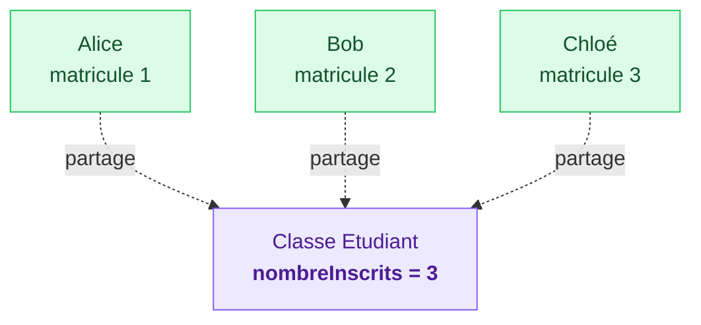
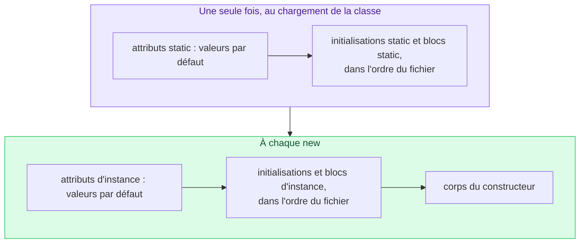
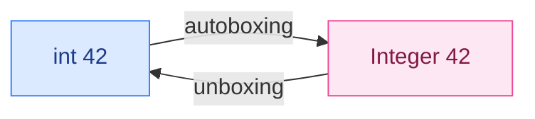

# 10. Membres statiques, initialiseurs et wrappers

<mark style="color:blue;">**Ce qui est partagé par tous, et les primitifs déguisés en objets.**</mark>

&#x20;


**En bref**

Un membre **`static`** appartient à la **classe** : il existe en un seul exemplaire, partagé par tous les objets, et s'utilise sans créer d'objet. Un bloc **`static { }`** s'exécute une seule fois, au chargement de la classe. Les **wrappers** (`Integer`, `Double`…) enveloppent les types primitifs dans des objets, avec conversion automatique (**autoboxing**).


&#x20;

***

&#x20;

## <mark style="color:purple;">01</mark> · Les attributs statiques

&#x20;

Un attribut normal (**d'instance**) existe **dans chaque objet**. Un attribut **`static`** (**de classe**) existe **une seule fois**, partagé par tous.

&#x20;


```java
public class Etudiant {

    private static int nombreInscrits = 0;   // partagé par tous les étudiants

    private final String nom;                 // propre à chaque étudiant
    private final int matricule;

    public Etudiant(String nom) {
        this.nom = nom;
        nombreInscrits++;
        this.matricule = nombreInscrits;      // 1, 2, 3…
    }

    public static int getNombreInscrits() {
        return nombreInscrits;
    }
}
```


&#x20;



&#x20;

### L'analogie de la salle de classe

&#x20;

Chaque étudiant a **son propre cahier** (attribut d'instance). Mais il n'y a **qu'un seul tableau noir** au mur, que tout le monde voit et partage (attribut statique). Si quelqu'un écrit au tableau, tout le monde le voit.

&#x20;


**Accès** — on accède à un membre statique **par le nom de la classe** : `Etudiant.getNombreInscrits()`, `Math.PI`. Passer par un objet (`alice.getNombreInscrits()`) compile, mais trompe le lecteur.


&#x20;

***

&#x20;

## <mark style="color:purple;">02</mark> · Les méthodes statiques

&#x20;

Une méthode `static` n'agit sur **aucun objet précis**. On l'appelle sur la classe.

&#x20;

```java
double r = Math.sqrt(16.0);          // Math : que des méthodes statiques
int n = Integer.parseInt("42");
double m = Math.max(3.5, 7.2);
```

&#x20;

C'est ce qu'on a fait depuis le chapitre 4 : `main` et nos petites méthodes étaient `static`.

&#x20;


**Une méthode statique n'a pas de `this`.** Elle ne peut donc **pas** utiliser directement les attributs ou méthodes d'**instance** : lesquels prendre, s'il n'y a pas d'objet ? C'est l'erreur `non-static variable cannot be referenced from a static context`.


&#x20;

| Depuis…                       | Membre d'instance | Membre statique |
| ----------------------------- | ----------------- | --------------- |
| une méthode **d'instance**    | Oui               | Oui             |
| une méthode **statique**      | Non (sans objet)  | Oui             |

&#x20;

### Quand utiliser `static` ?

&#x20;

* **Méthodes utilitaires** qui ne dépendent que de leurs paramètres : `Math.abs`, `estBissextile(annee)`.
* **Compteurs** et informations partagées par toutes les instances.
* **Constantes** : `static final`.
* **Méthodes de fabrique** : `Integer.valueOf(42)`, `List.of(1, 2, 3)`.

&#x20;

***

&#x20;

## <mark style="color:purple;">03</mark> · Les constantes : `static final`

&#x20;

```java
public class Config {
    public static final int MAX_ESSAIS = 3;
    public static final double TAUX_TVA = 0.081;
}
```

&#x20;

* `static` : **une seule** copie, pour toute la classe.
* `final` : la valeur **ne change jamais**.
* Nom en `UPPER_SNAKE_CASE`. Exemples de la bibliothèque : `Math.PI`, `Integer.MAX_VALUE`.

&#x20;

***

&#x20;

## <mark style="color:purple;">04</mark> · Les blocs d'initialisation statiques

&#x20;

Un bloc `static { … }` s'exécute **une seule fois**, quand la classe est **chargée** par la JVM (à sa première utilisation), avant toute création d'objet.

&#x20;

```java
public class Pays {

    private static final String[] CODES;

    static {
        CODES = new String[] {"CH", "FR", "DE", "IT", "AT"};
        System.out.println("Classe Pays chargée");
    }
}
```

&#x20;

### L'ordre complet

&#x20;



&#x20;

***

&#x20;

## <mark style="color:purple;">05</mark> · Les wrappers (classes enveloppes)

&#x20;

Les types primitifs ne sont **pas des objets** : pas de méthodes, pas de `null`, et ils ne peuvent pas entrer dans les collections (`List`, `Map`… voir chapitre 13). Chaque type primitif a donc une **classe enveloppe** :

&#x20;

| Primitif    | Wrapper       |
| ----------- | ------------- |
| `byte`      | `Byte`        |
| `short`     | `Short`       |
| `int`       | `Integer`     |
| `long`      | `Long`        |
| `float`     | `Float`       |
| `double`    | `Double`      |
| `char`      | `Character`   |
| `boolean`   | `Boolean`     |

&#x20;

### L'analogie du colis

&#x20;

Le primitif, c'est l'**objet nu** ; le wrapper, c'est ce même objet **mis dans un colis** : on peut alors l'envoyer par la poste (le ranger dans une collection), lui coller une étiquette (des méthodes)… ou envoyer un colis **vide** (`null`).

&#x20;

### Autoboxing et unboxing

&#x20;

Java emballe et déballe **automatiquement** :

&#x20;

```java
Integer boite = 42;          // autoboxing   : int -> Integer
int n = boite;               // unboxing     : Integer -> int
int somme = boite + 8;       // unboxing automatique pour le calcul

List<Integer> notes = new ArrayList<>();
notes.add(5);                // autoboxing : 5 devient un Integer
```

&#x20;



&#x20;

### Les méthodes utiles

&#x20;

| Méthode / constante              | Rôle                                        |
| -------------------------------- | ------------------------------------------- |
| `Integer.parseInt("42")`         | Texte → `int`                               |
| `Double.parseDouble("3.5")`      | Texte → `double`                            |
| `Integer.valueOf(42)`            | `int` → `Integer`                           |
| `Integer.MAX_VALUE`, `MIN_VALUE` | Bornes d'un `int`                           |
| `Integer.toBinaryString(10)`     | `"1010"`                                    |
| `Character.isDigit(c)`           | Le caractère est-il un chiffre ?            |
| `Double.compare(a, b)`           | Compare deux `double` (négatif, 0, positif) |

&#x20;

### Les deux pièges des wrappers

&#x20;



```java
Integer a = 127, b = 127;
System.out.println(a == b);        // true  (petites valeurs réutilisées)

Integer c = 128, d = 128;
System.out.println(c == d);        // false !
System.out.println(c.equals(d));   // true
```

&#x20;

Un `Integer` est un **objet** : `==` compare les **adresses**. Java réutilise les objets pour les valeurs de −128 à 127, ce qui rend le bug **intermittent**. Toujours `equals` pour comparer des wrappers.



```java
Integer age = null;       // un wrapper peut être null…
int a = age;              // …mais pas un int : NullPointerException
```

&#x20;

L'unboxing d'une référence `null` fait planter le programme.



&#x20;

***

&#x20;

## <mark style="color:purple;">06</mark> · En résumé

&#x20;


* **`static`** = appartient à la **classe** : un seul exemplaire, partagé, accessible par `NomClasse.membre`.
* Une méthode statique n'a **pas de `this`** : elle n'accède pas directement aux membres d'instance.
* Constantes : **`static final`**, en `UPPER_SNAKE_CASE`.
* **`static { }`** s'exécute **une fois**, au chargement de la classe ; le reste de l'initialisation se fait à chaque `new`.
* **Wrappers** : `Integer`, `Double`, `Character`… ; **autoboxing** automatique ; comparer avec **`equals`** ; attention à l'unboxing de `null`.


&#x20;

***

&#x20;

## <mark style="color:purple;">07</mark> · Exercices

&#x20;


**Sur papier, sans ordinateur.** Écris tes réponses à la main, puis ouvre la solution pour corriger.


&#x20;

### Exercice 1 — Statique et wrappers

&#x20;

**a)** Qu'affiche ce programme ?

&#x20;


```java
class Ticket {

    static int prochainNumero = 1;
    final int numero;

    static {
        System.out.println("Chargement de Ticket");
    }

    Ticket() {
        numero = prochainNumero++;
        System.out.println("Ticket " + numero);
    }
}

public class Main {

    public static void main(String[] args) {
        System.out.println("Début");
        Ticket t1 = new Ticket();
        Ticket t2 = new Ticket();
        System.out.println(t1.numero + " " + t2.numero + " " + Ticket.prochainNumero);
    }
}
```


&#x20;

**b)** Donne le résultat de chaque ligne (valeur, ou « erreur » avec son nom) :

&#x20;

| #  | Code                                              | Résultat |
| -- | ------------------------------------------------- | -------- |
| 1  | `Integer.parseInt("42") + 1`                      |          |
| 2  | `"42" + 1`                                        |          |
| 3  | `Integer x = 1000, y = 1000;` puis `x == y`       |          |
| 4  | `Integer x = 1000, y = 1000;` puis `x.equals(y)`  |          |
| 5  | `Integer z = null;` puis `int w = z;`             |          |
| 6  | `Integer.MAX_VALUE + 1`                           |          |

&#x20;

<details>

<summary>Solution</summary>

&#x20;

**a)**

```
Début
Chargement de Ticket
Ticket 1
Ticket 2
1 2 3
```

&#x20;

* `Début` s'affiche **avant** le chargement : la classe `Ticket` n'est chargée qu'à sa **première utilisation** (le premier `new`).
* Le bloc `static` ne s'exécute qu'**une fois**, même avec deux tickets.
* `prochainNumero++` donne la valeur **puis** incrémente : 1, puis 2, et il vaut 3 à la fin.

&#x20;

**b)**

&#x20;

| #  | Résultat                        | Pourquoi                                               |
| -- | ------------------------------- | ------------------------------------------------------ |
| 1  | `43`                            | Conversion en `int`, puis addition                     |
| 2  | `"421"`                         | Concaténation de texte                                 |
| 3  | `false`                         | Deux objets différents (1000 est hors de −128…127)     |
| 4  | `true`                          | Même valeur                                            |
| 5  | `NullPointerException`          | Unboxing d'une référence `null`                        |
| 6  | `-2147483648`                   | Dépassement de capacité (chapitre 2)                   |

&#x20;

</details>

&#x20;

### Exercice 2 — Une classe utilitaire

&#x20;

Écris **à la main** une classe `Convertisseur` qui ne contient **que des membres statiques** :

&#x20;

1. une constante `CHF_PAR_EURO` valant 0.94 ;
2. une méthode `euroVersChf(double euros)` et une méthode `chfVersEuro(double chf)` ;
3. un compteur statique `nombreConversions`, incrémenté à chaque conversion, et une méthode pour le lire ;
4. un constructeur **`private`**. Explique en une phrase à quoi il sert.

&#x20;

Écris enfin l'appel qui convertit 50 € en francs, **sans** créer d'objet.

&#x20;

<details>

<summary>Solution</summary>

&#x20;


```java
public class Convertisseur {

    public static final double CHF_PAR_EURO = 0.94;

    private static int nombreConversions = 0;

    private Convertisseur() {
        // empêche de créer des objets : cette classe n'a que des membres statiques
    }

    public static double euroVersChf(double euros) {
        nombreConversions++;
        return euros * CHF_PAR_EURO;
    }

    public static double chfVersEuro(double chf) {
        nombreConversions++;
        return chf / CHF_PAR_EURO;
    }

    public static int getNombreConversions() {
        return nombreConversions;
    }
}
```


&#x20;

```java
double chf = Convertisseur.euroVersChf(50);    // 47.0
```

&#x20;

**Le constructeur `private`** empêche d'écrire `new Convertisseur()` : créer un objet n'aurait aucun sens, puisque tout est statique. C'est le même principe que la classe `Math`.

&#x20;

</details>

&#x20;

<mark style="color:green;">**→ Suite :**</mark> [11. Héritage et polymorphisme](11-heritage-polymorphisme.md)
