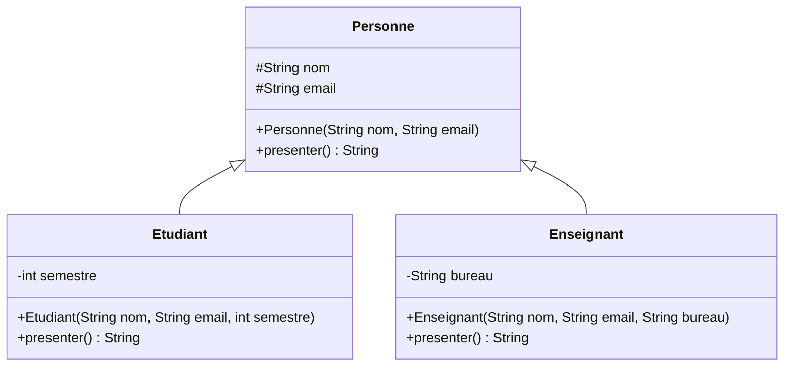
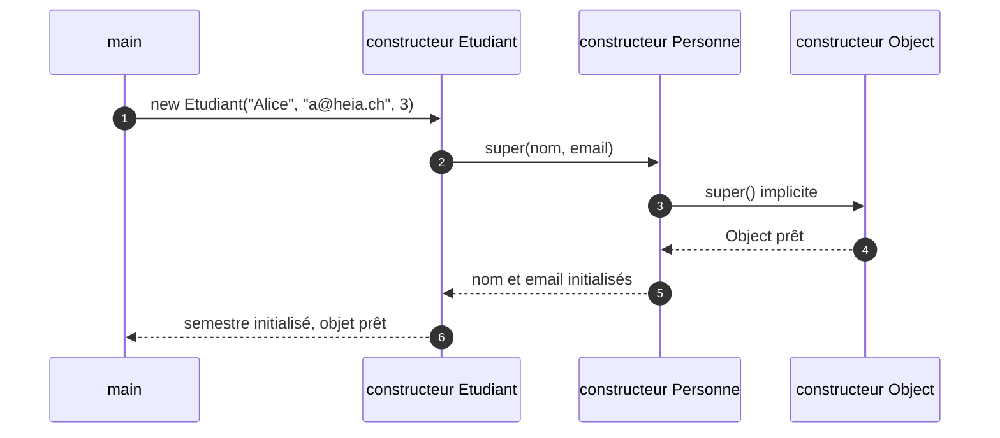
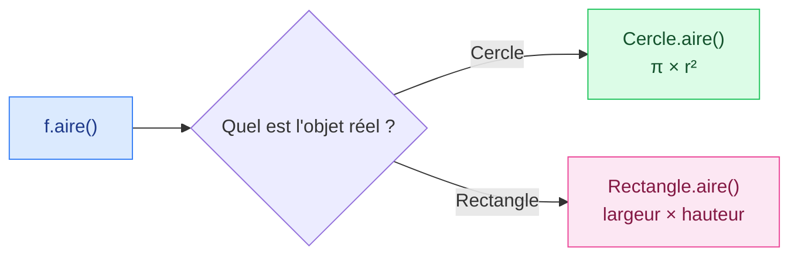
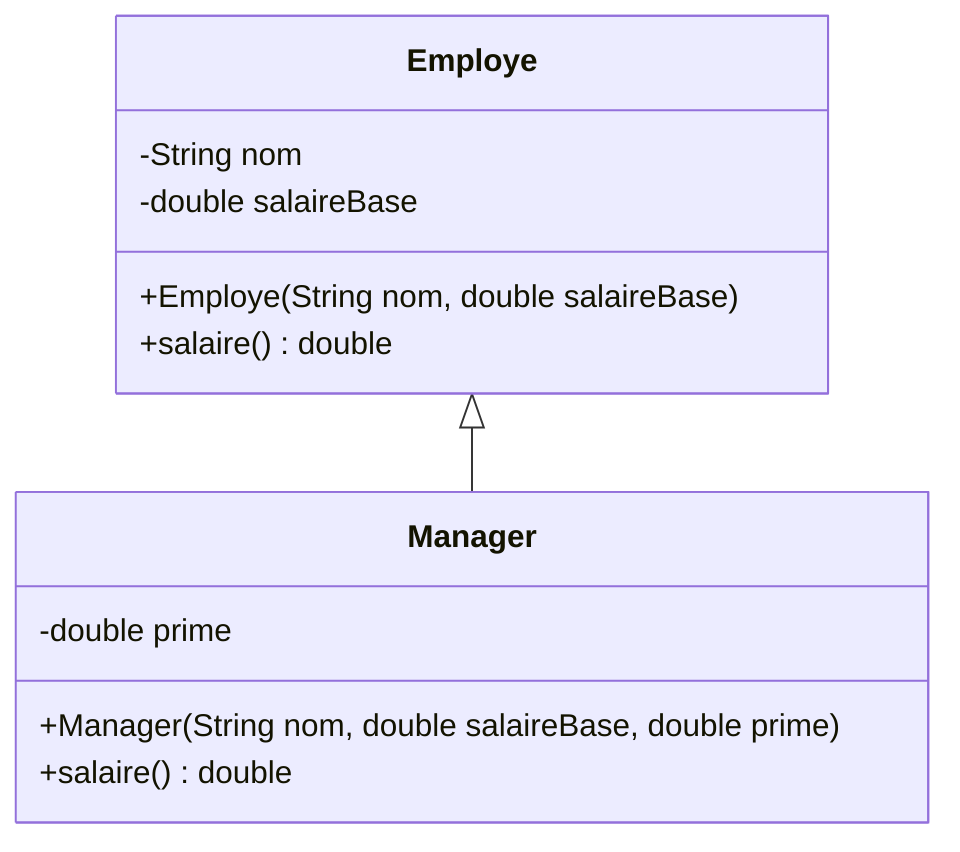

# 11. Héritage et polymorphisme

<mark style="color:blue;">**Une classe qui en prolonge une autre, et des objets qui savent qui ils sont.**</mark>

&#x20;


**En bref**

Avec **`extends`**, une sous-classe **hérite** des attributs et méthodes de sa super-classe, et peut en **ajouter** ou en **redéfinir** (`@Override`). Grâce au **polymorphisme**, une variable du type parent peut désigner un objet enfant, et c'est la méthode **de l'objet réel** qui est exécutée.


&#x20;

***

&#x20;

## <mark style="color:purple;">01</mark> · Pourquoi hériter ?

&#x20;

Un étudiant et un enseignant ont tous deux un nom, un prénom et une adresse e-mail. Écrire deux classes séparées **duplique** ce code. L'héritage permet de le mettre **une seule fois** dans une classe commune.

&#x20;

L'héritage exprime une relation **« est un »** : un étudiant **est une** personne, un enseignant **est une** personne.

&#x20;



&#x20;

### L'analogie de la classification des animaux

&#x20;

Un **chien** est un **mammifère**, qui est un **animal**. Tout ce qui est vrai pour un animal (il respire) est vrai pour un mammifère, et tout ce qui est vrai pour un mammifère (il allaite) est vrai pour un chien. Le chien **ajoute** ses propres particularités (il aboie).

&#x20;

***

&#x20;

## <mark style="color:purple;">02</mark> · `extends` et `super`

&#x20;


```java
public class Personne {

    protected String nom;
    protected String email;

    public Personne(String nom, String email) {
        this.nom = nom;
        this.email = email;
    }

    public String presenter() {
        return "Je suis " + nom;
    }
}
```


&#x20;


```java
public class Etudiant extends Personne {

    private int semestre;

    public Etudiant(String nom, String email, int semestre) {
        super(nom, email);            // appelle le constructeur de Personne
        this.semestre = semestre;
    }

    public int getSemestre() {        // méthode propre à Etudiant
        return semestre;
    }

    @Override
    public String presenter() {
        return super.presenter() + ", étudiant en semestre " + semestre;
    }
}
```


&#x20;

| Élément                     | Rôle                                                                                   |
| --------------------------- | -------------------------------------------------------------------------------------- |
| `extends Personne`          | `Etudiant` hérite de `Personne` : elle récupère `nom`, `email` et `presenter()`        |
| `super(nom, email)`         | Appelle le **constructeur parent**. Obligatoirement la **première instruction**        |
| `@Override`                 | Indique qu'on **redéfinit** une méthode héritée (le compilateur vérifie qu'elle existe)|
| `super.presenter()`         | Appelle la **version du parent** de la méthode                                         |
| `protected`                 | Visible dans les **sous-classes** (voir [chapitre 9](09-packages-controle-acces-initialiseurs-encapsulation.md)) |

&#x20;


**Un seul parent.** En Java, une classe n'hérite que d'**une seule** classe (héritage simple). Toutes les classes héritent, directement ou non, de **`Object`**, qui fournit `toString()`, `equals()` et `hashCode()`.


&#x20;

### L'ordre de construction

&#x20;

Un `Etudiant` **contient** une `Personne` : la partie parent est construite **en premier**.

&#x20;



&#x20;


**Si tu n'écris pas `super(...)`**, Java insère `super()` sans argument. Si le parent n'a **pas** de constructeur sans paramètre, le code ne compile pas.


&#x20;

***

&#x20;

## <mark style="color:purple;">03</mark> · Redéfinir ou surcharger ?

&#x20;

|                           | **Redéfinition** (_override_)                     | **Surcharge** (_overload_)                    |
| ------------------------- | ------------------------------------------------- | --------------------------------------------- |
| Où                        | Dans une **sous-classe**                          | Dans la **même** classe (ou une sous-classe)  |
| Signature                 | **Identique** (même nom, mêmes paramètres)        | Même nom, paramètres **différents**           |
| But                       | **Remplacer** le comportement hérité              | Proposer **plusieurs variantes**              |
| Choisie                   | À l'**exécution**, selon l'objet réel             | À la **compilation**, selon les arguments     |
| Annotation                | `@Override`                                       | aucune                                        |

&#x20;


**Mets toujours `@Override`** — si tu te trompes dans le nom ou les paramètres, le compilateur te prévient au lieu de créer silencieusement une nouvelle méthode.


&#x20;

***

&#x20;

## <mark style="color:purple;">04</mark> · Le polymorphisme

&#x20;

Une variable de type **parent** peut désigner un objet de n'importe quelle **sous-classe** :

&#x20;

```java
Personne p1 = new Etudiant("Alice", "alice@heia.ch", 3);
Personne p2 = new Enseignant("Martin", "martin@heia.ch", "D20.07");

System.out.println(p1.presenter());   // Je suis Alice, étudiant en semestre 3
System.out.println(p2.presenter());   // version d'Enseignant
```

&#x20;

Même appel `presenter()`, **comportements différents** : c'est la méthode de **l'objet réel** qui s'exécute. On parle de **liaison dynamique**.

&#x20;

### Tout son intérêt : traiter une collection d'objets différents

&#x20;


```java
Forme[] formes = {
    new Cercle(1.0),
    new Rectangle(2.0, 3.0),
    new Cercle(2.0)
};

double total = 0;
for (Forme f : formes) {
    total += f.aire();         // chaque forme calcule SA propre aire
}
```


&#x20;



&#x20;

### L'analogie de la télécommande universelle

&#x20;

Tu appuies sur le **même bouton** « allumer ». Selon l'appareil visé (télévision, radio, projecteur), c'est **son** mécanisme qui s'active. Le bouton ne connaît pas les détails : chaque appareil sait comment s'allumer.

&#x20;


**Le gain** — pour ajouter un `Triangle`, il suffit d'écrire la classe. La boucle qui calcule le total **ne change pas**.


&#x20;

***

&#x20;

## <mark style="color:purple;">05</mark> · Type statique et type dynamique

&#x20;

```java
Personne p = new Etudiant("Alice", "alice@heia.ch", 3);
```

&#x20;



**Type statique : `Personne`**

Le type de la **variable**. Il décide ce que le **compilateur** autorise : seulement les méthodes de `Personne`.



**Type dynamique : `Etudiant`**

Le type de l'**objet réel**. Il décide **quelle version** d'une méthode s'exécute.



&#x20;

```java
p.presenter();          // compile (existe dans Personne), exécute la version Etudiant
p.getSemestre();        // ERREUR de compilation : Personne n'a pas cette méthode
```

&#x20;

### Convertir : upcast et downcast

&#x20;

```java
Personne p = new Etudiant("Alice", "a@heia.ch", 3);   // upcast : automatique, toujours sûr

Etudiant e = (Etudiant) p;                           // downcast : explicite
int s = e.getSemestre();                             // OK, l'objet est bien un Etudiant

Personne q = new Enseignant("Martin", "m@heia.ch", "D20");
Etudiant f = (Etudiant) q;                           // compile… mais ClassCastException !
```

&#x20;

### Vérifier avec `instanceof`

&#x20;

```java
if (q instanceof Etudiant etu) {          // teste ET convertit (Java 16+)
    System.out.println(etu.getSemestre());
}
```

&#x20;


**Beaucoup d'`instanceof` = mauvaise conception.** Si tu testes le type pour choisir un comportement, c'est souvent qu'une méthode redéfinie (polymorphisme) ferait mieux le travail.


&#x20;

***

&#x20;

## <mark style="color:purple;">06</mark> · Redéfinir `equals` et `toString`

&#x20;

Toutes les classes héritent d'`Object`. Ses versions par défaut sont rarement utiles : `toString()` affiche une adresse et `equals()` se comporte comme `==`.

&#x20;


```java
public class Point {

    private final int x;
    private final int y;

    public Point(int x, int y) {
        this.x = x;
        this.y = y;
    }

    @Override
    public String toString() {
        return "(" + x + ", " + y + ")";
    }

    @Override
    public boolean equals(Object o) {
        if (this == o) return true;                    // même objet
        if (!(o instanceof Point autre)) return false; // pas un Point (ou null)
        return x == autre.x && y == autre.y;           // mêmes coordonnées
    }

    @Override
    public int hashCode() {
        return java.util.Objects.hash(x, y);           // à redéfinir avec equals
    }
}
```


&#x20;


**`equals` et `hashCode` vont ensemble** : deux objets égaux doivent avoir le même `hashCode`, sinon les collections comme `HashSet` et `HashMap` se comportent mal.


&#x20;

***

&#x20;

## <mark style="color:purple;">07</mark> · Bloquer l'héritage : `final`

&#x20;

| Sur…              | Effet                                                    | Exemple                    |
| ----------------- | -------------------------------------------------------- | -------------------------- |
| une **classe**    | Personne ne peut en hériter                              | `public final class String` |
| une **méthode**   | Les sous-classes ne peuvent pas la redéfinir             | `public final void payer()` |
| un **attribut**   | La valeur est fixée une fois pour toutes                 | `private final int x;`     |

&#x20;

***

&#x20;

## <mark style="color:purple;">08</mark> · Héritage ou composition ?

&#x20;



### « est un » → héritage

Un `Etudiant` **est une** `Personne`.

```java
class Etudiant extends Personne { … }
```



### « a un » → composition

Une `Voiture` **a un** `Moteur` (elle n'**est** pas un moteur).

```java
class Voiture {
    private Moteur moteur;
}
```



&#x20;


**Dans le doute, préfère la composition.** L'héritage lie fortement deux classes ; la composition est plus souple. N'hérite que si la phrase « X **est un** Y » est vraie dans **tous** les cas.


&#x20;

***

&#x20;

## <mark style="color:purple;">09</mark> · En résumé

&#x20;


* `extends` : la sous-classe hérite de tout le parent (un seul parent ; tout hérite d'`Object`).
* `super(...)` construit la partie parent, **en premier** ; `super.methode()` appelle la version du parent.
* **Redéfinition** (`@Override`) : même signature, choisie à l'**exécution** ; **surcharge** : autres paramètres, choisie à la **compilation**.
* **Polymorphisme** : le **type statique** décide ce qui compile, le **type dynamique** décide ce qui s'exécute.
* Downcast avec `(Type)`, vérifié par `instanceof` ; redéfinir `toString`, et `equals` **avec** `hashCode`.
* « est un » → héritage ; « a un » → composition.


&#x20;

***

&#x20;

## <mark style="color:purple;">10</mark> · Exercices

&#x20;


**Sur papier, sans ordinateur.** Écris tes réponses à la main, puis ouvre la solution pour corriger.


&#x20;

### Exercice 1 — Qui répond ?

&#x20;


```java
class Animal {
    String nom()      { return "animal"; }
    String cri()      { return "..."; }
    String presenter() { return "Je suis un " + nom() + " et je fais " + cri(); }
}

class Chien extends Animal {
    @Override String nom() { return "chien"; }
    @Override String cri() { return "Wouf"; }
}

class Chiot extends Chien {
    @Override String cri() { return "Wif"; }
}
```


&#x20;

**a)** Qu'affiche ce code ?

&#x20;

```java
Animal[] zoo = { new Animal(), new Chien(), new Chiot() };
for (Animal a : zoo) {
    System.out.println(a.presenter());
}
```

&#x20;

**b)** Pour chaque ligne : compile ? Si oui, que se passe-t-il à l'exécution ?

&#x20;

```java
Chien c1 = new Animal();
Animal a1 = new Chiot();
Chien c2 = (Chien) a1;
Chiot p1 = (Chiot) new Chien();
```

&#x20;

<details>

<summary>Solution</summary>

&#x20;

**a)**

```
Je suis un animal et je fais ...
Je suis un chien et je fais Wouf
Je suis un chien et je fais Wif
```

&#x20;

`presenter()` est définie une seule fois dans `Animal`, mais les appels `nom()` et `cri()` qu'elle contient sont **liés dynamiquement** : c'est la version de l'objet réel qui s'exécute. Le `Chiot` ne redéfinit pas `nom()` : il hérite de celle de `Chien`.

&#x20;

**b)**

&#x20;

| Ligne                              | Compile ? | Exécution                                                        |
| ---------------------------------- | --------- | ---------------------------------------------------------------- |
| `Chien c1 = new Animal();`         | Non       | Un `Animal` n'est pas forcément un `Chien`                       |
| `Animal a1 = new Chiot();`         | Oui       | Upcast automatique                                               |
| `Chien c2 = (Chien) a1;`           | Oui       | OK : l'objet réel est un `Chiot`, donc un `Chien`                |
| `Chiot p1 = (Chiot) new Chien();`  | Oui       | **`ClassCastException`** : un `Chien` n'est pas un `Chiot`       |

&#x20;

</details>

&#x20;

### Exercice 2 — Employés et managers

&#x20;

1. Dessine le diagramme de classe : une classe `Employe` (nom, salaire de base) et une sous-classe `Manager` qui ajoute une prime.
2. Écris-les **à la main**, avec attributs `private`, constructeurs (le constructeur de `Manager` doit utiliser `super`), et une méthode `salaire()` : pour un employé, c'est le salaire de base ; pour un manager, c'est le salaire de base **plus** la prime (en réutilisant la version du parent).
3. Écris une méthode `static double masseSalariale(Employe[] equipe)` qui renvoie la somme des salaires. Pourquoi fonctionne-t-elle aussi pour les managers ?

&#x20;

<details>

<summary>Solution</summary>

&#x20;



&#x20;


```java
public class Employe {

    private final String nom;
    private final double salaireBase;

    public Employe(String nom, double salaireBase) {
        this.nom = nom;
        this.salaireBase = salaireBase;
    }

    public double salaire() {
        return salaireBase;
    }

    public static double masseSalariale(Employe[] equipe) {
        double total = 0;
        for (Employe e : equipe) {
            total += e.salaire();       // liaison dynamique
        }
        return total;
    }
}
```


&#x20;


```java
public class Manager extends Employe {

    private final double prime;

    public Manager(String nom, double salaireBase, double prime) {
        super(nom, salaireBase);
        this.prime = prime;
    }

    @Override
    public double salaire() {
        return super.salaire() + prime;
    }
}
```


&#x20;

**Pourquoi `masseSalariale` marche pour les managers ?** Un `Manager` **est un** `Employe`, il peut donc être rangé dans un `Employe[]`. À l'appel `e.salaire()`, c'est la version **de l'objet réel** qui s'exécute : celle de `Manager`, qui ajoute la prime. La méthode n'a pas besoin de connaître les sous-classes.

&#x20;

</details>

&#x20;

<mark style="color:green;">**→ Suite :**</mark> [12. Classes abstraites et interfaces](12-classes-abstraites-interfaces.md)
