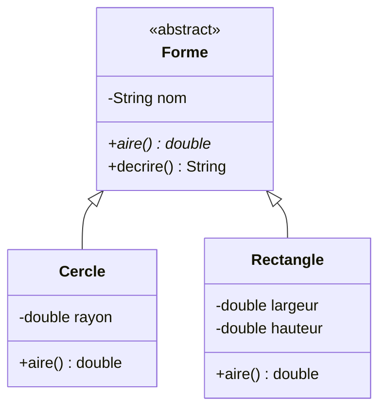
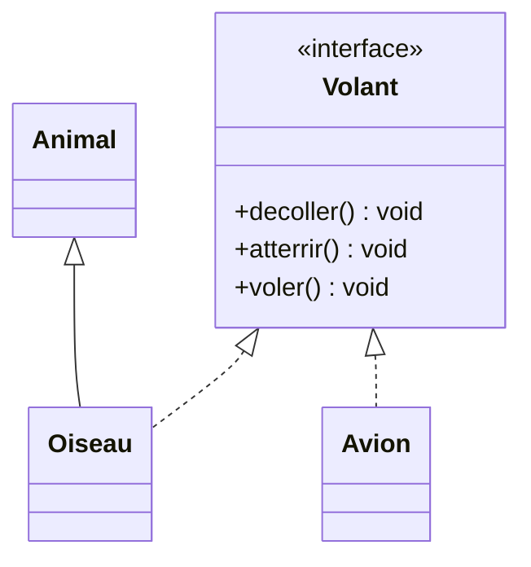

# 12. Classes abstraites et interfaces

<mark style="color:blue;">**Dire ce qu'un objet doit savoir faire, sans forcément dire comment.**</mark>

&#x20;


**En bref**

Une **classe abstraite** est un modèle **incomplet** : on ne peut pas l'instancier, et elle peut déclarer des méthodes **sans corps** que les sous-classes doivent écrire. Une **interface** est un **contrat** : une liste de méthodes qu'une classe s'engage à fournir avec `implements`. Une classe n'a qu'un parent, mais peut implémenter **plusieurs** interfaces.


&#x20;

***

&#x20;

## <mark style="color:purple;">01</mark> · Les classes abstraites

&#x20;

Au chapitre précédent, on avait une classe `Forme` avec une méthode `aire()`. Mais que renvoyer pour une « forme » en général ? Rien de sensé : une forme **abstraite** n'a pas d'aire. Seuls un cercle ou un rectangle en ont une.

&#x20;


```java
public abstract class Forme {

    private final String nom;

    protected Forme(String nom) {
        this.nom = nom;
    }

    public abstract double aire();          // pas de corps : à écrire par les sous-classes

    public String decrire() {               // méthode concrète, héritée telle quelle
        return nom + " d'aire " + aire();
    }
}
```


&#x20;


```java
public class Cercle extends Forme {

    private final double rayon;

    public Cercle(double rayon) {
        super("Cercle");
        this.rayon = rayon;
    }

    @Override
    public double aire() {
        return Math.PI * rayon * rayon;
    }
}
```


&#x20;



&#x20;

En UML, une méthode abstraite est marquée d'un `*` (ou en italique).

&#x20;

| Règle                                                                 | Conséquence                                            |
| --------------------------------------------------------------------- | ------------------------------------------------------ |
| Une classe `abstract` **ne peut pas être instanciée**                 | `new Forme("x")` ne compile pas                        |
| Une méthode `abstract` n'a **pas de corps**                           | Elle se termine par `;`                                |
| Une classe avec une méthode abstraite **doit** être `abstract`        | Sinon, erreur de compilation                           |
| Une sous-classe concrète **doit** redéfinir toutes les méthodes abstraites | Sinon, elle doit être `abstract` elle aussi       |
| Une classe abstraite peut avoir des attributs, constructeurs, méthodes concrètes | Elle **factorise** le code commun            |

&#x20;

### L'analogie du formulaire à compléter

&#x20;

Une classe abstraite, c'est un **formulaire pré-rempli** : l'en-tête, la mise en page et certaines rubriques sont déjà faites, mais quelques cases restent **vides**. Chaque personne (sous-classe) **doit** remplir ces cases avant que le formulaire soit valable (instanciable).

&#x20;

***

&#x20;

## <mark style="color:purple;">02</mark> · Les interfaces

&#x20;

Une **interface** décrit **ce qu'un objet sait faire**, sans rien dire de ce qu'il **est**. Des classes sans aucun lien de parenté peuvent la respecter.

&#x20;


```java
public interface Volant {

    void decoller();                   // implicitement public et abstract
    void atterrir();

    default void voler() {             // méthode par défaut : un corps fourni
        decoller();
        System.out.println("… en vol …");
        atterrir();
    }
}
```


&#x20;

```java
public class Oiseau extends Animal implements Volant {
    @Override public void decoller() { System.out.println("Battement d'ailes"); }
    @Override public void atterrir() { System.out.println("Se pose sur une branche"); }
}

public class Avion implements Volant {
    @Override public void decoller() { System.out.println("Moteurs à fond"); }
    @Override public void atterrir() { System.out.println("Train d'atterrissage sorti"); }
}
```

&#x20;



&#x20;

En UML, `implements` se dessine avec une flèche **en pointillés**.

&#x20;

### L'analogie du permis

&#x20;

Une interface, c'est comme un **brevet de pilote** : un oiseau et un avion n'ont rien en commun (l'un est un animal, l'autre une machine), mais tous deux « **savent voler** ». Celui qui a besoin de quelque chose qui vole ne demande pas **ce que tu es**, seulement si tu as **le brevet**.

&#x20;

```java
public static void faireVoler(Volant v) {    // accepte tout ce qui implémente Volant
    v.voler();
}

faireVoler(new Oiseau());
faireVoler(new Avion());
```

&#x20;

### Ce qu'une interface peut contenir

&#x20;

| Élément                     | Exemple                                    | Remarque                                       |
| --------------------------- | ------------------------------------------ | ---------------------------------------------- |
| Méthodes abstraites         | `void decoller();`                         | Implicitement `public abstract`                |
| Méthodes `default`          | `default void voler() { … }`               | Corps fourni, redéfinissable (Java 8+)         |
| Méthodes `static`           | `static Volant planeur() { … }`            | Appelées par `Volant.planeur()`                |
| Constantes                  | `int ALTITUDE_MAX = 12000;`                | Implicitement `public static final`            |
| Attributs d'instance        | —                                          | <mark style="color:red;">**Interdits**</mark>  |
| Constructeurs               | —                                          | <mark style="color:red;">**Interdits**</mark>  |

&#x20;

***

&#x20;

## <mark style="color:purple;">03</mark> · Classe abstraite ou interface ?

&#x20;

|                                   | Classe abstraite                          | Interface                                   |
| --------------------------------- | ----------------------------------------- | ------------------------------------------- |
| Relation exprimée                 | « **est un** » (famille)                  | « **sait faire** » (capacité)               |
| Combien par classe ?              | **Une seule** (`extends`)                 | **Plusieurs** (`implements A, B, C`)        |
| Attributs d'instance              | Oui                                       | Non (seulement des constantes)              |
| Constructeurs                     | Oui                                       | Non                                         |
| Méthodes avec corps               | Oui                                       | Oui, avec `default` ou `static`             |
| Quand l'utiliser                  | Partager du **code et de l'état** dans une famille | Définir un **contrat** commun à des classes sans lien |

&#x20;


**Règle pratique** — commence par une **interface**. Ajoute une classe abstraite seulement si plusieurs classes qui implémentent l'interface partagent du **code** ou des **attributs**.


&#x20;

***

&#x20;

## <mark style="color:purple;">04</mark> · Une interface indispensable : `Comparable`

&#x20;

Pour que `Arrays.sort` sache trier tes objets, ils doivent être **comparables**. L'interface `Comparable<T>` impose une méthode `compareTo` qui renvoie :

&#x20;

* un nombre **négatif** si `this` vient **avant** l'autre ;
* **0** s'ils sont équivalents ;
* un nombre **positif** si `this` vient **après**.

&#x20;


```java
public class Etudiant implements Comparable<Etudiant> {

    private final String nom;
    private final double moyenne;

    public Etudiant(String nom, double moyenne) {
        this.nom = nom;
        this.moyenne = moyenne;
    }

    @Override
    public int compareTo(Etudiant autre) {
        return Double.compare(this.moyenne, autre.moyenne);   // ordre croissant des moyennes
    }

    @Override
    public String toString() {
        return nom + " (" + moyenne + ")";
    }
}
```


&#x20;

```java
Etudiant[] classe = {
    new Etudiant("Alice", 5.2),
    new Etudiant("Bob", 4.1),
    new Etudiant("Chloé", 5.8)
};
Arrays.sort(classe);
System.out.println(Arrays.toString(classe));
// [Bob (4.1), Alice (5.2), Chloé (5.8)]
```

&#x20;


`String`, `Integer`, `Double`… implémentent déjà `Comparable` : c'est pour ça que `Arrays.sort` sait les trier. Pour trier selon **un autre critère** sans modifier la classe, on utilise un `Comparator` (chapitre 13).


&#x20;

***

&#x20;

## <mark style="color:purple;">05</mark> · Les interfaces fonctionnelles

&#x20;

Une interface qui ne contient **qu'une seule méthode abstraite** est dite **fonctionnelle**. On peut l'annoter `@FunctionalInterface` :

&#x20;

```java
@FunctionalInterface
public interface Operation {
    int appliquer(int a, int b);
}
```

&#x20;

Ces interfaces sont la base des **expressions lambda**, qui permettent d'écrire une implémentation en une ligne : `Operation somme = (a, b) -> a + b;`. C'est le sujet du [chapitre 13](13-genericite-expressions-lambda.md).

&#x20;

***

&#x20;

## <mark style="color:purple;">06</mark> · En résumé

&#x20;


* **Classe abstraite** (`abstract class`) : non instanciable, peut contenir des méthodes `abstract` (sans corps) que les sous-classes concrètes **doivent** redéfinir.
* **Interface** : un **contrat** ; une classe l'implémente avec `implements` et peut en implémenter **plusieurs**.
* Interface : méthodes abstraites, `default`, `static` et constantes — **pas** d'attributs d'instance ni de constructeurs.
* Abstraite = « **est un** » + code partagé ; interface = « **sait faire** ».
* `Comparable<T>` + `compareTo` rend des objets triables ; une interface à une seule méthode est **fonctionnelle**.


&#x20;

***

&#x20;

## <mark style="color:purple;">07</mark> · Exercices

&#x20;


**Sur papier, sans ordinateur.** Écris tes réponses à la main, puis ouvre la solution pour corriger.


&#x20;

### Exercice 1 — Le compilateur, encore toi

&#x20;

On reprend `Forme` (abstraite, avec `abstract double aire()`), `Cercle` (concrète) et l'interface `Volant` de ce chapitre. Pour chaque ligne ou bloc, dis s'il **compile** et justifie.

&#x20;

```java
1.  Forme f = new Forme("x");
2.  Forme f = new Cercle(2.0);
3.  Volant v = new Volant();
4.  Volant v = new Avion();
5.  class Carre extends Forme { }
6.  abstract class Polygone extends Forme { }
7.  class Drone implements Volant {
        public void decoller() { }
    }
8.  class Canard extends Animal implements Volant, Comparable<Canard> { … }   // toutes les méthodes écrites
9.  class Hydravion extends Avion, Bateau { … }
```

&#x20;

<details>

<summary>Solution</summary>

&#x20;

| #  | Compile ? | Pourquoi                                                                      |
| -- | --------- | ----------------------------------------------------------------------------- |
| 1  | Non       | Une classe abstraite ne s'instancie pas                                       |
| 2  | Oui       | `Cercle` est concrète, et un `Cercle` **est une** `Forme`                     |
| 3  | Non       | Une interface ne s'instancie pas                                              |
| 4  | Oui       | `Avion` implémente `Volant`                                                   |
| 5  | Non       | `Carre` est concrète mais ne redéfinit pas `aire()`                           |
| 6  | Oui       | `Polygone` est abstraite : elle peut laisser `aire()` à ses sous-classes      |
| 7  | Non       | `atterrir()` n'est pas écrite (`voler()` a un corps `default`, donc pas obligatoire) |
| 8  | Oui       | Un parent et **plusieurs** interfaces, c'est permis                           |
| 9  | Non       | Une classe n'a qu'**un seul** parent                                          |

&#x20;

</details>

&#x20;

### Exercice 2 — Tout ce qui se paie

&#x20;

1. Écris **à la main** une interface `Payable` avec une méthode `double montantAPayer()`.
2. Écris deux classes **sans lien** qui l'implémentent :
   * `Facture` (numéro, quantité, prix unitaire) : montant = quantité × prix unitaire ;
   * `Salarie` (nom, salaire mensuel) : montant = salaire mensuel.
3. Écris `static double total(Payable[] aPayer)`.
4. Calcule à la main `total` pour : une facture de 3 articles à 19.90, une facture de 1 article à 250.00, et un salarié à 5200.00.
5. Pourquoi ne pas avoir utilisé une classe abstraite `Payable` ?

&#x20;

<details>

<summary>Solution</summary>

&#x20;


```java
public interface Payable {
    double montantAPayer();
}
```


&#x20;


```java
public class Facture implements Payable {

    private final String numero;
    private final int quantite;
    private final double prixUnitaire;

    public Facture(String numero, int quantite, double prixUnitaire) {
        this.numero = numero;
        this.quantite = quantite;
        this.prixUnitaire = prixUnitaire;
    }

    @Override
    public double montantAPayer() {
        return quantite * prixUnitaire;
    }
}
```


&#x20;


```java
public class Salarie implements Payable {

    private final String nom;
    private final double salaireMensuel;

    public Salarie(String nom, double salaireMensuel) {
        this.nom = nom;
        this.salaireMensuel = salaireMensuel;
    }

    @Override
    public double montantAPayer() {
        return salaireMensuel;
    }
}
```


&#x20;

```java
public static double total(Payable[] aPayer) {
    double somme = 0;
    for (Payable p : aPayer) {
        somme += p.montantAPayer();
    }
    return somme;
}
```

&#x20;

**Calcul :** 3 × 19.90 = 59.70 ; 1 × 250.00 = 250.00 ; salarié 5200.00. Total = **5509.70**.

&#x20;

**Pourquoi une interface ?** Une facture et un salarié n'ont **rien en commun** (ni attributs, ni code) : ils partagent seulement une **capacité**, « avoir un montant à payer ». De plus, `Salarie` pourrait déjà hériter d'une classe `Personne` : avec une classe abstraite, il ne pourrait pas avoir deux parents.

&#x20;

</details>

&#x20;

<mark style="color:green;">**→ Suite :**</mark> [13. Généricité et expressions lambda](13-genericite-expressions-lambda.md)
