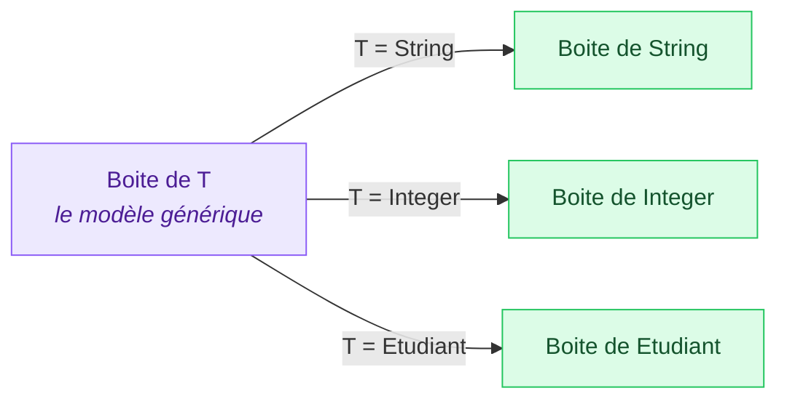
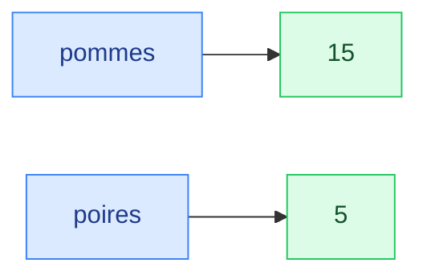
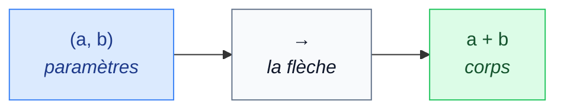
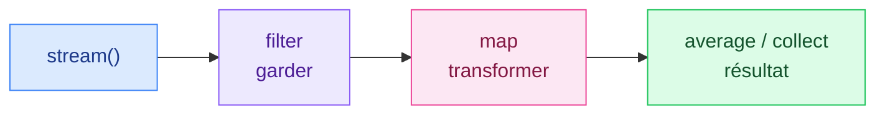

# 13. Généricité et expressions lambda

<mark style="color:blue;">**Du code qui marche pour tous les types, et des fonctions qu'on passe comme des valeurs.**</mark>

&#x20;


**En bref**

La **généricité** permet d'écrire une classe ou une méthode avec un **type en paramètre** (`Boite<T>`, `List<String>`) : le compilateur vérifie les types et les casts disparaissent. Une **expression lambda** (`x -> x * 2`) est une fonction courte qu'on passe en argument ; elle implémente une **interface fonctionnelle**.


&#x20;

***

&#x20;

## <mark style="color:purple;">01</mark> · Le problème sans généricité

&#x20;

Imaginons une boîte capable de contenir **n'importe quoi** :

&#x20;

```java
public class BoiteObjet {
    private Object contenu;

    public BoiteObjet(Object contenu) { this.contenu = contenu; }
    public Object get() { return contenu; }
}
```

&#x20;

```java
BoiteObjet b = new BoiteObjet("Bonjour");
String s = (String) b.get();       // cast obligatoire
Integer n = (Integer) b.get();     // compile… mais ClassCastException à l'exécution !
```

&#x20;

Le compilateur ne sait pas **ce qu'il y a** dans la boîte : l'erreur n'apparaît qu'à l'exécution, peut-être chez l'utilisateur.

&#x20;

***

&#x20;

## <mark style="color:purple;">02</mark> · Les classes génériques

&#x20;

On ajoute un **paramètre de type** `T` entre chevrons :

&#x20;


```java
public class Boite<T> {

    private T contenu;

    public Boite(T contenu) {
        this.contenu = contenu;
    }

    public T get() {
        return contenu;
    }

    public void set(T contenu) {
        this.contenu = contenu;
    }
}
```


&#x20;

```java
Boite<String> b = new Boite<>("Bonjour");   // T = String ; <> : le type est déduit
String s = b.get();                          // plus de cast
Integer n = b.get();                         // ERREUR de compilation : détectée tout de suite
b.set(42);                                   // ERREUR de compilation
```

&#x20;



&#x20;

### L'analogie des bocaux étiquetés

&#x20;

Un bocal sans étiquette (`Object`) : il faut l'ouvrir et goûter pour savoir si c'est du sel ou du sucre. Un bocal **étiqueté** « sucre » (`Boite<Sucre>`) : on sait ce qu'il contient, et on refuse d'y verser du sel.

&#x20;


**Conventions de nommage** — une seule majuscule : `T` (type), `E` (élément d'une collection), `K` et `V` (clé et valeur), `R` (résultat). Plusieurs paramètres : `Paire<A, B>`.


&#x20;

***

&#x20;

## <mark style="color:purple;">03</mark> · Les méthodes génériques et les bornes

&#x20;

Une méthode peut avoir ses propres paramètres de type, déclarés **avant** le type de retour :

&#x20;

```java
public static <T> T dernier(T[] tableau) {
    return tableau[tableau.length - 1];
}

String s = dernier(new String[] {"a", "b", "c"});   // T = String, déduit
Integer n = dernier(new Integer[] {1, 2, 3});       // T = Integer
```

&#x20;

### Borner le type

&#x20;

Pour trouver le maximum, il faut pouvoir **comparer** : on exige que `T` implémente `Comparable` avec `extends` :

&#x20;

```java
public static <T extends Comparable<T>> T max(T[] tableau) {
    T max = tableau[0];
    for (T element : tableau) {
        if (element.compareTo(max) > 0) {
            max = element;
        }
    }
    return max;
}
```

&#x20;

`max` fonctionne pour des `Integer`, des `String`, des `Etudiant` (s'ils implémentent `Comparable`, voir [chapitre 12](12-classes-abstraites-interfaces.md))… mais pas pour une classe non comparable : le compilateur refuse.

&#x20;

<details>

<summary>Pour aller plus loin : les jokers ? extends et ? super</summary>

&#x20;

`List<Integer>` n'est **pas** un sous-type de `List<Number>`, même si `Integer` est un sous-type de `Number`. Pour écrire une méthode plus souple, on utilise des **jokers** :

&#x20;

| Écriture                  | Signifie                                  | On peut…                  |
| ------------------------- | ----------------------------------------- | ------------------------- |
| `List<? extends Number>`  | une liste de `Number` **ou d'un sous-type** | **lire** des `Number`    |
| `List<? super Integer>`   | une liste d'`Integer` **ou d'un super-type** | **ajouter** des `Integer` |

&#x20;

```java
public static double somme(List<? extends Number> nombres) {
    double s = 0;
    for (Number n : nombres) {
        s += n.doubleValue();
    }
    return s;          // accepte List<Integer>, List<Double>…
}
```

&#x20;

Mnémotechnique : **PECS** — _Producer Extends, Consumer Super_.

&#x20;

</details>

&#x20;

***

&#x20;

## <mark style="color:purple;">04</mark> · Les collections génériques

&#x20;

Le cas d'usage n°1 de la généricité : les **collections** de `java.util`, qui remplacent souvent les tableaux.

&#x20;

### `List` et `ArrayList` : une liste qui grandit

&#x20;

```java
List<String> courses = new ArrayList<>();
courses.add("pain");
courses.add("lait");
courses.add(0, "café");              // insère en position 0

courses.get(1);                      // "pain"
courses.size();                      // 3
courses.contains("lait");            // true
courses.remove("pain");              // [café, lait]

for (String article : courses) {
    System.out.println(article);
}
```

&#x20;

| | Tableau `String[]` | `ArrayList<String>` |
| --- | --- | --- |
| Taille | **Fixe** | **Grandit** et rétrécit |
| Accès | `t[i]` | `liste.get(i)` |
| Taille actuelle | `t.length` | `liste.size()` |
| Types primitifs | Oui (`int[]`) | Non : wrappers (`List<Integer>`) |

&#x20;

### `Map` et `HashMap` : un dictionnaire clé → valeur

&#x20;

```java
Map<String, Integer> stock = new HashMap<>();
stock.put("pommes", 12);
stock.put("poires", 5);
stock.put("pommes", 15);                  // remplace la valeur de "pommes"

stock.get("poires");                      // 5
stock.get("kiwis");                       // null : clé absente
stock.getOrDefault("kiwis", 0);           // 0
stock.containsKey("pommes");              // true

for (Map.Entry<String, Integer> entree : stock.entrySet()) {
    System.out.println(entree.getKey() + " : " + entree.getValue());
}
```

&#x20;



&#x20;

Comme un **dictionnaire** : on cherche un mot (la **clé**, unique) pour trouver sa définition (la **valeur**).

&#x20;

***

&#x20;

## <mark style="color:purple;">05</mark> · Les limites de la généricité

&#x20;

| Interdit                                   | Pourquoi                                                  | À la place                     |
| ------------------------------------------ | --------------------------------------------------------- | ------------------------------ |
| `List<int>`                                | Les paramètres de type sont des **objets**                | `List<Integer>` (autoboxing)   |
| `new T()`                                  | Le type réel n'est plus connu à l'exécution               | Passer l'objet en paramètre    |
| `new T[10]`                                | Même raison                                               | Utiliser une `List<T>`         |
| `if (x instanceof List<String>)`           | Même raison                                               | `instanceof List<?>`           |

&#x20;


**Effacement de type** (_type erasure_) — les génériques n'existent **qu'à la compilation**. Une fois vérifiés, `Boite<String>` et `Boite<Integer>` deviennent la même classe `Boite` dans le bytecode. D'où les limites ci-dessus.


&#x20;

***

&#x20;

## <mark style="color:purple;">06</mark> · Les expressions lambda

&#x20;

### La motivation

&#x20;

Pour trier une liste d'étudiants par nom, il faut donner à `sort` **une façon de comparer**. Avant Java 8, il fallait une classe anonyme :

&#x20;



```java
etudiants.sort(new Comparator<Etudiant>() {
    @Override
    public int compare(Etudiant a, Etudiant b) {
        return a.getNom().compareTo(b.getNom());
    }
});
```



```java
etudiants.sort((a, b) -> a.getNom().compareTo(b.getNom()));
```



```java
etudiants.sort(Comparator.comparing(Etudiant::getNom));
```



&#x20;

Les trois versions font **exactement** la même chose.

&#x20;

### La syntaxe

&#x20;



&#x20;

| Forme                                   | Exemple                                          |
| --------------------------------------- | ------------------------------------------------ |
| Aucun paramètre                         | `() -> System.out.println("Salut")`              |
| Un paramètre (parenthèses facultatives) | `x -> x * 2`                                     |
| Plusieurs paramètres                    | `(a, b) -> a + b`                                |
| Types explicites                        | `(int a, int b) -> a + b`                        |
| Corps de plusieurs lignes               | `x -> { int y = x * 2; return y + 1; }`          |

&#x20;

### L'analogie du mode d'emploi

&#x20;

Une lambda, c'est un **petit mode d'emploi** qu'on glisse à quelqu'un : « pour comparer deux étudiants, regarde leur nom ». La méthode `sort` sait trier ; toi, tu lui dis seulement **selon quoi**.

&#x20;

### Les interfaces fonctionnelles standard

&#x20;

Une lambda implémente toujours une **interface fonctionnelle** (une seule méthode abstraite). Java en fournit dans `java.util.function` :

&#x20;

| Interface               | Méthode               | Reçoit → renvoie        | Exemple                                      |
| ----------------------- | --------------------- | ----------------------- | -------------------------------------------- |
| `Predicate<T>`          | `test(T)`             | `T` → `boolean`         | `s -> s.isEmpty()`                           |
| `Function<T, R>`        | `apply(T)`            | `T` → `R`               | `s -> s.length()`                            |
| `Consumer<T>`           | `accept(T)`           | `T` → rien              | `s -> System.out.println(s)`                 |
| `Supplier<T>`           | `get()`               | rien → `T`              | `() -> Math.random()`                        |
| `BiFunction<T, U, R>`   | `apply(T, U)`         | `T`, `U` → `R`          | `(a, b) -> a * b`                            |
| `UnaryOperator<T>`      | `apply(T)`            | `T` → `T`               | `s -> s.toUpperCase()`                       |
| `Comparator<T>`         | `compare(T, T)`       | `T`, `T` → `int`        | `(a, b) -> a.length() - b.length()`          |

&#x20;

```java
Predicate<Integer> estPair = n -> n % 2 == 0;
Function<String, Integer> longueur = s -> s.length();

estPair.test(4);            // true
longueur.apply("HEIA");     // 4
```

&#x20;

### Les références de méthodes

&#x20;

Quand une lambda ne fait **qu'appeler une méthode existante**, on peut l'écrire encore plus court avec `::` :

&#x20;

| Lambda                              | Référence de méthode    |
| ----------------------------------- | ----------------------- |
| `s -> s.length()`                   | `String::length`        |
| `s -> System.out.println(s)`        | `System.out::println`   |
| `s -> Integer.parseInt(s)`          | `Integer::parseInt`     |
| `() -> new ArrayList<>()`           | `ArrayList::new`        |

&#x20;

### Les lambdas au quotidien

&#x20;

```java
List<String> noms = new ArrayList<>(List.of("Chloé", "alice", "Bob", "david"));

noms.forEach(System.out::println);                          // afficher chaque élément
noms.removeIf(n -> n.length() <= 3);                        // supprimer "Bob"
noms.sort(String::compareToIgnoreCase);                     // trier sans tenir compte de la casse
noms.replaceAll(String::toUpperCase);                       // tout en majuscules

etudiants.sort(Comparator.comparing(Etudiant::getMoyenne).reversed());   // meilleure moyenne d'abord
```

&#x20;


**Variables capturées** — une lambda peut utiliser une variable locale extérieure, à condition qu'elle ne soit **plus jamais modifiée** (_effectivement finale_). Sinon, erreur de compilation.

```java
int seuil = 4;
etudiants.removeIf(e -> e.getMoyenne() < seuil);   // OK
seuil = 5;                                         // rend la ligne précédente invalide
```


&#x20;

<details>

<summary>Pour aller plus loin : un aperçu des streams</summary>

&#x20;

Les **streams** enchaînent des opérations sur une collection, en combinant des lambdas :

&#x20;

```java
double moyenneReussis = etudiants.stream()
        .filter(e -> e.getMoyenne() >= 4.0)     // garder les réussis
        .mapToDouble(Etudiant::getMoyenne)      // ne garder que leur moyenne
        .average()                              // calculer la moyenne
        .orElse(0.0);                           // 0 si personne n'a réussi
```

&#x20;



&#x20;

</details>

&#x20;

***

&#x20;

## <mark style="color:purple;">07</mark> · En résumé

&#x20;


* **Généricité** : un type en paramètre (`Boite<T>`) ; erreurs de type détectées **à la compilation**, plus de casts.
* Méthode générique : `<T>` avant le type de retour ; borne : `<T extends Comparable<T>>`.
* Collections : `ArrayList<E>` (liste qui grandit), `HashMap<K, V>` (clé → valeur) ; **pas de primitifs**, on utilise les wrappers.
* **Lambda** : `(paramètres) -> corps`, implémente une **interface fonctionnelle** (`Predicate`, `Function`, `Consumer`, `Supplier`, `Comparator`…).
* **Référence de méthode** : `Classe::methode` quand la lambda ne fait qu'appeler une méthode.


&#x20;

***

&#x20;

## <mark style="color:purple;">08</mark> · Exercices

&#x20;


**Sur papier, sans ordinateur.** Écris tes réponses à la main, puis ouvre la solution pour corriger.


&#x20;

### Exercice 1 — Lire des lambdas

&#x20;

**a)** Qu'affiche ce code ?

&#x20;


```java
List<String> mots = new ArrayList<>(List.of("java", "lambda", "code", "generique", "api"));
mots.removeIf(m -> m.length() <= 3);
mots.sort(Comparator.comparing(String::length));
System.out.println(mots);

Function<String, Integer> longueur = String::length;
BiFunction<Integer, Integer, Integer> somme = (a, b) -> a + b;
Predicate<String> commenceParC = s -> s.startsWith("c");
System.out.println(longueur.apply("HEIA") + " " + somme.apply(2, 3) + " " + commenceParC.test("code"));
```


&#x20;

(Le tri de `List.sort` est **stable** : deux éléments égaux gardent leur ordre d'origine.)

&#x20;

**b)** Ces lignes compilent-elles ?

&#x20;

```java
1.  List<int> nombres = new ArrayList<>();
2.  List<Integer> nombres = new ArrayList<>();  nombres.add(3);
3.  List<Integer> nombres = new ArrayList<>();  nombres.add("3");
4.  Boite<String> b = new Boite<>("x");  Integer i = b.get();
5.  Predicate<String> vide = s -> s.isEmpty();
6.  Function<String> f = s -> s.length();
```

&#x20;

<details>

<summary>Solution</summary>

&#x20;

**a)**

```
[java, code, lambda, generique]
4 5 true
```

&#x20;

* `removeIf` retire les mots de 3 lettres ou moins : seulement `"api"`.
* Tri par longueur : `java` (4) et `code` (4) gardent leur ordre, puis `lambda` (6), puis `generique` (9).
* `longueur.apply("HEIA")` = 4 ; `somme.apply(2, 3)` = 5 ; `"code"` commence par `c` : `true`.

&#x20;

**b)**

&#x20;

| #  | Compile ? | Pourquoi                                                          |
| -- | --------- | ----------------------------------------------------------------- |
| 1  | Non       | Pas de type primitif en paramètre de type : `List<Integer>`       |
| 2  | Oui       | Autoboxing de `3` en `Integer`                                    |
| 3  | Non       | `"3"` est un `String`, pas un `Integer`                           |
| 4  | Non       | `b.get()` renvoie un `String`                                     |
| 5  | Oui       | `String` → `boolean`                                              |
| 6  | Non       | `Function` a **deux** paramètres de type : `Function<String, Integer>` |

&#x20;

</details>

&#x20;

### Exercice 2 — Une paire générique et des lambdas

&#x20;

1. Écris **à la main** une classe générique `Paire<A, B>` avec deux attributs `premier` et `second`, un constructeur, deux getters, et une méthode `inverser()` qui renvoie une **nouvelle** paire où les deux éléments sont échangés. Quel est son type de retour ?
2. On dispose d'une `List<Etudiant> classe`, où `Etudiant` a les méthodes `getNom()` et `getMoyenne()`. Écris **une ligne** pour chacune de ces actions :
   * trier la liste de la **meilleure** à la moins bonne moyenne ;
   * créer un `Predicate<Etudiant>` nommé `reussi` (moyenne d'au moins 4.0) ;
   * supprimer de la liste tous les étudiants **en échec**, en réutilisant `reussi` ;
   * afficher le nom de chaque étudiant restant.

&#x20;

<details>

<summary>Solution</summary>

&#x20;


```java
public class Paire<A, B> {

    private final A premier;
    private final B second;

    public Paire(A premier, B second) {
        this.premier = premier;
        this.second = second;
    }

    public A getPremier() {
        return premier;
    }

    public B getSecond() {
        return second;
    }

    public Paire<B, A> inverser() {
        return new Paire<>(second, premier);
    }
}
```


&#x20;

Le type de retour de `inverser()` est **`Paire<B, A>`** : les types sont échangés, eux aussi. Exemple : une `Paire<String, Integer>` ("Alice", 20) devient une `Paire<Integer, String>` (20, "Alice").

&#x20;

```java
classe.sort(Comparator.comparing(Etudiant::getMoyenne).reversed());
Predicate<Etudiant> reussi = e -> e.getMoyenne() >= 4.0;
classe.removeIf(reussi.negate());
classe.forEach(e -> System.out.println(e.getNom()));
```

&#x20;

`reussi.negate()` construit le prédicat **inverse** (« en échec »). On aurait aussi pu écrire `classe.removeIf(e -> e.getMoyenne() < 4.0);`.

&#x20;

</details>

&#x20;

<mark style="color:green;">**→ Suite :**</mark> [14. Enum, annotations, RSA et limitations](14-enum-annotations-rsa-limitations.md)
