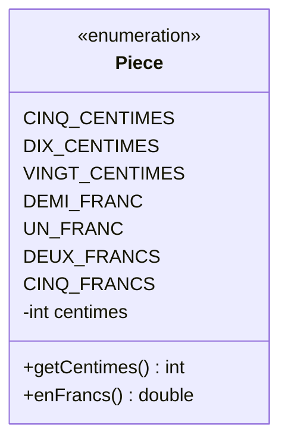

# 14. Enum, annotations, RSA et limitations

<mark style="color:blue;">**Des types aux valeurs fixées, des étiquettes pour le compilateur, et les limites des nombres.**</mark>

&#x20;


**En bref**

Un **`enum`** définit un type dont les valeurs possibles sont **fixées et nommées** (`LUNDI`, `MARDI`…). Une **annotation** (`@Override`, `@Deprecated`…) est une **étiquette** posée sur le code, lue par le compilateur ou par des outils. Enfin, l'algorithme de chiffrement **RSA** montre les **limites** des types `int`, `long` et `double`, et comment `BigInteger` les dépasse.


&#x20;


**Section RSA rédigée sans le support s14.** L'intitulé « RSA et limitations » a été interprété comme l'étude de RSA pour illustrer les limites des types numériques. Cette partie sera ajustée dès réception du support de cours.


&#x20;

***

&#x20;

## <mark style="color:purple;">01</mark> · Les énumérations

&#x20;

### Le problème des constantes entières

&#x20;

```java
public static final int LUNDI = 1;
public static final int MARDI = 2;
// …
int jour = 42;           // compile, mais ne veut rien dire
planifier(3, 1);         // quel paramètre est le jour ? le mois ?
```

&#x20;

Rien n'empêche une valeur absurde, et le code se lit mal.

&#x20;

### La solution : `enum`

&#x20;

```java
public enum Jour {
    LUNDI, MARDI, MERCREDI, JEUDI, VENDREDI, SAMEDI, DIMANCHE
}
```

&#x20;

```java
Jour j = Jour.MERCREDI;
Jour k = 42;                 // ERREUR de compilation : seules les 7 valeurs existent
```

&#x20;

Un `enum` est une classe spéciale dont les **seules instances possibles** sont celles listées. Elles sont créées une fois pour toutes, au chargement de la classe.

&#x20;

### L'analogie du menu déroulant

&#x20;

Un champ texte libre accepte n'importe quoi (« mecredi », « 42 »…). Un **menu déroulant** ne propose que des choix **valides**. Un `enum`, c'est le menu déroulant du code.

&#x20;

### Les méthodes fournies

&#x20;

| Méthode                   | Rôle                                           | Exemple                               | Résultat              |
| ------------------------- | ---------------------------------------------- | ------------------------------------- | --------------------- |
| `values()`                | Tableau de toutes les valeurs, dans l'ordre    | `Jour.values().length`                | `7`                   |
| `ordinal()`               | Position (à partir de 0)                       | `Jour.MERCREDI.ordinal()`             | `2`                   |
| `name()` / `toString()`   | Nom de la constante                            | `Jour.MERCREDI.name()`                | `"MERCREDI"`          |
| `valueOf(String)`         | Texte → constante                              | `Jour.valueOf("LUNDI")`               | `Jour.LUNDI`          |
| `compareTo(autre)`        | Compare les positions                          | `Jour.LUNDI.compareTo(Jour.MARDI)`    | négatif               |

&#x20;

```java
for (Jour j : Jour.values()) {
    System.out.println(j.ordinal() + " : " + j);
}
```

&#x20;


**Comparer des enums avec `==`** est correct et recommandé : chaque constante n'existe qu'en **un seul exemplaire**. `Jour.valueOf("lundi")` lance une `IllegalArgumentException` (la casse compte).


&#x20;

### Avec `switch`

&#x20;

```java
String type = switch (j) {
    case SAMEDI, DIMANCHE -> "week-end";
    default -> "semaine";
};
```

&#x20;

Dans un `switch`, on écrit `SAMEDI` sans le préfixe `Jour.`.

&#x20;

***

&#x20;

## <mark style="color:purple;">02</mark> · Des enums avec attributs et méthodes

&#x20;

Un `enum` peut avoir des **attributs**, un **constructeur** (toujours privé) et des **méthodes** :

&#x20;


```java
public enum Piece {

    CINQ_CENTIMES(5),
    DIX_CENTIMES(10),
    VINGT_CENTIMES(20),
    DEMI_FRANC(50),
    UN_FRANC(100),
    DEUX_FRANCS(200),
    CINQ_FRANCS(500);                  // point-virgule avant la suite

    private final int centimes;

    Piece(int centimes) {              // implicitement private
        this.centimes = centimes;
    }

    public int getCentimes() {
        return centimes;
    }

    public double enFrancs() {
        return centimes / 100.0;
    }
}
```


&#x20;

```java
int total = 0;
Piece[] portemonnaie = {Piece.DEUX_FRANCS, Piece.DEMI_FRANC, Piece.DIX_CENTIMES};
for (Piece p : portemonnaie) {
    total += p.getCentimes();
}
System.out.println(total / 100.0 + " CHF");    // 2.6 CHF
```

&#x20;



&#x20;


**Quand utiliser un `enum` ?** Dès qu'une valeur ne peut prendre qu'un **ensemble fixe et connu** de possibilités : jours, mois, couleurs d'un jeu de cartes, états d'une commande (`EN_ATTENTE`, `EXPEDIEE`, `LIVREE`), niveaux de difficulté…


&#x20;

***

&#x20;

## <mark style="color:purple;">03</mark> · Les annotations

&#x20;

Une **annotation** commence par `@` et ajoute une **information** sur un élément du code (classe, méthode, attribut, paramètre). Elle ne change pas directement ce que fait le code : elle est lue par le **compilateur**, par des **outils**, ou par le programme lui-même.

&#x20;

### Les annotations standard

&#x20;

| Annotation                  | Rôle                                                                              |
| --------------------------- | --------------------------------------------------------------------------------- |
| `@Override`                 | « Cette méthode redéfinit une méthode héritée » — le compilateur **vérifie**      |
| `@Deprecated`               | « Ne plus utiliser » — le compilateur **avertit** ceux qui l'appellent            |
| `@SuppressWarnings("…")`    | Fait taire un avertissement précis du compilateur                                 |
| `@FunctionalInterface`      | « Cette interface n'a qu'une méthode abstraite » — le compilateur **vérifie**     |

&#x20;

```java
public class Calcul {

    /** @deprecated remplacée par {@link #moyenne(double[])} */
    @Deprecated
    public static double moy(double a, double b) {
        return (a + b) / 2;
    }

    @Override
    public String toString() {
        return "Calcul";
    }
}
```

&#x20;

### L'analogie des post-it

&#x20;

Une annotation, c'est un **post-it** collé sur le code : « attention, ancienne version », « vérifie que ceci redéfinit bien quelque chose ». Le code en dessous reste le même, mais ceux qui le lisent (le compilateur, un outil de test) savent quoi en faire.

&#x20;

### Des annotations lues par des outils

&#x20;

De nombreuses bibliothèques reposent sur des annotations. Par exemple, **JUnit** (tests unitaires) exécute toutes les méthodes marquées `@Test` :

&#x20;

```java
class CalculTest {

    @Test
    void moyenneDeDeuxNotes() {
        assertEquals(4.75, Calcul.moyenne(4.5, 5.0));
    }
}
```

&#x20;

<details>

<summary>Pour aller plus loin : déclarer sa propre annotation</summary>

&#x20;

```java
import java.lang.annotation.*;

@Retention(RetentionPolicy.RUNTIME)     // conservée jusqu'à l'exécution
@Target(ElementType.METHOD)             // se pose sur des méthodes
public @interface Auteur {
    String nom();
    String date() default "inconnue";
}
```

&#x20;

```java
@Auteur(nom = "Alice", date = "2026-09-28")
public void calculer() { … }
```

&#x20;

Un programme peut ensuite lire cette information par **réflexion** (`methode.getAnnotation(Auteur.class)`).

&#x20;

</details>

&#x20;

***

&#x20;

## <mark style="color:purple;">04</mark> · RSA : un algorithme qui dépasse les types primitifs

&#x20;

### Le principe en bref

&#x20;

**RSA** est un algorithme de **chiffrement asymétrique** : chacun possède une **clé publique** (pour chiffrer, donnée à tous) et une **clé privée** (pour déchiffrer, gardée secrète).

&#x20;


&#x20;



### Choisir deux nombres premiers

&#x20;

`p = 61` et `q = 53`, puis calculer `n = p × q = 3233` et `φ = (p − 1)(q − 1) = 3120`.



### Choisir l'exposant public `e`

&#x20;

Un nombre sans diviseur commun avec φ : `e = 17`. La **clé publique** est `(n, e) = (3233, 17)`.



### Calculer l'exposant privé `d`

&#x20;

Le nombre tel que `e × d mod φ = 1` : `d = 2753` (car 17 × 2753 = 46 801 = 15 × 3120 + 1). La **clé privée** est `(n, d) = (3233, 2753)`.



### Chiffrer, puis déchiffrer

&#x20;

Message `m = 65` : `c = 65^17 mod 3233 = 2790`. Puis `2790^2753 mod 3233 = 65`.

&#x20;

<mark style="color:green;">**On retrouve le message d'origine.**</mark>



&#x20;


La sécurité de RSA repose sur un fait simple : **multiplier** deux grands nombres premiers est facile, mais retrouver `p` et `q` à partir de `n` est extrêmement difficile. En pratique, `n` fait **2048 bits** ou plus (plus de 600 chiffres décimaux).


&#x20;

***

&#x20;

## <mark style="color:purple;">05</mark> · Les limites des types numériques

&#x20;

Essayons de chiffrer `m = 65` avec les types vus jusqu'ici :

&#x20;



```java
long c = 1;
for (int i = 0; i < 17; i++) {
    c = c * 65;             // 65^17 ≈ 6,6 × 10^30 : bien trop grand pour un long
}
System.out.println(c % 3233);   // résultat FAUX, sans aucun message d'erreur
```

&#x20;

Un `long` s'arrête à environ 9,2 × 10¹⁸ : le calcul **déborde en silence** (chapitre 2).



```java
double c = Math.pow(65, 17) % 3233;   // résultat FAUX
```

&#x20;

Un `double` peut représenter de très grands nombres, mais avec seulement **15 à 16 chiffres significatifs** : les derniers chiffres de 65¹⁷ sont perdus, et le reste de la division n'a plus de sens.



```java
import java.math.BigInteger;

BigInteger m = BigInteger.valueOf(65);
BigInteger e = BigInteger.valueOf(17);
BigInteger n = BigInteger.valueOf(3233);

BigInteger c = m.modPow(e, n);                            // 2790 : correct
BigInteger d = BigInteger.valueOf(2753);
System.out.println(c.modPow(d, n));                       // 65
```

&#x20;

`BigInteger` représente des entiers de **taille illimitée** (seulement limitée par la mémoire). `modPow` calcule `m^e mod n` sans jamais construire l'énorme nombre `m^e`.



&#x20;

### Récapitulatif des limites

&#x20;

| Type          | Limite                                          | Ce qui se passe au-delà                         |
| ------------- | ----------------------------------------------- | ----------------------------------------------- |
| `int`         | ±2,1 × 10⁹                                      | <mark style="color:red;">Débordement silencieux</mark> |
| `long`        | ±9,2 × 10¹⁸                                     | <mark style="color:red;">Débordement silencieux</mark> |
| `double`      | ~10³⁰⁸, mais **15-16 chiffres significatifs**   | <mark style="color:orange;">Perte de précision</mark> ; `0.1 + 0.2 != 0.3` |
| `BigInteger`  | Entiers de taille arbitraire                    | Plus lent, mais **exact**                       |
| `BigDecimal`  | Décimaux de précision arbitraire                | Plus lent, mais **exact** : indispensable pour l'**argent** |

&#x20;


**Ne jamais calculer de l'argent avec des `double`.** `0.1 + 0.2` donne `0.30000000000000004`. Sur des millions d'opérations bancaires, les centimes perdus s'accumulent. On utilise `BigDecimal`, ou des **centimes** stockés dans un `long` (comme l'enum `Piece` plus haut).


&#x20;

```java
import java.math.BigDecimal;

BigDecimal a = new BigDecimal("0.1");     // à partir d'un TEXTE, pas d'un double
BigDecimal b = new BigDecimal("0.2");
System.out.println(a.add(b));             // 0.3, exactement
```

&#x20;


**Détecter le débordement** — `Math.addExact(a, b)` et `Math.multiplyExact(a, b)` lancent une `ArithmeticException` au lieu de déborder en silence.


&#x20;

***

&#x20;

## <mark style="color:purple;">06</mark> · En résumé

&#x20;


* Un **`enum`** limite une variable à un **ensemble fixe** de constantes ; méthodes `values()`, `ordinal()`, `name()`, `valueOf()` ; comparaison avec `==` ; utilisable dans un `switch`.
* Un enum peut avoir **attributs, constructeur privé et méthodes**.
* Une **annotation** (`@Override`, `@Deprecated`, `@FunctionalInterface`, `@Test`…) est une **étiquette** lue par le compilateur ou des outils.
* **RSA** chiffre avec `m^e mod n` et déchiffre avec `c^d mod n` ; ses nombres dépassent de loin `int` et `long`.
* `int`/`long` **débordent en silence**, `double` **perd en précision** ; `BigInteger` et `BigDecimal` sont **exacts**. Jamais de `double` pour de l'argent.


&#x20;

***

&#x20;

## <mark style="color:purple;">07</mark> · Exercices

&#x20;


**Sur papier, sans ordinateur.** Écris tes réponses à la main, puis ouvre la solution pour corriger.


&#x20;

### Exercice 1 — Les feux de circulation

&#x20;


```java
public enum Feu {
    VERT(30), ORANGE(3), ROUGE(40);

    private final int duree;

    Feu(int duree) {
        this.duree = duree;
    }

    public int getDuree() {
        return duree;
    }

    public Feu suivant() {
        return switch (this) {
            case VERT -> ORANGE;
            case ORANGE -> ROUGE;
            case ROUGE -> VERT;
        };
    }
}
```


&#x20;

Qu'affiche ce code ?

&#x20;

```java
Feu f = Feu.ROUGE;
int total = 0;
for (int i = 0; i < 4; i++) {
    System.out.print(f + "(" + f.ordinal() + ") ");
    total += f.getDuree();
    f = f.suivant();
}
System.out.println();
System.out.println(total + " " + Feu.values().length + " " + (f == Feu.VERT));
```

&#x20;

<details>

<summary>Solution</summary>

&#x20;

```
ROUGE(2) VERT(0) ORANGE(1) ROUGE(2)
113 3 true
```

&#x20;

| Tour | `f` affiché | `ordinal()` | `total` après | `f` devient |
| ---- | ----------- | ----------- | ------------- | ----------- |
| 1    | ROUGE       | 2           | 40            | VERT        |
| 2    | VERT        | 0           | 70            | ORANGE      |
| 3    | ORANGE      | 1           | 73            | ROUGE       |
| 4    | ROUGE       | 2           | 113           | VERT        |

&#x20;

À la fin, `f` vaut `VERT` : `f == Feu.VERT` est `true` (comparer des enums avec `==` est correct).

&#x20;

</details>

&#x20;

### Exercice 2 — RSA à la main

&#x20;

On choisit `p = 5` et `q = 11`.

&#x20;

1. Calcule `n` et `φ = (p − 1)(q − 1)`.
2. On prend `e = 3`. Vérifie que `d = 27` convient, c'est-à-dire que `e × d mod φ = 1`.
3. **Chiffre** le message `m = 8` : calcule `c = 8³ mod n`.
4. **Déchiffre** `c` : calcule `c²⁷ mod n` par **carrés successifs** (calcule `c²`, `c⁴`, `c⁸`, `c¹⁶` modulo `n`, puis combine avec 27 = 16 + 8 + 2 + 1). Retrouves-tu 8 ?
5. Pourquoi `Math.pow(17, 27) % 55` ne donnerait-il **pas** le bon résultat en Java ?

&#x20;

<details>

<summary>Solution</summary>

&#x20;

**1.** `n = 5 × 11 = 55` et `φ = 4 × 10 = 40`.

&#x20;

**2.** `3 × 27 = 81 = 2 × 40 + 1`, donc `81 mod 40 = 1`. **`d = 27` convient.**

&#x20;

**3.** `8³ = 512` et `512 = 9 × 55 + 17`, donc **`c = 17`**.

&#x20;

**4.** Carrés successifs modulo 55 :

&#x20;

| Puissance | Calcul                  | Résultat mod 55 |
| --------- | ----------------------- | --------------- |
| `17¹`     | —                       | 17              |
| `17²`     | 17 × 17 = 289           | 289 − 275 = **14** |
| `17⁴`     | 14 × 14 = 196           | 196 − 165 = **31** |
| `17⁸`     | 31 × 31 = 961           | 961 − 935 = **26** |
| `17¹⁶`    | 26 × 26 = 676           | 676 − 660 = **16** |

&#x20;

27 = 16 + 8 + 2 + 1, donc `17²⁷ ≡ 16 × 26 × 14 × 17 (mod 55)` :

* 16 × 26 = 416 ≡ 416 − 385 = **31**
* 31 × 14 = 434 ≡ 434 − 385 = **49**
* 49 × 17 = 833 ≡ 833 − 825 = **8**

&#x20;

<mark style="color:green;">**On retrouve bien m = 8.**</mark>

&#x20;

**5.** `17²⁷` vaut environ 1,6 × 10³³. Un `double` le représente, mais avec seulement 15 à 16 chiffres significatifs : les derniers chiffres sont **faux**, donc le reste de la division par 55 aussi. Il faut `BigInteger.valueOf(17).modPow(BigInteger.valueOf(27), BigInteger.valueOf(55))`, qui fait exactement le calcul par carrés successifs de la question 4.

&#x20;

</details>

&#x20;

<mark style="color:green;">**→ Suite :**</mark> [15. Conventions de codage et bonnes pratiques](15-conventions-codage-bonnes-pratiques.md)
