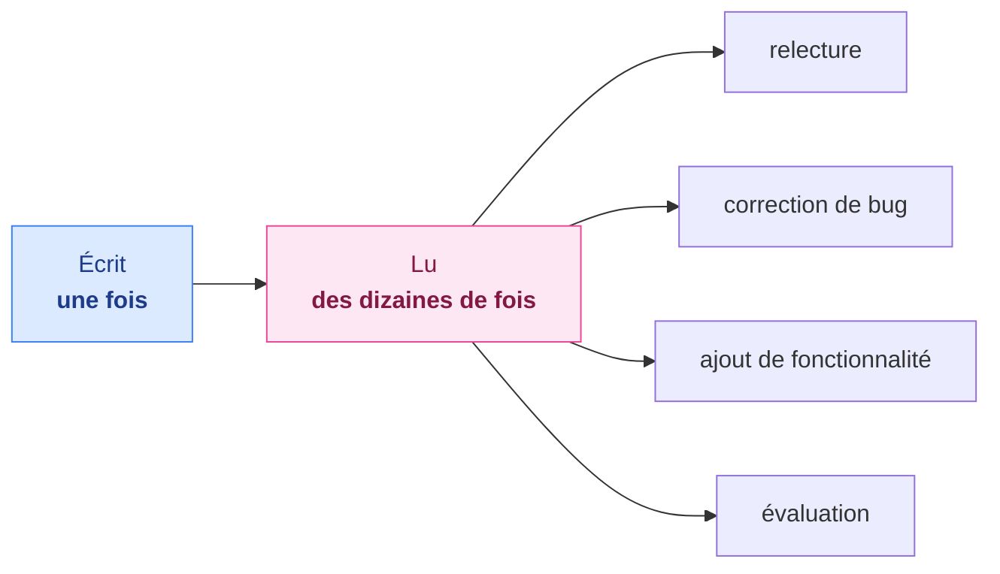
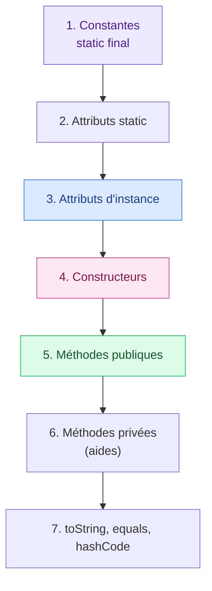

# 15. Conventions de codage et bonnes pratiques

<mark style="color:blue;">**Du code qui marche, c'est le minimum. Du code qu'on comprend, c'est le métier.**</mark>

&#x20;


**En bref**

Un programme est **lu** bien plus souvent qu'il n'est **écrit** : par tes collègues, par l'enseignant qui corrige, et par toi dans six mois. Des **conventions** communes (nommage, mise en forme, structure) et quelques **bonnes pratiques** (méthodes courtes, pas de nombres magiques, pas de duplication) rendent le code lisible et fiable.


&#x20;

***

&#x20;

## <mark style="color:purple;">01</mark> · Pourquoi des conventions ?

&#x20;

### L'analogie du code de la route

&#x20;

Rouler à droite n'est pas « meilleur » que rouler à gauche. Mais si **tout le monde** fait pareil, personne n'a besoin de réfléchir, et on évite les accidents. Les conventions de codage, c'est pareil : l'important est que **toute l'équipe** suive les mêmes.

&#x20;



&#x20;

***

&#x20;

## <mark style="color:purple;">02</mark> · Le nommage

&#x20;

| Élément                | Convention            | Bons exemples                                   | À éviter                      |
| ---------------------- | --------------------- | ----------------------------------------------- | ----------------------------- |
| Classe, interface, enum | `PascalCase`, nom    | `CompteBancaire`, `Payable`, `Jour`             | `compte`, `Compte_bancaire`   |
| Méthode                | `camelCase`, **verbe** | `calculerTotal()`, `afficherMenu()`            | `Total()`, `f()`              |
| Méthode booléenne      | `est…`, `a…`, `peut…` | `estVide()`, `aExpire()`, `peutRetirer()`       | `vide()`, `check()`           |
| Variable, paramètre    | `camelCase`, nom      | `nombreEtudiants`, `prixUnitaire`               | `n`, `x2`, `tmp`              |
| Constante              | `UPPER_SNAKE_CASE`    | `MAX_ESSAIS`, `TAUX_TVA`                        | `maxEssais`, `Max`            |
| Package                | minuscules            | `ch.heiafr.banque`                              | `ch.HeiaFr.Banque`            |

&#x20;


**Un bon nom rend le commentaire inutile.** `int d; // durée en jours` devient `int dureeEnJours;`. Les noms d'une lettre ne sont acceptables que pour les compteurs de boucle courts (`i`, `j`).


&#x20;

***

&#x20;

## <mark style="color:purple;">03</mark> · La mise en forme

&#x20;



```java
public class calcul{public static double F(int[] T){double x=0;
for(int i=0;i<T.length;i++)x=x+T[i];
if(T.length==0)return 0;return x/T.length;}}
```



```java
public class Calcul {

    public static double moyenne(int[] valeurs) {
        if (valeurs.length == 0) {
            return 0;
        }

        double somme = 0;
        for (int valeur : valeurs) {
            somme += valeur;
        }
        return somme / valeurs.length;
    }
}
```



&#x20;

| Règle                                     | Exemple                                               |
| ----------------------------------------- | ----------------------------------------------------- |
| **Indentation de 4 espaces** par niveau   | Le contenu d'un bloc est décalé                       |
| **Accolade ouvrante en fin de ligne**     | `if (x > 0) {`                                        |
| **Toujours des accolades**, même pour une ligne | Évite le piège du chapitre 3                    |
| **Une instruction par ligne**             | Pas de `a = 1; b = 2;` sur la même ligne              |
| **Espaces autour des opérateurs**         | `a + b`, `x = 5`, `i < n`                             |
| **Espace après les mots-clés**            | `if (`, `for (`, `while (`                            |
| **Lignes de moins de ~100 caractères**    | Couper les longues expressions                        |
| **Lignes vides** entre les méthodes et les étapes logiques | Le code « respire »                  |

&#x20;


**Laisse l'outil travailler** — IntelliJ IDEA (<kbd>Ctrl</kbd>+<kbd>Alt</kbd>+<kbd>L</kbd>) et VS Code (<kbd>Shift</kbd>+<kbd>Alt</kbd>+<kbd>F</kbd>) formatent automatiquement le code selon les conventions.


&#x20;

***

&#x20;

## <mark style="color:purple;">04</mark> · Les commentaires et la Javadoc

&#x20;



**Mauvais commentaire**

Il répète le code.

```java
i++;   // incrémente i
```



**Bon commentaire**

Il explique le **pourquoi**.

```java
i++;   // on saute la ligne d'en-tête du CSV
```



&#x20;

Chaque classe et chaque méthode **publique** mérite un commentaire **Javadoc** :

&#x20;

```java
/**
 * Retire un montant du compte.
 *
 * @param montant le montant à retirer, strictement positif
 * @throws IllegalArgumentException si le montant est négatif ou dépasse le solde
 */
public void retirer(double montant) {
    // …
}
```

&#x20;

| Balise        | Rôle                                  |
| ------------- | ------------------------------------- |
| `@param`      | Décrit un paramètre                   |
| `@return`     | Décrit la valeur renvoyée             |
| `@throws`     | Décrit une exception possible         |
| `@author`     | Auteur (pour une classe)              |
| `{@link X}`   | Lien vers une autre classe ou méthode |

&#x20;


**Un commentaire faux est pire que pas de commentaire.** Quand tu modifies le code, mets le commentaire à jour. Et ne laisse pas de code **commenté** « au cas où » : l'historique Git s'en souvient pour toi.


&#x20;

***

&#x20;

## <mark style="color:purple;">05</mark> · L'ordre dans une classe

&#x20;

Toujours le même ordre, pour qu'on sache où chercher :

&#x20;



&#x20;

***

&#x20;

## <mark style="color:purple;">06</mark> · Les bonnes pratiques

&#x20;



### Pas de nombres magiques

```java
// Non : que signifie 1.081 ?
prix = prix * 1.081;

// Oui
final double TAUX_TVA = 0.081;
prix = prix * (1 + TAUX_TVA);
```

&#x20;

### Ne pas se répéter (DRY)

Si tu copies-colles du code, c'est qu'il faut une **méthode**. _Don't Repeat Yourself._

&#x20;

### Des méthodes courtes

Une méthode fait **une seule chose**. Si elle dépasse un écran, découpe-la.



### Sortir tôt

```java
// Moins de niveaux d'imbrication
if (liste == null || liste.isEmpty()) {
    return 0;
}
// suite du traitement…
```

&#x20;

### Portée minimale

Déclare une variable **au plus près** de son utilisation, dans le bloc le plus petit.

&#x20;

### Rester simple (KISS)

La solution la plus simple qui marche est souvent la meilleure. _Keep It Simple._



&#x20;

### Récapitulatif des chapitres précédents

&#x20;

| Bonne pratique                                           | Chapitre |
| -------------------------------------------------------- | -------- |
| Toujours des accolades après `if`, `for`, `while`        | 3        |
| Comparer des objets (`String`, wrappers) avec `equals`   | 7, 10    |
| Attributs `private`, accès par des méthodes qui vérifient | 9       |
| `final` pour ce qui ne change pas                        | 9        |
| `@Override` sur chaque redéfinition                      | 11       |
| Redéfinir `equals` **et** `hashCode` ensemble            | 11       |
| Jamais de `catch` vide                                   | 6        |
| `try-with-resources` pour les fichiers                   | 7        |
| Pas de `double` pour de l'argent                         | 14       |

&#x20;

***

&#x20;

## <mark style="color:purple;">07</mark> · Les « mauvaises odeurs » du code

&#x20;

Certains signes indiquent qu'un code mérite d'être **retravaillé** (_refactoring_) :

&#x20;

| Odeur                                    | Remède                                               |
| ---------------------------------------- | ---------------------------------------------------- |
| Méthode très longue                      | La découper en méthodes plus petites et bien nommées |
| Code dupliqué                            | Extraire une méthode commune                         |
| Trop de paramètres (plus de 4)           | Les regrouper dans un objet                          |
| Longue chaîne de `if / else if` sur un type | Polymorphisme (chapitre 11) ou `switch`/`enum`    |
| Nombres magiques                         | Constantes nommées                                   |
| Noms obscurs (`data`, `tmp`, `x2`)       | Renommer (<kbd>Shift</kbd>+<kbd>F6</kbd> dans IntelliJ) |
| Commentaire qui explique un code confus  | Réécrire le code pour qu'il soit clair               |

&#x20;

***

&#x20;

## <mark style="color:purple;">08</mark> · Tester son code

&#x20;

Un code « qui marche sur mon exemple » n'est pas un code qui marche. Les **tests unitaires** vérifient automatiquement chaque méthode sur plusieurs cas, y compris les cas limites :

&#x20;


```java
import static org.junit.jupiter.api.Assertions.*;
import org.junit.jupiter.api.Test;

class CalculTest {

    @Test
    void moyenneCasNormal() {
        assertEquals(4.0, Calcul.moyenne(new int[] {3, 4, 5}));
    }

    @Test
    void moyenneTableauVide() {
        assertEquals(0.0, Calcul.moyenne(new int[] {}));
    }
}
```


&#x20;


**Pense aux cas limites** — tableau vide, un seul élément, valeurs négatives, zéro, `null`, très grands nombres. C'est là que se cachent la plupart des bugs.


&#x20;

***

&#x20;

## <mark style="color:purple;">09</mark> · En résumé

&#x20;


* **Nommage** : `PascalCase` (classes), `camelCase` (méthodes = verbes, variables = noms), `UPPER_SNAKE_CASE` (constantes), minuscules (packages).
* **Mise en forme** : 4 espaces, accolades toujours, une instruction par ligne, espaces autour des opérateurs — et le formateur automatique de l'IDE.
* **Commentaires** : le **pourquoi**, pas le quoi ; Javadoc (`@param`, `@return`, `@throws`) sur ce qui est public.
* **Bonnes pratiques** : pas de nombres magiques, DRY, méthodes courtes, sortir tôt, portée minimale, KISS.
* **Tester**, en particulier les cas limites.


&#x20;

***

&#x20;

## <mark style="color:purple;">10</mark> · Exercices

&#x20;


**Sur papier, sans ordinateur.** Écris tes réponses à la main, puis ouvre la solution pour corriger.


&#x20;

### Exercice 1 — La revue de code

&#x20;

Ce code **compile et fonctionne**, mais il enfreint de nombreuses conventions. Trouve **au moins 8 problèmes** et, pour chacun, indique la ligne et la règle enfreinte.

&#x20;


```java
public class calcul {
    public static double F(int[] T) {
        double x=0;int i;
        for(i=0;i<T.length;i++) x=x+T[i];
        if (T.length==0) return 0;
        return x/T.length*1.081; // calcul
    }
}
```


&#x20;

<details>

<summary>Solution</summary>

&#x20;

| Ligne | Problème                                                                           |
| ----- | ---------------------------------------------------------------------------------- |
| 1     | Nom de classe `calcul` : doit être en `PascalCase` (`Calcul`)                      |
| 2     | Nom de méthode `F` : doit être un verbe en `camelCase` (`moyenneTTC`)              |
| 2     | Paramètre `T` : en majuscule, et nom non parlant (`prix`)                          |
| 2     | Pas de Javadoc sur une méthode publique                                            |
| 3     | Deux instructions sur une même ligne                                               |
| 3     | `x` : nom non parlant (`somme`)                                                    |
| 3     | `i` déclaré hors de la boucle : portée trop grande                                 |
| 3, 4, 5 | Pas d'espaces autour des opérateurs (`x=0`, `i<T.length`, `T.length==0`)         |
| 4     | Pas d'accolades autour du corps du `for`                                           |
| 4     | `for` classique alors qu'un `for-each` suffit                                      |
| 5     | Pas d'accolades autour du `return` du `if`                                         |
| 5     | Le cas limite (tableau vide) est testé **après** la boucle : mieux vaut sortir tôt |
| 6     | Nombre magique `1.081`                                                             |
| 6     | Commentaire inutile (`// calcul`)                                                  |

&#x20;

</details>

&#x20;

### Exercice 2 — Réécrire proprement

&#x20;

Réécris **à la main** le code de l'exercice 1 en corrigeant **tous** les problèmes trouvés. Le comportement doit rester **identique** : moyenne des prix, majorée de la TVA de 8,1 %, et 0 pour un tableau vide.

&#x20;

<details>

<summary>Solution</summary>

&#x20;


```java
public class Calcul {

    private static final double TAUX_TVA = 0.081;

    /**
     * Calcule la moyenne des prix, TVA comprise.
     *
     * @param prix les prix hors taxe
     * @return la moyenne TTC, ou 0 si le tableau est vide
     */
    public static double moyenneTTC(int[] prix) {
        if (prix.length == 0) {
            return 0;
        }

        double somme = 0;
        for (int p : prix) {
            somme += p;
        }
        double moyenneHT = somme / prix.length;
        return moyenneHT * (1 + TAUX_TVA);
    }
}
```


&#x20;

**Ce qui a changé :** noms explicites, constante nommée pour la TVA, Javadoc, sortie anticipée pour le cas limite, `for-each`, accolades partout, une instruction par ligne, et une variable intermédiaire `moyenneHT` qui rend le calcul lisible.

&#x20;

</details>

&#x20;


**Fin du cours de programmation.** Tu as maintenant toutes les bases de Java : de la première variable à la programmation orientée objet, en passant par la généricité et les lambdas. La suite, c'est la pratique.

