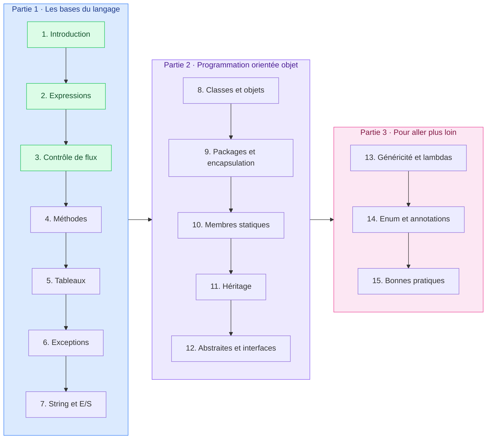

# Programmation

<mark style="color:blue;">**Écrire du code qui marche, et qui se lit.**</mark>

&#x20;


**En bref**

Le cours part des **bases du langage Java** (variables, opérateurs, boucles, méthodes, tableaux), passe à la **programmation orientée objet** (classes, héritage, interfaces), puis aborde des notions **avancées** (généricité, lambdas, enums) et les **bonnes pratiques**.


&#x20;

***

&#x20;

## <mark style="color:purple;">01</mark> · Le parcours

&#x20;

&#x20;

***

&#x20;

## <mark style="color:purple;">02</mark> · Les chapitres

&#x20;

| #  | Chapitre                                                                                                    | Statut                                              |
| -- | ----------------------------------------------------------------------------------------------------------- | --------------------------------------------------- |
| 1  | [Introduction et éléments de base](01-introduction-elements-de-base/README.md)                              | <mark style="color:green;">**Rédigé**</mark>        |
| 2  | [Expressions et opérateurs](02-expressions-operateurs/README.md)                                            | <mark style="color:green;">**Rédigé**</mark>        |
| 3  | [Instructions et contrôle de flux](03-instructions-controle-flux/README.md)                                 | <mark style="color:green;">**Rédigé**</mark>        |
| 4  | [Méthodes](04-methodes/README.md)                                                                           | À venir                                             |
| 5  | [Tableaux](05-tableaux/README.md)                                                                           | À venir                                             |
| 6  | [Exceptions](06-exceptions/README.md)                                                                       | À venir                                             |
| 7  | [String et entrées/sorties](07-string-entrees-sorties/README.md)                                            | À venir                                             |
| 8  | [Classes et objets](08-classes-objets/README.md)                                                            | À venir                                             |
| 9  | [Packages, contrôle d'accès, initialiseurs et encapsulation](09-packages-controle-acces-initialiseurs-encapsulation/README.md) | À venir                  |
| 10 | [Membres statiques, initialiseurs et wrappers](10-membres-statiques-initialiseurs-wrappers/README.md)       | À venir                                             |
| 11 | [Héritage et polymorphisme](11-heritage-polymorphisme/README.md)                                            | À venir                                             |
| 12 | [Classes abstraites et interfaces](12-classes-abstraites-interfaces/README.md)                              | À venir                                             |
| 13 | [Généricité et expressions lambda](13-genericite-expressions-lambda/README.md)                              | À venir                                             |
| 14 | [Enum, annotations, RSA et limitations](14-enum-annotations-rsa-limitations/README.md)                      | À venir                                             |
| 15 | [Conventions de codage et bonnes pratiques](15-conventions-codage-bonnes-pratiques/README.md)               | À venir                                             |

&#x20;

***

&#x20;

## <mark style="color:purple;">03</mark> · Comment travailler ce cours

&#x20;



### Lire le chapitre

&#x20;

Chaque chapitre suit le même format : un encadré **En bref**, des sections numérotées avec des schémas et des exemples de code, puis un **résumé**.



### Taper les exemples

&#x20;

Recopie les exemples de code et exécute-les. Modifie-les pour voir ce qui change.



### Faire les exercices sur papier

&#x20;

Chaque chapitre se termine par des **exercices à faire au crayon**, comme à l'examen écrit. Ouvre la solution seulement après avoir écrit ta réponse.



&#x20;


**Outils** — un **JDK** récent (21 ou plus) et un éditeur comme IntelliJ IDEA ou VS Code. Mais pour les exercices : papier et crayon.

