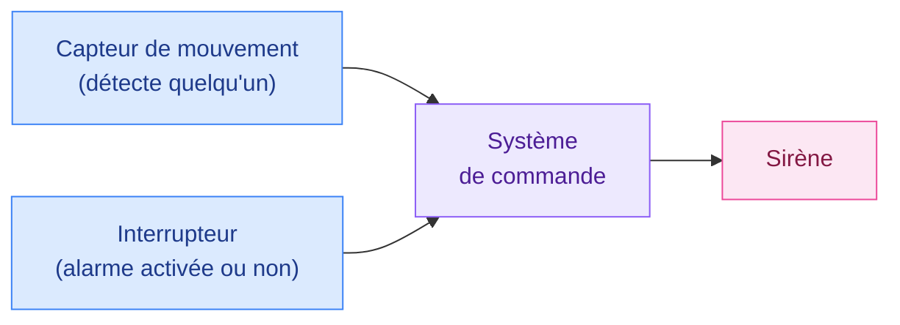
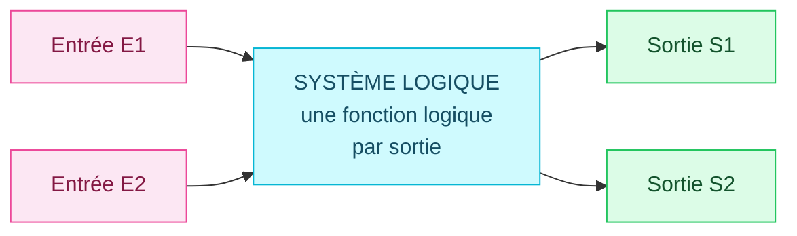
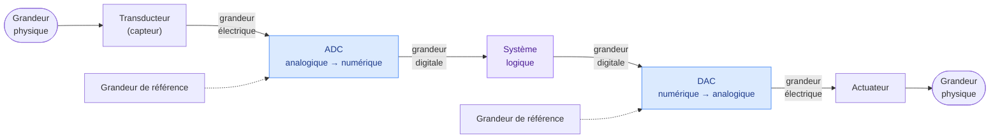

# 1. Les systèmes logiques

<mark style="color:blue;">**Tout système numérique, du réveil au processeur, repose sur une seule idée : un signal est soit vrai, soit faux.**</mark>

&#x20;


**En bref**

Un **système logique** reçoit des **entrées** qui valent 0 ou 1, et calcule des **sorties** qui valent 0 ou 1. La règle qui relie les sorties aux entrées s'appelle la **fonction logique**. Dans la réalité, ces 0 et 1 sont des **tensions électriques** (0 V et 3,3 V par exemple).


&#x20;

***

&#x20;

## <mark style="color:purple;">01</mark> · Un exemple : l'alarme d'une maison

&#x20;

Le cours part d'un exemple très concret : une alarme anti-intrusion.

&#x20;

&#x20;

On veut que la sirène sonne **seulement si** l'alarme est activée **et** qu'un mouvement est détecté. Si le propriétaire est chez lui et a désactivé l'alarme, il peut bouger sans déclencher la sirène.

&#x20;

Remarque : chacune de ces trois informations ne peut prendre que **deux valeurs**.

&#x20;

* le capteur détecte un mouvement… **ou non** ;
* l'interrupteur est enclenché… **ou non** ;
* la sirène sonne… **ou non**.

&#x20;

C'est exactement le monde de la logique.

&#x20;

***

&#x20;

## <mark style="color:purple;">02</mark> · Deux valeurs seulement : 0 et 1

&#x20;

Les systèmes logiques manipulent des **signaux** qui ne peuvent prendre que deux valeurs :

&#x20;

| Valeur | Sens logique    | En anglais |
| ------ | --------------- | ---------- |
| **1**  | VRAI            | TRUE       |
| **0**  | FAUX            | FALSE      |

&#x20;

Un **signal logique** est donc une **affirmation** qui est vraie ou fausse : « un mouvement est détecté » vaut 1 si c'est vrai, 0 sinon.

&#x20;


**Vocabulaire** — dans ce cours, **logique**, **binaire** et **numérique** veulent dire la même chose : « qui ne prend que deux valeurs ». (*Binaire* vient de « deux », *numérique* de « nombre » : on code tout avec des chiffres 0 et 1.)


&#x20;

### Du 0 / 1 à la tension électrique

&#x20;

Un « 1 » n'existe pas physiquement : dans un circuit, on le **matérialise** par une grandeur physique, en général une **tension**.

&#x20;

| Signal logique | Tension (exemple) | État électrique |
| -------------- | ----------------- | --------------- |
| 1              | 3,3 V             | HAUT (HIGH)     |
| 0              | 0 V               | BAS (LOW)       |

&#x20;

C'est pour ça qu'on parle aussi d'état **HAUT** et **BAS** : on décrit le signal par sa tension.

&#x20;

Pourquoi seulement deux valeurs ? Pourquoi pas dix, comme nos chiffres ?

&#x20;

Parce que c'est **beaucoup plus fiable**. Une tension n'est jamais parfaitement exacte : elle est perturbée par du **bruit** (parasites, câbles longs, température…).

* Avec **2 niveaux** (0 V et 3,3 V), une tension de 3,1 V ou 0,2 V se reconnaît sans hésitation : elle est clairement proche de l'un des deux.
* Avec **10 niveaux** (0 V, 0,33 V, 0,66 V…), les niveaux seraient si proches qu'un petit parasite ferait lire un 4 au lieu d'un 5.

Deux niveaux très éloignés = presque aucune erreur de lecture. C'est la raison pour laquelle **tous** les ordinateurs travaillent en binaire.

&#x20;

&#x20;

***

&#x20;

## <mark style="color:purple;">03</mark> · Entrées, sorties, fonction logique

&#x20;

Un **système logique** est un système qui traite l'information de manière numérique. Il possède :

&#x20;

* des **entrées** : les informations qu'il reçoit (capteur, interrupteur…) ;
* des **sorties** : ce qu'il commande (sirène, moteur, lampe…) ;
* des **composants** (portes logiques) reliés entre eux par des **fils**.

&#x20;

&#x20;

Le système est décrit par des **fonctions logiques**, **une par sortie**. Une fonction logique donne la valeur de la sortie **en fonction de la valeur des entrées** :

$$S = F(E_1, E_2, \dots)$$

&#x20;


**Pourquoi une fonction par sortie ?** Parce que chaque sortie a sa propre règle. Dans l'exercice A.3 (moteur), la sortie « ON/OFF » et la sortie « Error » ne s'allument pas dans les mêmes situations : il faut deux règles différentes, donc deux fonctions.


&#x20;

***

&#x20;

## <mark style="color:purple;">04</mark> · Application à l'alarme

&#x20;

### Étape 1 — Décrire clairement les entrées et les sorties

&#x20;

C'est **toujours** la première chose à faire : donner un nom court à chaque signal et dire **ce que veut dire 1**.

&#x20;

| Entrée      | Nom du signal | Définition                                  |
| ----------- | ------------- | ------------------------------------------- |
| Capteur     | **C**         | 1 si un mouvement est détecté               |
| Interrupteur| **I**         | 1 si la fonction de détection est enclenchée|

&#x20;

| Sortie | Nom du signal | Définition                     |
| ------ | ------------- | ------------------------------ |
| Sirène | **S**         | 1 si la sirène est enclenchée  |

&#x20;


**Pourquoi c'est si important ?** Sans la colonne « définition », « C = 1 » ne veut rien dire : est-ce « mouvement détecté » ou « tout est calme » ? Deux personnes pourraient construire deux circuits opposés. On **fixe le sens** du 1 une fois pour toutes.


&#x20;

### Étape 2 — Lister tous les états possibles

&#x20;

Les **états d'entrée** sont toutes les combinaisons possibles des entrées :

&#x20;

| C | I |
| - | - |
| 0 | 0 |
| 0 | 1 |
| 1 | 0 |
| 1 | 1 |

&#x20;

Les **états de sortie** sont les valeurs possibles de la sortie : S = 0 ou S = 1.

&#x20;

### Combien de combinaisons ?

&#x20;

Avec **n entrées**, il y a $$2^n$$ combinaisons.

&#x20;

**Pourquoi ?** Chaque entrée peut valoir 0 ou 1. Quand on ajoute une entrée, chaque combinaison existante se **dédouble** (une fois avec la nouvelle entrée à 0, une fois à 1). On multiplie donc par 2 à chaque entrée :

&#x20;

| Nombre d'entrées | Combinaisons |
| ---------------- | ------------ |
| 1                | 2            |
| 2                | 4            |
| 3                | 8            |
| 4                | 16           |
| n                | $$2^n$$      |

&#x20;

L'exercice A.1 (chauffage) a 4 entrées binaires : sa table a donc **16 lignes**.

&#x20;

***

&#x20;

## <mark style="color:purple;">05</mark> · Le système logique dans le monde réel

&#x20;

Le monde physique n'est pas binaire : une température, une pression, une vitesse peuvent prendre **n'importe quelle valeur**. Pour qu'un système logique puisse les traiter, il faut une chaîne de conversion :

&#x20;

&#x20;

| Bloc            | Rôle                                                                | Exemple (chauffage)                         |
| --------------- | ------------------------------------------------------------------- | ------------------------------------------- |
| **Transducteur**| transforme une grandeur physique en **tension**                     | sonde de température : 21 °C → 2,1 V        |
| **ADC**         | *Analog to Digital Converter* : transforme la tension en **nombre binaire** | 2,1 V → `0110'1011`                  |
| **Système logique** | calcule, compare, décide                                        | « 21 °C < consigne 22 °C → chauffer »       |
| **DAC**         | *Digital to Analog Converter* : transforme un nombre binaire en **tension** | `1000'0000` → 5 V                    |
| **Actuateur**   | transforme la tension en **action physique**                        | vanne, brûleur, moteur                      |

&#x20;


**La grandeur de référence** — l'ADC et le DAC ont besoin d'une **tension de référence** pour savoir à quoi correspond le nombre maximal. Par exemple, si la référence est 5 V sur 8 bits, `1111'1111` (255) correspond à environ 5 V et `1000'0000` (128) à environ 2,5 V. C'est la **règle de trois** entre le monde analogique et le monde numérique.


&#x20;

Comment un nombre comme 21,0 °C est représenté en binaire, c'est tout le sujet de la partie [Codage des nombres](../02-codage-des-nombres/01-systemes-de-numeration.md).

&#x20;

***

&#x20;

## <mark style="color:purple;">06</mark> · À retenir

&#x20;

* Un signal logique vaut **1 (vrai)** ou **0 (faux)** ; physiquement, une tension **HAUTE** ou **BASSE**.
* On travaille en binaire car **deux niveaux éloignés** résistent au bruit.
* Un système logique = **entrées** + **sorties** + **une fonction logique par sortie**.
* Toujours commencer par **nommer les signaux** et **définir ce que veut dire 1**.
* n entrées → $$2^n$$ combinaisons.
* Monde réel : capteur → **ADC** → logique → **DAC** → actuateur.

&#x20;


**Page suivante** → [2. Décrire une fonction logique](02-decrire-une-fonction-logique.md)

