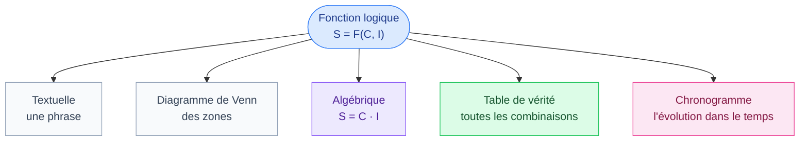
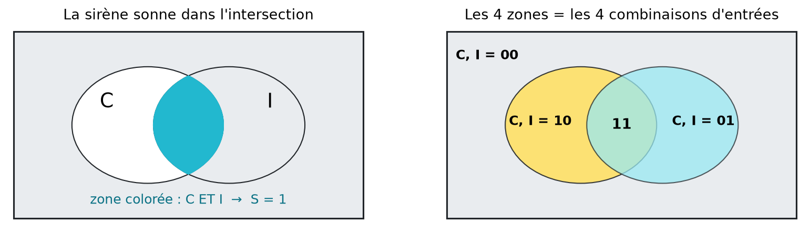
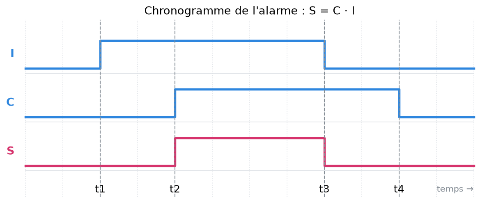

# 2. Décrire une fonction logique

<mark style="color:blue;">**Une même règle, cinq façons de l'écrire : chacune a son utilité.**</mark>

&#x20;


**En bref**

Une fonction logique peut se décrire de **5 façons** :

1. **textuelle** (une phrase) ;
2. **diagramme de Venn** (des zones) ;
3. **fonction algébrique** (une équation) ;
4. **table de vérité** (un tableau de toutes les combinaisons) ;
5. **chronogramme** (l'évolution dans le temps).

Elles disent toutes **exactement la même chose**. On passe de l'une à l'autre selon le besoin.


&#x20;

***

&#x20;

## <mark style="color:purple;">01</mark> · Vue d'ensemble

&#x20;

&#x20;

On reprend l'**alarme** de la page précédente (C = capteur, I = interrupteur, S = sirène).

&#x20;

***

&#x20;

## <mark style="color:purple;">02</mark> · Description textuelle

&#x20;

C'est la description en **langage naturel** :

&#x20;

> « La sirène d'alarme va sonner dans le cas où l'interrupteur est dans la position demandant la détection de mouvement **et** que le capteur détecte un mouvement dans la chambre. »

&#x20;


**Formalisme délicat** — le langage naturel est souvent **ambigu**. « Le brûleur s'allume s'il fait froid ou s'il faut de l'eau chaude et qu'il y a du mazout » : le « et qu'il y a du mazout » s'applique-t-il aux deux cas ou seulement au second ? Une phrase peut se comprendre de deux façons, une équation non. C'est pour ça qu'on traduit toujours le texte en une forme plus précise.


&#x20;

***

&#x20;

## <mark style="color:purple;">03</mark> · Diagramme de Venn

&#x20;

On dessine chaque variable comme une **zone**. À l'intérieur de la zone C, C vaut 1 ; à l'extérieur, C vaut 0. On colorie la zone où la sortie vaut 1.

&#x20;

<figure><figcaption>
À gauche : la sirène sonne dans l'intersection de C et I. À droite : chaque zone correspond à une combinaison des entrées.
</figcaption></figure>

&#x20;

Les deux cercles découpent le rectangle en **4 zones**, une par combinaison :

&#x20;

* en dehors des deux cercles : C = 0, I = 0 ;
* seulement dans C : C = 1, I = 0 ;
* seulement dans I : C = 0, I = 1 ;
* dans les deux (l'**intersection**) : C = 1, I = 1.

&#x20;

C'est une représentation **visuelle**, utile pour comprendre, mais **peu utilisée** en pratique : au-delà de 3 ou 4 variables, le dessin devient illisible.

&#x20;

***

&#x20;

## <mark style="color:purple;">04</mark> · Fonction algébrique et opérateurs logiques

&#x20;

On écrit la règle comme une **équation**, avec des opérateurs logiques :

$$S = C \text{ ET } I \qquad\text{qu'on écrit}\qquad S = C \cdot I$$

&#x20;

### Les trois opérateurs de base

&#x20;



**A · B vaut 1 seulement si A ET B valent 1 tous les deux.**

&#x20;

| A | B | A · B |
| - | - | ----- |
| 0 | 0 | 0     |
| 0 | 1 | 0     |
| 1 | 0 | 0     |
| 1 | 1 | **1** |

&#x20;

**Pourquoi le symbole « · » (multiplication) ?** Parce que le résultat est exactement le produit : $$1 \times 1 = 1$$, et dès qu'il y a un 0, le produit vaut 0.

&#x20;

Image : deux interrupteurs **en série** : le courant ne passe que si les deux sont fermés.



**A + B vaut 1 si AU MOINS UN des deux vaut 1.**

&#x20;

| A | B | A + B |
| - | - | ----- |
| 0 | 0 | 0     |
| 0 | 1 | **1** |
| 1 | 0 | **1** |
| 1 | 1 | **1** |

&#x20;

**Attention :** en logique, $$1 + 1 = 1$$ (pas 2 !). « Au moins un des deux est vrai » reste simplement vrai.

&#x20;

Image : deux interrupteurs **en parallèle** : il suffit qu'un seul soit fermé.



**/A (ou $$\overline{A}$$) est le contraire de A.**

&#x20;

| A | /A |
| - | -- |
| 0 | 1  |
| 1 | 0  |

&#x20;

Exemple de l'exercice A.1 : **Saison** = 1 en hiver, donc **/Saison** = 1 en été.



**A ⊕ B vaut 1 si A et B sont DIFFÉRENTS** (l'un ou l'autre, mais pas les deux).

&#x20;

| A | B | A ⊕ B |
| - | - | ----- |
| 0 | 0 | 0     |
| 0 | 1 | **1** |
| 1 | 0 | **1** |
| 1 | 1 | 0     |

&#x20;

Il s'écrit avec les opérateurs de base : $$A \oplus B = \overline{A} \cdot B + A \cdot \overline{B}$$. On le rencontre dans les exercices A.2 et A.3.



&#x20;


**Priorité des opérateurs** — comme en algèbre, **ET passe avant OU** (comme × avant +). $$A + B \cdot C$$ se lit $$A + (B \cdot C)$$. En cas de doute, on met des **parenthèses**.


&#x20;

***

&#x20;

## <mark style="color:purple;">05</mark> · Table de vérité

&#x20;

C'est un tableau qui donne la sortie pour **toutes** les combinaisons d'entrées :

&#x20;

| C | I | S     |
| - | - | ----- |
| 0 | 0 | 0     |
| 0 | 1 | 0     |
| 1 | 0 | 0     |
| 1 | 1 | **1** |

&#x20;

C'est la description **la plus sûre** : on n'oublie aucun cas, et il n'y a aucune ambiguïté.

&#x20;

### Comment la construire sans rien oublier

&#x20;



### Une colonne par entrée, une colonne par sortie

On sépare souvent les entrées et les sorties par un trait plus épais.



### $$2^n$$ lignes

Avec n entrées, il y a $$2^n$$ lignes (4 lignes pour 2 entrées, 8 pour 3, 16 pour 4).



### Remplir les entrées en comptant en binaire

Ligne 0 : `000`, ligne 1 : `001`, ligne 2 : `010`, … , ligne 7 : `111`.

&#x20;

**Pourquoi compter en binaire ?** C'est une méthode **automatique** qui garantit d'avoir chaque combinaison **une seule fois**. Astuce : la colonne de droite alterne 0, 1, 0, 1… ; la suivante 0, 0, 1, 1… ; la suivante par paquets de 4, etc.



### Pour chaque ligne, se demander : « la sortie doit-elle être active ? »

On relit l'énoncé avec les valeurs de la ligne et on met 1 ou 0.



&#x20;

### Passer de la table à l'équation

&#x20;

C'est la méthode qu'on utilise dans tous les exercices :

&#x20;

1. on regarde **les lignes où la sortie vaut 1** ;
2. pour chacune, on écrit un **produit (ET)** de toutes les entrées : l'entrée telle quelle si elle vaut 1, **inversée** (/) si elle vaut 0 ;
3. on relie ces produits par des **OU (+)**.

&#x20;

**Exemple :** une table à 2 entrées A, B où la sortie vaut 1 sur les lignes `01` et `10` :

* ligne A = 0, B = 1 → produit $$\overline{A} \cdot B$$ ;
* ligne A = 1, B = 0 → produit $$A \cdot \overline{B}$$ ;
* donc $$S = \overline{A} \cdot B + A \cdot \overline{B}$$ (c'est le OU exclusif).

&#x20;

**Pourquoi ça marche ?** Chaque produit vaut 1 **pour sa ligne exactement** et 0 pour toutes les autres (il suffit qu'une seule entrée soit différente pour que le ET tombe à 0). Le OU les rassemble : la sortie vaut 1 sur toutes les lignes choisies, et seulement celles-là.

&#x20;

***

&#x20;

## <mark style="color:purple;">06</mark> · Chronogramme

&#x20;

Le chronogramme montre l'**évolution des signaux dans le temps**. Chaque signal est une ligne qui est en haut (1) ou en bas (0).

&#x20;

<figure><figcaption>
La sirène S ne monte que pendant les instants où I et C sont à 1 en même temps (entre t2 et t3).
</figcaption></figure>

&#x20;

Lecture :

* **t1** : on enclenche l'alarme (I passe à 1). Personne ne bouge : S reste à 0.
* **t2** : un mouvement est détecté (C passe à 1). C **et** I valent 1 : la sirène sonne.
* **t3** : on désactive l'alarme (I repasse à 0) : la sirène s'arrête, même si le mouvement continue.
* **t4** : le mouvement s'arrête. Rien ne change pour S.

&#x20;


**Méthode pour tracer une sortie** — découpe le temps en tranches **à chaque changement d'une entrée** (traits verticaux). Dans chaque tranche, les entrées sont constantes : tu lis la ligne correspondante de la table de vérité et tu traces la sortie. C'est exactement ce qu'on fait aux exercices A.2 et A.3.


&#x20;

***

&#x20;

## <mark style="color:purple;">07</mark> · Quelle description utiliser ?

&#x20;

| Description     | Point fort                                 | Point faible                                |
| --------------- | ------------------------------------------ | ------------------------------------------- |
| Textuelle       | compréhensible par tout le monde           | ambiguë                                     |
| Diagramme de Venn | très visuel                              | illisible au-delà de 3 variables (peu utilisé) |
| Algébrique      | compacte, se simplifie, se câble directement | il faut savoir la lire                    |
| Table de vérité | complète, sans ambiguïté                   | énorme si beaucoup d'entrées ($$2^n$$ lignes) |
| Chronogramme    | montre un **scénario** réel dans le temps  | ne montre que les cas qui arrivent          |

&#x20;

En pratique, on part souvent du **texte**, on construit la **table de vérité** (pour ne rien oublier), on en tire l'**équation** (pour câbler), et on vérifie avec un **chronogramme**.

&#x20;

***

&#x20;

## <mark style="color:purple;">08</mark> · Exercices rapides

&#x20;

1. Écris la table de vérité de S = A + /B.

&#x20;

| A | B | /B | S |
| - | - | -- | - |
| 0 | 0 | 1  | 1 |
| 0 | 1 | 0  | 0 |
| 1 | 0 | 1  | 1 |
| 1 | 1 | 0  | 1 |

&#x20;

2. La sortie vaut 1 uniquement pour A = 1, B = 1, C = 0. Quelle est l'équation ?

&#x20;

$$S = A \cdot B \cdot \overline{C}$$ — un seul produit, car une seule ligne vaut 1.

&#x20;

3. Combien de lignes a la table de vérité d'un système à 5 entrées ?

&#x20;

$$2^5 = 32$$ lignes.

&#x20;

4. Que vaut 1 + 1 en logique ? Et en binaire (addition de nombres) ?

&#x20;

En **logique** (OU) : 1 + 1 = **1**. En **arithmétique binaire** : 1 + 1 = **10** (deux), on écrit 0 et on retient 1 (voir [Arithmétique binaire](../02-codage-des-nombres/05-arithmetique-et-depassement.md)). Le même symbole « + » a deux sens selon le contexte !

&#x20;

&#x20;

***

&#x20;

## <mark style="color:purple;">09</mark> · À retenir

&#x20;

* 5 descriptions : **texte, Venn, équation, table de vérité, chronogramme**.
* **ET (·)** : tous à 1. **OU (+)** : au moins un à 1. **NON (/)** : l'inverse. **ET avant OU**.
* Table de vérité : $$2^n$$ lignes, remplies en **comptant en binaire**.
* Table → équation : un **produit** par ligne à 1, puis on les relie par des **+**.
* Chronogramme : découper le temps à chaque changement d'entrée, puis lire la table.

&#x20;


**Page suivante** → [3. Exercices A.1 à A.3](03-exercices-concepts.md)

