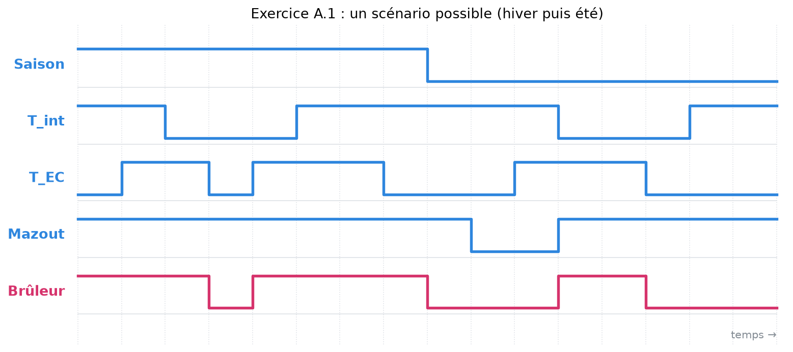
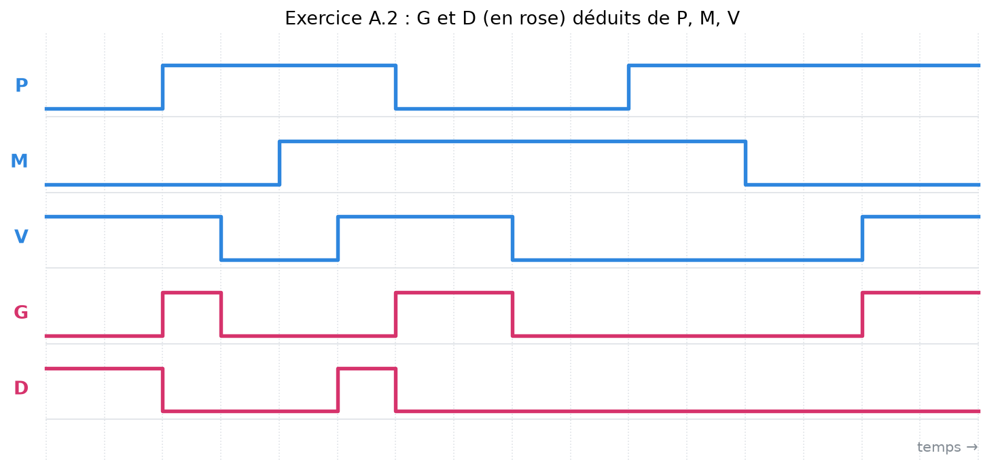
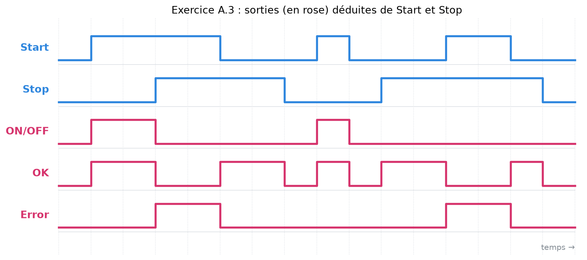

# 3. Exercices A.1 à A.3

<mark style="color:blue;">**Trois systèmes réels, décrits de toutes les façons vues au chapitre précédent.**</mark>

&#x20;


**Mode d'emploi** — pour chaque exercice, essaie d'abord **seul** chaque question, puis ouvre la solution. La méthode est toujours la même :

1. décrire les entrées / sorties ;
2. construire la table de vérité ;
3. en tirer les équations ;
4. tracer le chronogramme.

Si tu bloques, relis [2. Décrire une fonction logique](02-decrire-une-fonction-logique.md).


&#x20;

***

&#x20;

## <mark style="color:purple;">01</mark> · Exercice A.1 — Le chauffage au mazout

&#x20;

**Énoncé (résumé).** Une maison est chauffée par un **brûleur à mazout**, qui chauffe à la fois la maison et l'eau chaude. On mesure la température intérieure et celle de l'eau chaude, et on les compare à des **consignes** (températures souhaitées). Décrire clairement les entrées / sorties, la table de vérité, l'équation, un chronogramme et le diagramme de Venn de la commande du brûleur.

&#x20;

### 1. Description des entrées

&#x20;

Solution : les entrées

&#x20;

| Nom             | Nature    | Unité | Valeurs     | Description                                                        |
| --------------- | --------- | ----- | ----------- | ------------------------------------------------------------------ |
| Sonde\_T        | numérique | °C    | −30 … 50    | mesure de la température intérieure                                |
| Consigne\_T     | numérique | °C    | 10 … 30     | température intérieure souhaitée                                   |
| Sonde\_EC       | numérique | °C    | 0 … 100     | mesure de la température de l'eau chaude                           |
| Consigne\_EC    | numérique | °C    | 20 … 80     | température d'eau chaude souhaitée                                 |
| **T\_int (T)**  | binaire   | on/off| 0 / 1       | **1** : température intérieure **inférieure** à la consigne (il faut chauffer) |
| **T\_EC (EC)**  | binaire   | on/off| 0 / 1       | **1** : eau chaude **inférieure** à la consigne (il faut chauffer l'eau) |
| **Saison (S)**  | binaire   | on/off| 0 / 1       | **0** : été, **1** : hiver                                         |
| **Mazout (M)**  | binaire   | on/off| 0 / 1       | **0** : cuve vide, **1** : il y a du mazout                        |

&#x20;

**Pourquoi deux sortes d'entrées ?** Les sondes et consignes sont des **nombres** (des températures), pas des 0 / 1. Le système logique ne travaille qu'avec des signaux binaires : on transforme donc chaque comparaison « mesure < consigne ? » en un signal binaire (T et EC). Ce sont **ces 4 signaux binaires** (T, EC, S, M) qui entrent dans la fonction logique.

&#x20;

&#x20;

### 2. Description de la sortie et description textuelle

&#x20;

Solution : sortie et texte

&#x20;

| Nom         | Nature  | Valeurs | Description                                  |
| ----------- | ------- | ------- | -------------------------------------------- |
| **Brûleur (B)** | binaire | 0 / 1 | **1** : le brûleur est enclenché, **0** : éteint |

&#x20;

**Texte :** le brûleur s'enclenche lorsqu'il y a du **mazout** et que la **température intérieure est trop basse pendant l'hiver**, ou lorsque **l'eau chaude est trop froide** (et qu'il y a du mazout).

&#x20;

**Pourquoi la saison ?** En été, on ne chauffe pas la maison, même s'il fait frais : seule l'eau chaude compte. En hiver, on chauffe pour la maison **et** pour l'eau.

&#x20;

&#x20;

### 3. Table de vérité

&#x20;

Solution : table de vérité (16 lignes)

&#x20;

4 entrées → $$2^4 = 16$$ lignes, remplies en comptant en binaire.

&#x20;

| Mazout | Saison | T\_int | T\_EC | **Brûleur** | Pourquoi                               |
| :----: | :----: | :----: | :---: | :---------: | -------------------------------------- |
| 0      | 0      | 0      | 0     | 0           | pas de mazout → jamais                 |
| 0      | 0      | 0      | 1     | 0           | pas de mazout                          |
| 0      | 0      | 1      | 0     | 0           | pas de mazout                          |
| 0      | 0      | 1      | 1     | 0           | pas de mazout                          |
| 0      | 1      | 0      | 0     | 0           | pas de mazout                          |
| 0      | 1      | 0      | 1     | 0           | pas de mazout                          |
| 0      | 1      | 1      | 0     | 0           | pas de mazout                          |
| 0      | 1      | 1      | 1     | 0           | pas de mazout                          |
| 1      | 0      | 0      | 0     | 0           | été, eau assez chaude                  |
| 1      | 0      | 0      | 1     | <mark style="color:orange;">**1**</mark> | été, eau trop froide       |
| 1      | 0      | 1      | 0     | 0           | été : on ignore la maison              |
| 1      | 0      | 1      | 1     | <mark style="color:orange;">**1**</mark> | été, eau trop froide       |
| 1      | 1      | 0      | 0     | 0           | hiver, tout est assez chaud            |
| 1      | 1      | 0      | 1     | <mark style="color:blue;">**1**</mark> | hiver, eau trop froide        |
| 1      | 1      | 1      | 0     | <mark style="color:blue;">**1**</mark> | hiver, maison trop froide     |
| 1      | 1      | 1      | 1     | <mark style="color:blue;">**1**</mark> | hiver, les deux               |

&#x20;

Les lignes <mark style="color:orange;">orange</mark> sont les cas **été**, les lignes <mark style="color:blue;">bleues</mark> les cas **hiver**.

&#x20;

&#x20;

### 4. Fonction algébrique

&#x20;

Solution : équation et simplification

&#x20;

On écrit directement la phrase en équation :

$$B = M \cdot \big( (S \cdot (T + EC)) + (\overline{S} \cdot EC) \big)$$

&#x20;

Lecture : « il y a du mazout **ET** ( c'est l'hiver et (maison **OU** eau trop froide) **OU** c'est l'été et l'eau est trop froide ) ».

* $$S \cdot (T + EC)$$ correspond aux 3 lignes <mark style="color:blue;">bleues</mark> ;
* $$\overline{S} \cdot EC$$ correspond aux 2 lignes <mark style="color:orange;">orange</mark>.

&#x20;

**Bonus : on peut simplifier.** On développe :

$$S \cdot T + S \cdot EC + \overline{S} \cdot EC = S \cdot T + EC \cdot (S + \overline{S}) = S \cdot T + EC$$

car $$S + \overline{S} = 1$$ (c'est toujours soit l'hiver, soit l'été). D'où :

$$\boxed{B = M \cdot (EC + S \cdot T)}$$

« Avec du mazout, on chauffe si l'eau est trop froide (toute l'année), ou si la maison est trop froide en hiver. » Plus court, et c'est **la même table**.

&#x20;

&#x20;

### 5. Chronogramme et diagramme de Venn

&#x20;

Solution : chronogramme

&#x20;

<figure><figcaption>
Un scénario : hiver (Saison = 1) puis été (Saison = 0). Le brûleur est calculé avec B = M · (EC + S · T).
</figcaption></figure>

&#x20;

À remarquer :

* en **hiver**, le brûleur suit « T ou EC » ;
* quand le **mazout manque**, le brûleur est coupé quoi qu'il arrive ;
* en **été**, T\_int n'a plus d'effet : le brûleur suit seulement EC.

&#x20;

Solution : diagramme de Venn

&#x20;

On dessine 4 zones qui se chevauchent : **M**, **Saison**, **T\_int**, **T\_EC**. La zone où B = 1 est **à l'intérieur de M** (condition obligatoire), et dans :

* l'intersection **Saison ∩ T\_int** (hiver et maison froide) ;
* toute la zone **T\_EC** (eau froide, été comme hiver).

Avec 4 variables, le dessin devient compliqué : c'est la raison pour laquelle le diagramme de Venn est **peu utilisé** en pratique.

&#x20;

&#x20;

***

&#x20;

## <mark style="color:purple;">02</mark> · Exercice A.2 — Le tapis roulant

&#x20;

**Énoncé.** Un tapis roulant transporte des pièces. Deux pistons peuvent pousser la pièce à gauche ou à droite.

&#x20;

| Signal | Type   | Description                               | 0             | 1                     |
| ------ | ------ | ----------------------------------------- | ------------- | --------------------- |
| **P**  | entrée | présence d'une pièce sur le tapis         | pas de pièce  | pièce présente        |
| **M**  | entrée | la pièce est en métal                     | pas en métal  | métal                 |
| **V**  | entrée | le tapis est en mouvement                 | immobile      | en mouvement          |
| **G**  | sortie | piston qui pousse à **gauche**            | OFF           | actif                 |
| **D**  | sortie | piston qui pousse à **droite**            | OFF           | actif                 |

&#x20;

| P | M | V | G | D |
| - | - | - | - | - |
| 0 | 0 | 0 | 0 | 0 |
| 0 | 0 | 1 | 0 | 1 |
| 0 | 1 | 0 | 0 | 0 |
| 0 | 1 | 1 | 1 | 0 |
| 1 | 0 | 0 | 0 | 0 |
| 1 | 0 | 1 | 1 | 0 |
| 1 | 1 | 0 | 0 | 0 |
| 1 | 1 | 1 | 0 | 1 |

&#x20;

**a)** Décrire textuellement le fonctionnement. **b)** Écrire les équations de G et D. **c)** Tracer G et D pour le scénario donné.

&#x20;

Indice

&#x20;

Regarde d'abord toutes les lignes où **V = 0** : que valent G et D ? Puis compare P et M sur les lignes où V = 1.

&#x20;

Solution a) — description textuelle

&#x20;

* Quand le tapis est **immobile** (V = 0), **aucun** piston n'est actionné (les 4 lignes avec V = 0 ont G = D = 0). C'est logique : on ne pousse pas une pièce qui ne défile pas.
* Quand le tapis **avance** (V = 1) :
  * une **pièce présente non métallique** (P = 1, M = 0) est poussée à **gauche** ;
  * une **pièce présente métallique** (P = 1, M = 1) est poussée à **droite** ;
  * dans les cas sans pièce (P = 0), la table active quand même un piston : **gauche** si M = 1, **droite** si M = 0.

&#x20;

**Résumé compact :** tapis en mouvement → **gauche si P et M sont différents, droite s'ils sont égaux**.

&#x20;

Solution b) — équations

&#x20;

On prend les lignes où chaque sortie vaut 1 (méthode du chapitre 2) :

&#x20;

* **G = 1** sur les lignes `0 1 1` et `1 0 1` :

$$G = \overline{P} \cdot M \cdot V + P \cdot \overline{M} \cdot V = V \cdot (\overline{P} \cdot M + P \cdot \overline{M}) = V \cdot (P \oplus M)$$

* **D = 1** sur les lignes `0 0 1` et `1 1 1` :

$$D = \overline{P} \cdot \overline{M} \cdot V + P \cdot M \cdot V = V \cdot (\overline{P} \cdot \overline{M} + P \cdot M) = V \cdot \overline{(P \oplus M)}$$

&#x20;

**Pourquoi on peut sortir le V ?** Il apparaît dans **chaque** produit : on le met en facteur, comme en algèbre ($$ab + ac = a(b + c)$$).

&#x20;

Solution c) — chronogramme

&#x20;

On découpe le temps à chaque changement de P, M ou V, et on lit la table dans chaque tranche :

&#x20;

<figure><figcaption>
P, M, V relevés sur la grille de l'énoncé ; G et D (en rose) calculés avec la table de vérité.
</figcaption></figure>

&#x20;

Vérifications rapides :

* dès que **V = 0**, G et D tombent à 0 ;
* quand **V = 1**, il y a **toujours exactement un** piston actif (G et D ne sont jamais à 1 en même temps) ;
* G = 1 quand P ≠ M, D = 1 quand P = M.

&#x20;

&#x20;

***

&#x20;

## <mark style="color:purple;">03</mark> · Exercice A.3 — La commande d'un moteur

&#x20;

**Énoncé.** La commande d'un moteur a 2 entrées (**Start**, **Stop**) et 3 sorties (**ON/OFF**, **OK**, **Error**).

&#x20;

1. L'opérateur demande le démarrage en mettant **Start** à 1. La commande est quittancée par **ON/OFF** = 1 et **OK** = 1. ON/OFF retombe à 0 si Start revient à 0.
2. L'opérateur demande l'arrêt en mettant **Stop** à 1 : **ON/OFF** = 0 et **OK** = 1.
3. **Error** = 1 uniquement si Start **et** Stop sont activés en même temps. Dans ce cas, ON/OFF = 0 et OK = 0.
4. Si aucune entrée n'est activée, toutes les sorties sont à 0.

&#x20;

**a)** Table de vérité. **b)** Équations de ON/OFF, OK et Error. **c)** Chronogramme du scénario donné.

&#x20;

Indice

&#x20;

2 entrées → 4 lignes. Chaque point de l'énoncé correspond à **une ligne** de la table.

&#x20;

Solution a) — table de vérité

&#x20;

| Start | Stop | ON/OFF | OK | Error | Point de l'énoncé           |
| :---: | :--: | :----: | :-: | :---: | -------------------------- |
| 0     | 0    | 0      | 0   | 0     | 4. rien n'est activé       |
| 0     | 1    | 0      | 1   | 0     | 2. arrêt demandé           |
| 1     | 0    | 1      | 1   | 0     | 1. démarrage demandé       |
| 1     | 1    | 0      | 0   | 1     | 3. les deux : erreur       |

&#x20;

Solution b) — équations

&#x20;

* **ON/OFF** = 1 seulement sur la ligne `1 0` :

$$ON/OFF = Start \cdot \overline{Stop}$$

* **OK** = 1 sur les lignes `0 1` et `1 0` (les entrées sont **différentes**) :

$$OK = \overline{Start} \cdot Stop + Start \cdot \overline{Stop} = Start \oplus Stop$$

* **Error** = 1 seulement sur la ligne `1 1` :

$$Error = Start \cdot Stop$$

&#x20;

**Interprétation de OK :** la commande est « OK » quand **une seule** demande claire est faite (démarrer **ou** arrêter, pas les deux). C'est exactement le OU exclusif.

&#x20;

Solution c) — chronogramme

&#x20;

<figure><figcaption>
Start et Stop relevés sur la grille de l'énoncé ; les trois sorties (en rose) calculées avec la table de vérité.
</figcaption></figure>

&#x20;

Vérifications :

* **ON/OFF** n'est à 1 que lorsque Start est seul à 1 ;
* **Error** est à 1 pendant les chevauchements Start / Stop ;
* **OK** et **Error** ne sont **jamais** à 1 en même temps, et OK vaut 1 exactement quand une seule entrée est active.

&#x20;

&#x20;

***

&#x20;

## <mark style="color:purple;">04</mark> · À retenir

&#x20;

* On commence **toujours** par décrire les signaux et le sens du 1.
* Une ligne d'énoncé ↔ une ou plusieurs lignes de la table de vérité.
* Table → équation : un produit par ligne à 1, puis on **factorise** ce qui est commun.
* Chronogramme : découper le temps aux changements d'entrées, puis lire la table.

&#x20;


**Partie suivante** → [Codage des nombres — 1. Les systèmes de numération](../02-codage-des-nombres/01-systemes-de-numeration.md)

