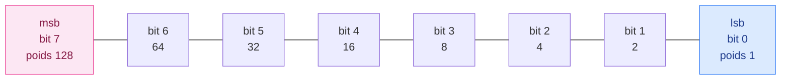

# 1. Les systèmes de numération

<mark style="color:blue;">**Le binaire fonctionne exactement comme nos nombres décimaux : seule la base change.**</mark>

&#x20;


**En bref**

Un nombre s'écrit avec un **alphabet** de symboles, et chaque position a un **poids** (une puissance de la base) : c'est un **code pondéré**.

* Base 10 : chiffres 0 à 9, poids 1, 10, 100, 1000…
* Base 2 : chiffres 0 et 1 (les **bits**), poids 1, 2, 4, 8, 16…

La valeur du nombre = **la somme de chaque chiffre multiplié par son poids**.


&#x20;

***

&#x20;

## <mark style="color:purple;">01</mark> · Ce que tu fais déjà sans y penser : la base 10

&#x20;

Dans le système **décimal**, on a un alphabet de **10 symboles** : {0, 1, 2, 3, 4, 5, 6, 7, 8, 9}. La **position** d'un chiffre indique ce qu'il vaut :

$$N_{10} = 85{,}2 = \color{#E03131}{8}\cdot 10^1 + \color{#E03131}{5}\cdot 10^0 + \color{#E03131}{2}\cdot 10^{-1} = 80 + 5 + 0{,}2$$

&#x20;

| Chiffre | Position          | Poids           | Valeur |
| ------- | ----------------- | --------------- | ------ |
| 8       | dizaines          | $$10^1 = 10$$   | 80     |
| 5       | unités            | $$10^0 = 1$$    | 5      |
| 2       | dixièmes          | $$10^{-1} = 0{,}1$$ | 0,2 |

&#x20;


**Code pondéré** — « pondéré » veut dire « avec des poids ». Le même chiffre 5 ne vaut pas la même chose dans 5, 50 ou 500 : c'est sa **position** qui lui donne son **poids**. Tout le codage des nombres repose sur cette idée.


&#x20;

**Pourquoi des puissances de 10 ?** Parce qu'on a 10 chiffres. Quand on dépasse 9, on n'a plus de symbole : on remet l'unité à 0 et on ajoute 1 à la position suivante (9 → 10). Chaque position vaut donc **10 fois** la précédente.

&#x20;

***

&#x20;

## <mark style="color:purple;">02</mark> · La base 2 : le binaire

&#x20;

En **binaire**, l'alphabet n'a que **2 symboles** : {0, 1}. Chaque chiffre s'appelle un **bit** (*binary digit*). Les poids sont des **puissances de 2**.

&#x20;

| Position (rang)  | 4      | 3      | 2      | 1      | 0      |
| ---------------- | ------ | ------ | ------ | ------ | ------ |
| Poids            | $$2^4$$ | $$2^3$$ | $$2^2$$ | $$2^1$$ | $$2^0$$ |
| Poids en décimal | 16     | 8      | 4      | 2      | 1      |
| Mot binaire      | **1**  | **0**  | **0**  | **1**  | **1**  |

&#x20;

$$10011_{(2)} = 1 \cdot 16 + 0 \cdot 8 + 0 \cdot 4 + 1 \cdot 2 + 1 \cdot 1 = 19_{(10)}$$

&#x20;

**Pourquoi des puissances de 2 ?** Même raison qu'en base 10 : on n'a que 2 symboles. Après 1, on n'a plus de symbole, donc on écrit 10 (« un-zéro », qui vaut deux). Chaque position vaut **2 fois** la précédente.

&#x20;

### Compter en binaire

&#x20;

| Décimal | Binaire | Décimal | Binaire |
| ------- | ------- | ------- | ------- |
| 0       | 0000    | 8       | 1000    |
| 1       | 0001    | 9       | 1001    |
| 2       | 0010    | 10      | 1010    |
| 3       | 0011    | 11      | 1011    |
| 4       | 0100    | 12      | 1100    |
| 5       | 0101    | 13      | 1101    |
| 6       | 0110    | 14      | 1110    |
| 7       | 0111    | 15      | 1111    |

&#x20;

On remarque que le bit de droite **alterne** 0, 1, 0, 1… : c'est lui qui dit si le nombre est **pair** (0) ou **impair** (1).

&#x20;

### Les puissances de 2 à connaître par cœur

&#x20;

| $$2^0$$ | $$2^1$$ | $$2^2$$ | $$2^3$$ | $$2^4$$ | $$2^5$$ | $$2^6$$ | $$2^7$$ | $$2^8$$ | $$2^9$$ | $$2^{10}$$ |
| ------- | ------- | ------- | ------- | ------- | ------- | ------- | ------- | ------- | ------- | ---------- |
| 1       | 2       | 4       | 8       | 16      | 32      | 64      | 128     | 256     | 512     | 1024       |

&#x20;

***

&#x20;

## <mark style="color:purple;">03</mark> · Bit, mot, octet, msb, lsb

&#x20;

* Un **bit** est un chiffre binaire (0 ou 1).
* Les bits sont regroupés en **mots binaires** (*words*) de taille fixe.
* Un mot de **8 bits** s'appelle un **octet** (*byte*).
* Le bit le plus à **gauche** est le **msb** (*most significant bit*, bit de poids fort) : c'est celui qui pèse le plus.
* Le bit le plus à **droite** est le **lsb** (*least significant bit*, bit de poids faible) : il vaut 1 ou 0.

&#x20;

&#x20;


**Numérotation des bits** — on numérote les bits **à partir de 0, depuis la droite**. Le bit n° k a pour poids $$2^k$$. C'est pour ça que le msb d'un octet est le **bit 7** (et non 8) : un octet a les bits 0 à 7.


&#x20;

### Combien de valeurs avec n bits ?

&#x20;

Avec n bits, on a $$2^n$$ combinaisons (même raisonnement que les tables de vérité : chaque bit double le nombre de possibilités). En **binaire pur** (nombres positifs seulement), on représente les entiers de **0** à $$2^n - 1$$.

&#x20;

| Nombre de bits | Combinaisons | Plage en binaire pur |
| -------------- | ------------ | -------------------- |
| 4              | 16           | 0 … 15               |
| 6              | 64           | 0 … 63               |
| 8 (octet)      | 256          | 0 … 255              |
| 10             | 1024         | 0 … 1023             |
| 16             | 65 536       | 0 … 65 535           |

&#x20;

**Pourquoi $$2^n - 1$$ et pas $$2^n$$ ?** Parce que **0 occupe une des combinaisons**. Avec 8 bits : 256 combinaisons = les nombres 0, 1, …, 255.

&#x20;

***

&#x20;

## <mark style="color:purple;">04</mark> · Les nombres entiers naturels : le binaire pur

&#x20;

Les nombres naturels (0, 1, 2, …) sont généralement codés en **binaire pur** : on écrit simplement le nombre en base 2.

&#x20;

**Exemple du cours :** $$147_{(10)} = 0010010011_{(2)}$$ sur 10 bits.

&#x20;

Vérification : $$128 + 16 + 2 + 1 = 147$$.

&#x20;


**Les zéros à gauche** — `0010010011` et `10010011` ont la **même valeur** (147). On ajoute des zéros à gauche pour remplir **toute la largeur du registre** (ici 10 bits). Un registre matériel a toujours un nombre fixe de bits : tous doivent avoir une valeur, même ceux qui ne servent pas.


&#x20;

***

&#x20;

## <mark style="color:purple;">05</mark> · N'importe quelle base

&#x20;

Le principe est **le même pour toutes les bases**. En base b :

* l'alphabet contient **b symboles** : 0, 1, …, b − 1 ;
* le chiffre en position k a le poids $$b^k$$.

&#x20;

$$\Large N = c_{n-1}\, b^{n-1} + \dots + c_2\, b^2 + c_1\, b^1 + c_0\, b^0$$

&#x20;

| Base | Nom          | Alphabet                                    | Poids             |
| ---- | ------------ | ------------------------------------------- | ----------------- |
| 2    | binaire      | 0, 1                                        | 1, 2, 4, 8, 16…   |
| 7    | base 7       | 0 … 6                                       | 1, 7, 49, 343…    |
| 8    | octal        | 0 … 7                                       | 1, 8, 64, 512…    |
| 10   | décimal      | 0 … 9                                       | 1, 10, 100…       |
| 16   | hexadécimal  | 0 … 9, **A, B, C, D, E, F**                 | 1, 16, 256, 4096… |

&#x20;

**Exemple en base 7 :** $$135_{(7)} = 1 \cdot 49 + 3 \cdot 7 + 5 \cdot 1 = 75_{(10)}$$

&#x20;


**Pourquoi des lettres en hexadécimal ?** La base 16 a besoin de **16 symboles**, mais nous n'avons que 10 chiffres. On complète avec des lettres : **A = 10, B = 11, C = 12, D = 13, E = 14, F = 15**. Chaque position doit tenir en **un seul caractère** : si on écrivait « 13 » pour la valeur treize, on ne saurait plus si « 13 » est un chiffre ou deux chiffres (1 puis 3, ce qui vaut $$1 \cdot 16 + 3 = 19$$). La valeur treize s'écrit donc **D**.


&#x20;

### Bien noter la base

&#x20;

Le même texte « 101 » vaut des choses très différentes selon la base :

&#x20;

| Écriture       | Valeur en décimal |
| -------------- | ----------------- |
| $$101_{(2)}$$  | 5                 |
| $$101_{(8)}$$  | 65                |
| $$101_{(10)}$$ | 101               |
| `0x101`        | 257               |

&#x20;

On indique donc **toujours** la base : en indice `(2)`, `(8)`, `(10)`, `(H)`, ou avec le préfixe `0x` pour l'hexadécimal.

&#x20;

***

&#x20;

## <mark style="color:purple;">06</mark> · Exercices

&#x20;

1. Que vaut 1011'0110(2) en décimal ?

&#x20;

$$128 + 32 + 16 + 4 + 2 = 182$$

&#x20;

2. Quelle est la plus grande valeur en binaire pur sur 12 bits ?

&#x20;

$$2^{12} - 1 = 4095$$

&#x20;

3. Que vaut 241(7) en décimal ?

&#x20;

$$2 \cdot 49 + 4 \cdot 7 + 1 = 98 + 28 + 1 = 127$$

&#x20;

4. Combien de bits faut-il au minimum pour coder 300 en binaire pur ?

&#x20;

8 bits vont jusqu'à 255 (trop peu), 9 bits jusqu'à 511 : il faut **9 bits**.

&#x20;

&#x20;

***

&#x20;

## <mark style="color:purple;">07</mark> · À retenir

&#x20;

* **Code pondéré** : valeur = somme de (chiffre × poids), poids = puissances de la base.
* Binaire : bits 0 / 1, poids 1, 2, 4, 8, 16, 32, 64, 128, 256, 512, 1024.
* Octet = 8 bits. **msb** = bit de poids fort (à gauche), **lsb** = bit de poids faible (à droite).
* n bits → $$2^n$$ combinaisons → binaire pur de 0 à $$2^n - 1$$.
* Toujours **noter la base**.

&#x20;


**Page suivante** → [2. Conversions entre bases](02-conversions.md)

