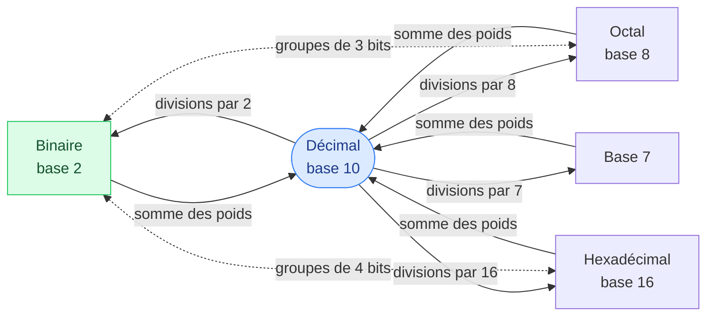

# 2. Conversions entre bases

<mark style="color:blue;">**Deux méthodes suffisent pour passer de n'importe quelle base à n'importe quelle autre.**</mark>

&#x20;


**En bref**

* **Base b → décimal** : on additionne chaque chiffre × son poids ($$b^k$$).
* **Décimal → base b** : on divise par b encore et encore ; les **restes**, lus **de bas en haut**, donnent le nombre.
* Entre deux bases quelconques : on **passe par le décimal** (ou par le binaire pour 2, 8, 16 : voir page 3).


&#x20;

***

&#x20;

## <mark style="color:purple;">01</mark> · La carte des conversions

&#x20;

&#x20;

Le décimal sert de **plaque tournante** : on sait toujours y aller et en revenir. Les raccourcis en pointillés (binaire ↔ octal ↔ hexa) sont expliqués à la [page 3](03-octal-et-hexadecimal.md).

&#x20;

***

&#x20;

## <mark style="color:purple;">02</mark> · Vers le décimal : la somme des poids

&#x20;

C'est la **définition même** du code pondéré : on écrit le poids sous chaque chiffre, puis on additionne.

&#x20;



**Exemple du cours :** $$1001101_{(2)}$$

&#x20;

| Bit   | 1  | 0  | 0  | 1 | 1 | 0 | 1 |
| ----- | -- | -- | -- | - | - | - | - |
| Poids | 64 | 32 | 16 | 8 | 4 | 2 | 1 |

&#x20;

$$64 + 8 + 4 + 1 = 77_{(10)}$$

&#x20;

**Astuce :** en binaire, chaque chiffre vaut 0 ou 1 : on additionne simplement **les poids des bits à 1**, et on ignore les autres.

&#x20;

**Exemple du cours :** $$1110000_{(2)} = 64 + 32 + 16 = 112_{(10)}$$



**Exemple du cours :** $$13B_{(H)}$$

$$1 \cdot 16^2 + 3 \cdot 16^1 + 11 \cdot 16^0 = 256 + 48 + 11 = 315_{(10)}$$

&#x20;

On n'oublie pas que **B = 11**.



**Exemple du cours :** $$473_{(8)}$$

$$4 \cdot 8^2 + 7 \cdot 8^1 + 3 \cdot 8^0 = 256 + 56 + 3 = 315_{(10)}$$



$$1043_{(7)} = 1 \cdot 343 + 0 \cdot 49 + 4 \cdot 7 + 3 \cdot 1 = 374_{(10)}$$



&#x20;

***

&#x20;

## <mark style="color:purple;">03</mark> · Depuis le décimal : les divisions successives

&#x20;



### Diviser par la base

On fait la division **entière** du nombre par la base b. On note le **quotient** et le **reste**.



### Recommencer avec le quotient

On divise le quotient par b, et ainsi de suite, **jusqu'à obtenir un quotient de 0**.



### Lire les restes de bas en haut

Le **dernier** reste est le chiffre de **gauche** (poids fort), le **premier** reste est le chiffre de **droite** (poids faible).



&#x20;

**Exemple du cours :** $$139_{(10)}$$ en binaire.

&#x20;

| Division     | Quotient | Reste                          |
| ------------ | -------- | ------------------------------ |
| 139 ÷ 2      | 69       | **1** ← lsb (bit 0)            |
| 69 ÷ 2       | 34       | **1**                          |
| 34 ÷ 2       | 17       | **0**                          |
| 17 ÷ 2       | 8        | **1**                          |
| 8 ÷ 2        | 4        | **0**                          |
| 4 ÷ 2        | 2        | **0**                          |
| 2 ÷ 2        | 1        | **0**                          |
| 1 ÷ 2        | 0        | **1** ← msb (bit 7)            |

&#x20;

On lit de bas en haut : $$139_{(10)} = 1000'1011_{(2)}$$. Vérification : $$128 + 8 + 2 + 1 = 139$$.

&#x20;

### Pourquoi ça marche ?

&#x20;

Écris le nombre en binaire : $$N = \dots + b_2 \cdot 4 + b_1 \cdot 2 + b_0$$. Tous les termes sauf $$b_0$$ sont **pairs** (multiples de 2). Donc quand on divise N par 2 :

* le **reste** est exactement $$b_0$$, le bit de droite ;
* le **quotient** est $$\dots + b_2 \cdot 2 + b_1$$ : c'est le même nombre **décalé d'un cran vers la droite**.

En recommençant, on récupère $$b_1$$, puis $$b_2$$, etc. Les bits sortent **de droite à gauche** : c'est pour ça qu'on lit les restes **de bas en haut**.

&#x20;


**C'est pareil en base 10 !** 347 ÷ 10 = 34 reste **7**, 34 ÷ 10 = 3 reste **4**, 3 ÷ 10 = 0 reste **3**. De bas en haut : 3, 4, 7. La méthode extrait simplement les chiffres un par un.


&#x20;

### La même méthode pour toutes les bases

&#x20;



$$75_{(10)}$$ en base 7 :

| Division | Quotient | Reste |
| -------- | -------- | ----- |
| 75 ÷ 7   | 10       | **5** |
| 10 ÷ 7   | 1        | **3** |
| 1 ÷ 7    | 0        | **1** |

$$75_{(10)} = 135_{(7)}$$. Vérification : $$49 + 21 + 5 = 75$$.



$$315_{(10)}$$ en hexadécimal :

| Division  | Quotient | Reste           |
| --------- | -------- | --------------- |
| 315 ÷ 16  | 19       | 11 = **B**      |
| 19 ÷ 16   | 1        | **3**           |
| 1 ÷ 16    | 0        | **1**           |

$$315_{(10)} = 13B_{(H)}$$. Un reste entre 10 et 15 s'écrit **avec sa lettre**.



$$315_{(10)}$$ en octal :

| Division | Quotient | Reste |
| -------- | -------- | ----- |
| 315 ÷ 8  | 39       | **3** |
| 39 ÷ 8   | 4        | **7** |
| 4 ÷ 8    | 0        | **4** |

$$315_{(10)} = 473_{(8)}$$.



&#x20;

***

&#x20;

## <mark style="color:purple;">04</mark> · Méthode rapide vers le binaire : soustraire les puissances de 2

&#x20;

Pour le binaire, il existe une méthode souvent plus rapide de tête : on **retire la plus grande puissance de 2 possible**, et on recommence avec le reste.

&#x20;

**Exemple du cours :** $$578_{(10)}$$ en binaire.

&#x20;

| Reste à coder | Plus grande puissance ≤ reste | On met un 1 au bit… | Nouveau reste |
| ------------- | ----------------------------- | ------------------- | ------------- |
| 578           | 512 = $$2^9$$                 | 9                   | 66            |
| 66            | 64 = $$2^6$$                  | 6                   | 2             |
| 2             | 2 = $$2^1$$                   | 1                   | 0             |

&#x20;

Bits 9, 6 et 1 à 1, tous les autres à 0 :

| Bit   | 9   | 8   | 7   | 6  | 5  | 4  | 3 | 2 | 1 | 0 |
| ----- | --- | --- | --- | -- | -- | -- | - | - | - | - |
| Poids | 512 | 256 | 128 | 64 | 32 | 16 | 8 | 4 | 2 | 1 |
| Valeur| **1** | 0 | 0   | **1** | 0 | 0 | 0 | 0 | **1** | 0 |

&#x20;

$$578_{(10)} = 10'0100'0010_{(2)}$$

&#x20;

**Pourquoi choisir la plus grande puissance ?** Parce que la somme de **toutes** les puissances plus petites est inférieure : $$1 + 2 + \dots + 256 = 511 < 512$$. Si on ne prenait pas 512, on ne pourrait jamais atteindre 578 avec les bits restants.

&#x20;

***

&#x20;

## <mark style="color:purple;">05</mark> · Entre deux bases quelconques

&#x20;

On passe par le **décimal** : base de départ → décimal (somme des poids), puis décimal → base d'arrivée (divisions).

&#x20;

**Exemple :** $$4267_{(8)}$$ en base 7.

&#x20;

<mark style="color:orange;">1.</mark> Vers le décimal : $$4 \cdot 512 + 2 \cdot 64 + 6 \cdot 8 + 7 = 2048 + 128 + 48 + 7 = 2231$$.

<mark style="color:orange;">2.</mark> Vers la base 7 :

| Division    | Quotient | Reste |
| ----------- | -------- | ----- |
| 2231 ÷ 7    | 318      | **5** |
| 318 ÷ 7     | 45       | **3** |
| 45 ÷ 7      | 6        | **3** |
| 6 ÷ 7       | 0        | **6** |

$$4267_{(8)} = 2231_{(10)} = 6335_{(7)}$$

&#x20;


**Toujours vérifier** — une conversion se vérifie en faisant le chemin inverse : $$6 \cdot 343 + 3 \cdot 49 + 3 \cdot 7 + 5 = 2058 + 147 + 21 + 5 = 2231$$. Ça prend 30 secondes et évite de perdre des points.


&#x20;

***

&#x20;

## <mark style="color:purple;">06</mark> · Exercices

&#x20;

1. 127(10) en binaire

&#x20;

$$127 = 128 - 1$$ : c'est le nombre juste avant $$2^7$$, donc **7 bits à 1** : `111'1111`. (Comme 999 est juste avant 1000 en décimal.)

&#x20;

2. 1011'1010(2) en décimal

&#x20;

$$128 + 32 + 16 + 8 + 2 = 186$$

&#x20;

3. 127(10) en base 7

&#x20;

127 ÷ 7 = 18 reste 1 ; 18 ÷ 7 = 2 reste 4 ; 2 ÷ 7 = 0 reste 2 → $$241_{(7)}$$.

&#x20;

4. 0xF38 en décimal

&#x20;

$$15 \cdot 256 + 3 \cdot 16 + 8 = 3840 + 48 + 8 = 3896$$

&#x20;

5. 2759(10) en hexadécimal

&#x20;

2759 ÷ 16 = 172 reste 7 ; 172 ÷ 16 = 10 reste 12 (C) ; 10 ÷ 16 = 0 reste 10 (A) → `0xAC7`.

&#x20;

&#x20;

***

&#x20;

## <mark style="color:purple;">07</mark> · À retenir

&#x20;

* **→ décimal** : somme de chiffre × poids.
* **décimal →** : divisions successives par la base, restes lus **de bas en haut**.
* Vers le binaire, de tête : **soustraire la plus grande puissance de 2**.
* Entre deux bases quelconques : passer par le décimal.
* Toujours **vérifier** par le chemin inverse.

&#x20;


**Page suivante** → [3. Octal et hexadécimal](03-octal-et-hexadecimal.md)

