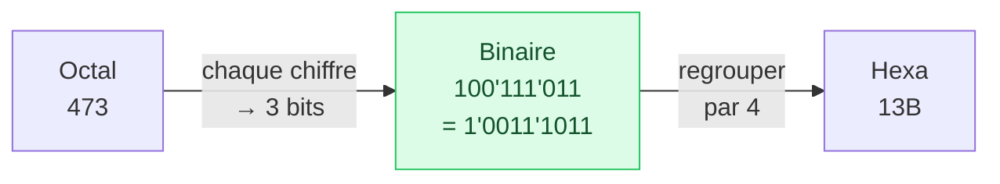

# 3. Octal et hexadécimal

<mark style="color:blue;">**Un long mot binaire est illisible : on le découpe en petits paquets, et chaque paquet devient un seul chiffre.**</mark>

&#x20;


**En bref**

* **Octal** (base 8) : on groupe les bits **par 3**, chaque groupe donne un chiffre de 0 à 7.
* **Hexadécimal** (base 16) : on groupe les bits **par 4**, chaque groupe donne un chiffre de 0 à F.
* On groupe toujours **à partir de la droite** (du lsb).

C'est une conversion **directe**, sans calcul, car $$8 = 2^3$$ et $$16 = 2^4$$.


&#x20;

***

&#x20;

## <mark style="color:purple;">01</mark> · Pourquoi l'octal et l'hexadécimal ?

&#x20;

Lire `1001110001101101` sans erreur est très difficile. Le recopier, encore plus. On le **fractionne** en mots plus courts, codés chacun par un symbole :

&#x20;

| Base        | Taille d'un groupe | Alphabet                                           |
| ----------- | ------------------ | -------------------------------------------------- |
| Octal       | 3 bits             | 0, 1, 2, 3, 4, 5, 6, 7                             |
| Hexadécimal | 4 bits             | 0, 1, 2, 3, 4, 5, 6, 7, 8, 9, A, B, C, D, E, F     |

&#x20;

L'**hexadécimal** est le plus utilisé aujourd'hui : un **octet** (8 bits) s'écrit avec exactement **2 chiffres hexa** (`1001'1100` = `9C`). C'est pour ça qu'on le retrouve partout : adresses mémoire, couleurs web (`#FF8800`), adresses MAC…

&#x20;

***

&#x20;

## <mark style="color:purple;">02</mark> · La table de correspondance

&#x20;

À connaître (ou à savoir reconstruire en comptant en binaire) :

&#x20;

| Décimal | Binaire (4 bits) | Octal | Hexa |
| ------- | ---------------- | ----- | ---- |
| 0       | 0000             | 0     | 0    |
| 1       | 0001             | 1     | 1    |
| 2       | 0010             | 2     | 2    |
| 3       | 0011             | 3     | 3    |
| 4       | 0100             | 4     | 4    |
| 5       | 0101             | 5     | 5    |
| 6       | 0110             | 6     | 6    |
| 7       | 0111             | 7     | 7    |
| 8       | 1000             | 10    | 8    |
| 9       | 1001             | 11    | 9    |
| 10      | 1010             | 12    | **A** |
| 11      | 1011             | 13    | **B** |
| 12      | 1100             | 14    | **C** |
| 13      | 1101             | 15    | **D** |
| 14      | 1110             | 16    | **E** |
| 15      | 1111             | 17    | **F** |

&#x20;


**Astuce pour les lettres** — retiens deux repères : **A = 10** (`1010`, facile : « 10-10 ») et **F = 15** (`1111`, tous les bits à 1). Les autres se déduisent en comptant : B = 11, C = 12…


&#x20;

***

&#x20;

## <mark style="color:purple;">03</mark> · Binaire → octal et hexadécimal

&#x20;

**Exemple du cours :** $$N_2 = 1001110001101101$$

&#x20;



### Découper à partir de la droite

Par **4** pour l'hexa, par **3** pour l'octal. Si le dernier groupe (à gauche) est incomplet, on le complète avec des **zéros à gauche** (ça ne change pas la valeur).



### Convertir chaque groupe séparément

Avec la table ci-dessus.



### Recoller les chiffres dans le même ordre



&#x20;



| Groupe | 1001 | 1100 | 0110 | 1101 |
| ------ | ---- | ---- | ---- | ---- |
| Hexa   | 9    | C    | 6    | D    |

$$1001'1100'0110'1101_{(2)} = 9C6D_{(H)}$$



| Groupe | (00)1 | 001 | 110 | 001 | 101 | 101 |
| ------ | ----- | --- | --- | --- | --- | --- |
| Octal  | 1     | 1   | 6   | 1   | 5   | 5   |

$$1'001'110'001'101'101_{(2)} = 116155_{(8)}$$

&#x20;

Le groupe de gauche n'a qu'un bit : on le complète en `001`.



&#x20;

### Pourquoi ça marche ?

&#x20;

Prenons l'hexa. Dans un nombre binaire, les poids sont 1, 2, 4, 8 | 16, 32, 64, 128 | 256, … On remarque que :

* le **2e groupe** de 4 bits a des poids $$16 \times (1, 2, 4, 8)$$ ;
* le **3e groupe** a des poids $$256 \times (1, 2, 4, 8)$$ ;
* et $$1, 16, 256, \dots$$ sont exactement les **poids de l'hexadécimal** ($$16^0, 16^1, 16^2$$).

Chaque groupe de 4 bits forme donc un nombre entre 0 et 15 qui est **directement** le chiffre hexa de cette position. Même raisonnement pour l'octal avec des groupes de 3 et $$8 = 2^3$$.

&#x20;


**Toujours grouper depuis la DROITE.** Si on groupe depuis la gauche, les groupes ne tombent plus sur les bonnes puissances : `1'0011'1011` groupé depuis la gauche donnerait `1001'1101'1` → faux. C'est le **lsb** qui fixe les frontières, car les poids partent de lui ($$2^0$$).


&#x20;

***

&#x20;

## <mark style="color:purple;">04</mark> · Octal et hexadécimal → binaire

&#x20;

On fait l'inverse : chaque chiffre est remplacé par **son groupe de bits** (3 bits pour l'octal, 4 pour l'hexa), **sans oublier les zéros** à l'intérieur.

&#x20;

* `0x3AB` → `3` = `0011`, `A` = `1010`, `B` = `1011` → `0011'1010'1011` → sur 10 bits : `11'1010'1011`.
* $$732_{(8)}$$ → `7` = `111`, `3` = `011`, `2` = `010` → `111'011'010` = `1'1101'1010`.

&#x20;


**Piège : les zéros à l'intérieur** — le chiffre octal `3` donne `011`, pas `11`. Si on oublie le 0, tous les bits suivants se décalent et le nombre devient faux. Chaque chiffre donne **toujours** exactement 3 bits (octal) ou 4 bits (hexa). Seuls les zéros **tout à gauche** du résultat peuvent être enlevés.


&#x20;

***

&#x20;

## <mark style="color:purple;">05</mark> · Octal ↔ hexadécimal

&#x20;

Il n'y a pas de groupement direct entre 8 et 16 (3 bits contre 4 bits). On **passe par le binaire** :

&#x20;

&#x20;

**Exemple du cours :** $$315_{(10)} = 1'0011'1011_{(2)} = 13B_{(H)} = 473_{(8)}$$.

&#x20;

C'est **beaucoup plus rapide** que de passer par le décimal : aucune division, seulement des regroupements.

&#x20;

***

&#x20;

## <mark style="color:purple;">06</mark> · Exercices

&#x20;

1. 1'0111'0110(2) en hexa et en octal

&#x20;

* Hexa : `1` `0111` `0110` → `0x176`.
* Octal : `101` `110` `110` → $$566_{(8)}$$.
* (En décimal : 374.)

&#x20;

2. 0xAC7 en binaire et en octal

&#x20;

* Binaire : `1010'1100'0111`.
* Octal : `101` `011` `000` `111` → $$5307_{(8)}$$.

&#x20;

3. 4620(8) en hexa

&#x20;

`100` `110` `010` `000` → `1001'1001'0000` → `0x990`.

&#x20;

4. Combien de chiffres hexa pour un registre de 10 bits ?

&#x20;

10 bits = 2 groupes de 4 + 2 bits → **3 chiffres**. Le chiffre de gauche ne peut valoir que 0 à 3 (2 bits seulement) : le maximum est `0x3FF` = 1023.

&#x20;

&#x20;

***

&#x20;

## <mark style="color:purple;">07</mark> · À retenir

&#x20;

* **Octal** = groupes de **3** bits, **hexa** = groupes de **4** bits, **depuis la droite**.
* Chaque chiffre octal → exactement 3 bits, chaque chiffre hexa → exactement 4 bits (garder les zéros intérieurs).
* Octal ↔ hexa : **passer par le binaire**.
* 1 octet = 2 chiffres hexa.

&#x20;


**Page suivante** → [4. BCD, Gray et ASCII](04-bcd-gray-ascii.md)

