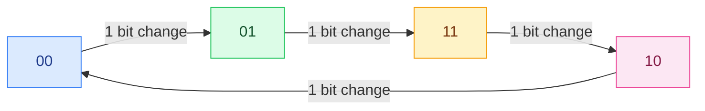

# 4. BCD, Gray et ASCII

<mark style="color:blue;">**Le binaire pur n'est pas toujours le meilleur choix : selon l'usage, on code autrement.**</mark>

&#x20;


**En bref**

* **BCD** : chaque **chiffre décimal** est codé séparément sur 4 bits. Pratique pour les affichages.
* **Gray** : entre deux valeurs voisines, **un seul bit change**. Indispensable pour les capteurs de position.
* **ASCII** : chaque **caractère** (lettre, chiffre, symbole) a un code sur 7 bits. **Unicode** étend ça à toutes les langues.


&#x20;

***

&#x20;

## <mark style="color:purple;">01</mark> · Le code BCD

&#x20;

**BCD** = *Binary Coded Decimal* (décimal codé en binaire). Au lieu de convertir **tout le nombre** en binaire, on code **chaque chiffre décimal individuellement** sur 4 bits.

&#x20;

**Exemple du cours :** $$N_{10} = 40045$$

&#x20;

| Chiffre décimal | 4    | 0    | 0    | 4    | 5    |
| --------------- | ---- | ---- | ---- | ---- | ---- |
| BCD             | 0100 | 0000 | 0000 | 0100 | 0101 |

&#x20;

$$40045_{(10)} = 0100'0000'0000'0100'0101_{(BCD)}$$

&#x20;

### BCD ou binaire pur : ce n'est pas la même chose !

&#x20;

| Nombre | Binaire pur  | BCD                 |
| ------ | ------------ | ------------------- |
| 28     | `0001'1100`  | `0010'1000` (2 · 8) |
| 43     | `0010'1011`  | `0100'0011` (4 · 3) |
| 99     | `0110'0011`  | `1001'1001` (9 · 9) |
| 255    | `1111'1111`  | `0010'0101'0101` (12 bits !) |

&#x20;

### Pourquoi utiliser le BCD ?

&#x20;



### <mark style="color:green;">Avantage</mark>

&#x20;

On passe **directement** aux chiffres décimaux, sans division. Idéal pour piloter un **afficheur 7 segments** (montre, balance, compteur) : chaque groupe de 4 bits commande un chiffre de l'écran.



### <mark style="color:orange;">Inconvénient</mark>

&#x20;

C'est du **gaspillage** : avec 4 bits on a 16 combinaisons, mais **seules 10 sont utilisées** (0000 à 1001). Les codes 1010 à 1111 sont **interdits** en BCD. Il faut donc plus de bits : 255 tient sur 8 bits en binaire, mais demande **12 bits** en BCD.



&#x20;


**Conséquence dans les exercices** — sur un registre de **8 bits**, le BCD ne peut coder que **2 chiffres**, donc de 0 à **99**. Un nombre comme 179 ou 253 a 3 chiffres → 12 bits → **impossible** en BCD sur 8 bits (c'est pour ça que ces cases sont grisées dans l'exercice B.12).


&#x20;

***

&#x20;

## <mark style="color:purple;">02</mark> · Le code de Gray

&#x20;

Le codage des nombres peut avoir une **forme cyclique**, comme le **code de Gray** : en passant d'une valeur à la suivante, **un seul bit change**, et la dernière valeur rejoint la première de la même façon (le code « boucle »).

&#x20;

### Le problème qu'il résout

&#x20;

Imagine une **roue codeuse** qui indique la position d'un axe (un bouton de volume, un moteur). Des capteurs lisent chaque bit.

&#x20;

En binaire pur, passer de 3 (`011`) à 4 (`100`) change **3 bits en même temps**. Mais mécaniquement, les 3 capteurs ne basculent **jamais exactement au même instant**. Pendant une fraction de seconde, on peut lire `111` (7), `000` (0) ou `101` (5) : des positions **complètement fausses**.

&#x20;

Avec le code de Gray, un seul bit change à chaque pas : au pire, on lit l'ancienne position ou la nouvelle, **jamais une valeur absurde**.

&#x20;

### Gray sur 2 bits : la roue du cours

&#x20;

&#x20;

### Gray sur 3 bits

&#x20;

| Décimal | Binaire pur | Gray    | Bit qui a changé |
| ------- | ----------- | ------- | ---------------- |
| 0       | 000         | 000     | —                |
| 1       | 001         | 001     | bit 0            |
| 2       | 010         | 011     | bit 1            |
| 3       | 011         | 010     | bit 0            |
| 4       | 100         | 110     | bit 2            |
| 5       | 101         | 111     | bit 0            |
| 6       | 110         | 101     | bit 1            |
| 7       | 111         | 100     | bit 0            |
| (retour à 0) |        | 000     | bit 2            |

&#x20;

Comment construire le code de Gray (méthode du miroir)

&#x20;

1. Pars de Gray 1 bit : `0`, `1`.
2. Écris la liste, puis **la même liste à l'envers** en dessous (le miroir) : `0, 1, 1, 0`.
3. Ajoute un **0 devant** la première moitié et un **1 devant** la seconde : `00, 01, 11, 10`.
4. Recommence pour 3 bits : `000, 001, 011, 010, 110, 111, 101, 100`.

**Pourquoi ça marche ?** Dans chaque moitié, un seul bit change (par construction). Au milieu, le miroir répète le même code, et seul le bit ajouté devant passe de 0 à 1.

&#x20;

&#x20;

***

&#x20;

## <mark style="color:purple;">03</mark> · Le codage des caractères : ASCII

&#x20;

Un ordinateur ne stocke que des nombres. Pour stocker du **texte**, on donne un **numéro** à chaque caractère.

&#x20;

La **table ASCII** (*American Standard Code for Information Interchange*) est un standard ISO sur **7 bits** : il y a donc $$2^7 = 128$$ caractères (codes 0 à 127).

&#x20;

| Codes         | Contenu                                                     |
| ------------- | ----------------------------------------------------------- |
| 0 à 31        | caractères **non imprimables** (commandes) : NUL, LF (nouvelle ligne, 10), CR (retour chariot, 13), ESC… |
| 32            | l'espace                                                    |
| 48 à 57       | les chiffres `0` à `9`                                      |
| 65 à 90       | les majuscules `A` à `Z`                                    |
| 97 à 122      | les minuscules `a` à `z`                                    |
| 127           | DEL                                                         |

&#x20;

### Les codes à retenir

&#x20;

| Caractère | Décimal | Hexa  | Binaire    |
| --------- | ------- | ----- | ---------- |
| espace    | 32      | 0x20  | 010'0000   |
| `0`       | 48      | 0x30  | 011'0000   |
| `9`       | 57      | 0x39  | 011'1001   |
| `A`       | 65      | 0x41  | 100'0001   |
| `Z`       | 90      | 0x5A  | 101'1010   |
| `a`       | 97      | 0x61  | 110'0001   |

&#x20;


**Deux astuces qui viennent de la table**

* **Chiffre caractère → valeur** : le caractère `7` a le code 0x37. Pour obtenir la valeur 7, on **retire 0x30** (48). C'est pour ça que les chiffres commencent à 0x30 : le chiffre se lit directement dans le demi-octet de droite.
* **Majuscule ↔ minuscule** : `a` − `A` = 97 − 65 = **32** = $$2^5$$. Passer de majuscule à minuscule, c'est **mettre le bit 5 à 1** : un seul bit de différence.


&#x20;

### ASCII étendu et Unicode

&#x20;

* L'**ASCII étendu** utilise le **8e bit** pour ajouter 128 caractères (codes 128 à 255) : lettres accentuées (é, è, ç…), symboles, caractères de dessin. Problème : il existe **plusieurs versions** selon les régions, incompatibles entre elles.
* La table **UNICODE** est une table **universelle** qui contient l'ASCII (les 128 premiers codes sont identiques) **et** toutes les variantes régionales : accents, alphabets grec, cyrillique, chinois, emojis… Elle utilise plus de bits par caractère.

&#x20;

***

&#x20;

## <mark style="color:purple;">04</mark> · Exercices

&#x20;

1. Code 63(10) en BCD et en binaire pur

&#x20;

* BCD : `6` = 0110, `3` = 0011 → `0110'0011`.
* Binaire pur : `0011'1111`.

&#x20;

2. `1001'0111` est-il un code BCD valide ? Et `0101'1100` ?

&#x20;

* `1001'0111` : 1001 = 9, 0111 = 7 → valide, c'est **97**.
* `0101'1100` : 1100 = 12 n'est **pas** un chiffre décimal → **invalide** en BCD.

&#x20;

3. Quel est le code ASCII de `B` ? de `b` ? de `5` ?

&#x20;

`B` = 66 (0x42), `b` = 98 (0x62), `5` = 53 (0x35).

&#x20;

4. Pourquoi une roue codeuse en binaire pur peut-elle donner une position absurde ?

&#x20;

Parce qu'entre deux positions voisines, **plusieurs bits** peuvent changer, et les capteurs ne basculent jamais exactement en même temps : on peut lire une combinaison intermédiaire fausse. Le code de Gray évite ça : **un seul bit change** à chaque pas.

&#x20;

&#x20;

***

&#x20;

## <mark style="color:purple;">05</mark> · À retenir

&#x20;

* **BCD** : 4 bits par chiffre décimal, seulement 10 codes sur 16 utilisés → 8 bits = 0 à 99.
* **Gray** : un seul bit change entre deux valeurs voisines, et le code boucle.
* **ASCII** : 7 bits, 128 caractères, les 32 premiers non imprimables ; `0` = 0x30, `A` = 0x41, `a` = 0x61.
* **Unicode** : table universelle qui contient l'ASCII.

&#x20;


**Page suivante** → [5. Arithmétique binaire et dépassement](05-arithmetique-et-depassement.md)

