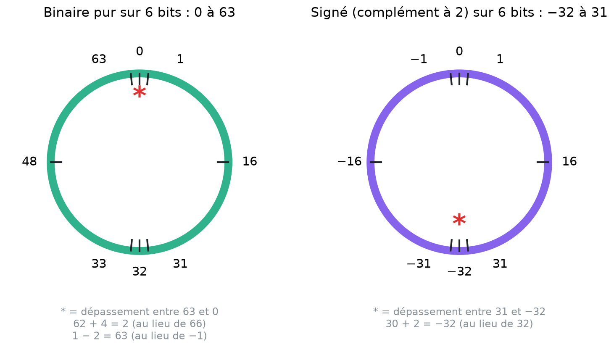

# 5. Arithmétique binaire et dépassement

<mark style="color:blue;">**On calcule en binaire exactement comme à l'école primaire, mais un registre a un nombre de bits limité : il peut déborder.**</mark>

&#x20;


**En bref**

* Addition : $$1 + 1 = 10$$ → on écrit 0 et on **retient 1**.
* Soustraction : $$0 - 1$$ → on **emprunte** 1 à la colonne de gauche.
* Sur **n bits**, les nombres vivent sur un **cercle** : après $$2^n - 1$$ on revient à 0. Si le vrai résultat sort de la plage, il y a **dépassement** et le résultat binaire est **incohérent**.


&#x20;

***

&#x20;

## <mark style="color:purple;">01</mark> · L'addition binaire

&#x20;

Il n'y a que **4 cas** à connaître (plus la retenue) :

&#x20;

| Calcul        | Résultat | On écrit | On retient |
| ------------- | -------- | -------- | ---------- |
| 0 + 0         | 0        | 0        | 0          |
| 0 + 1         | 1        | 1        | 0          |
| 1 + 1         | 2 = `10` | **0**    | **1**      |
| 1 + 1 + 1 (retenue) | 3 = `11` | **1** | **1**    |

&#x20;

**Pourquoi « 1 + 1 = 10 » ?** Parce que 2 n'existe pas comme chiffre en binaire. C'est exactement comme 5 + 5 = 10 en décimal : on dépasse le plus grand chiffre (9 en décimal, 1 en binaire), donc on écrit 0 et on reporte une unité à la colonne suivante, qui vaut **2 fois plus**.

&#x20;

### Exemple : 23 + 46 sur 8 bits

&#x20;

On pose l'addition et on va **de droite à gauche**, en notant les retenues au-dessus :

&#x20;

```
retenues     0111'1100
               0001'0111     (23)
             + 0010'1110     (46)
             -----------
               0100'0101     (69)
```

&#x20;

Vérification : $$64 + 4 + 1 = 69 = 23 + 46$$. Le résultat est **cohérent**.

&#x20;

***

&#x20;

## <mark style="color:purple;">02</mark> · La soustraction binaire

&#x20;

| Calcul   | On écrit | On emprunte |
| -------- | -------- | ----------- |
| 0 − 0    | 0        | 0           |
| 1 − 0    | 1        | 0           |
| 1 − 1    | 0        | 0           |
| 0 − 1    | **1**    | **1**       |

&#x20;

**Pourquoi 0 − 1 = 1 avec un emprunt ?** On emprunte 1 à la colonne de gauche, qui vaut **2** dans la colonne actuelle. On calcule donc $$2 - 1 = 1$$, et on n'oublie pas de retirer 1 à la colonne de gauche (comme en décimal quand on fait 30 − 7).

&#x20;

### Exemple : 158 − 96 sur 8 bits

&#x20;

```
emprunts     1100'0000
               1001'1110     (158)
             - 0110'0000     (96)
             -----------
               0011'1110     (62)
```

&#x20;

Vérification : $$32 + 16 + 8 + 4 + 2 = 62$$. Cohérent.

&#x20;


En pratique, les circuits **ne soustraient pas** : ils **additionnent l'opposé**, grâce au complément à 2. C'est beaucoup plus simple à fabriquer (un seul circuit additionneur). On le verra à la [page suivante](06-complement-a-2.md).


&#x20;

***

&#x20;

## <mark style="color:purple;">03</mark> · Un registre a une taille fixe

&#x20;

Un registre de **n bits** ne peut stocker que n bits, ni plus ni moins. Si un calcul produit une retenue au-delà du bit de gauche, elle est **perdue** : elle n'a nulle part où aller.

&#x20;

C'est comme le **compteur kilométrique** d'une vieille voiture à 6 chiffres : après 999 999 km, il affiche 000 000. La voiture a bien roulé 1 000 000 km, mais le compteur n'a pas la place de l'écrire.

&#x20;

### Le cercle des nombres

&#x20;

On représente donc les valeurs possibles sur un **cercle** : après la plus grande valeur, on revient à 0.

&#x20;

<figure><figcaption><p>Sur 6 bits, les 64 combinaisons forment un cercle. L'étoile rouge marque l'endroit où l'on « saute » d'un bout de la plage à l'autre : le dépassement.</p></figcaption></figure>

&#x20;

En **binaire pur sur 6 bits**, la plage va de **0 à 63** ($$2^6 - 1$$) :

* additionner = **tourner dans le sens horaire** ;
* soustraire = **tourner dans le sens antihoraire** ;
* si on traverse l'étoile (entre 63 et 0), le résultat est **faux** :

&#x20;

| Calcul    | Vrai résultat | Résultat sur 6 bits | Pourquoi                         |
| --------- | ------------- | ------------------- | -------------------------------- |
| 62 + 4    | 66            | **2**               | 66 − 64 = 2 : on a fait un tour  |
| 1 − 2     | −1            | **63**              | −1 + 64 = 63 : on a reculé d'un tour |

&#x20;


**La règle mathématique** — sur n bits, le résultat est toujours le vrai résultat **modulo** $$2^n$$ : on ajoute ou on retire $$2^n$$ jusqu'à retomber dans la plage. 66 − 64 = 2 ; −1 + 64 = 63.


&#x20;

***

&#x20;

## <mark style="color:purple;">04</mark> · Détecter un dépassement (nombres non signés)

&#x20;



### Addition

&#x20;

Il y a dépassement si l'addition produit une **retenue sortante** (au-delà du msb).

&#x20;

**Exemple :** 146 + 174 sur 8 bits

```
retenues   0111'1100
             1001'0010   (146)
           + 1010'1110   (174)
           -----------
         1 | 0100'0000   (64)
```

Le 1 de gauche est **perdu**. Résultat lu : 64 au lieu de 320 → <mark style="color:red;">**incohérent**</mark> (320 > 255).



### Soustraction

&#x20;

Il y a dépassement s'il faut **emprunter au-delà du msb** (le résultat serait négatif).

&#x20;

**Exemple :** 35 − 79 sur 8 bits

```
emprunts   1011'1000
             0010'0011   (35)
           - 0100'1111   (79)
           -----------
             1101'0100   (212)
```

Emprunt final nécessaire. Résultat lu : 212 au lieu de −44 → <mark style="color:red;">**incohérent**</mark> (pas de négatif en binaire pur). 212 = −44 + 256.



&#x20;


**« Vérifier la cohérence du résultat »** (consigne des exercices B.2 et B.7) veut dire : **convertir le résultat binaire en décimal** et le comparer au vrai calcul. S'ils sont égaux, c'est cohérent ; sinon, il y a eu dépassement.


&#x20;

***

&#x20;

## <mark style="color:purple;">05</mark> · Exercices

&#x20;

<details>

<summary>1. Calcule 0110'1001 + 0001'0111 sur 8 bits. Cohérent ?</summary>

&#x20;

105 + 23 = 128 → `1000'0000`. Pas de retenue sortante : **cohérent** en binaire pur (128 ≤ 255).

&#x20;

</details>

<details>

<summary>2. Sur 4 bits non signés, que donne 12 + 7 ?</summary>

&#x20;

19 − 16 = **3** (`0011`) avec une retenue sortante : **dépassement**, incohérent.

&#x20;

</details>

<details>

<summary>3. Sur 8 bits non signés, que donne 10 − 20 ?</summary>

&#x20;

−10 + 256 = **246** (`1111'0110`) : **dépassement** (résultat négatif impossible en binaire pur).

&#x20;

</details>

&#x20;

***

&#x20;

## <mark style="color:purple;">06</mark> · À retenir

&#x20;

* Addition : 1 + 1 = 0, retenue 1 ; 1 + 1 + 1 = 1, retenue 1.
* Soustraction : 0 − 1 = 1, emprunt 1.
* Sur n bits, les valeurs forment un **cercle** : résultat = vrai résultat **modulo** $$2^n$$.
* Non signé : **retenue sortante** (addition) ou **emprunt final** (soustraction) = **dépassement** = résultat incohérent.

&#x20;


**Page suivante** → [6. Nombres signés : complément à 2](06-complement-a-2.md)

