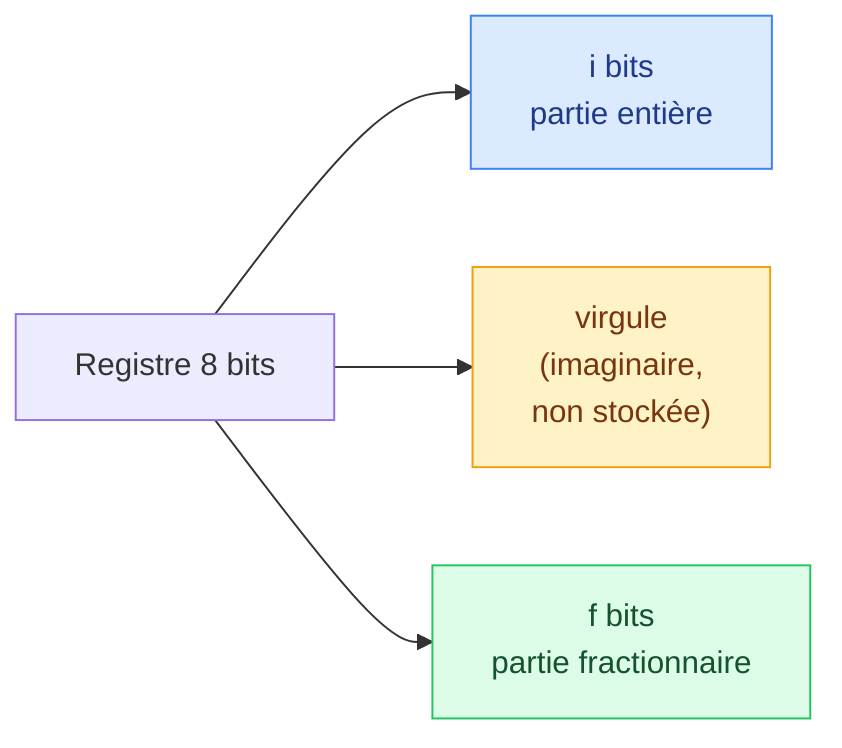

# 7. Nombres réels : virgule fixe

<mark style="color:blue;">**Après la virgule, les poids continuent : 1/2, 1/4, 1/8… Avec un nombre de bits limité, on perd un peu de précision.**</mark>

&#x20;


**En bref**

* Après la virgule, les poids binaires sont $$2^{-1} = 0{,}5$$, $$2^{-2} = 0{,}25$$, $$2^{-3} = 0{,}125$$…
* En **virgule fixe**, on décide une fois pour toutes **combien de bits** vont avant et après la virgule. La virgule n'est **pas stockée** : elle est « imaginaire ».
* Méthode rapide : **multiplier par $$2^f$$** (f = nombre de bits après la virgule), **arrondir**, coder l'entier obtenu.
* L'**erreur absolue** = |valeur voulue − valeur codée|.


&#x20;

***

&#x20;

## <mark style="color:purple;">01</mark> · Les poids après la virgule

&#x20;

C'est la suite logique du code pondéré : en décimal, après la virgule on a $$10^{-1}$$, $$10^{-2}$$… En binaire, on a :

&#x20;

| Position | $$2^2$$ | $$2^1$$ | $$2^0$$ | **,** | $$2^{-1}$$ | $$2^{-2}$$ | $$2^{-3}$$ | $$2^{-4}$$ | $$2^{-5}$$ |
| -------- | ------- | ------- | ------- | ----- | ---------- | ---------- | ---------- | ---------- | ---------- |
| Poids    | 4       | 2       | 1       | **,** | 0,5        | 0,25       | 0,125      | 0,0625     | 0,03125    |

&#x20;

Chaque poids est **la moitié** du précédent, aussi après la virgule.

&#x20;

**Exemple :** $$10{,}01_{(2)} = 1 \cdot 2 + 0 \cdot 1 + 0 \cdot 0{,}5 + 1 \cdot 0{,}25 = 2{,}25$$

&#x20;

***

&#x20;

## <mark style="color:purple;">02</mark> · Convertir la partie après la virgule : multiplier par 2

&#x20;

Pour la partie entière, on divise par 2 (page 2). Pour la partie **fractionnaire**, on fait l'inverse : on **multiplie par 2** et on garde la **partie entière** (0 ou 1) comme bit suivant.

&#x20;

**Exemple :** 0,5663 en binaire.

&#x20;

| Calcul              | Résultat | Bit (partie entière) | On continue avec |
| ------------------- | -------- | -------------------- | ---------------- |
| 0,5663 × 2          | 1,1326   | **1** ($$2^{-1}$$)   | 0,1326           |
| 0,1326 × 2          | 0,2652   | **0** ($$2^{-2}$$)   | 0,2652           |
| 0,2652 × 2          | 0,5304   | **0** ($$2^{-3}$$)   | 0,5304           |
| 0,5304 × 2          | 1,0608   | **1** ($$2^{-4}$$)   | 0,0608           |
| …                   |          |                      |                  |

&#x20;

$$0{,}5663 \approx 0{,}1001\dots_{(2)}$$ — on lit les bits **de haut en bas** (cette fois, le premier bit obtenu est le plus proche de la virgule).

&#x20;

**Pourquoi ça marche ?** Multiplier par 2 décale tous les bits d'un cran vers la **gauche**. Le premier bit après la virgule passe donc **devant** la virgule : c'est la partie entière qu'on vient de lire.

&#x20;


**Ça ne s'arrête pas toujours** — certains nombres simples en décimal ont une écriture binaire **infinie**. Par exemple 0,1 = 0,0001100110011…₍₂₎, exactement comme 1/3 = 0,333… en décimal. Avec un nombre de bits limité, on doit **couper** : on fait une **erreur**. Seuls les nombres qui sont des sommes de puissances de 2 (comme 2,25 = 2 + 1/4) tombent juste.


&#x20;

***

&#x20;

## <mark style="color:purple;">03</mark> · Le format virgule fixe

&#x20;

Un registre de **n bits** est partagé en :

* **i bits** pour la partie entière ;
* **f bits** pour la partie fractionnaire ;
* avec $$i + f = n$$.

&#x20;

&#x20;

La virgule n'existe pas dans le registre : c'est **une convention** entre celui qui écrit et celui qui lit. Le registre contient simplement un **entier** égal à la valeur multipliée par $$2^f$$.

&#x20;

### Le compromis : plage contre précision

&#x20;

| Format (8 bits)         | Plus grande valeur | Pas (précision) |
| ----------------------- | ------------------ | --------------- |
| 8 bits entiers, 0 après | 255                | 1               |
| 5 entiers, 3 après      | 31,875             | 0,125           |
| 3 entiers, 5 après      | 7,96875            | 0,03125         |
| 0 entier, 8 après       | 0,99609375         | 0,00390625      |

&#x20;

**Pourquoi un compromis ?** Le nombre total de bits est fixe. Chaque bit qu'on donne à la partie fractionnaire **double la précision**, mais **divise par deux la plage**. Pour avoir « le plus de précision possible », on donne à la partie entière **juste le nombre de bits nécessaire**, et tout le reste à la partie fractionnaire.

&#x20;

### La méthode rapide

&#x20;



### Choisir f

Compte les bits nécessaires pour la partie entière (+ 1 bit de signe si le nombre est négatif). Le reste du registre donne f.



### Multiplier par $$2^f$$ et arrondir à l'entier le plus proche

C'est l'entier qui sera stocké dans le registre.



### Coder cet entier en binaire

En binaire pur, ou en complément à 2 s'il est négatif.



### Calculer la valeur réellement codée et l'erreur

Valeur codée = entier ÷ $$2^f$$. Erreur absolue = |valeur voulue − valeur codée|.



&#x20;

***

&#x20;

## <mark style="color:purple;">04</mark> · Exemple 1 : 16,5663 sur 8 bits

&#x20;

<mark style="color:orange;">1. Choisir f.</mark> La partie entière 16 = `10000` demande **5 bits**. Il reste $$8 - 5 = 3$$ bits après la virgule : **f = 3**, pas = $$2^{-3} = 0{,}125$$.

<mark style="color:orange;">2. Multiplier par $$2^3 = 8$$ :</mark> $$16{,}5663 \times 8 = 132{,}53$$.

<mark style="color:orange;">3. Arrondir :</mark> deux candidats.

&#x20;

| Choix         | Entier | Binaire (8 bits)    | Avec la virgule | Valeur codée | Erreur absolue |
| ------------- | ------ | ------------------- | --------------- | ------------ | -------------- |
| tronquer      | 132    | `1000'0100`         | `10000,100`     | 16,5         | 0,0663         |
| **arrondir**  | **133**| **`1000'0101`**     | **`10000,101`** | **16,625**   | **0,0587**     |

&#x20;

L'arrondi à l'entier le plus proche donne la **meilleure précision** : $$16{,}5663 \approx 10000{,}101_{(2)} = 16{,}625$$, erreur ≈ **0,059**.

&#x20;


**L'erreur maximale** — en arrondissant, on ne se trompe jamais de plus d'**un demi-pas** : ici $$0{,}125 / 2 = 0{,}0625$$. Notre erreur (0,0587) est bien en dessous. En tronquant, l'erreur peut aller jusqu'à un pas entier.


&#x20;

***

&#x20;

## <mark style="color:purple;">05</mark> · Exemple 2 : −2,25 sur 8 bits (signé)

&#x20;

<mark style="color:orange;">1. Choisir f.</mark> La partie entière 2 = `10` demande 2 bits, **plus 1 bit de signe** (complément à 2) : **3 bits entiers**, donc **f = 5**. Plage : −4 à 3,96875.

<mark style="color:orange;">2. Multiplier par $$2^5 = 32$$ :</mark> $$-2{,}25 \times 32 = -72$$ (entier exact : pas d'arrondi).

<mark style="color:orange;">3. Coder −72 en complément à 2 :</mark> 72 = `0100'1000` → inverser `1011'0111` → +1 → **`1011'1000`**.

<mark style="color:orange;">4. Lecture avec la virgule :</mark> `101,11000`. Avec les poids signés :

| Bit   | 1      | 0   | 1   | , | 1   | 1    | 0     | 0      | 0       |
| ----- | ------ | --- | --- | - | --- | ---- | ----- | ------ | ------- |
| Poids | **−4** | 2   | 1   | , | 0,5 | 0,25 | 0,125 | 0,0625 | 0,03125 |

$$-4 + 1 + 0{,}5 + 0{,}25 = -2{,}25$$

&#x20;

**Erreur : 0**, car 2,25 = 2 + 1/4 est une somme exacte de puissances de 2.

&#x20;

***

&#x20;

## <mark style="color:purple;">06</mark> · Exercices

&#x20;

1. Que vaut 101,011(2) ?

&#x20;

$$4 + 1 + 0{,}25 + 0{,}125 = 5{,}375$$

&#x20;

2. Code 3,7 sur 8 bits non signés avec la meilleure précision. Erreur ?

&#x20;

3 = `11` → 2 bits entiers, f = 6. $$3{,}7 \times 64 = 236{,}8$$ → arrondi **237** = `1110'1101` → `11,101101` = 237/64 = **3,703125**. Erreur ≈ **0,0031**.

&#x20;

3. Pourquoi 0,1 ne peut-il pas être codé exactement en binaire ?

&#x20;

Parce que 0,1 = 1/10 n'est pas une somme finie de puissances de 2 : son écriture binaire est **infinie** (0,000110011…). On doit couper, donc il reste toujours une erreur.

&#x20;

&#x20;

***

&#x20;

## <mark style="color:purple;">07</mark> · À retenir

&#x20;

* Après la virgule : poids 0,5 ; 0,25 ; 0,125 ; 0,0625…
* Partie fractionnaire → binaire : **multiplier par 2**, garder la partie entière, lire de haut en bas.
* Virgule fixe : i bits entiers + f bits fractionnaires ; la virgule n'est **pas stockée**.
* Méthode : choisir f (minimum de bits entiers), **× $$2^f$$, arrondir**, coder l'entier (complément à 2 si négatif).
* **Erreur absolue** = |voulu − codé| ≤ demi-pas si on arrondit.

&#x20;


**Page suivante** → [8. Exercices B.1 à B.12](08-exercices-codage.md)

