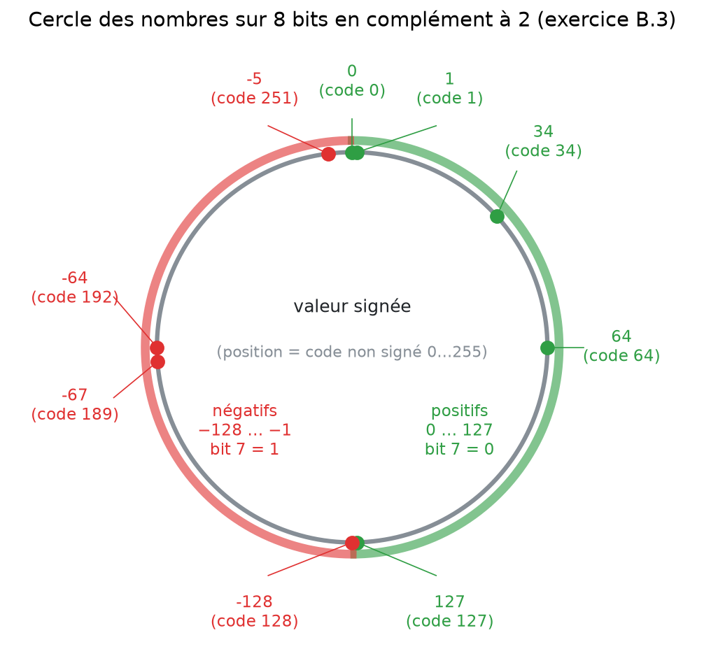

# 8. Exercices B.1 à B.12

<mark style="color:blue;">**Toutes les fiches du cours, avec le chemin complet jusqu'à la réponse.**</mark>

&#x20;


**Mode d'emploi** — remplis les tableaux **sur papier** avant d'ouvrir la correction. Entre parenthèses, la page à relire si tu bloques :

* conversions → [2. Conversions](02-conversions.md) et [3. Octal et hexa](03-octal-et-hexadecimal.md) ;
* BCD → [4. BCD, Gray, ASCII](04-bcd-gray-ascii.md) ;
* additions, cohérence → [5. Arithmétique](05-arithmetique-et-depassement.md) ;
* nombres négatifs → [6. Complément à 2](06-complement-a-2.md) ;
* nombres à virgule → [7. Virgule fixe](07-virgule-fixe.md).


&#x20;

***

&#x20;

## <mark style="color:purple;">00</mark> · Exercices des diapositives

&#x20;

<details>

<summary>Convertir 139(10) et 578(10) en binaire pur</summary>

&#x20;

* 139 = 128 + 8 + 2 + 1 → **`1000'1011`**
* 578 = 512 + 64 + 2 → **`10'0100'0010`**

(Détail des deux méthodes dans [2. Conversions](02-conversions.md).)

&#x20;

</details>

<details>

<summary>Convertir 1001101(2) et 1110000(2) en décimal</summary>

&#x20;

* `1001101` = 64 + 8 + 4 + 1 = **77**
* `1110000` = 64 + 32 + 16 = **112**

&#x20;

</details>

<details>

<summary>Convertir 315(10) en octal et en hexadécimal</summary>

&#x20;

315 = `1'0011'1011` → hexa `13B` ; regroupé par 3 : `100'111'011` → octal `473`.

Vérification : $$1 \cdot 256 + 3 \cdot 16 + 11 = 315$$ et $$4 \cdot 64 + 7 \cdot 8 + 3 = 315$$.

&#x20;

</details>

&#x20;

***

&#x20;

## <mark style="color:purple;">01</mark> · Exercice B.1 — Tableau des bases

&#x20;

**Consigne :** remplir le tableau en fonction des bases.

&#x20;

| Décimale | Binaire   | Octale | Hexadécimale | Base 7 |
| -------- | --------- | ------ | ------------ | ------ |
| 75       |           |        |              |        |
| 127      |           |        |              |        |
|          | 101110110 |        |              |        |
|          |           | 4267   |              |        |
|          |           |        | ac7          |        |
|          |           |        | f38          |        |
|          |           | 4620   |              |        |

&#x20;

<details>

<summary>Indice</summary>

&#x20;

Pour chaque ligne, commence par obtenir le **binaire** (directement si on part de l'octal ou de l'hexa, par groupes), puis le **décimal**. La base 7 se calcule **depuis le décimal** par divisions successives par 7.

&#x20;

</details>

<details>

<summary>Solution</summary>

&#x20;

| Décimale | Binaire           | Octale | Hexadécimale | Base 7 |
| -------- | ----------------- | ------ | ------------ | ------ |
| **75**   | 100'1011          | 113    | 4B           | 135    |
| **127**  | 111'1111          | 177    | 7F           | 241    |
| 374      | **1'0111'0110**   | 566    | 176          | 1043   |
| 2231     | 1000'1011'0111    | **4267** | 8B7        | 6335   |
| 2759     | 1010'1100'0111    | 5307   | **AC7**      | 11021  |
| 3896     | 1111'0011'1000    | 7470   | **F38**      | 14234  |
| 2448     | 1001'1001'0000    | **4620** | 990        | 10065  |

&#x20;

**Détail de quelques lignes :**

* **75** : 75 = 64 + 8 + 2 + 1 → `100'1011`. Par 3 : `1|001|011` → 113. Par 4 : `100|1011` → 4B. Base 7 : 75 ÷ 7 = 10 r **5**, 10 ÷ 7 = 1 r **3**, 1 ÷ 7 = 0 r **1** → 135.
* **4267₍₈₎** : chaque chiffre → 3 bits : `100 010 110 111` → regroupé par 4 : `1000 1011 0111` → 8B7. Décimal : 4·512 + 2·64 + 6·8 + 7 = 2231.
* **AC7** : `1010 1100 0111` → par 3 : `101 011 000 111` → 5307. Décimal : 10·256 + 12·16 + 7 = 2759.
* **Base 7 de 2759** : 2759 ÷ 7 = 394 r **1** ; 394 ÷ 7 = 56 r **2** ; 56 ÷ 7 = 8 r **0** ; 8 ÷ 7 = 1 r **1** ; 1 ÷ 7 = 0 r **1** → 11021.

&#x20;

</details>

&#x20;

***

&#x20;

## <mark style="color:purple;">02</mark> · Exercice B.2 — Opérations sur 8 bits

&#x20;

**Consigne :** réaliser en binaire les opérations suivantes sur 8 bits et vérifier la cohérence du résultat : **23 + 46**, **146 + 174**, **158 − 96**, **35 − 79**.

&#x20;

<details>

<summary>Indice</summary>

&#x20;

Ici, les nombres sont **non signés** (0 à 255). Un résultat est cohérent si le vrai résultat est entre 0 et 255 (pas de retenue sortante, pas d'emprunt final).

&#x20;

</details>

<details>

<summary>Solution</summary>

&#x20;

**23 + 46**

```
retenues     0111'1100
               0001'0111     (23)
             + 0010'1110     (46)
             -----------
               0100'0101     (69)
```

69 = 23 + 46 → <mark style="color:green;">**cohérent**</mark>.

&#x20;

**146 + 174**

```
retenues     0111'1100
               1001'0010     (146)
             + 1010'1110     (174)
             -----------
           1 | 0100'0000     (64)
```

La retenue sortante est perdue : on lit 64 au lieu de 320 → <mark style="color:red;">**incohérent**</mark> (320 > 255, dépassement). 64 = 320 − 256.

&#x20;

**158 − 96**

```
emprunts     1100'0000
               1001'1110     (158)
             - 0110'0000     (96)
             -----------
               0011'1110     (62)
```

62 = 158 − 96 → <mark style="color:green;">**cohérent**</mark>.

&#x20;

**35 − 79**

```
emprunts     1011'1000
               0010'0011     (35)
             - 0100'1111     (79)
             -----------
             1101'0100       (212)
```

Il faut emprunter au-delà du bit 7 : on lit 212 au lieu de −44 → <mark style="color:red;">**incohérent**</mark> en non signé (212 = −44 + 256). Remarque : lu en **complément à 2**, `1101'0100` vaut justement **−44** !

&#x20;

&#x20;

</details>

&#x20;

***

&#x20;

## <mark style="color:purple;">03</mark> · Exercice B.3 — Le cercle des nombres

&#x20;

**Consigne :** représenter les valeurs suivantes dans un cercle des nombres sur 8 bits (0-255) si elles sont codées en complément à 2 : **34, 0, −5, 127, −67, −128, 1, 64, −64**.

&#x20;

<details>

<summary>Indice</summary>

&#x20;

Chaque valeur se place sur la position de son **code non signé** : un positif garde sa valeur, un négatif −x se place en $$256 - x$$.

&#x20;

</details>

<details>

<summary>Solution</summary>

&#x20;

| Valeur | Position sur le cercle (code) | Binaire     |
| ------ | ----------------------------- | ----------- |
| 34     | 34                            | 0010'0010   |
| 0      | 0                             | 0000'0000   |
| −5     | 256 − 5 = **251**             | 1111'1011   |
| 127    | 127                           | 0111'1111   |
| −67    | 256 − 67 = **189**            | 1011'1101   |
| −128   | 256 − 128 = **128**           | 1000'0000   |
| 1      | 1                             | 0000'0001   |
| 64     | 64                            | 0100'0000   |
| −64    | 256 − 64 = **192**            | 1100'0000   |

&#x20;

<figure><figcaption><p>Les positifs occupent la moitié droite (0 à 127), les négatifs la moitié gauche (128 à 255 = −128 à −1).</p></figcaption></figure>

&#x20;

À remarquer : 127 et −128 sont **voisins** sur le cercle (codes 127 et 128) : c'est l'endroit du **dépassement signé**.

&#x20;

</details>

&#x20;

***

&#x20;

## <mark style="color:purple;">04</mark> · Exercice B.4 — Binaire vers octal, hexa, décimal, BCD

&#x20;

| Binaire   | Octal | Hexadécimal | Décimal | BCD (forme binaire) |
| --------- | ----- | ----------- | ------- | ------------------- |
| 0010'1011 |       |             |         |                     |
| 0001'1100 |       |             |         |                     |
| 1111'1111 |       |             |         |                     |
| 0011'1111 |       |             |         |                     |

&#x20;

<details>

<summary>Indice</summary>

&#x20;

Octal et hexa : regroupe les bits. Pour le BCD, il faut d'abord le **décimal**, puis coder **chaque chiffre** sur 4 bits.

&#x20;

</details>

<details>

<summary>Solution</summary>

&#x20;

| Binaire   | Octal | Hexadécimal | Décimal | BCD                 |
| --------- | ----- | ----------- | ------- | ------------------- |
| 0010'1011 | 53    | 2B          | 43      | 0100'0011           |
| 0001'1100 | 34    | 1C          | 28      | 0010'1000           |
| 1111'1111 | 377   | FF          | 255     | 0010'0101'0101      |
| 0011'1111 | 77    | 3F          | 63      | 0110'0011           |

&#x20;

* Octal de `0010'1011` : depuis la droite `00|101|011` → 0 5 3 → **53**.
* 255 a trois chiffres → **12 bits** en BCD (et ne tiendrait donc pas sur 8 bits).
* Le BCD n'est **pas** le binaire : 28 = `0001'1100` en binaire, mais `0010'1000` en BCD.

&#x20;

</details>

&#x20;

***

&#x20;

## <mark style="color:purple;">05</mark> · Exercice B.5 — Registre de 10 bits (non signé)

&#x20;

| Hexadécimal | Octal  | Binaire (10 bits) | Décimal (non signé) |
| ----------- | ------ | ----------------- | ------------------- |
| 0x3AB       |        |                   |                     |
|             | 732₍₈₎ |                   |                     |
|             |        | 01'1010'0011      |                     |
|             |        |                   | 759                 |
| 0x3FE       |        |                   |                     |
|             | 111₍₈₎ |                   |                     |
|             |        | 10'0000'0000      |                     |
|             |        |                   | 511                 |

&#x20;

<details>

<summary>Indice</summary>

&#x20;

10 bits = 2 + 4 + 4 bits (3 chiffres hexa, celui de gauche ≤ 3) et 1 + 3 + 3 + 3 bits (4 chiffres octaux, celui de gauche ≤ 1). Complète toujours le binaire à **10 bits** avec des zéros à gauche.

&#x20;

</details>

<details>

<summary>Solution</summary>

&#x20;

| Hexadécimal | Octal    | Binaire (10 bits) | Décimal |
| ----------- | -------- | ----------------- | ------- |
| **0x3AB**   | 1653     | 11'1010'1011      | 939     |
| 0x1DA       | **732**  | 01'1101'1010      | 474     |
| 0x1A3       | 643      | **01'1010'0011**  | 419     |
| 0x2F7       | 1367     | 10'1111'0111      | **759** |
| **0x3FE**   | 1776     | 11'1111'1110      | 1022    |
| 0x049       | **111**  | 00'0100'1001      | 73      |
| 0x200       | 1000     | **10'0000'0000**  | 512     |
| 0x1FF       | 777      | 01'1111'1111      | **511** |

&#x20;

* **0x3AB** : `11` `1010` `1011` ; décimal 3·256 + 10·16 + 11 = 939 ; par 3 depuis la droite : `1|110|101|011` → 1653.
* **759** : 759 = 512 + 128 + 64 + 32 + 16 + 4 + 2 + 1 → `10'1111'0111`.
* **511** = $$2^9 - 1$$ : neuf bits à 1. **512** = $$2^9$$ : seul le bit 9 est à 1.

&#x20;

</details>

&#x20;

***

&#x20;

## <mark style="color:purple;">06</mark> · Exercice B.6 — Non signé, signé, hexa

&#x20;

**Partie 1 :** convertir en décimal non signé, décimal signé et hexadécimal : `0011'0011`, `1001'1101`, `1111'0010`.

&#x20;

**Partie 2 :** détailler sur 8 bits **28 + 64 = 92** et **28 − 15 = 13**, en interprétant les valeurs négatives en complément à 2.

&#x20;

<details>

<summary>Indice</summary>

&#x20;

En signé, regarde le msb : s'il vaut 1, valeur signée = valeur non signée − 256. Pour 28 − 15, calcule **28 + (−15)**.

&#x20;

</details>

<details>

<summary>Solution</summary>

&#x20;

| Binaire   | Non signé | Signé   | Hexa |
| --------- | --------- | ------- | ---- |
| 0011'0011 | 51        | **51**  | 0x33 |
| 1001'1101 | 157       | **−99** | 0x9D |
| 1111'0010 | 242       | **−14** | 0xF2 |

&#x20;

`0011'0011` a un msb à 0 : les deux lectures sont identiques.

&#x20;

**28 + 64 :**

```
               0001'1100     (28)
             + 0100'0000     (64)
             -----------
               0101'1100     (92)
```

Aucune retenue : 64 + 16 + 8 + 4 = 92.

&#x20;

**28 − 15 = 28 + (−15) :** −15 = inverser `0000'1111` → `1111'0000` → +1 → `1111'0001`.

```
retenues     1110'0000
               0001'1100     (28)
             + 1111'0001     (-15)
             -----------
           1 | 0000'1101     (13)
```

On ignore la retenue sortante (c'est le $$2^8$$ ajouté en codant −15) : il reste **13**.

&#x20;

</details>

&#x20;

***

&#x20;

## <mark style="color:purple;">07</mark> · Exercice B.7 — Cohérence et complément à 2

&#x20;

**a)** Détailler sur 8 bits **4 + 250** et **86 + 194**, et indiquer si le résultat binaire est cohérent.

**b)** Coder en complément à 2 sur 8 bits : **−45, −2, −128, −86**.

&#x20;

<details>

<summary>Indice</summary>

&#x20;

Pour la cohérence, regarde les **deux** interprétations : non signée (retenue sortante ?) et signée (250 et 194 ont un msb à 1 : ce sont des négatifs en signé).

&#x20;

</details>

<details>

<summary>Solution a)</summary>

&#x20;

**4 + 250 :**

```
               0000'0100     (4)
             + 1111'1010     (250)
             -----------
               1111'1110     (254)
```

* Non signé : 4 + 250 = 254 → <mark style="color:green;">**cohérent**</mark> (pas de retenue sortante).
* Signé : 250 = −6, donc 4 + (−6) = −2 = `1111'1110` → <mark style="color:green;">**cohérent**</mark> aussi.

&#x20;

**86 + 194 :**

```
retenues     1000'1100
               0101'0110     (86)
             + 1100'0010     (194)
             -----------
           1 | 0001'1000     (24)
```

* Non signé : 86 + 194 = 280, on lit 24 → <mark style="color:red;">**incohérent**</mark> (retenue sortante, 280 > 255).
* Signé : 194 = −62, donc 86 + (−62) = 24 → <mark style="color:green;">**cohérent**</mark> (positif + négatif : jamais de dépassement).

&#x20;

**Leçon :** la cohérence dépend de l'**interprétation** des bits.

&#x20;

</details>

<details>

<summary>Solution b)</summary>

&#x20;

| Valeur | Positif     | Inversé     | +1 = complément à 2 |
| ------ | ----------- | ----------- | ------------------- |
| −45    | 0010'1101   | 1101'0010   | **1101'0011**       |
| −2     | 0000'0010   | 1111'1101   | **1111'1110**       |
| −128   | (128 = 1000'0000) | 0111'1111 | **1000'0000**    |
| −86    | 0101'0110   | 1010'1001   | **1010'1010**       |

&#x20;

−128 est le cas particulier : +128 n'existe pas sur 8 bits signés, mais 256 − 128 = 128 = `1000'0000`.

&#x20;

</details>

&#x20;

***

&#x20;

## <mark style="color:purple;">08</mark> · Exercice B.10 — Registre de 10 bits signé

&#x20;

**A)** Plus petite valeur entière signée sur 10 bits (décimal et binaire) ?

**B)** Plus grande valeur entière signée sur 10 bits ?

**C)** Compléter :

&#x20;

| Décimal | Binaire (10 bits) | Hexadécimal |
| ------- | ----------------- | ----------- |
| 0       |                   |             |
| −1      |                   |             |
| 128     |                   |             |
| −73     |                   |             |
| −488    |                   |             |
|         |                   | 0x1FC       |
|         |                   | 0x2BD       |

&#x20;

<details>

<summary>Indice</summary>

&#x20;

Plage signée sur n bits : $$-2^{n-1}$$ à $$2^{n-1} - 1$$. Un négatif −x se code $$1024 - x$$ sur 10 bits. Un code hexa ≥ 0x200 a le bit 9 à 1 : il est négatif.

&#x20;

</details>

<details>

<summary>Solution</summary>

&#x20;

**A)** $$-2^9 = $$ **−512** = `10'0000'0000`

**B)** $$2^9 - 1 = $$ **511** = `01'1111'1111`

&#x20;

**C)**

| Décimal  | Binaire (10 bits) | Hexadécimal | Calcul                                   |
| -------- | ----------------- | ----------- | ---------------------------------------- |
| 0        | 00'0000'0000      | 0x000       |                                          |
| −1       | 11'1111'1111      | 0x3FF       | 1024 − 1 = 1023 : tous les bits à 1      |
| 128      | 00'1000'0000      | 0x080       | positif : seul le bit 7 à 1              |
| −73      | 11'1011'0111      | 0x3B7       | 1024 − 73 = 951                          |
| −488     | 10'0001'1000      | 0x218       | 1024 − 488 = 536                         |
| **508**  | 01'1111'1100      | 0x1FC       | 0x1FC < 0x200 → positif : 256 + 15·16 + 12 = 508 |
| **−323** | 10'1011'1101      | 0x2BD       | 0x2BD = 701 ≥ 512 → négatif : 701 − 1024 = −323 |

&#x20;

**Vérification de −73 par « inverser + 1 » :** 73 = `00'0100'1001` → inversé `11'1011'0110` → +1 → `11'1011'0111`.

&#x20;

</details>

&#x20;

***

&#x20;

## <mark style="color:purple;">09</mark> · Exercice B.12 — Synthèse sur 8 bits

&#x20;

**A.** Registre de 8 bits :

| Expression  | Décimal | BCD (binaire)  | Octal | Hexadécimal |
| ----------- | ------- | -------------- | ----- | ----------- |
| $$2^8 - 3$$ |         | *(grisé)*      |       | 0x          |
| *(grisé)*   | 67      |                |       | 0x          |
| $$2^6$$     |         |                |       | 0x          |
| *(grisé)*   | 99      |                |       | 0x          |
| *(grisé)*   | 179     | *(grisé)*      |       | 0x          |

&#x20;

**B.** Complément à 2 sur 8 bits : −1, −10, −45, −89, −128.

**C.** Valeur signée de : `1001'0110`, `0011'0111`, `1100'1100`, `1111'0011`, `0111'1111`.

**D.** Représenter sur 8 bits, avec le plus de précision possible, **16,5663** et **−2,25**, et estimer l'erreur absolue.

&#x20;

<details>

<summary>Indice</summary>

&#x20;

* A : pourquoi certaines cases BCD sont-elles grisées ? Combien de chiffres BCD tiennent sur 8 bits ?
* D : donne à la partie entière **le minimum** de bits (+ 1 bit de signe pour −2,25), le reste à la partie fractionnaire, puis multiplie par $$2^f$$ et arrondis.

&#x20;

</details>

<details>

<summary>Solution A</summary>

&#x20;

| Expression  | Décimal | BCD            | Octal | Hexadécimal |
| ----------- | ------- | -------------- | ----- | ----------- |
| $$2^8 - 3$$ | 253     | —              | 375   | 0xFD        |
|             | 67      | 0110'0111      | 103   | 0x43        |
| $$2^6$$     | 64      | 0110'0100      | 100   | 0x40        |
|             | 99      | 1001'1001      | 143   | 0x63        |
|             | 179     | —              | 263   | 0xB3        |

&#x20;

**Pourquoi le BCD est grisé pour 253 et 179 ?** Ces nombres ont **3 chiffres** : il faudrait 3 × 4 = **12 bits** en BCD. Sur 8 bits, le BCD ne va que jusqu'à **99**.

&#x20;

**Astuce pour 253 :** $$2^8 - 3 = 256 - 3$$ = `1111'1111` − 2 = `1111'1101` = 0xFD.

&#x20;

</details>

<details>

<summary>Solution B</summary>

&#x20;

| Valeur | Complément à 2 (8 bits) |
| ------ | ----------------------- |
| −1     | 1111'1111               |
| −10    | 1111'0110               |
| −45    | 1101'0011               |
| −89    | 1010'0111               |
| −128   | 1000'0000               |

&#x20;

</details>

<details>

<summary>Solution C</summary>

&#x20;

| Complément à 2 | Valeur  | Calcul                       |
| -------------- | ------- | ---------------------------- |
| 1001'0110      | **−106**| −128 + 16 + 4 + 2            |
| 0011'0111      | **55**  | msb = 0 : 32 + 16 + 4 + 2 + 1 |
| 1100'1100      | **−52** | −128 + 64 + 8 + 4            |
| 1111'0011      | **−13** | −128 + 64 + 32 + 16 + 2 + 1  |
| 0111'1111      | **127** | la plus grande valeur positive |

&#x20;

</details>

<details>

<summary>Solution D</summary>

&#x20;

**16,5663** (non signé) :

* 16 = `10000` → 5 bits entiers, **3 bits** après la virgule (pas 0,125) ;
* $$16{,}5663 \times 8 = 132{,}53$$ → arrondi **133** = `1000'0101` ;
* lecture : `10000,101` = 16 + 0,5 + 0,125 = **16,625** ;
* **erreur absolue** = |16,5663 − 16,625| ≈ **0,059** (en tronquant à 132 → 16,5, l'erreur serait 0,066).

&#x20;

**−2,25** (signé, complément à 2) :

* 2 = `10` → 2 bits + 1 bit de signe = 3 bits entiers, **5 bits** après la virgule ;
* $$-2{,}25 \times 32 = -72$$ → complément à 2 de 72 (`0100'1000`) : **`1011'1000`** ;
* lecture : `101,11000` = −4 + 1 + 0,5 + 0,25 = −2,25 ;
* **erreur absolue = 0** (2,25 = 2 + 1/4 est exactement représentable).

&#x20;

Détails de la méthode : [7. Virgule fixe](07-virgule-fixe.md).

&#x20;

</details>

&#x20;

***

&#x20;


**Bravo !** Tu as fait toute la partie « Codage des nombres ». Retour à l'[accueil du cours](../README.md).

