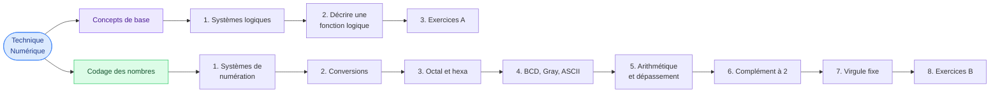

# Technique Numérique

<mark style="color:blue;">**Des 0 et des 1 jusqu'au circuit.**</mark>

&#x20;


**En bref**

Un ordinateur ne connaît que **deux états** : 0 et 1. Ce cours explique comment, avec seulement ces deux symboles, on peut **décrire une commande** (une alarme, un chauffage, un moteur) et **représenter n'importe quel nombre** : entier, négatif ou à virgule.


&#x20;

***

&#x20;

## <mark style="color:purple;">01</mark> · Le parcours

&#x20;

&#x20;


**Ordre conseillé** — lis les pages **dans l'ordre** : chaque page utilise la précédente. Le complément à 2 (page 6) est le point le plus important des exercices B : ne le saute pas.


&#x20;

***

&#x20;

## <mark style="color:purple;">02</mark> · Les chapitres

&#x20;

| Partie             | Page                                                                                              | Ce que tu y apprends                                            |
| ------------------ | ------------------------------------------------------------------------------------------------- | --------------------------------------------------------------- |
| Concepts de base   | [1. Les systèmes logiques](01-concepts-de-base/01-systemes-logiques.md)                           | 0 et 1, signaux, entrées / sorties, la chaîne ADC → DAC         |
| Concepts de base   | [2. Décrire une fonction logique](01-concepts-de-base/02-decrire-une-fonction-logique.md)         | Texte, Venn, équation, table de vérité, chronogramme            |
| Concepts de base   | [3. Exercices A.1 à A.3](01-concepts-de-base/03-exercices-concepts.md)                            | Chauffage, tapis roulant, commande de moteur (corrigés)         |
| Codage des nombres | [1. Les systèmes de numération](02-codage-des-nombres/01-systemes-de-numeration.md)               | Code pondéré, base 10, base 2, bit, octet, msb / lsb            |
| Codage des nombres | [2. Conversions entre bases](02-codage-des-nombres/02-conversions.md)                             | Décimal ↔ binaire ↔ n'importe quelle base                       |
| Codage des nombres | [3. Octal et hexadécimal](02-codage-des-nombres/03-octal-et-hexadecimal.md)                       | Grouper les bits par 3 ou par 4                                 |
| Codage des nombres | [4. BCD, Gray et ASCII](02-codage-des-nombres/04-bcd-gray-ascii.md)                               | Les autres codes : chiffres, roues codeuses, caractères         |
| Codage des nombres | [5. Arithmétique binaire et dépassement](02-codage-des-nombres/05-arithmetique-et-depassement.md) | Additionner, soustraire, et le cercle des nombres               |
| Codage des nombres | [6. Nombres signés : complément à 2](02-codage-des-nombres/06-complement-a-2.md)                  | Représenter les nombres négatifs                                |
| Codage des nombres | [7. Nombres réels : virgule fixe](02-codage-des-nombres/07-virgule-fixe.md)                       | Les bits après la virgule, précision et erreur                  |
| Codage des nombres | [8. Exercices B.1 à B.12](02-codage-des-nombres/08-exercices-codage.md)                           | Toutes les fiches d'exercices corrigées                         |

&#x20;

***

&#x20;

## <mark style="color:purple;">03</mark> · Les notations du cours

&#x20;

| Notation                    | Signification                                     | Exemple                         |
| --------------------------- | ------------------------------------------------- | ------------------------------- |
| `(10)`, `(2)`, `(8)`, `(H)` | la **base** dans laquelle le nombre est écrit     | `315(10)`, `473(8)`, `13B(H)`   |
| `0x…`                       | nombre en **hexadécimal**                         | `0x3AB`                         |
| `'` (apostrophe)            | séparateur de groupes de bits, pour la lisibilité | `1001'0110`                     |
| `·` ou `*`                  | **ET** logique                                    | `S = C · I`                     |
| `+`                         | **OU** logique                                    | `B = T + EC`                    |
| `/A` ou $$\overline{A}$$    | **NON** A (le contraire de A)                     | `/Saison` = été                 |

&#x20;

Comment utiliser les exercices

&#x20;

Chaque exercice a une **réponse cachée**. Cherche d'abord **sur papier**, puis clique pour vérifier. Les réponses détaillent toujours **le chemin**, pas seulement le résultat : si tu t'es trompé, tu vois à quelle étape.

&#x20;

