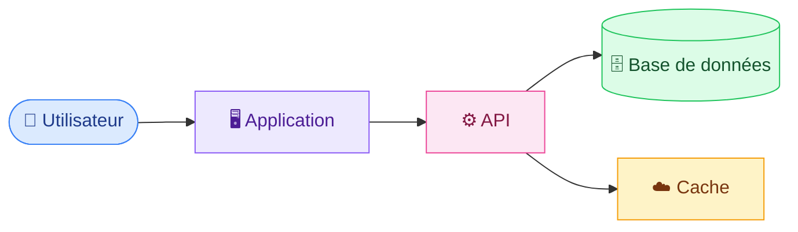
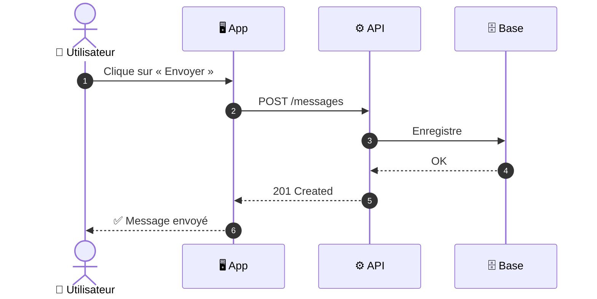
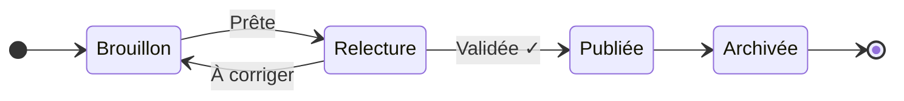
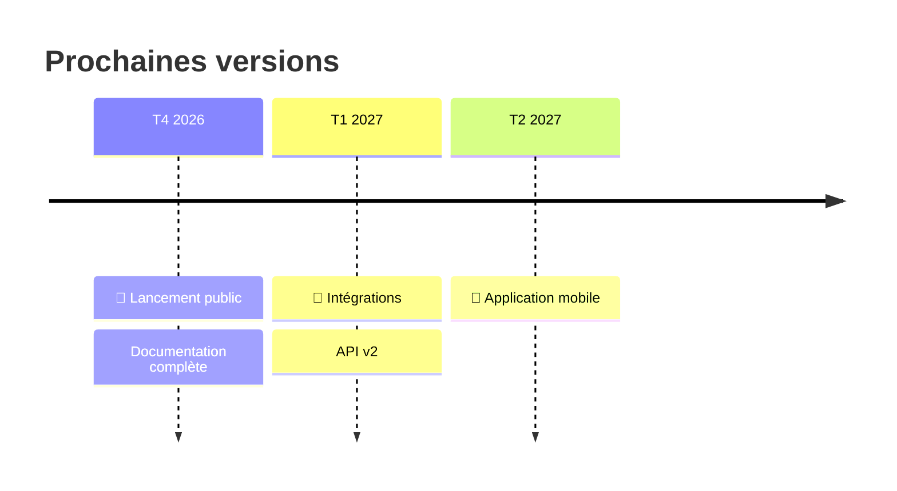

# Guide de démarrage

<mark style="color:blue;">**Tout ce qu'il faut pour être opérationnel en 5 minutes.**</mark>

&#x20;

Cette page sert de **modèle**. Reprends sa structure, son rythme et ses couleurs pour chaque nouvelle page.

&#x20;


**En bref**

On installe, on configure, on lance. Trois étapes, rien de plus.


&#x20;

***

&#x20;

## <mark style="color:purple;">01</mark> · Vue d'ensemble

&#x20;

Avant de commencer, voici comment les pièces s'emboîtent.

&#x20;



&#x20;

<figure><figcaption><p>L'interface principale, telle qu'elle apparaît au premier lancement.</p></figcaption></figure>

&#x20;

***

&#x20;

## <mark style="color:purple;">02</mark> · Installation

&#x20;



### Installer l'outil

&#x20;

```bash
npm install mon-outil
```

&#x20;



### Créer la configuration

&#x20;

Ajoute un fichier `config.json` à la racine du projet.

&#x20;

```json
{
  "env": "production",
  "port": 3000
}
```

&#x20;



### Lancer

&#x20;

```bash
npm start
```

&#x20;

<mark style="color:green;">**✓ C'est prêt.**</mark> Ouvre `http://localhost:3000`.



&#x20;



```bash
brew install mon-outil
```



```powershell
winget install mon-outil
```



```bash
sudo apt install mon-outil
```



&#x20;

***

&#x20;

## <mark style="color:purple;">03</mark> · Comment ça marche

&#x20;

Une requête suit toujours le même chemin :

&#x20;



&#x20;



<figure><figcaption><p>Ce que l'utilisateur voit quand tout va bien.</p></figcaption></figure>



<figure><figcaption><p>Et en cas d'erreur.</p></figcaption></figure>



&#x20;

***

&#x20;

## <mark style="color:purple;">04</mark> · Cycle de vie d'une page

&#x20;



&#x20;

| Statut          | Signification                          |
| --------------- | -------------------------------------- |
| ⚪ Brouillon    | En cours d'écriture                    |
| 🟡 Relecture    | <mark style="color:orange;">En attente de validation</mark> |
| 🟢 Publiée      | <mark style="color:green;">Visible par tous</mark>          |
| ⚫ Archivée     | Conservée, mais masquée                |

&#x20;

***

&#x20;

## <mark style="color:purple;">05</mark> · Les couleurs, et quand les utiliser

&#x20;


**Bonne pratique** — ce qu'il faut faire.



**Attention** — un piège fréquent à éviter.



**Danger** — action irréversible, à lire deux fois.


&#x20;

Dans le texte, reste sobre :

&#x20;

* <mark style="color:green;">**Vert**</mark> → validé, recommandé
* <mark style="color:orange;">**Orange**</mark> → à surveiller
* <mark style="color:red;">**Rouge**</mark> → interdit, dangereux
* <mark style="color:blue;">**Bleu**</mark> → terme clé, lien important

&#x20;


**Règle d'or** : une couleur doit toujours **signifier** quelque chose. Jamais de couleur pour décorer.


&#x20;

***

&#x20;

## <mark style="color:purple;">06</mark> · Feuille de route

&#x20;



&#x20;

***

&#x20;

<details>

<summary>💡 Pour aller plus loin</summary>

&#x20;

Les blocs repliables servent aux détails que la plupart des lecteurs n'ont pas besoin de voir tout de suite : options avancées, cas limites, historique.

&#x20;

</details>

&#x20;


**Une question ?** Ouvre une issue sur le dépôt ou écris-nous sur le canal `#docs`.
